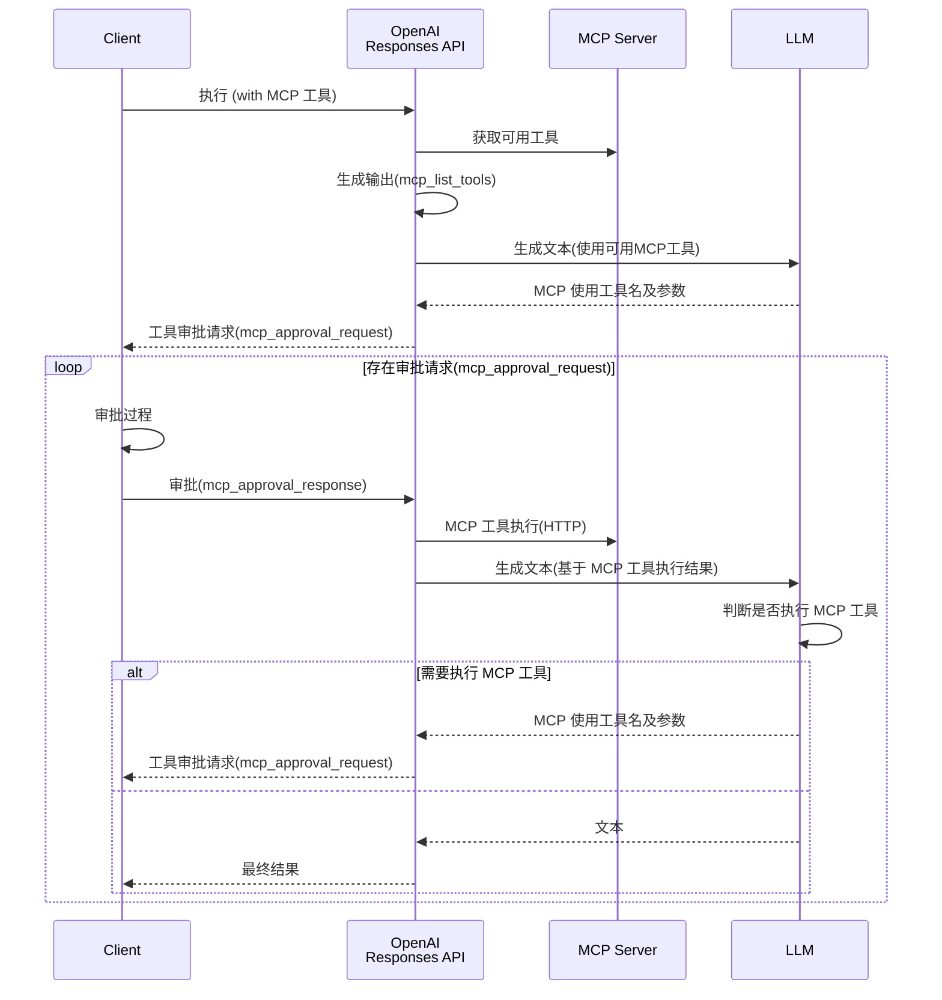

就在上个月，OpenAI 宣布在其 API 中新增了内置工具。

<blockquote class="twitter-tweet"><p lang="en" dir="ltr">Introducing support for remote MCP servers, image generation, Code Interpreter, and more in the Responses API. <a href="https://t.co/EMZOutvV2a">pic.twitter.com/EMZOutvV2a</a></p>&mdash; OpenAI Developers (@OpenAIDevs) <a href="https://twitter.com/OpenAIDevs/status/1925214114445771050?ref_src=twsrc%5Etfw">May 21, 2025</a></blockquote> <script async src="https://platform.twitter.com/widgets.js" charset="utf-8"></script>

此次发布中最受关注的是新增的远程 MCP 工具。同时还宣布加入 MCP 指导委员会，此前在该领域一直落后于其他平台的 OpenAI，终于开始正式支持 MCP 生态系统，感觉迈出了重要的一步。

在这里，我将介绍包括 MCP 在内的新添加各工具的使用方法。

- [远程MCP](#远程mcp)
- [图像生成](#图像生成)
- [代码解释器](#代码解释器)

## 远程MCP

[OpenAI Doc - Tools - Remote MCP](https://platform.openai.com/docs/guides/tools-remote-mcp)

远程 MCP 工具是一项新功能，可以通过 Responses API 使用外部托管的 MCP 服务器上的工具。OpenAI 会从可用工具的搜索、最佳工具的选择到执行提供一站式处理，开发者无需编写与工具执行相关的实现。

这次，我们使用官方文档中介绍的 Devin 的 [DeepWiki](https://docs.devin.ai/work-with-devin/deepwiki-mcp) MCP 服务器进行测试。

下面以让它总结 OpenAI 的 [Codex CLI](https://github.com/openai/codex) 的先决条件和使用方法为例进行实现。

```python
from openai import OpenAI

client = OpenAI()

response = client.responses.create(
    model='gpt-4.1-mini',
    input='用markdown格式总结系统要求和使用步骤，大约200字。 GitHub Repository: openai/codex',
    # 指定 MCP 工具
    tools=[{
        'type': 'mcp',
        'server_label': 'deepwiki',
        'server_url': 'https://mcp.deepwiki.com/mcp',
        # 如果无需审批执行
        # 'require_approval': 'never',
    }],
)

while any(entity.type == 'mcp_approval_request' for entity in response.output):
    # 审批过程
    approval_inputs = []
    for entity in response.output:
        if entity.type == 'mcp_approval_request':
            print((
                '*' * 10 + ' 执行工具 ' + '*' * 10 + '\n'
                f'请求ID: {entity.id}\n'
                f'工具: {entity.name}\n'
                f'参数: {entity.arguments}\n'
                f'标签: {entity.server_label}\n'
            ))
            approval_inputs.append({
                'type': 'mcp_approval_response',
                'approval_request_id': entity.id,
                'approve': True
            })
    # 审批 & 执行 MCP 工具
    response = client.responses.create(
        model='gpt-4.1-mini',
        previous_response_id=response.id, # 保持上下文
        tools=[{
            'type': 'mcp',
            'server_label': 'deepwiki',
            'server_url': 'https://mcp.deepwiki.com/mcp',
        }],
        input=approval_inputs
    )

print('*' * 10 + ' 最终执行结果 ' + '*' * 10)
print(response.output_text)
```

上述代码的特点在于执行 MCP 工具前的审批过程。

将 `require_approval` 设置为 `never` 可以跳过此审批过程，但从安全角度出发，除非是可信的 MCP 服务器，否则建议加入审批流程。

执行时，Responses API 会以 `mcp_approval_request` 的形式提供将要使用的工具名称和参数详情。客户端可以检查这些内容，如无问题则通过 `mcp_approval_response` 进行审批。

在本次验证中，我们将工具详情输出并实现了自动审批。

运行此代码后，获得了如下结果。

```
********** 实行工具 **********
请求 ID: mcpr_6836d85f88108191af93f624edf62e83032c59875e6c1154
工具: read_wiki_structure
参数: {"repoName":"openai/codex"}
标签: deepwiki

********** 实行工具 **********
请求 ID: mcpr_6836d86e63d0819180d4b1ca6b839828032c59875e6c1154
工具: read_wiki_contents
参数: {"repoName":"openai/codex"}
标签: deepwiki

********** 最终执行结果 **********
以下是 OpenAI Codex CLI 的系统需求和使用步骤概要。

---

## 系统需求
- 支持操作系统: macOS 12 以上、Ubuntu 20.04 以上、Debian 10 以上、Windows 11（通过 WSL2）
- Node.js 22 以上（推荐 LTS）
- Git 2.23 以上（使用 PR 辅助时）
- 内存: 最少 4GB（推荐 8GB）

## 使用步骤
1. 安装 Codex CLI 并设置 OpenAI API 密钥
2. 在终端运行 `codex` 命令并以自然语言进行操作
3. 代码解析、修改和命令执行将根据审批模式运行
4. 模式可在 “Suggest（建议）”“Auto Edit（自动编辑）”“Full Auto（全自动）” 中选择
5. 为了安全，命令将在沙箱环境中执行（macOS 上使用 Apple Seatbelt 等）

---

可根据需要使用 API 密钥设置或配置文件进行详细设置。
```

MCP 工具被执行了 2 次（`read_wiki_structure` 和 `read_wiki_contents`），并基于各自的结果生成了响应。可以清楚地看到 LLM 是如何自主判断并执行所需工具的。

通过此次验证，我们将理解到的远程 MCP 执行流程绘制成了如下图：



外部的 MCP 生态系统与 OpenAI API 的集成将变得非常简单。

## 图像生成

[OpenAI Doc - Tools - Image generation](https://platform.openai.com/docs/guides/tools-image-generation)

OpenAI 一直以来都有专用的 [图像 API](https://platform.openai.com/docs/api-reference/images)，但这次又将图像生成功能作为 Responses API 的工具新增进来了。

作为 Responses API 的工具使用后，与以往的一次性生成不同，可以进行多轮图像生成并支持流式处理。由此，有望构建更灵活、更具对话性的图像生成工作流程。

当然，现有的图像 API 也将继续得到支持，因此对于简单的图像生成，可以继续选择传统方法。关于两种 API 的使用场景区分，可参考[官方指南](https://platform.openai.com/docs/guides/image-generation)。

### 新增生成

首先尝试基础的图像生成。以创建一个虚构活动的横幅为例进行实现。

```python
from openai import OpenAI
import base64

client = OpenAI()

response = client.responses.create(
    model='gpt-4.1-mini',
    input=(
        '请为豆藏开发者活动"Mamezou Tech Fest 2025"制作宣传横幅。\n'
        '- 明亮愉快的氛围\n'
        '- 豆子角色们聚集在一起的场景\n'
        '- 包含活动名称和日期"2025年7月20日"\n'
        '- 动漫风格，色彩丰富的配色\n'    ),
    # 指定图像生成工具
    tools=[{
        'type': 'image_generation',
        'size': '1024x1536',
        'quality': 'medium',
        'output_format': 'webp',
        'model': 'gpt-image-1', # Responses API 当前仅支持此模型（DALL-E 不可用）
    }],
    tool_choice={'type': 'image_generation'}
)

images = [
    output.result for output in response.output
    if output.type == 'image_generation_call'
]

if images:
    with open('banner.webp', 'wb') as f:
        f.write(base64.b64decode(images[0]))
```

在工具参数中，可对尺寸、质量、输出格式等进行细致设置。有关可用参数的详细信息，请参阅以下官方文档。

- [OpenAI Doc - Image Generation - Customize Image Output](https://platform.openai.com/docs/guides/image-generation#customize-image-output)

运行后，生成了如下图像：


无论好坏如何，倒是做出了相当有感觉的横幅图像（当然是虚构的活动）。

### 编辑

接下来，我们也验证了现有的图像编辑功能。尝试为我司专属吉祥物角色（？）豆香(mameka) 创建歌手版本。

以下是原始图像：


示例代码如下：

```python
from openai import OpenAI
import base64

client = OpenAI()

# 原始图像
with open("mameka.png", "rb") as image_file:
    base64_image = base64.b64encode(image_file.read()).decode('utf-8')

response = client.responses.create(
    model='gpt-4.1-mini',
    input=[{
        'role': 'user',
        'content': [{
            'type': 'input_text',
            'text': '请编辑成笑着唱歌的样子'
        },
        # 待编辑图像
        {
            'type': 'input_image',
            'image_url': 'data:image/png;base64,' + base64_image
        }],
    }],
    tools=[{'type': 'image_generation'}],
    tool_choice={'type': 'image_generation'}
)

images = [
    output.result for output in response.output
    if output.type == 'image_generation_call'
]

if images:
    with open('singer-mameka.webp', 'wb') as f:
        f.write(base64.b64decode(images[0]))
```

待编辑图像将与提示一起传递给 Responses API。本次我们使用 Base64 编码嵌入了图像数据，也可选择使用 [File API](https://platform.openai.com/docs/api-reference/files) 上传文件。

图像编辑结果如下：


在保留原始图像特征的同时，自然地调整为像在歌唱的表情。相当出色的效果呢💖

这里虽然未进行测试，但也可以传递带遮罩的原始图像，只针对该部分进行编辑[^1]。

[^1]: <https://platform.openai.com/docs/guides/image-generation?image-generation-model=gpt-image-1&api=responses#edit-an-image-using-a-mask-inpainting>

## 代码解释器

[OpenAI Doc - Tools - Code Interpreter](https://platform.openai.com/docs/guides/tools-code-interpreter)

最后尝试一下代码解释器功能。该功能在 Assistants API 中已提供，但这次也已可在 Responses API 中使用。

在 Responses API 中的代码解释器引入了“容器”这一新概念。它表示 Python 的沙箱执行环境，与 Assistants API 的用法略有不同。

这次以分析示例 CSV 文件并生成图表为例进行验证。由于代码稍长，分为两部分说明。

### 创建容器并执行 Responses API

首先是使用代码解释器执行 Responses API 的部分。

```python
from openai import OpenAI

client = OpenAI()

# 分析目标 CSV 文件
with open('sales.csv', 'rb') as data_file:
    file_response = client.files.create(
        file=data_file,
        purpose='user_data'
    )
# 上传日文字体
# https://fonts.google.com/share?selection.family=Noto+Sans+JP:wght@100..900
with open('NotoSansJP-Regular.ttf', 'rb') as font_file:
    font_response = client.files.create(
        file=font_file,
        purpose='user_data'
    )

# 创建容器
container = client.containers.create(
    name='sales_data', file_ids=[file_response.id, font_response.id]
)

response = client.responses.create(
    model='gpt-4.1-mini',
    input=[{
        'role': 'user',
        'content': [{
            'type': 'input_text',
            'text': '请创建按类别的销售额构成比（饼图）。请应用Noto Sans JP字体。'
        }]
    }],
    # 指定代码解释器工具
    tools=[{
        'type': 'code_interpreter',
        'container': container.id,
    }],
    tool_choice={'type': 'code_interpreter'}
)
```

首先，通过 [File API](https://platform.openai.com/docs/api-reference/files) 上传分析所需的文件。本次准备了分析目标的 CSV 文件和可在图表中使用日文字体的字体文件。

接下来，使用新添加的 [Containers API](https://platform.openai.com/docs/api-reference/containers) 创建容器对象。通过在此指定上传文件的 ID，文件将挂载到沙箱环境中。

此外，创建容器目前每个会产生 $0.03 的费用。有关最新费用，请参阅[官方信息](https://platform.openai.com/docs/pricing)。

最后，指定代码解释器工具并执行 Responses API。在此，将前面创建的容器 ID 作为工具参数（`container`）指定。

:::column:自动生成容器
除了手动创建容器之外，也可以在执行 Responses API 时自动生成容器。

在这种情况下，要挂载到容器的文件在 Responses API 执行时作为工具参数指定。

```python
response = client.responses.create(
    model='gpt-4.1-mini',
    input=[{
        # (省略)
    }],
    tools=[{
        'type': 'code_interpreter',
        # 如果要自动创建容器
        'container': {
            'type': 'auto',
            'file_ids': [file_response.id, font_response.id],
        }
    }],
    tool_choice={'type': 'code_interpreter'}
)
```
:::

### 获取输出文件

接下来是后半部分的源代码。在这里，从 Responses API 的响应中提取代码解释器的输出文件。

```python
annotations = [
    annotation for annotation in response.output[-1].content[0].annotations
    if annotation.type == 'container_file_citation'
]

if annotations:
    output_response = client.containers.files.content.with_raw_response.retrieve(
        container_id=annotations[0].container_id,
        file_id=annotations[0].file_id,
    )
    if output_response.status_code == 200:
        with open('sales_summary.png', 'wb') as f:
            f.write(output_response.content)
    else:
        print(
            f'Error retrieving file: {output_response.status_code} - {output_response.text}')
```

代码解释器生成的文件需要从容器中获取。

从 Responses API 输出的 `annotations` 中包含的 `container_file_citation`，提取文件 ID 和容器 ID。然后使用新引入的 [Containers File API](https://platform.openai.com/docs/api-reference/container-files/retrieveContainerFileContent) 获取实际的文件数据。

### 示例文件及执行结果

最后尝试运行代码解释器。

在本次验证中，准备了如下示例 CSV 文件。

**CSV 文件 (sales.csv)**
```csv
订单ID,订单日期,商品名称,类别,数量,单价（日元）
1001,2025-05-01,苹果,水果,10,120
1002,2025-05-01,香蕉,水果,8,90
1003,2025-05-02,哈密瓜,水果,1,800
1004,2025-05-02,卷心菜,蔬菜,5,150
1005,2025-05-03,牛奶,饮料,3,180
1006,2025-05-04,番茄,蔬菜,6,130
1007,2025-05-04,橙子,水果,7,100
1008,2025-05-05,酸奶,乳制品,4,200
1009,2025-05-06,胡萝卜,蔬菜,10,80
1010,2025-05-06,咖啡,饮料,2,250
```

执行后，生成了如下图表：


日文字体也被正确应用，制作出了易于理解的按类别分布比例的饼图。

本次仅验证了 CSV 文件的分析，但与 ChatGPT 一样，似乎可以支持各种文件格式和数据处理任务。

## 总结

这次，我全面验证了 Responses API 新增的各种工具功能。

这些功能即使单独使用也具有充分价值，但若结合使用，似乎可以构建更强大的 AI 代理。

实际上，在 OpenAI 的 [Agents SDK](https://openai.github.io/openai-agents-python/tools/) 中，这些工具也已得到支持，让人感受到 AI 代理开发生态系统正迅速发展。

通过本次验证，我切身感受到 Responses API 已进入 AI 应用的新阶段。接下来会涌现出哪些应用场景，令人十分期待。
