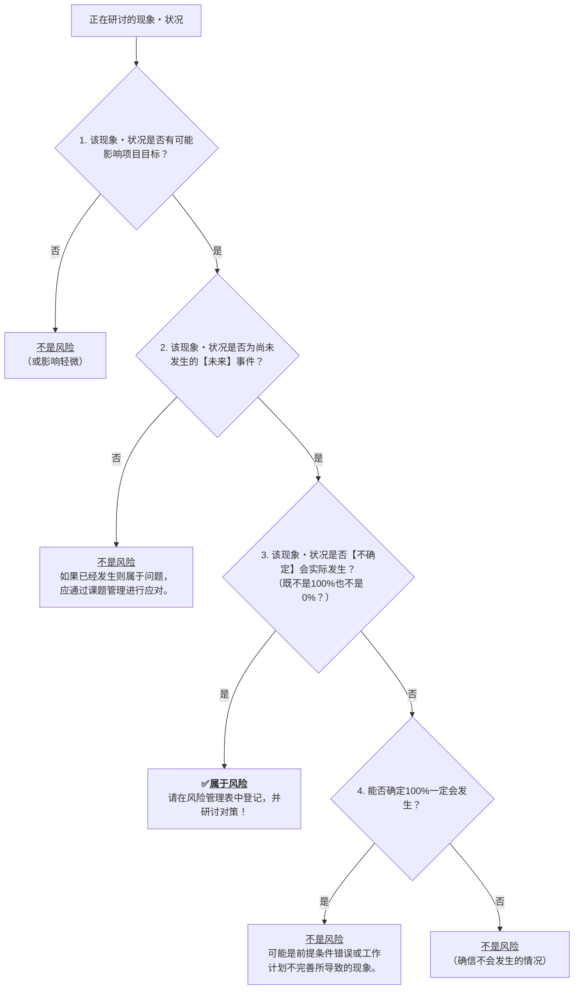

# 引言

[之前的文章](https://developer.mamezou-tech.com/zh-cn/blogs/2025/06/06/from_problem_to_action_issue_management_for_rookies/)中，我们从“问题”和“课题”的区别出发，讲解了课题管理的推进方式。这次作为续篇，将以“风险”和“问题”的区别为主线，清晰地解说**风险管理的第一步**。

有没有这样的烦恼？

- “风险”是否指所有看起来危险的事情？
- “风险”和“问题”有什么不同？
- 到底应该从哪里入手呢？

阅读本文，你将：
- 能够清晰地理解“问题”和“风险”的区别。
- 理解为何将其视为“风险”并进行管理很重要。
- 学习到可从明天开始使用的风险管理的基本推进步骤。
- 你的项目运营将增添“预见能力”。

让我们一起掌握把“模糊的不安”转变为“具体应对”的技能吧。

:::info
**本文是面向新人项目经理系列文章的一部分**

1. [第1回：从“问题”和“课题”的区别开始（课题管理入门）](https://developer.mamezou-tech.com/zn-ch/blogs/2025/06/06/from_problem_to_action_issue_management_for_rookies/)
2. [第2回：侦探式管理 ― 如何洞察真相？（思维方法·观察篇）](https://developer.mamezou-tech.com/zn-ch/blogs/2025/06/13/fact_vs_truths_conan_inspired_pm_guide_for_rookies/)
3. 第3回：从“问题”和“风险”的区别开始（风险管理指南）

👉 初次阅读者建议 [从第1回开始阅读](https://developer.mamezou-tech.com/zn-ch/blogs/2025/06/06/from_problem_to_action_issue_management_for_rookies/)。
:::

# 先来做个思维实验！哪个是“风险”？

作为热身，请想象这样一个场景：在厨房做饭时，你可能不慎将一颗珍贵的生鸡蛋掉落。

* **【A】将鸡蛋从厨房台面掉到坚硬地面上**  
  在这种情况下，鸡蛋被摔在地板上碎裂几乎无法避免。

* **【B】将鸡蛋从砧板上掉入水槽**  
  在这种情况下，鸡蛋有可能破裂。  
  但落差较小，也许幸运地只会产生裂纹而已。

那么，哪个更适合作为**“风险”**呢？

---
**回答与解说：**

答案是 **【B】**。

风险是指伴随**“不确定性”**的事件。  
【A】几乎必定会导致不良结果，更像是“应该避免的危险行为”或“问题”，因此与风险不同。

而【B】则存在“可能发生也可能不发生”的不确定性。  
它正是针对未来事件的预防，也就成为风险管理的对象。

---

# 风险与问题的区别？新人也能辨别的方法

通过思维实验，你是否体会到“不确定性”是关键呢？  
那么，让我们再次确认“问题”和“风险”的定义，并整理它们的区别。

## “问题”的定义（回顾）

**问题是指“理想状态”和“现实状态”之间的差距，是已经发生的棘手状况**。  

例如，交期延误或缺陷暴露等已显现的故障，都属于“问题”，需要立即应对。

## “风险”的定义

**风险是对目标造成“不确定性”影响**。（ISO 31000 / PMBOK®指南）  

如图所示，即使看似顺利，也存在“可能无法取得成果”的下行偏差可能性。  
这就是风险的概念。

也就是说，将“尚未发生但可能发生的事情”可能对目标产生负面影响的情况称为风险。  
※本文主要聚焦于带来负面影响的“负面风险”。

## “问题”和“风险”的主要区别 总结

| 特征         | 问题 (Problem/Issue)                          | 风险 (Risk)                                             |
| :----------- | :--------------------------------------------- | :------------------------------------------------------- |
| **发生时间** | 已经发生                                       | 尚未发生（可能在未来发生）                              |
| **确定性**   | 肯定会发生                                     | 是否发生具有不确定性                                    |
| **应对重点** | 发生后的解决（纳入课题管理并处理）             | 发生前的预防与发生后的影响缓解（预防策·减轻策）         |

已显现的“问题”通过课题管理进行应对，尚未发生的“风险”则由风险管理来处理。这是基本原则。

# 这是风险吗？困惑时的YES/NO流程图

当你犹豫“这是风险、还是单纯的担忧，或者是问题”时，可参考以下判断流程图。

# 风险管理的重要3个理由：“Slack（余地）”是成功的关键

风险管理不仅仅是“将危险因素列举并回避”的工作。  
软件工程师Tom DeMarco在其著作 *SLACK: Getting Past Burnout, Busywork, and the Myth of Total Efficiency* [^1] 中，如下所述：

> *"Risk management is about planning for failure."* [^2]

也就是说，风险管理就是“以失败为前提进行规划”。  
此外，DeMarco还说道：

> *"Slack is what helps organizations cope with risk. It's the buffer that allows for the unexpected."* [^3]

Slack（余地）正是应对变化和意外状况的“缓冲（余量）”。  
如果一味追求效率，组织会失去灵活性，很容易因稍微的变化或意料之外的情况而崩溃。

反过来，通过刻意设置“Slack＝保险”，可实现具有韧性的运营。  
由此可见，风险管理是一种面向“可能发生的未来”并且“刻意保留余地”的管理决策。

这种理念为判断风险管理是否正常运作提供了一个有趣的视角。  
试想，如果你的项目在预算、进度和人员方面完全没有“余地”，会怎样？

如果项目总是处于紧绷状态，那可以说是非常高风险的状况。  
你或许会觉得那些看似低效的“浪费”作业或成本多余。

然而，这恰恰是为应对意外变化而有计划地设置的‘Slack（余地）’。  
而这正是风险管理正常发挥作用的证明。

你是将那份“余地”视为浪费，还是看作对未来的保险？  
这样的判断力正是项目经理的实力所在。

# 面向新人PM｜首先要制作的风险管理表的写法与示例

一旦识别出风险，为了可视化和应对，就要将其登记到“风险管理表”中。  
最开始使用Excel或Google表格，以下这样的简单格式就足够了。

## 就从这个开始！风险管理表的制作方法【附示例】

| ID    | 风险登记日 | 风险内容（可能会～）                               | 发生概率（高/中/低） | 影响度（大/中/小） | 风险分数（发生概率×影响度） | 应对方针（预防策·减轻策）                                     | 负责人  | 期限       | 状态        | 备注           |
| :---- | :--------- | :------------------------------------------------- | :------------------ | :---------------- | :-------------------------- | :----------------------------------------------------------- | :------ | :--------- | :---------- | :------------- |
| R-001 | 2025/06/06 | 主要成员A可能会突然离职，导致开发进度延迟           | 中 (2)              | 大 (3)            | 6 (高)                      | 将A的工作形成文档，并与B共享；准备交接计划。                   | PM高橋 | 2025/06/20 | 正在制定对策 |                |
| R-002 | 2025/06/06 | 拟引入的外部API规格可能会大幅变更，从而产生返工       | 低 (1)              | 中 (2)            | 2 (低)                      | 定期检查API提供方的更新信息，事先评估影响范围。                | 鈴木    | 待定        | 未应对      | 以防AWS故障   |
| R-003 | 2025/06/07 | 测试环境准备可能比计划延后，导致测试启动延迟         | 中 (2)              | 中 (2)            | 4 (中)                      | 重新确认所需资源，并尽早向IT部门申请；每周跟进进度。            | 佐藤    | 2025/06/15 | 已应对      | 已向IT部门申请 |

## 示例字段说明

* `ID`：请为风险分配一个唯一的ID（例如：R-001）。
* `风险登记日`：记录首次识别该风险的日期。
* `风险内容`：将未来可能发生的“麻烦事”具体地以“可能会～”的形式描述。
* `发生概率`：评估该风险实际发生的可能性。初期采用“高(3)/中(2)/低(1)”三段评估即可。请基于团队经验及过往案例进行判断。
* `影响度`：若该风险发生，评估其对项目目标（如QCD等）造成的负面影响程度。可采用“大(3)/中(2)/小(1)”等评估方式。
* `风险分数`：将发生概率与影响度的评分相乘得出。分数越高，表示该风险越应优先考虑对策。
* `应对方针（预防策·减轻策）`：  
    * **预防策**：为降低风险发生概率而采取的具体行动。  
    * **减轻策**：万一风险发生，能将其影响降至最低的具体行动。  
* `负责人`：明确负责实施该风险应对措施的责任人，通常需指定具体个人。  
* `期限`：设置执行应对措施或对该风险进行重点监控的目标日期。  
* `状态`：记录风险当前的状态（如：未应对、正在研讨对策、进行中、已应对、监控中、已发生（问题化）等）。  
* `备注`：记录其他特殊事项或关联信息。  

:::info:【术语解读】QCD是什么
**QCD**是取自**Quality（质量）**·**Cost（成本）**·**Delivery（纳期）**的项目管理基本概念。  
这三要素相互影响，若优先考虑其中一项，可能会影响其他项。  
PM需关注QCD的平衡，并从整体优化的角度进行决策。  
:::

### 通过发生概率和影响度来评估优先级的“风险分数”是什么？
将风险的“发生概率”和“影响度”量化并相乘，就能用**客观的数值**来评估抽象的“潜在危险”。  
如此一来，团队更易形成共同认识，也能进行优先对策的探讨和有效的讨论。

### 预防和减轻，哪一个应当优先？
基本上，**优先考虑预防策**是更可取的。  
因为若能减少风险发生的可能性，就能大幅降低后续的成本和影响。  
但若预防困难或成本过高，就需要准备减轻策。  
项目经理的能力就在于如何平衡地考虑两者。

### 关于“已发生（问题化）”
指风险实际发生并开始对项目产生影响的状态。  
在这种情况下，该风险不再属于“风险管理”范畴，而是**作为“问题”转入“课题管理”流程**，需要迅速应对。  
风险管理的目的之一就是尽可能防止风险达到“已发生”这一阶段。

# 切勿搁置！风险管理表持续使用的运营规则

即便是精心制作的风险管理表，一旦搁置也会很快形同摆设。  
关键在于“**定期审查并更新**”——仅此一点，风险管理表就能发挥未来预测雷达的作用。

## 风险管理表维护的基本操作

- **新风险要立即登记**  
  当有人感到“可能需关注”时，立即加入候选。  
- **以周或定期会议进行全面检查**  
  对高优先级风险更新状态；若未应对，也要记录原因。  
- **整理已完成应对的风险**  
  将状态栏更新为“已应对”等以示明确。  
- **不再需要的风险“存档”**  
  可移至另一个表单或底部，以记录历史。

## 为什么维护如此重要？

项目每天都在变化。昨日还是低风险的事项，明日可能就成了重大风险。  
定期更新才是真正处于“对风险有所准备”的状态。

# 项目团队可用的10项风险管理检查清单

风险管理不仅是项目经理的工作，  
需要全体成员配合。  
及时发现、共享并协作对策的意识，  
才能实现有效应对。  
请使用以下检查清单，团队定期确认风险管理状态。

| 项目               | 检查事项                                                                                      |
| :----------------- | :-------------------------------------------------------------------------------------------- |
| **项目启动时**     | 在启动会议中是否就“什么是风险”“与问题的区别”达成共识？                                       |
|                    | 是否梳理出了预想的主要风险？（是否参考过往类似项目？）                                         |
|                    | 是否制作了风险管理表并在团队中进行了共享？                                                    |
|                    | 在项目计划中，是否在预算、进度、人员方面预留了计划性的“余地（Slack）”？                    |
| **项目进行中**     | 是否定期（例如：每周）安排时间审查风险？                                                      |
|                    | 当犹豫“这是风险、仅是担忧还是问题”时，是否使用过流程图进行确认？                             |
|                    | 如果出现了新风险，是否迅速在风险管理表中登记？                                                 |
|                    | 已登记的风险的“状态”和“期限”是否已更新？                                                    |
| **团队运营角度**   | 团队内部是否营造了易于共享“不安”或“顾虑”的氛围？                                            |
|                    | 是否已形成“发现风险就报告”的文化？                                                          |
|                    | 针对各风险的应对方针，相关人员的分工是否已明确？                                              |
| **项目完成后**     | 是否回顾了实际发生的风险及其应对记录？                                                      |
|                    | 是否分析了为何遗漏某些意外风险？                                                           |
|                    | 是否将“风险应对的教训”作为知识留存，以便今后利用？                                         |

# 总结：风险管理是防患于未然的拐杖！

- **风险是“未来的不确定影响”，与“问题”截然不同。**
- **“肯定会发生坏事”不是风险，而是“前提”或“问题”。**
- **不确定性恰恰是风险的本质。**
- 通过评分和分类，你可以冷静地对极端事件（例如：日本消失级别的陨石撞击）进行优先级排序。  
  例如，“日本消失级别的陨石撞击”由于发生概率天文数字般地低，因此优先级会降低。  
- 刚开始时，使用简单的列表即可。  
  关键在于，**持续地审查并更新**。

针对“问题”发生后进行的课题管理固然重要，  
但从根本上防止问题发生、抢先行动的风险管理同样必不可少。

这两者如双轮并行，缺一不可，才能将项目导向成功。  
风险管理即是预测未来并进行掌控的行为。

一开始你可能会觉得困难，  
但第一步就是发挥想象力：“或许会发生这样的麻烦，  
那么现在可以做些什么呢？”

本文介绍的概念和工具仅是基础，  
请根据你的项目情况不断自定义。

最重要的是，不要独自承担，  
要营造团队共同讨论风险的文化。  
一定会有一天，你会庆幸：“那时我好在把风险都列举出来了。”

[^1]: Tom DeMarco, *SLACK: Getting Past Burnout, Busywork, and the Myth of Total Efficiency*, Broadway Business, 2001.  
[^2]: Tom DeMarco, *SLACK*, (2001).  
[^3]: Tom DeMarco, *SLACK*, (2001).
