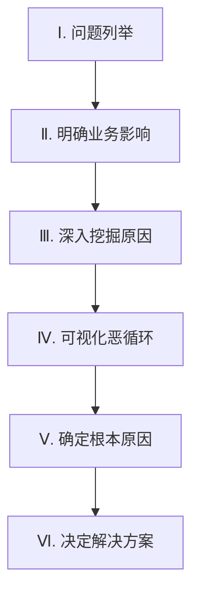
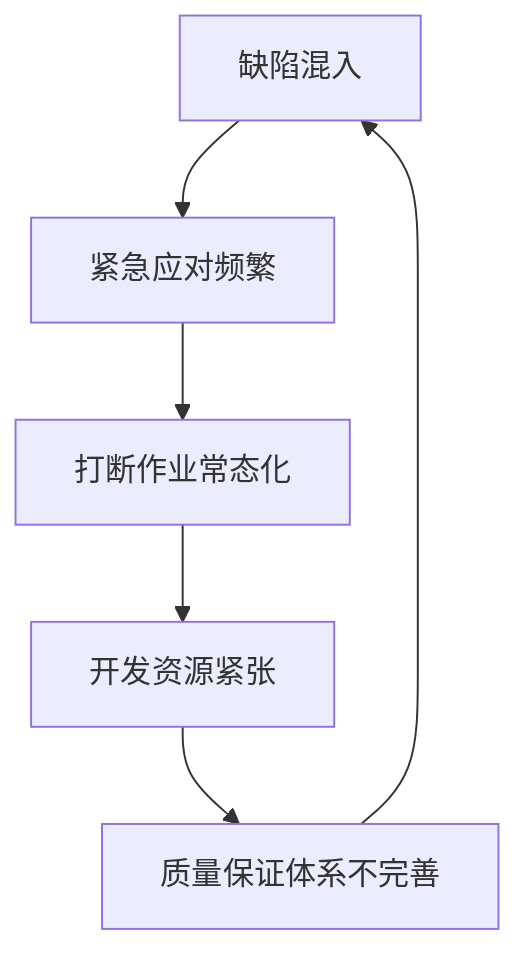
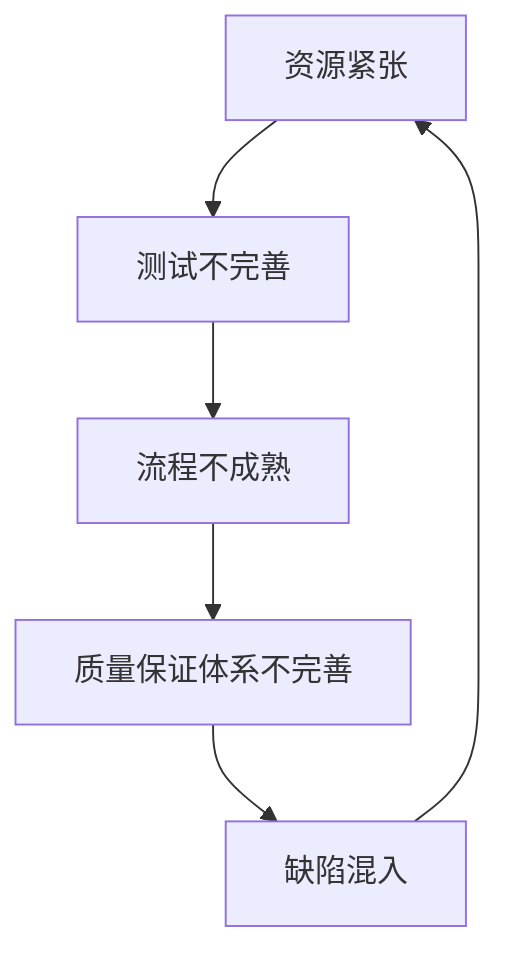

# 介绍
在之前的文章「[如何区分“问题解决”和“课题达成”？—面向新手项目经理的“守”与“攻”思维法](https://developer.mamezou-tech.com/blogs/2025/06/30/problem_solving_vs_task_achieving_pm_thinking_for_rookies/)」中，我们介绍了项目管理（PM）中的“问题解决型”与“课题达成型”两种思维模式。

本文将聚焦于“问题解决型”方法，结构化地理解PM现场所面临的课题和问题，并讲解如何利用因果关系图从根本原因出发进行有效解决。特别强调将其与持续的流程改进相结合的视角。

※ 因果关系图是用箭头表示“原因”和“结果”关系的图形。初学者也请随意尝试。

# 用图解梳理“问题解决型”与“课题达成型”的区别
比较“理想状态（To Be）”与“现状（As Is）”，并按如下方式区分使用不同的方法。

- **问题解决型**：现状比“理想状态”更糟 → 定位并消除原因  
- **课题达成型**：想要从现状推进到“期望状态” → 规划达成手段  

这次我们将介绍 **“问题解决型”** 的推进方法。并结合具体框架进行实践性解说。

# 利用因果关系图的6个步骤加速现场改进
下面是从问题识别到解决方案导出的“6个步骤”的整体图示。

## 步骤1：问题列举（从项目回顾开始）
首先，使用计划书、周报、成果物等将发生的问题列出来。  
使用便签等按流程进行可视化，可以更容易整体俯瞰。

📌 **项目问题整体把握示例**  

在列出问题时，“无论多小的事情都要写出来”非常重要。  
初学者不要一开始就追求完美，按想到的随时记录即可。

## 步骤2：明确问题对业务造成的负面影响
本文以PM现场常见的一个问题案例“生产环境中缺陷频繁混入”为例。  
接下来明确该问题对业务的影响。

关键在于，**通过因果关系回溯，图示问题最终会导致何种“可见损害”**。

例如，可以浮现出如下业务损害：  
- 成本增加（运营效率降低）  
- 客户流失（满意度下降）

如果觉得“问题与影响的关联”难以绘制，不妨稍微改变思路。

例如，  
**“生产环境中缺陷频繁混入。接下来会发生什么？”**

这样提问后，  
· 服务中断  
· 客户投诉  
· 恢复作业的负担  
等业务影响和连锁事件就能自然显现。

如图所示，建议将“业务损害”的便签与其他要素区分开，使用不同颜色。

🟡 起点：选定为分析对象的问题  
🔴 中间：在因果途中出现的直接或结构性因素  
⚫ 结果：最终显现的业务损害（例：成本增加、客户流失）

例如，“服务中断”或“恢复作业的负担”等作为🔴中间因素。  
由此引发的“客户流失”与“成本增加”则对应于⚫业务损害。

放置好业务损害的便签后，接下来检查因果关系是否成立。  
从下往上，以“如果【原因】则【结果】”的形式读一遍看看。

例如，  
- 如果“生产环境中混入了缺陷”，则“某些服务功能会停止”  
- 如果“发生问题修复与恢复作业”，则“业务运营成本会增加”

通过这样朗读因果关系并确认，可以判断**逻辑是否一致**。  
如果关联不自然，就调整措辞或布局。

## 步骤3：查明原因
明确业务影响后，深入挖掘问题的原因。  
不断提问“为什么会发生？”，沿着因果关系向下游追溯。

如上图所示，从“缺陷混入”这一直接原因开始。  
然后深入到流程不成熟、开发资源紧张、变更管理混乱等结构性背景。

在此步骤中，提问的质量和深度是关键。  
反复发问“为什么会这样？”，逐步接近本质。

## 步骤4：可视化导致问题重复发生的“恶循环”
在许多现场，**某个结果会成为下一个原因，从而重复同样的问题，形成“恶循环”**。  
识别出它，就能触及问题的深层本质。

如上图，在步骤Ⅲ中绘制的因果关系图里，用粗箭头强调了**形成恶循环的环路**。

🔁 A循环示例（紧急应对与质量恶化的循环）

紧急应对成为常态，资源紧张，结果质量保证体系也崩溃──。  
通过这个循环，“缺陷混入”便再次发生。

🔁 B循环示例（不完善流程导致的缺陷循环）

这里以测试不足和流程不完善为主要原因，重复引发缺陷混入的结构。

识别恶循环的环路结构可能需要一些时间。  
要发现循环，可以整体浏览因果图，确认是否存在“一圈转回原点”的流程。  
虽然耗时，但一旦识别出该结构，就能看到解决问题的突破口。

## 步骤5：确定根本原因
接下来，寻找成为恶循环“起点”的**根本原因**。  
根本原因是导致问题反复发生的“真正原因”，具有以下特点。

- 没有其他要素指向它的箭头（= 它本身就是原因的源头）  
- 觉得无需进一步挖掘  
- 处理可行，解决后可预期产生广泛影响

如上图，以下两项被列为根本原因：

- 缺乏测试的专业知识和技能  
- 制定了不合理的计划和交付期限

通过此方式，确定导致问题发生的核心要因。

如图所示，建议将“根本原因”的便签与其他要素区分开，并使用不同颜色。

🟡 起点：选定为分析对象的问题  
🟣 原因：处于中间位置的要因（结构性或直接性原因）  
⚫ 根本原因：导致问题再发的核心要因（恶循环的起点）

例如，将“变更管理混乱”“质量保证体系不完善”等作为🟣原因。  
引发它们的“不合理的计划与期限”“技能不足”等则为⚫根本原因。

若这些得到解决，**就有很大可能一次性改善多个问题**──。  
本步骤就是要识别出能撬动全局的关键点。

## 步骤6：决定如何解决根本原因
确定根本原因后，思考如何改变。  
在这里，将负面原因转述为“理想状态”非常关键。

例如，  
“制定了不合理的计划和交付期限”  
→ “能够根据情况调整计划和交付期限”  

“缺乏测试的专业知识和技能”  
→ “拥有具备测试专业知识和技能的成员”  

如此，**从“理想状态应是怎样？”的视角进行转述**。

接下来，探讨实现该目标的**具体解决方案**。

例如，  
“能够根据情况调整计划和交付期限”  
→ “进行早期并持续的风险评估与共享”  

如此，准备现实且可执行的举措。

思考解决方案时，要想象“理想状态”。  
初次实施时，建议从小幅改进开始。不要急躁，稳步前进。

最后，从理想的未来图景倒推，构建整体方案。

在此“未来实现树”中，将通过3个阶段描绘“迈向未来的故事”。

- 将原因替换为理想现象  
- 将问题转化为理想目标  
- 验证它们是否逻辑相连  

至此，利用因果关系图的“问题解决模型”完成。

# 因果关系图的优点
因果关系图的制作有许多优点。  
* **加深团队整体的共同理解**：不仅对团队内部，也有助于向组织外进行说明。  
* **能够将业务影响与技术问题关联解释**：可以直观展示导致业务损害的问题流。  
* **使根本原因变得清晰**：不仅表面问题，连潜藏其后的真正根本原因也更容易被识别。  
* **可视化打破恶循环的策略**：可以识别出让问题持续存在的恶循环，并找到切断循环的介入点。  
* **更易验证解决方案的合理性**：通过理解根本原因和恶循环，能够导出并选择最有效的解决方案。

# 绘制因果关系图时的注意事项与不出错技巧
以下是在制作因果关系图时的注意事项。  
* ❌ **箭头及要素过多** → 删除不必要的内容  
* ⚠️ **不要过度简化** → 在制作者能够解释的范围内详细说明  
* ⚠️ **不要将问题范围扩大过度** → 聚焦重点  
* 🚫 **注意避免演变为人身攻击**

# 总结：利用因果关系图切入“结构性问题”的要点
本文介绍了有助于现场改进的、利用因果关系图进行问题解决的具体步骤。  
确定问题的根本原因，并具备防止再发和改进业务流程的视角非常重要。

因果关系图是即使初学者也易于入手的问题解决工具。  
建议先从小问题开始尝试，累积经验后，现场改进将稳步推进。请务必尝试。

下次将介绍如何利用此未来实现树，将目标设定与计划制定相衔接的方法。

:::info
**本文是“能干PM系列”的一部分**  
👉 [防止检查表形式化！能干PM的重构术与7大改进对策](https://developer.mamezou-tech.com/blogs/2025/07/10/pm_checklist_rebuild_and_improve/)  
👉 [不流于形式的定例会议推进方法｜能干PM的7个改进步骤](https://developer.mamezou-tech.com/blogs/2025/07/18/pm_meeting_rebuild_and_improve/)  
👉 [课题能够被消化的清单运用｜能干PM告别形式化的12项技巧](https://developer.mamezou-tech.com/blogs/2025/07/24/issue_list_rebuilding_and_practical_tips_for_pms/)  
:::
