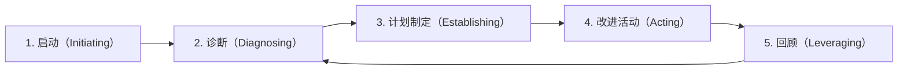

# 引言
“虽然知道流程改进很重要，但却难以取得成果”——  
在实际现场有没有过这样的感受？

流程改进的目的不仅仅是“使流程变得更好”。  
本质在于**为持续生产高质量产品或服务搭建“基础”**。

但是，流程改进需要一定时间才能见效。  
在没有专职人员的组织中，改进活动往往在项目间隙中被兼顾进行。  
结果，几年过去仍未见成效的情况并不罕见。

本文将介绍基于IDEAL模型、可在PM和项目管理现场使用的流程改进推进方法。  
并介绍在包含软件开发的项目现场中，为使改进扎根于现场可用的5个步骤。

# 流程改进的5个步骤全貌
流程改进沿着以下5个步骤推进最为有效。

📌 **IDEAL模型**  

## 1. 启动：通过与相关方达成共识来夯实改进基础

### 明确目的和目标
在开始改进之前，首先与所有相关方共享“为什么需要改进”。

- 明确改进开始的背景和目的。  
- 确保组织高层（流程改进活动的负责人）的承诺。  
- 针对相关方的动机激发培训也是有效的。  

:::info:要点
如果背景或目标不明确，流程改进的优先级容易在中途被降低。  
流程改进具有见效慢且耗时的特点，因此需要长期视角下的共识。
:::

## 现场调查 — 掌握实际情况
接下来，对项目现场及支持组织进行访谈，以把握现状中的问题。

- 对业务负责人及项目负责人进行访谈。  
- 构建可能导致潜在问题的假设。  

:::info:要点
在此阶段，仅限于提出“假设”。  
决定改进方向的是下一个诊断阶段。
:::

## 2. 诊断：通过现状分析确定质量下降和延迟的根本原因
基于现场调查获得的信息，对组织的流程进行系统性诊断。

### 评估计划
基于行业标准（如 CMMI 或 ISO15504），制定适合组织的评估项目。

### 评估实施
针对目标项目和支持组织，进行文档调研和访谈，验证假设。

### 结果分析
基于评估结果，提取流程的优势/劣势，并从中确定具体的课题。  
将该结果汇总成报告，可使组织整体的开发能力可视化。

#### 成果物示例
**示例）定量评估**  

**示例）优势、劣势与课题一览**  

## 3. 制定计划：创建兼顾短期效果和长期效果的改进计划
整理在诊断中提取的课题，制定改进计划。

### 选择最佳举措

将课题按照相似性或关联性分组，整理层级和关系，确定瓶颈。

### 制定执行方案

基于结构化后的课题，创建中长期路线图。  
随后，制定具体执行方案，明确由谁、做什么、在何时完成。

特别是在执行方案中，明确“谁（负责人）、做什么（解决方案）、何时（期限）”非常重要。

:::info:要点
重要的是不要试图一次性解决所有问题。  
应将短期见效的措施与长期有效的措施相结合。
:::

另外，在为措施优先级排序时，  

- 措施的有效性（可预期的改进效果）  
- 难度（实施的易度或风险）  

也可以通过映射来决定，这种方法同样有效。

## 4. 改进活动：试点并推广能在现场落地的解决方案
按照计划，将改进方案引入现场。

### 试点解决方案
对制定的解决方案进行先行评估和试点，并根据结果进行改进。

### 全面推广
向组织或整个项目进行方案概述说明和培训，引入并推广解决方案。

:::info:要点
重要的是不要将解决方案强加于现场，而是以试点→反馈→改进的短周期迭代方式推进。
:::

## 5. 回顾：测量效果并连接到下一个改进周期
测量改进方案的效果，为下一个改进周期做准备。

在回顾中，回想至今的活动，并决定下一步行动。

- 回顾改进计划、周报、成果物等中的改进活动。  
- Keep：列出从 KPI 或定性评估中达成的事项和运行良好的部分。  
- Problem：列出遇到的困难和问题。  
- Try：提出强化 Keep 的举措及对应 Problem 的措施。  
- ToDo：从 Try 中确定下周及以后要实施的措施。

如果没有 ToDo，则作为下一个改进周期进入诊断阶段；如果有，则进入计划制定阶段。

:::info:要点
改进并非一蹴而就，持续才是关键。  
不要把回顾止于检讨会，而要将其作为决定“下一步行动”的场所。
:::

# 补充：以流程为中心的方法的重要性
在组织的流程改进行动中，基于 IDEAL 模型的**以流程为中心的方法**非常有效。  
通过评估从多方面把握现场的实际情况，不仅能应对表面问题，更能构建持续改进的基础。

这样不仅能找出显性问题，还能发现**潜在问题**。  
尤其在软件开发或系统开发现场，能成为长期提升质量与持续改进的基础。

为作比较，整理“以问题为中心的方法”与之的区别。

| 方法           | 优点                                                        | 缺点                                                        |
|----------------|-------------------------------------------------------------|-------------------------------------------------------------|
| **以问题为中心** | 见效快，更易获得现场认同感                                  | 当原因复杂时存在局限。只看到冰山一角，根本原因未被消除，存在再次发生的风险 |
| **以流程为中心** | 针对根本原因进行改进，带来长期效果                          | 从计划到分析再到方案制定需要时间，初期成本高，需较长时间才能看到成果   |

两者皆为有效方法，但要**改变组织文化，流程中心的视角不可或缺**。

# 总结：为了持续的流程改进
本文解读了基于 IDEAL 模型的流程改进推进方法。

- **重视以流程为中心的方法**  
  不仅分析显性问题，也要对流程整体进行分析，确定根本性问题。  
- **实施符合组织特点的评估**  
  在以行业标准模型为基础的同时，根据组织特性进行定制更为有效。  
- **明确措施的优先级**  
  从有效性和难度两个维度选择措施，结合短期与长期改进。  
- **打造持续改进的文化**  
  最终目标是让组织能够自发地改进流程。

流程改进不是一蹴而就的。  
从 PM 和项目管理的视角推动持续改进，将其植根于组织文化至关重要。  
通过稳步推进各个步骤、全组织共同参与，就能孕育出高质量产品和服务的沃土。

:::info
**本文为“高效PM系列”之一**  
👉 [防止检查清单形式化！高效PM的重构术与7大改进策略](https://developer.mamezou-tech.com/blogs/2025/07/10/pm_checklist_rebuild_and_improve/)  
👉 [防止形式化的定例会议推进方法｜高效PM的7大改进步骤](https://developer.mamezou-tech.com/blogs/2025/07/18/pm_meeting_rebuild_and_improve/)  
👉 [可消化课题的列表管理｜高效PM的脱形式化技巧12选](https://developer.mamezou-tech.com/blogs/2025/07/24/issue_list_rebuilding_and_practical_tips_for_pms/)  
👉 [利用因果关系图的问题解决方法｜适用于现场改进的高效PM实战步骤](https://developer.mamezou-tech.com/blogs/2025/08/05/problem_solving_with_cause_effect_diagram/)  
:::

