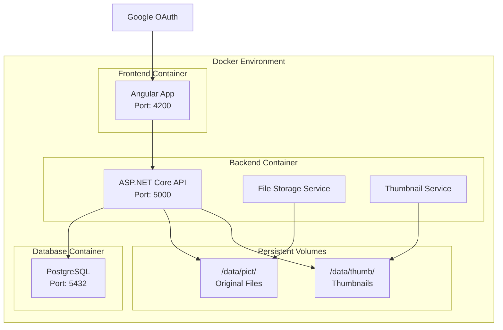
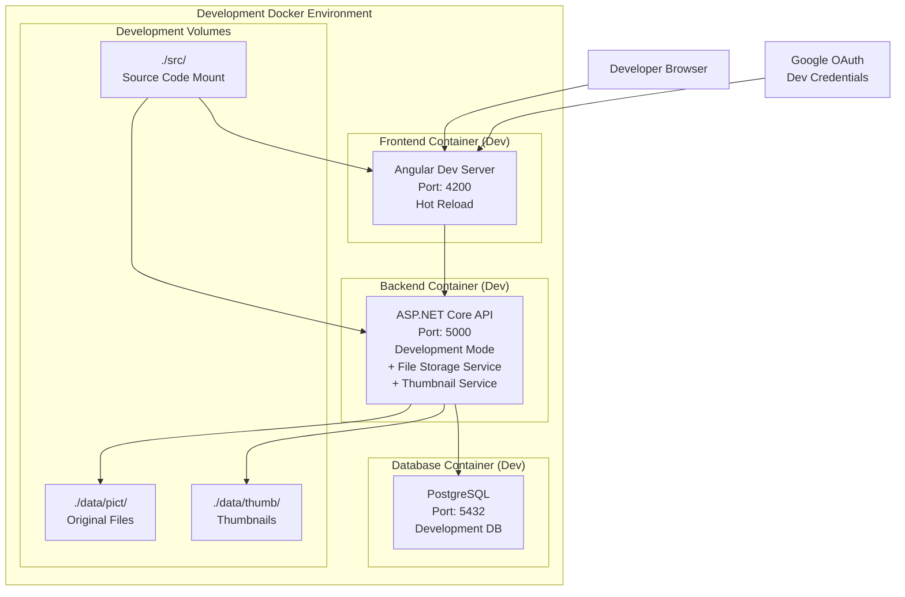
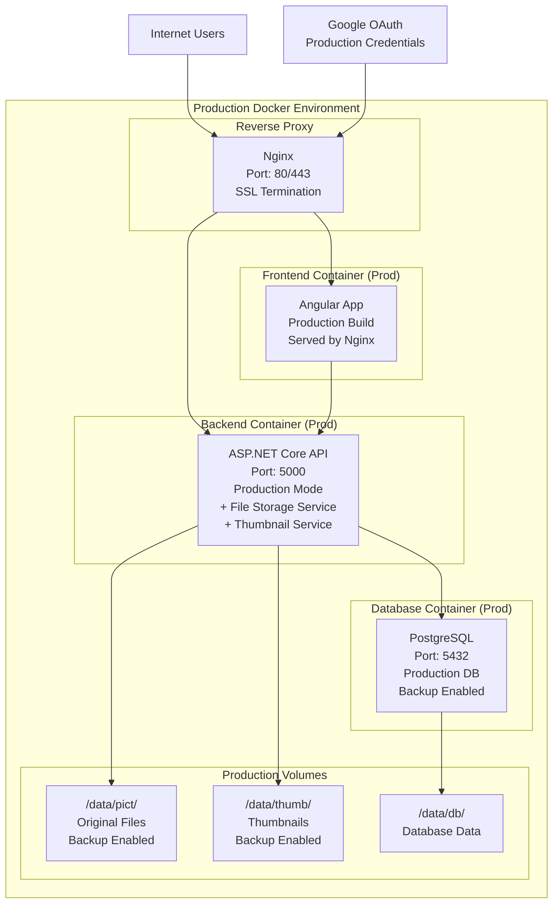

上个月，AWS发布了AI代理型IDE[Kiro(https://kiro.dev)](https://kiro.dev)。预览期间免费，于是我试用了它。  
我在预览期间使用了Kiro，尝试制作了一个假设在自家服务器上运行的相册应用。  
接下来我将分几次公开实际使用Kiro进行开发的记录。

:::info
所使用的Kiro版本为0.1.25。
:::

## 1. 初始提示

启动Kiro并打开空文件夹后，会显示如下画面。

  

作为第一步，选择“Spec”模式，并给出以下指示：

```text:作者
想制作一个相册应用。
前端使用 Angular，后端使用 ASP.NET Core。
运行环境和开发环境都在 Docker 容器中运行。
```

为了方便审核，我指定了自己习惯的框架。不过不确定Kiro是否支持。

以下是Kiro的回复：

```text:Kiro
是要开发相册应用呢。使用 Angular 前端和 ASP.NET Core 后端，在 Docker 环境中构建是个很棒的想法。

首先，为该功能创建一份需求文档吧。
Created requirements.md

已创建需求文档。在此文档中，将相册应用的主要功能分为 6 个需求进行整理：
1. 用户认证与账户管理 - 安全的登录/注册功能
2. 照片的上传与管理 - 图像文件的处理与管理
3. 相册的创建与整理 - 照片的分组与整理
4. 相册的共享与隐私 - 与其他用户的共享功能
5. 在 Docker 环境中的开发与运行 - 容器化环境
6. 响应式 UI 与用户可用性 - 适配各种设备

每个需求都包含了用户故事和具体的接受标准（EARS 格式）。

这些需求看起来合适吗？如果合适，就可以进入设计阶段。
```

已创建[需求定义书(requirements.md)](https://github.com/NoriyukiYagi/kiro-album-app/blob/v0.0.1/.kiro/specs/album-app/requirements.md)。

以下摘录部分内容至下图。

  

它根据“相册应用”这个关键词生成了通用的用户故事，并列出了相应所需功能。  
还附带了接受标准，似乎可以直接用作验收测试。

## 2. 需求的新增与修改

接着，我给出以下指示，对需求进行了新增和修改。

```text:作者
用户认证使用 Google 账户。
仅拥有管理员权限的用户可以添加/删除可登录的用户。
管理员权限的用户可以在后端应用程序的配置文件中进行设置。
不仅可以上传照片，还可以上传视频。
可上传文件的大小上限为 100MB。
可上传文件的扩展名为 JPG、PNG、HEIC、MP4、MOV。
从文件的元信息中获取日期，并按照 '/data/pict/<YYYYMMDD>' 格式创建目录，将文件保存在其中。
生成文件的缩略图，并按照 '/data/thumb/<YYYYMMDD>' 格式创建目录，将缩略图保存在其中。
照片列表中显示缩略图。
缩略图的尺寸（宽度和高度）均不超过 300 像素。
```

以下是Kiro的回复：

```text:Kiro
已了解相册应用的规格。这个是使用 Angular 前端、ASP.NET Core 后端、在 Docker 环境中进行照片/视频管理的应用，对吧。

首先创建需求定义书。
Accepted edits to requirements.md

已创建需求定义书。已按 EARS 格式整理了 Angular 前端、ASP.NET Core 后端、Docker 环境下的照片/视频相册应用需求。

主要需求如下：
・Google OAuth 认证和用户管理
・照片/视频的上传（100MB 限制，仅限特定扩展名）
・元数据库的按日期文件整理
・缩略图的自动生成（不超过 300px）
・缩略图列表显示
・Docker 容器中的运行环境

需求定义书的内容合适吗？如果有需要修改的地方请告知。如果没有问题，就进入设计阶段吧。
```

已修改[需求定义书(requirements.md)](https://github.com/NoriyukiYagi/kiro-album-app/blob/v0.0.2/.kiro/specs/album-app/requirements.md)。

以下摘录部分内容至下图。

  

内容发生了巨大变化，但似乎没有特别问题。  
让我们进入设计阶段吧。

## 3. 设计

点击提示中的「Move to design phase」按钮，进入设计阶段。

以下是Kiro的回复：

```text:Kiro
需求已被批准。接下来进入设计阶段。

首先，调查技术栈和实现所需的信息。
Searched workspace
调查 Angular 与 ASP.NET Core 的集成模式
Read file(s) requirements.md

基于需求创建设计文档。进行技术栈的选择和各组件的设计。
Created design.md

已创建设计文档。主要的设计决策事项：
架构：
・基于 Docker 容器的微服务结构
・Angular 前端 + ASP.NET Core 后端 + PostgreSQL
・通过持久化卷进行文件管理
技术选型：
・图像处理：ImageSharp（.NET 原生）
・视频处理：FFMpegCore（FFmpeg 包装器）
・认证：Google OAuth 2.0
・数据库：PostgreSQL（支持 Docker）
安全性：
・基于 JWT 令牌的认证
・管理员权限的配置文件管理
・文件大小和扩展名验证
文件管理：
・按日期的元数据目录结构
・自动生成缩略图（300px 限制）
・通过持久化卷进行数据保护

设计文档的内容合适吗？如果技术选型或架构方面有需要修改的地方，请告知。如果没有问题，就进入实现任务创建阶段。
```

已创建[设计文档(design.md)](https://github.com/NoriyukiYagi/kiro-album-app/blob/v0.1.0/.kiro/specs/album-app/design.md)。  
由于Mermaid记法编写的系统构成图有语法错误，所以做了修正。→[修正后的设计文档(design.md)](https://github.com/NoriyukiYagi/kiro-album-app/blob/v0.1.1/.kiro/specs/album-app/design.md)

以下摘录部分内容至下图。

  

先进行了技术调研，然后基于需求进行设计。我觉得它遵循的步骤与人类设计者没有区别，很有趣。  
系统构成图看起来不错，但有些违和感。



由于『File Storage Service』『Thumbnail Service』是后端组件，所以与 ASP.NET Core 并列显示是不合适的。  
此外，还标注了『Nginx (反向代理、生产环境用)』，既然已经考虑了生产环境的系统构成，就希望能将开发环境和生产环境的系统构成图分开绘制。  
除了系统构成图之外，看起来没有其他问题。

## 4. 系统构成图的修改请求

因为希望将开发环境的系统构成图和生产环境的系统构成图分开，就向 Kiro 提出了请求。

```text:作者
把开发环境的系统构成图和生产环境的系统构成图分开绘制。
```

以下是Kiro的回复：

```text:Kiro
已更新设计文档，将开发环境和生产环境的系统构成图分开列出。
Error(s) while editing design.md
Unable to replace text, trying a different approach...

确认设计文档的相关部分并进行准确替换。
Read file(s) design.md 10 - 51
Accepted edits to design.md

已分别更新开发环境和生产环境的系统构成图。
开发环境的特点：
・支持 Angular Dev Server 的热重载
・源代码卷挂载
・开发用 Google OAuth 认证信息
・保存至本地目录的文件存储
生产环境的特点：
・通过 Nginx 反向代理进行 SSL 终止
・Angular 生产构建
・数据库和文件的备份功能
・生产用 Google OAuth 认证信息

更新后的设计文档内容合适吗？关于开发环境和生产环境的构成图，是否还有其他需要修改的地方？如果没有问题，就进入实现任务创建阶段。
```

已修改[设计文档(design.md)](https://github.com/NoriyukiYagi/kiro-album-app/blob/v0.1.2/.kiro/specs/album-app/design.md)。  
由于生产环境的系统构成图存在语法错误，已进行了修正。→[修正后的设计文档(design.md)](https://github.com/NoriyukiYagi/kiro-album-app/blob/v0.1.3/.kiro/specs/album-app/design.md)  
由于想要修正『File Storage Service』和『Thumbnail Service』的问题，我也向 Kiro 提出指摘。

```text:作者
如果系统构成图中的『File Storage Service』和『Thumbnail Service』属于 ASP.NET Core API 的一部分，那么是不是可以省略它们？
```

以下是Kiro的回复：

```text:Kiro
您说得对。File Storage Service 和 Thumbnail Service 是 ASP.NET Core API 内的服务类，因此无需作为单独的容器展示。我将修改构成图。
Error(s) while editing design.md
Unable to replace text, trying a different approach...

正在检查当前文件内容并进行准确替换。
Read file(s) design.md 10 - 81
3 edits to file design.md
Read file(s) design.md 65 - 86
Accepted edits to design.md

已修改系统构成图。File Storage Service 和 Thumbnail Service 已表述为 ASP.NET Core API 内的服务类，而非独立容器，明确为 API 的一部分。

修正后的设计文档内容合适吗？如果还有需要修正的地方请告知。如果没有问题，就进入实现任务创建阶段。
```

已修改[设计文档(design.md)](https://github.com/NoriyukiYagi/kiro-album-app/blob/v0.1.4/.kiro/specs/album-app/design.md)。

最终的系统构成图如下。

#### 开发环境构成


#### 生产环境构成


效果不错。让我们进入下一步吧。

## 5. 实现计划

点击提示中的「Move to implementation plan」按钮，进入实现计划阶段。

以下是Kiro的回复：

```text:Kiro
设计已被批准。接下来创建实现任务。
Read file(s) requirements.md design.md

基于需求和设计创建实现任务。
Created tasks.md

已创建实现计划。拆分为 20 个任务，分阶段实现功能的计划。
主要实现流程：
基础搭建（任务1-2）：
・Docker 环境设置
・数据库与实体设置
认证功能（任务3-4）：
・实现 Google OAuth
・用户管理功能
文件管理（任务5-9）：
・上传功能
・元数据提取与整理
・缩略图生成
・API 实现
前端（任务10-16）：
・Angular 项目设置
・各组件实现
质量与部署（任务17-20）：
・错误处理
・生产环境配置
・测试实现
・集成与文档化
每个任务都对应了需求定义的接受标准，能够支持关注测试驱动开发的分阶段实现。

实现任务的内容合适吗？如果任务拆分或顺序方面有需要修改的地方请告知。如果没有问题，规格创建完成。
```

已创建[实现任务(task.md)](https://github.com/NoriyukiYagi/kiro-album-app/blob/v0.2.0/.kiro/specs/album-app/tasks.md)。

以下摘录部分内容至下图。

  

看起来没有问题，于是点击提示中的「Finalize task list」按钮。

以下是Kiro的回复：

```text:Kiro
实现任务已被批准！

相册应用的规格制定已完成。已创建以下成果物：
・需求定义书 (.kiro/specs/album-app/requirements.md)：以 EARS 形式定义的 7 个主要需求
・设计文档 (.kiro/specs/album-app/design.md)：系统构成、技术栈、数据模型、API 设计
・实现计划 (.kiro/specs/album-app/tasks.md)：20 个分阶段实现任务
至此，使用 Angular + ASP.NET Core + Docker 的照片与视频相册应用的开发准备已就绪。

如要开始实施，可打开 tasks.md 文件，点击各任务旁的「Start task」按钮，按阶段实现功能。建议从第一个任务「Docker 环境与项目结构设置」开始。
```

实现准备已就绪。下次开始进入实现阶段。

## 到目前为止的感想

首先，能够认真撰写需求定义书和设计书让我印象深刻。  
可以在确认内容后再进入下一阶段，增加了安全感。  
即使是针对特定业务的应用，也可以通过提供需求列表和用户故事来生成需求定义书。  
对于自动生成的需求定义书和设计书的内容，除系统构成图之外没有其他问题。  
感觉它也能在实际业务中发挥作用。
