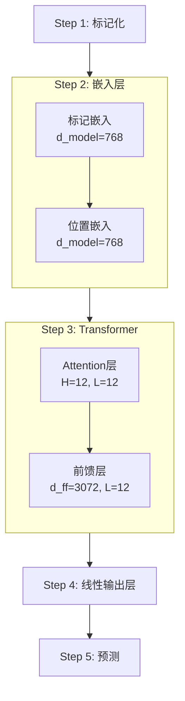
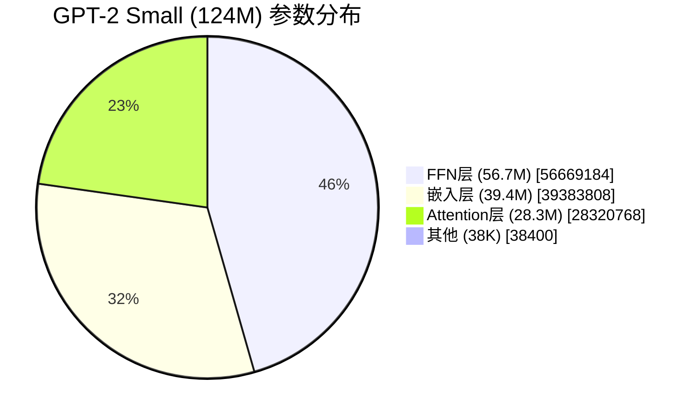

本文是2025年夏季接力连载第3天的文章。

:::check

本文面向以下读者群体。

* 希望直观理解参数数量与LLM性能关系者
* 希望概览Transformer机制并获得学习切入点者

本文非详细理论讲解，而是以**“把握整体概貌”**为目的。如需更深入学习，请参阅文中介绍的[参考文献](https://book.mynavi.jp/ec/products/detail/id=146901)。

:::

# 1. 导言

## 对参数数量的本质疑问

在大规模语言模型中，参数数量常被作为主要指标。例如，OpenAI在2025年8月5日发布的「gpt-oss-20b」与「gpt-oss-120b」也在模型名称中包含了参数规模。这既可作为所需内存量的参考，也可解读为对性能水平的暗示。

但是，为何可以说**参数越多性能越好**呢？要理解这一点，需要分解来看各参数实际是如何发挥作用的。

## 调查方法与参考文献

为了解答上述疑问，我们参考了『[つくりながら学ぶ！LLM自作入門（マイナビ出版）](https://book.mynavi.jp/ec/products/detail/id=146901)』，并实际对GPT-2 small所使用的124M参数进行了分解，实测各参数所起的作用。

@[og](https://book.mynavi.jp/ec/products/detail/id=146901)

本书的一大特色是**将LLM的理论与源码逐步讲解**。[原作者创建的GitHub仓库](https://github.com/rasbt/LLMs-from-scratch)也极具参考价值，其信息量令人惊叹。

@[og](https://github.com/rasbt/LLMs-from-scratch)

在本文中，我们利用上述资源对参数的工作原理进行了实测检验。接下来在第2章中，我们将详细探讨这些参数如何协同实现“理解”和“生成”。

# 2. 实测 - GPT-2 small (124M)的解剖

:::alert
本章说明基于作者本人对书籍理解及实测结果的整理，为了便于理解部分内容做了简化。如需更严谨的理论或完整的数学推导，请参阅[参考文献](https://book.mynavi.jp/ec/products/detail/id=146901)。如有错误或不足，欢迎反馈。
:::

## 2-1. 处理流程全貌

依据GitHub上公开的书籍第4章图表，我们简洁地将GPT-2处理文本的流程分为5个步骤。（已省略残差连接和Dropout等细节）



图中所示的 d_model=768、H=12、L=12、d_ff=3072 为可调参数。本章后续将对这4个参数进行跟踪讨论（PyTorch官方Transformer文档中排在前四项的可调参数）。

### 处理概述

例如，当输入 “Hello, I am” 时，将按以下流程处理，并最终确定下一个输出（如 “student”）：

**Step 1: 标记化**  
* 将文本转换为标记ID序列：`"Hello, I am" → [15496, 11, 314, 716]`

**Step 2: 嵌入层**  
* 标记嵌入 - 将各标记ID转换为768维向量  
* 位置嵌入 - 以768维表示附加标记的位置信息

**Step 3: Transformer模块（共12层）**  
* Attention模块 - 计算标记间的关系  
* 前馈网络 - 信息的转换与压缩

**Step 4: 线性输出层**  
* 最终归一化  
* 通过权重共享进行输出映射

**Step 5: 预测**  
* 通过Softmax计算概率  
* 从50,257个候选中进行选择

## 2-2. 各步骤的参数使用量（可跳过阅读！）

本章将说明各步骤的参数使用量。为确保准确，我们使用生成AI解析了[原作者GitHub仓库中的源码](https://github.com/rasbt/LLMs-from-scratch/blob/main/ch04/01_main-chapter-code/gpt.py)，并按步骤整理。但由于生成AI不擅长精确计算数字，参数数量部分采用了以下验证用代码的运行结果。

<details>
<summary>参数数量验证用代码（点击展开）</summary>

> ```python:check_param.py
> # GPT-2 124M parameter calculation based on gpt.py implementation
> 
> # GPT-2 124M configuration from gpt.py
> vocab_size = 50257
> context_length = 1024
> emb_dim = 768
> n_heads = 12
> n_layers = 12
> qkv_bias = False  # No bias in Q,K,V projections
> 
> print("=" * 60)
> print("GPT-2 124M Parameter Count (based on gpt.py)")
> print("=" * 60)
> 
> # 1. Embedding layers
> token_emb = vocab_size * emb_dim
> pos_emb = context_length * emb_dim
> emb_total = token_emb + pos_emb
> 
> print("\n1. Embedding Layers:")
> print(f"   Token embedding: {token_emb:,}")
> print(f"   Position embedding: {pos_emb:,}")
> print(f"   Subtotal: {emb_total:,}")
> 
> # 2. Transformer block (per layer)
> print("\n2. Transformer Block (per layer):")
> 
> # MultiHeadAttention
> # From gpt.py: W_query, W_key, W_value with qkv_bias=False
> qkv_weights = emb_dim * emb_dim * 3  # No bias
> # From gpt.py: out_proj has bias by default
> out_proj = emb_dim * emb_dim + emb_dim  # Weight + bias
> attention_total = qkv_weights + out_proj
> 
> print(f"   a) MultiHeadAttention:")
> print(f"      Q,K,V weights (no bias): {qkv_weights:,}")
> print(f"      Output projection (with bias): {out_proj:,}")
> print(f"      Attention total: {attention_total:,}")
> 
> # FeedForward
> # From gpt.py: nn.Linear(emb_dim, 4*emb_dim) with bias
> ffn_fc = emb_dim * (4 * emb_dim) + (4 * emb_dim)
> # From gpt.py: nn.Linear(4*emb_dim, emb_dim) with bias
> ffn_proj = (4 * emb_dim) * emb_dim + emb_dim
> ffn_total = ffn_fc + ffn_proj
> 
> print(f"   b) FeedForward:")
> print(f"      First layer (768->3072): {ffn_fc:,}")
> print(f"      Second layer (3072->768): {ffn_proj:,}")
> print(f"      FFN total: {ffn_total:,}")
> 
> # LayerNorm (2 per block: norm1 and norm2)
> # From gpt.py: scale and shift parameters
> ln_params = emb_dim * 2 * 2  # 2 params (scale, shift) × 2 LayerNorms
> 
> print(f"   c) LayerNorm x2: {ln_params:,}")
> 
> # Total per block
> block_total = attention_total + ffn_total + ln_params
> print(f"   Total per layer: {block_total:,}")
> 
> # 3. All transformer layers
> transformer_total = block_total * n_layers
> print(f"\n3. All Transformer Layers ({n_layers} layers):")
> print(f"   Total: {transformer_total:,}")
> 
> # 4. Final layers
> # From gpt.py: final_norm (LayerNorm)
> final_ln = emb_dim * 2  # scale and shift
> # From gpt.py: out_head shares weights with token embedding
> # nn.Linear(emb_dim, vocab_size, bias=False)
> # Weight is shared with token_emb, so we don't count it again
> 
> print(f"\n4. Final Layers:")
> print(f"   Final LayerNorm: {final_ln:,}")
> print(f"   Output head: Weight shared with token embedding (not counted)")
> 
> # 5. Total
> total_params = emb_total + transformer_total + final_ln
> 
> print(f"\n" + "=" * 60)
> print(f"TOTAL PARAMETERS: {total_params:,}")
> print(f"=" * 60)
> 
> # Verify the calculation
> print(f"\nExpected (GPT-2 124M): 124,412,160")
> print(f"Calculated: {total_params:,}")
> print(f"Match: {total_params == 124412160}")
> 
> # Breakdown summary
> print(f"\nParameter Distribution:")
> print(f"  Embeddings: {emb_total:,} ({emb_total/total_params*100:.1f}%)")
> print(f"  Transformer: {transformer_total:,} ({transformer_total/total_params*100:.1f}%)")
> print(f"  Output: {final_ln:,} ({final_ln/total_params*100:.1f}%)")
> ```
</details>

:::check
本部分基于源代码进行说明，只想了解结论的读者可直接跳至下一章。
:::

### Step 1: 标记化

**使用参数：0个**

将文本转为数字  
* 基于BPE（Byte Pair Encoding）的字典转换  
* 基于预训练词表（50,257个标记）

### Step 2: 嵌入层（39,383,808个）

**标记嵌入：38,597,376个**  
* 50,257词汇 × 768维 = 38,597,376个参数（参考：GPT-3的嵌入维度为12,288）  
* 从嵌入表中获取对应各标记ID的768维向量

**位置嵌入：786,432个**  
* 1,024位置 × 768维 = 786,432个参数  
* 从嵌入表中获取对应各位置信息的768维向量

**嵌入相加（无参数）**  
* 标记嵌入 + 位置嵌入（元素级相加）  
* 应用Dropout(0.1)

### Step 3: Transformer模块（12层，共85,026,816个）

每层使用7,085,568个参数：

**MultiHeadAttention（2,360,064个）**

12头并行处理（每头64维）：  
* Query投影：`nn.Linear(768, 768, bias=False)` → 589,824个  
* Key投影：`nn.Linear(768, 768, bias=False)` → 589,824个  
* Value投影：`nn.Linear(768, 768, bias=False)` → 589,824个  
* 输出投影：`nn.Linear(768, 768)` → 590,592个（含bias）

处理流程：  
1. 接收输入向量 [B（批次大小），T（序列长度），768]  
2. 通过线性变换生成 Q、K、V，并分割为12头 [B, 12, T, 64]  
3. 计算Attention得分：scores = (Q · Kᵀ) / √64  
4. 应用因果掩码后，通过softmax归一化以获得Attention权重 [B, 12, T, T]  
5. 计算上下文向量：context = weights · V [B, 12, T, 64]  
6. 将12头拼接，并通过输出投影返回到 [B, T, 768]

**FeedForward（4,722,432个）**

4倍维度扩展与压缩：  
* 第1层：`nn.Linear(768, 3072)` → 2,362,368个（weight+bias）  
* GELU激活（无参数）  
* 第2层：`nn.Linear(3072, 768)` → 2,360,064个（weight+bias）

**LayerNorm（3,072个）**

残差连接前后进行归一化：  
* norm1（在Attention前）：1,536个（scale:768 + shift:768）  
* norm2（在FFN前）：1,536个（scale:768 + shift:768）

**残差（Shortcut）连接和Dropout**  
* 无参数，用于改善梯度流动

### Step 4: 输出层（1,536个）

**最终LayerNorm：1,536个**  
* `LayerNorm(768)`：scale(768) + shift(768)

**输出投影（权重共享）**  
* `nn.Linear(768, 50257, bias=False)`  
* 使用标记嵌入的转置（节约38,597,376个参数）

### Step 5: 预测（无参数）

**Softmax概率计算**  
* 从50,257词汇中选择下一个标记  
* 可应用温度采样或Top-k/Top-p方法

## 2-3. 124M参数的全貌

分析结果显示，GPT-2 small的124,412,160个参数分布如下：

```
Step 1: 标记化               0个（0%）
Step 2: 嵌入层        39,383,808个（31.7%）
  ├─ 标记嵌入   38,597,376个（31.0%）
  └─ 位置嵌入          786,432个（0.6%）
Step 3: Transformer层     85,026,816个（68.3%）
  ├─ Attention（12层，12头）   28,320,768个（22.8%）
  ├─ FFN（12层）         56,669,184个（45.5%）
  └─ LayerNorm（12层）       36,864个（0.03%）
Step 4: 输出层               1,536个（0.001%）
  └─ 最终LayerNorm（投影使用权重共享）
Step 5: 预测                    0个（0%）
────────────────────────────────
合计：                 124,412,160个
                       ≈ 124.4M（1.24亿）

※通过权重共享节约38,597,376个参数
（若不共享，则为163,009,536个）
```

# 3. 结论与思考 - 参数数量决定性能的原因

## 3-1. 就参数数量而言，Attention仅占22.8%

下图以饼图形式展示了上一章所得的GPT-2参数数量明细：



Attention层仅占22.8%，反而FFN层占45.5%。嵌入层也超过3成，**大部分参数并未分配给Attention层**。

此结果很有趣。因为从论文标题“Attention Is All You Need”[^3]来看，作者本以为模型的大部分参数都应当用于Attention层。

## 3-2. 参数数量增加带来的4大效果：分辨率、多样性、特征理解力、推理深度

接下来，我们思考如何调整各层参数以提升LLM性能。本文将针对第2-1章定义的4个可调参数进行讨论。

**嵌入维度 (d_model)**  
决定将每个标记表示为多少维向量。维度越高，越能细致地保留上下文信息，精确捕捉词语意义与细微差别。  
直观的比喻可类比“二十个问题游戏”[^4]，通过增加提问数来精确锁定目标；在此仅需理解“维度越高，词语区分越精细”的概念即可。  
→ **提升词语分辨率**的参数。

**Attention头数 (H)**  
用于并行从多视角处理输入。增加头数可多角度捕捉上下文。  
例如，英语单词“bank”既可指“银行”，也可指“河岸”，具体含义取决于上下文。使用多头可同时追踪各含义，并根据上下文选择最合适的解释。  
→ **扩展解释多样性**的参数。

**FFN中间层 (d_ff)**  
用于将Attention获取的信息进行非线性变换。增大该值可重构无法通过简单平均处理表示的复杂特征，提高模型表达能力。  
比喻而言，这类似于图像处理中非线性滤波器相比线性滤波器（平均滤波器）能更精确地去除噪声[^5]。※虽处理原理不同，此处仅作为“可进行更复杂变换”的比喻。  
→ **强化复杂特征理解力**的参数。

**层数 (L)**  
指堆叠多少个Transformer模块。增加层数可分阶段重复推理，更易捕捉长距离依赖与复杂关系。  
→ **提高推理深度**的参数。

总结而言，**通过增加参数数量，可提升词语分辨率、多样性、特征理解力及推理深度，从而有望提高LLM性能**。

# 结语

通过本文，或许您获得了以下视角：

- 并非“注意力万能”，而是整体参数的平衡更为重要  
- 可超越“参数数量=性能提升”的简单理解，获得新的视角

作者本人也借2025年8月的内部Hackathon机会重新学习了[参考文献](https://book.mynavi.jp/ec/products/detail/id=146901)，并再次理清了Transformer的机制。希望本文能为各位读者的学习提供帮助。


[^1]: [OpenAI: 拓展开放权重推理模型边界的 gpt-oss-120b 和 gpt-oss-20b](https://openai.com/ja-JP/index/introducing-gpt-oss/)

[^2-1]: [Chapter 4: Implementing a GPT model from Scratch To Generate Text](https://github.com/rasbt/LLMs-from-scratch/blob/main/ch04/01_main-chapter-code/ch04.ipynb)

[^2-2]: [PyTorch官方文档（Transformer）](https://docs.pytorch.org/docs/stable/generated/torch.nn.Transformer.html)

[^3]: [Attention Is All You Need (Vaswani et al., 2017)](https://arxiv.org/abs/1706.03762)

[^4]: [Wikipedia 二十个问题](https://ja.wikipedia.org/wiki/%E4%BA%8C%E5%8D%81%E3%81%AE%E8%B3%AA%E5%95%8F)

[^5]: [图像滤波～为了更轻松地检测缺陷（前篇）](https://www.visco-tech.com/newspaper/column/detail19/?utm_source=chatgpt.com)
