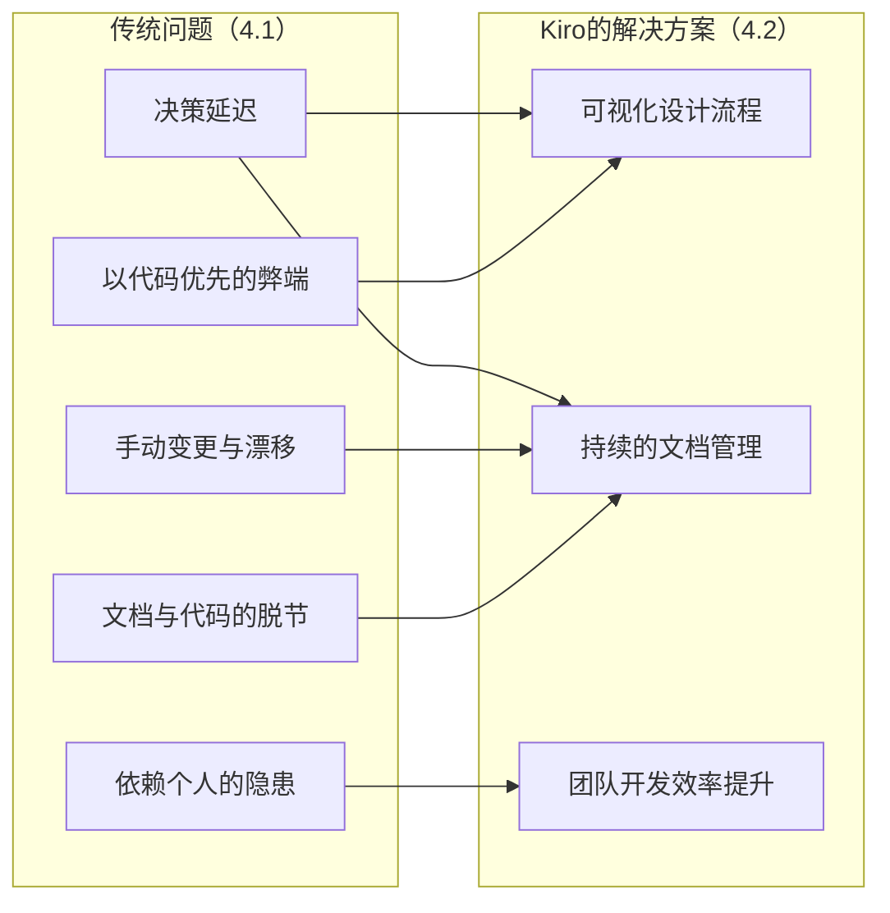
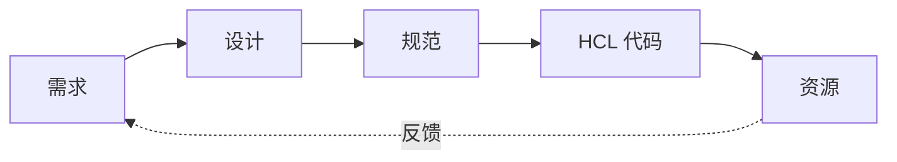

本文是2025年夏季接力连载的第8天文章。

## 1. 引言
您能准确掌握用于业务的基础设施规范吗？

对于个人开发或小规模系统而言，掌握基础设施的全貌相对容易。但是，随着组织系统规模的扩大，平台和使用产品的数量增加，能够掌握所有规范的人就会变少。

重要的不是全面理解一切，而是能够准确掌握自己负责领域的规范，并将其用于适当的决策。

### 为什么难以掌握基础设施规范
为什么难以掌握基础设施资源的规范呢？虽然有各种因素，但笔者认为“信息分散和缺失”是根本原因。

- **文档分散**：设计文档、运维流程、变更历史散落在不同位置
- **规范不明**：资源的需求、约束、设计依据未被记录
- **隐性知识积累**：配置意图和依赖关系只存在于负责人记忆中，随负责人离职而丢失

### 由此产生的问题及其影响
这些问题在DevOps中会引发以下问题。

- 无法预估变更时的影响范围
- 在故障响应时，定位原因需要耗费时间
- 在相关人员之间维持共同理解很困难
- 技术债务累积和风险增加

结果是决策延迟，变更和改进的启动被推迟。

### 作为解决手段的Kiro
受到关注的用于解决这些问题的手段是“Kiro”。虽然已有大量关于软件开发方面的Kiro文章，但从基础设施视角的应用案例仍然较少。

本文将利用Kiro的Spec模式，将规范驱动开发整合到Terraform工作流程中，并探讨以文档为起点的IaC在DevOps中的潜力。

## 2. 文章概要
### 目标读者
- 有Terraform IaC经验者
- 想要强化IaC规范和文档管理的开发/运维人员

### 前提条件
- Kiro版本: `0.2.13`
- HCL/Terraform基础知识
- 对AWS资源构建的基本理解

### 本文不涉及范围
- Terraform或HCL的基础语法
- Kiro内部AI模型的机制
- 高级Terraform模块设计
- AWS各服务的详细配置方法

## 3. 什么是Kiro？

::: alert
本文内容基于撰写时的公测版。最新信息请参见官方文档。
:::

[Kiro](https://kiro.dev/)是AWS开发的AI代理集成型IDE。  
与传统IDE不同，其特点是能通过自然语言交互来生成代码。

在预览发布后即切换至邀请制候补名单，可见其高关注度。

Kiro的基本操作请参见[官方Docs](https://kiro.dev/docs/)或以下我们公司开发者站点的文章。  
- [Kiro进行AI开发革命！？从零开始制作相册应用【第1部分：需求定义·设计·实现计划】](https://developer.mamezou-tech.com/blogs/2025/08/19/kiro-album-app-1/)

### 3.1 Kiro的基本概念
Kiro将开发流程结构化为以下三阶段。

1. **Requirements（需求）**：以自然语言提示想要构建的内容，Kiro会自动转换为EARS（Easy Approach to Requirements Syntax）格式并按该格式定义需求。  
2. **Design（设计）**：定义满足需求所需的技术架构。  
3. **Spec（规范）**：将设计确立为具体的实现规范。  

EARS是通过6种基本类型模板短语来简洁一致地表达需求、减少歧义的模板。详情超出本文范围，但可参考以下概览。  
- [将需求规格可视化 〜 利用EARS（Easy Approach to Requirements Syntax）编写系统需求的方法 〜](https://www.bgarage.co.jp/news/946/)

这种分阶段的方法有助于从因个人或AI的风格和偏好而进行的“感性编码”转向严格的“规范驱动开发”。  
此外，通过直接编写Requirements和Design，也可以更改Spec。

### 3.2 Spec模式与IaC的亲和性
特别是Spec模式，它一方面将需求和设计整理为文档，另一方面能将其直接生成HCL代码，与IaC高度契合。

考虑到IaC的特性，这种高亲和性源于以下原因：
- 基础设施架构是基于明确的需求和约束进行设计的
- 资源间的依赖关系需要明确表示
- 需要事先把握变更时的影响范围
- 需要着眼于长期DevOps的设计

此外，还可在提示和文档视图中确认规范和需求，实现AI与人交互式地打磨需求、设计和规范，并持续到代码生成。

## 4. 传统IaC开发面临的问题及Kiro的解决方案

### 4.1 传统IaC开发中的问题点
许多组织都在使用Terraform进行IaC开发，但常常会面临以下挑战。

**以代码优先的弊端**
- 从代码开始编写，设计意图容易变得模糊
- 事后想编写文档时，难以回想当时的判断依据
- 在代码评审时，无法理解“为什么要采用这种架构”

**文档与代码的脱节**
- 文档（包括设计和规范）与Terraform代码往往分开管理，代码变更时的更新滞后，导致决策记录与实现易出现脱节

**手动变更与漂移**
- 在IaC管理之外手动创建资源
- 手动创建的资源责任和管理不到位，多余资源持续残留（即漂移常态化）

**依赖个人的隐患**
- 配置的背景和约束依赖于负责人的记忆
- 因负责人调动或离职导致知识丧失
- 新成员加入时，理解需要耗费时间

结果是决策延迟，变更和改进的启动被推迟。

### 4.2 Kiro带来的文档化优势
在IaC实践中，单靠代码往往难以看清“为什么采用这样的规范或实现”。通过Kiro的Spec模式进行文档化，有以下优点：

**可视化设计流程（应对：以代码优先）**
- 从需求到设计、实现的思考过程被记录
- 决策依据和约束条件变得清晰
- 可以保留替代方案的评估过程

**持续的文档管理（应对：脱节）**
- 变更历史和背景会自动保留
- 审查和维护变得容易
- 可以事先把握规范变更时的影响范围

**团队开发效率提升（应对：依赖个人）**
- 能创建团队间易于共享的IaC规范
- 能在相关者间早期形成共同理解
- 代码评审质量提升

### 4.3 传统问题与Kiro解决方案的对应关系
以下展示如何通过Kiro的解决方案消除传统问题。


::: info
建立需求、设计、实现的可追溯性机制非常重要。  
就Kiro而言，通过对Requirements、Design和Spec这三份文档进行一致管理，并保持与生成的IaC代码的一致性，实现了解决传统问题。
:::

## 5. 实践：使用Kiro构建基于Lambda的定期执行系统

### 5.1 梳理需求（Requirements）
首先，以自然语言梳理需求。我们以定期批处理系统为例。

```
【前提条件与约束】
- 平台: AWS
- IaC: Terraform（HCL）
- 使用 Terraform v1.13
- 使用 hashicorp/aws 5.x

【需求】
- 希望每天在固定时间自动执行批处理
- 在批处理过程中进行数据汇总和整理
- 如果处理过程中发生错误，希望通过 CloudWatch 警报通知
- 希望以无服务器方式实现以提高成本效率
- 希望能够灵活地更改调度
- 希望将来能够扩展处理内容
```

↓ 在输入后Kiro的回应

  
*在向提示符输入简单需求后Kiro的回应。请最后确认内容是否无误，然后再进入下一阶段*

### 5.2 设计具体化（Design）
将需求输入Kiro后，可以获得如下设计方案。  
笔者额外添加了关于DevOps的描述，并将代码注释等以日文编写。

↓ 在输入后Kiro的回应

```
【设计】简易的无服务器架构
EventBridge Scheduler → Lambda → CloudWatch 的直接流程
每天早上9点自动执行（cron(0 9 * * ? *)）
出错时通过 CloudWatch 警报 → SNS → Email 通知

【主要组件】
EventBridge Scheduler：管理每天上午9点的调度
Lambda 函数：执行批处理（超时 5 分钟）
CloudWatch Logs：日志聚合（保留 30 天）
CloudWatch Alarms：错误监控与通知
SNS Topic：Email 通知
SQS Dead Letter Queue：故障时的重试处理

【安全性】
最小权限原则：Lambda 执行角色（仅写入 CloudWatch Logs）、EventBridge Scheduler 角色（仅执行 Lambda）
资源标签：为所有资源统一添加标签

【运维·DevOps】
Terraform：完全的 IaC 管理
日语支持：注释、说明文、错误信息以日文编写
监控：Lambda 执行状况、错误率监控
成本效率：无服务器按需计费
```

### 5.3 确定规范与代码生成（Spec）
在需求和设计确定后，通过Spec生成代码。  
以下是Kiro生成的HCL代码（节选）。为简洁起见，省略了IAM角色、SNS Topic等部分辅助资源定义。

某些细节通过笔者的指示进行了修改，但资源均根据需求和设计中指定的内容创建。

```hcl
terraform {
  required_version = ">= 1.13.0"
  required_providers {
    aws = {
      source  = "hashicorp/aws"
      version = "~> 5.0"
    }
  }
}

# 带默认标签的 Provider 配置
provider "aws" {
  region = "ap-northeast-1"

  default_tags {
    tags = {
      Project     = "batch-processing-system"
      Environment = "production"
      ManagedBy   = "Terraform"
    }
  }
}

# Lambda Function
resource "aws_lambda_function" "batch_processor" {
  filename         = "batch_processor.zip"
  function_name    = "daily-batch-processor"
  role             = aws_iam_role.lambda_role.arn
  handler          = "index.handler"
  runtime          = "python3.12"
  timeout          = 300
  description      = "每天执行的批处理 Lambda 函数"

  tags = {
    Name    = "daily-batch-processor"
    Purpose = "automated-batch-processing"
  }
}

# EventBridge Scheduler
resource "aws_scheduler_schedule" "batch_schedule" {
  name        = "daily-batch-schedule"
  group_name  = "default"
  description = "每天上午9点执行批处理的调度（JST）"

  flexible_time_window {
    mode = "OFF"
  }

  schedule_expression             = "cron(0 9 * * ? *)"
  schedule_expression_timezone    = "Asia/Tokyo"

  target {
    arn      = aws_lambda_function.batch_processor.arn
    role_arn = aws_iam_role.scheduler_role.arn
  }
}

# 允许 Scheduler 调用 Lambda 函数
resource "aws_lambda_permission" "allow_scheduler" {
  statement_id  = "AllowExecutionFromScheduler"
  action        = "lambda:InvokeFunction"
  function_name = aws_lambda_function.batch_processor.function_name
  principal     = "scheduler.amazonaws.com"
  source_arn    = aws_scheduler_schedule.batch_schedule.arn
}

# 监控 Lambda 函数错误的 CloudWatch 警报
resource "aws_cloudwatch_metric_alarm" "lambda_error_alarm" {
  alarm_name          = "lambda-batch-processor-errors"
  comparison_operator = "GreaterThanThreshold"
  evaluation_periods  = 1
  metric_name         = "Errors"
  namespace           = "AWS/Lambda"
  period              = 300
  statistic           = "Sum"
  threshold           = 0
  alarm_description   = "监控批处理 Lambda 函数错误的警报"
  alarm_actions       = [aws_sns_topic.alerts.arn]

  dimensions = {
    FunctionName = aws_lambda_function.batch_processor.function_name
  }

  tags = {
    Name    = "lambda-error-alarm"
    Purpose = "error-monitoring"
  }
}
```

### 5.4 从文档到代码的一致流程
通过此流程，实现了文档 → HCL → 基础设施的一致流程。

1. **需求定义**：以自然语言描述业务需求  
2. **设计评估**：对照技术约束与需求确定架构  
3. **规范确定**：确定包含实现级别细节的规范  
4. **代码生成**：输出为 HCL 代码  
5. **基础设施构建**：使用 Terraform 执行 plan/apply  

### 5.5 重用需求和设计以创建类似资源
已验证可利用在5.1〜5.3中确定的 Requirements/Design/Spec，轻松创建类似资源。

例如，对于“想要添加每周执行的批处理”此需求，只需复制现有Spec，并向Kiro提供以下简单指示，即可生成新资源。

```
请以现有的日常批处理规范为基础，按以下差异创建每周批处理：
- 调度：每周星期日 10:00
- 资源名称：weekly-batch-processor
- 处理内容：生成周报
```

Kiro会理解现有的设计模式，并在命名规范、标签设置、IAM 权限等方面一致应用，生成新的HCL代码。

由此可见，一旦建立了Requirements/Design/Spec，就能大幅提升创建类似资源的效率。

## 6. 文档与HCL的亲和性

### 6.1 HCL的特性与文档化
HCL具有较高的抽象度，能够以明确的方式描述构成要素和依赖关系，这与规范文档高度契合。

**声明式描述方式**  
HCL以声明式方式描述“要创建什么”，这与需求或设计文档的描述方式在本质上是相同的。

```hcl
# 设计文档: "每天在固定时间自动执行批处理"
resource "aws_scheduler_schedule" "batch_schedule" {
  name                = "daily-batch-schedule"
  description         = "每天上午9点执行批处理的调度"
  schedule_expression = "cron(0 9 * * ? *)"
}
```

**构成要素的明确对应关系**  
- 文档中编写的构成要素可直接对应到HCL的 resource 或 module  
- 在规范中定义的变量或需求可直接展开到 variable 或 output  
- 依赖关系在代码中也能明确表达  

### 6.2 实现规范驱动开发
:::: info
可追溯性（traceability）的一般定义  
- 能双向追踪需求、设计、实现、测试等成果物间关系的特性
::::

**确保可追溯性**  
在Kiro中，从需求到实际资源的一系列流程都会被记录，实现双向追踪。



**改进变更管理**
- 在规范变更时从需求层面重新审视
- 在设计阶段把握影响范围
- 在规范中验证代码变更的合理性

保留规范可确保HCL代码的意义不模糊。结果便可保证“代码源自规范”，最大程度防止设计与实现脱节，这是其最大价值。

## 7. 未来展望

**与 AI 协同开发的演进**  
像Kiro这样的AI代理集成型IDE，预计未来将进一步进化。  
- 提供更高级的设计模式  
- 从过往实现案例中学习的功能  
- 实时优化建议  

**IaC开发文化的变革**  
随着规范驱动开发的普及，基础设施开发的文化本身可能发生改变。  
- 强调“为什么”的设计文化  
- 文档优先的开发风格  
- 以持续改进为前提的 DevOps  

将基础设施开发从“感性编码”转向“规范驱动开发”带来的价值，超越了单纯的工具引入。通过提升整个组织的基础设施管理能力和减少技术债务，推动更稳定的 DevOps 实践。

## 8. 总结
利用Kiro的Spec模式，可为基于HCL的IaC管理带来以下新价值。

**技术价值**
- 以文档为起点的一致性高的架构管理
- 从文档直接生成代码的无缝开发体验
- 通过文档与HCL的高亲和性，防止设计与实现脱节

**组织价值**
- 促进团队内部的知识共享和知识积累
- 持续促进相关者间的共同理解
- 降低推动长期 DevOps 及其维护成本

**文化价值**
- 在编写代码前梳理规范的文化扎根
- 将设计决策的背景和依据明文化的设计思维
- 以持续改进为前提的开发流程

即使对 Terraform 已经熟悉的人员，通过引入 Kiro 也能自然而然地建立“在编写代码前梳理规范”的文化。由此可兼顾长期 DevOps 实践的易用性和团队开发的生产力，提升 IaC 中 DevOps 的可持续性。

再次重申，笔者认为最重要的是从因个人或AI的风格和偏好而进行的“感性编码”转向“规范驱动开发”。  
笔者认为，这不仅限于基础设施，在软件领域大致也是如此。  
秉持这一意识，期待在即将到来的AI时代与DevOps改进活动共进。
