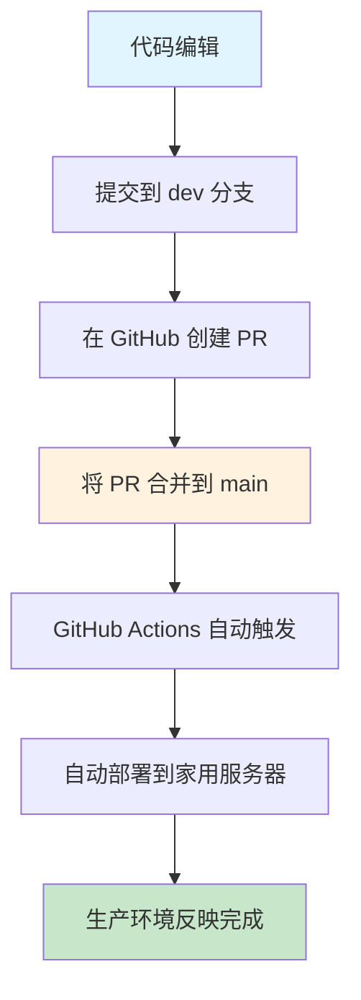
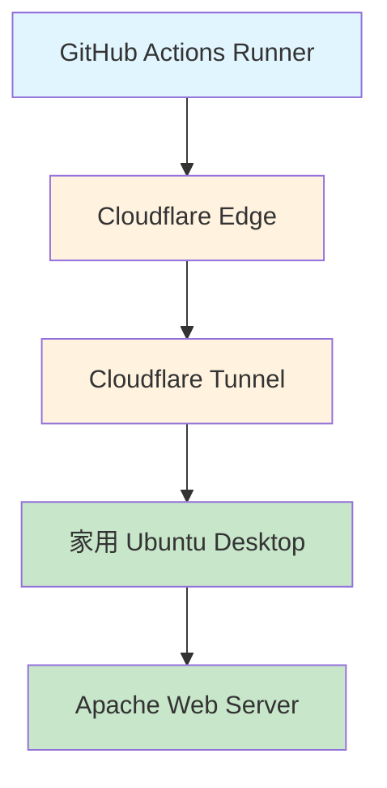
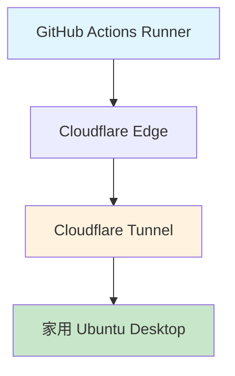
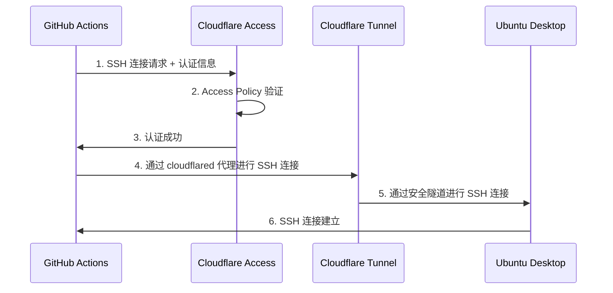
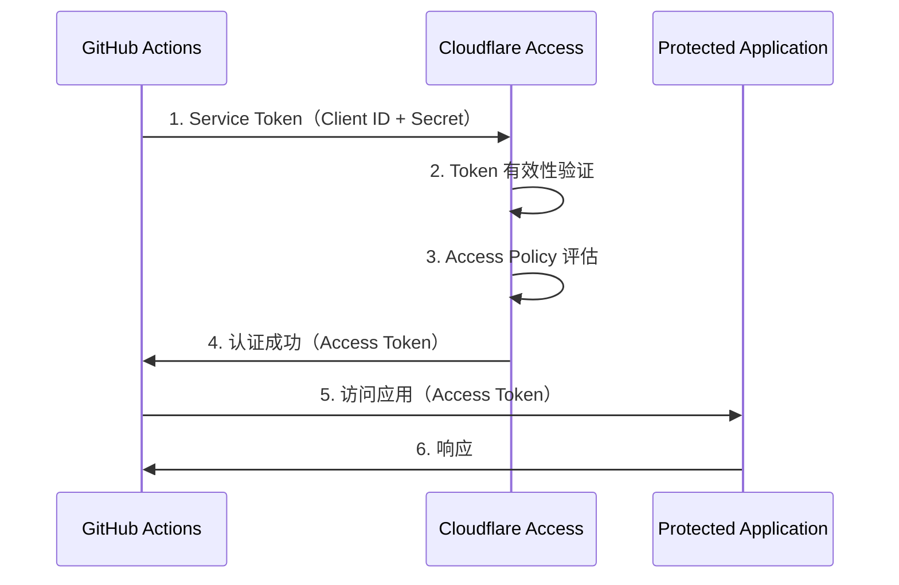
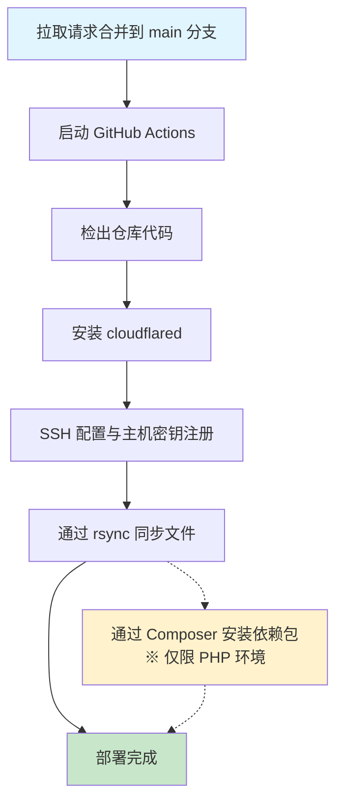
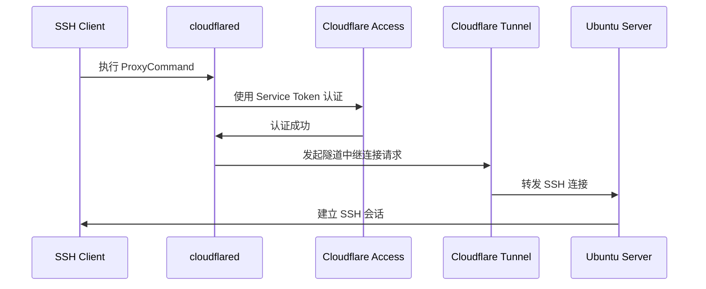

## 引言

最近，我购买了一台用于 Ubuntu Desktop 的笔记本。想在家里托管 Web 应用是契机。

购买之后，我立即安装了 Apache Web 服务器，直接编辑 `/var/www/html/index.html` 并通过浏览器访问。我记得看到按预期显示时，心想“这太有趣了！”。

但是，这样下去会有问题。**如果在这种状态下向外部公开页面，编辑的内容会立即反映到生产环境中。**也就是说，访客可能会看到开发中的不完整代码或测试用数据。

*“我想要将开发环境与生产环境分离……！”*

因此，我创建了一个与 Apache Web 服务器的公开目录分离的开发目录，在那里进行开发。同时引入了 Git/GitHub 版本管理，并采用了从 `dev` 分支到 `main` 分支的拉取请求（Pull Request）及合并的通用开发流程。

然而，又出现了新的问题。引入这个开发流程后，每次开发完成都需要**手动将开发目录的内容复制粘贴到公开目录**。虽然在 GitHub 上合并了拉取请求，但还要在本地仓库的 `main` 分支的基础上，手动执行开发目录到公开目录的复制粘贴。这实在太麻烦了。

*“希望一合并拉取请求，更新内容就能自动反映到 Apache Web 服务器的公开目录……！”*

为了解决这繁琐的手动操作，我决定构建一个基于 GitHub Actions 的 CD 管道。

本文将结合具体的配置步骤，讲解如何使用 GitHub Actions 构建面向家庭局域网内 Ubuntu Desktop 的持续部署（CD）流水线。

## 构建的 CD 流水线

本文构建的 CD 流水线将按照以下机制运行。

### 实现的操作流程



<br>

手动进行的“从开发目录复制粘贴到公开目录”操作将**以合并拉取请求为触发器实现完全自动化**。

<br>

### 系统架构



<br>

| 组件               | 作用                                                        |
|------------------|-----------------------------------------------------------|
| **GitHub Actions** | 以合并为触发器执行部署工作流程                                          |
| **Cloudflare Tunnel** | 提供无需公开家用 IP 的安全通信通道                                       |
| **Cloudflare Access** | 实现基于 Service Token 的自动认证                                     |
| **SSH + rsync**      | 仅高效同步已更改的文件                                             |

<br>

### 完成后可以做什么

- ✅ 只需合并拉取请求即可自动反映到生产环境  
- ✅ 在不公开家用公网 IP 的情况下安全运行  
- ✅ 部署历史会自动记录在 GitHub Actions 日志中  
- ✅ 完全解放手动部署操作  

## 本文的前提条件

本文面向具备以下知识和环境的读者。

### 所需知识

- **GitHub Actions 基础**：workflow 文件的编写方式及基本 Action 的使用方法  
- **Linux 基本操作**：命令行操作、文件权限、SSH 连接概念  
- **Apache Web 服务器基础**：DocumentRoot 概念及基本配置  
- **Git 基础**：分支、拉取请求、合并概念  

### 所需环境

- **GitHub 仓库**：私有或公共均可  
- **Ubuntu Desktop 环境**：本次以 Ubuntu 24.04.3 LTS 为例  
- **Apache Web 服务器**：已安装并配置  
- **Cloudflare 账号**：预期使用 Cloudflare Zero Trust  
- **自有域名**：DNS 服务器已设置为 Cloudflare  

## 所需技术概念与知识

在搭建流水线前，先梳理相关技术概念。

### GitHub Actions 工作流

GitHub Actions 是在 GitHub 仓库中执行 CI/CD 流水线的一个平台。

@[og](https://docs.github.com/ja/actions/get-started/understand-github-actions)

#### 重要概念

- **工作流**：在 `.github/workflows/` 目录下通过 YAML 文件定义并执行一个或多个作业的流程  
- **事件**：触发工作流的仓库内特定活动（如合并拉取请求）  
- **作业**：在同一 Runner 上执行的工作流中一系列步骤  
- **Action**：在工作流中执行特定任务的组件（可以使用 GitHub Actions 提供的或自定义的）  
- **Runner**：执行工作流的虚拟环境。每个 Runner 同时只能执行一个作业。（本例中使用 ubuntu-latest）

---

### SSH 连接与安全

#### SSH（Secure Shell）基础

SSH 是一种使用加密通信路径安全连接远程服务器的协议。

#### 主机认证

SSH 客户端通过验证，确认连接的目标是**真正的 SSH 服务器**。

##### **主机认证的机制**

SSH 服务器会设置一对称为 `ホスト鍵(host key)` 的唯一的私钥/公钥对。  
SSH 客户端将此公钥保存在 `~/.ssh/known_hosts` 文件中。

首次连接时，将 SSH 服务器的主机密钥（公钥）添加到 SSH 客户端的 `~/.ssh/known_hosts` 文件。  
之后每次连接时，将该文件中登记的主机密钥（公钥）与 SSH 服务器的主机密钥（私钥）进行比对，以确认连接目标是真正的 SSH 服务器。

#### 用户认证

SSH 服务器端通过验证，确认接入的 SSH 客户端用户是**真实的用户**。

##### **用户认证的机制**

使用公钥认证方式。  
大致流程如下。

1. SSH 服务器在 `~/.ssh/authorized_keys` 文件中保存被允许的 SSH 客户端的公钥。  
2. SSH 客户端使用其私钥生成签名。  
3. SSH 服务器使用 SSH 客户端的公钥验证签名。  
4. 签名验证通过后，SSH 服务器允许以该 SSH 客户端用户身份连接。

@[og](https://qiita.com/whoami_priv/items/9f165f8dfd95edb169b7)

@[og](https://qiita.com/pyon_kiti_jp/items/f89b8fa9f5b7f8abac23)

::: info
**本次 SSH 连接中的角色**

- **SSH 客户端**: GitHub Actions 的 Runner 环境 (ubuntu-latest)  
- **SSH 服务器**: 家庭 Ubuntu Desktop  

**为什么会是这种关系？**

GitHub Actions 的工作流在 GitHub 的云环境运行。  
因此，为了从云环境向外部服务器（家用 Ubuntu Desktop）部署文件，必须由 GitHub Actions Runner 向家用服务器发起 SSH 连接。  
也就是说，连接方向是“云 → 家”，GitHub Actions Runner 是发起连接的一方（客户端），家用 Ubuntu Desktop 是接收连接的一方（服务器）。
:::

---

### Cloudflare Tunnel

#### 什么是 Cloudflare Tunnel

Cloudflare Tunnel 是一项**无需公开公网 IP，便可将本地服务器安全暴露到互联网的服务**。

@[og](https://developers.cloudflare.com/cloudflare-one/networks/connectors/cloudflare-tunnel/)

@[og](https://qiita.com/keke21/items/efaa2b2c35dfb646a43e)

<br>

#### 与传统的家庭服务器公开方法的区别

**传统方法（端口映射）：**

```text
互联网 → 路由器（开放端口22） → 家用 Ubuntu Desktop
                    ↑ 安全风险
```

- ❌️ 需要在路由器上开放 SSH 端口（22 端口）  
- ❌ 公网 IP 地址直接暴露  
- ❌ 易成为 DDoS 攻击和暴力破解攻击的目标  
- ❌ 家庭 IP 地址有被识别的风险  

**使用 Cloudflare Tunnel 的方法：**

```text
GitHub Actions → Cloudflare Edge → Cloudflare Tunnel → 家用 Ubuntu Desktop
                                       ↑
                               加密隧道
```

- ✅️ 无需在路由器上开放端口  
- ✅️ 隐藏公网 IP 地址  
- ✅️ 利用 Cloudflare 的安全功能  
- ✅️ 流量通过 Cloudflare Edge 进行过滤  

#### 本次架构中的角色



- **家用 Ubuntu Desktop 端**：`cloudflared` 守护进程持续连接到 Cloudflare  
- **GitHub Actions 端**：通过 `cloudflared access ssh` 命令经代理连接  
- **Cloudflare**：在双方之间提供安全隧道  

#### 安全性优势

- **IP 隐藏**：家庭公网 IP 地址不会暴露  
- **DDoS 防护**：利用 Cloudflare 的安全基础设施  
- **访问控制**：通过 Cloudflare Access 实现详细控制  

---

### Cloudflare Access

#### 什么是 Cloudflare Access

Cloudflare Access 是 Cloudflare 提供的**实现零信任网络访问（ZTNA）的安全服务**。它取代传统 VPN，在应用层面提供认证与授权。

#### 零信任网络访问（ZTNA）的概念

@[og](https://www.cloudflare.com/ja-jp/learning/access-management/what-is-ztna/)

**传统边界安全模型：**

```text
外部（危险） | 防火墙 | 内部（安全）
```

- 在企业内部网络和互联网之间划定边界，通过防火墙阻断外部威胁  
- 以“内部网络可被信任”为前提  
- 一旦入侵内部，存在横向扩散风险  

**零信任方法：**

```text
验证所有访问 → 认证 → 授权 → 允许访问
```

- “不信任，始终验证”（Never Trust, Always Verify）  
- 无论网络位置如何，对所有连接进行认证与授权  

#### 本次架构中 Cloudflare Access 的角色



#### 安全性优势

- **细粒度访问控制**：按资源和用户进行详细权限设置  
- **审计日志**：记录所有访问尝试  
- **支持 MFA**：可强制多因素认证（针对人类用户）  
- **实时控制**：策略更改即时生效  
- **会话管理**：对连接会话进行详细管理与监控  

#### 与传统 VPN 的区别

| 项目       | 传统 VPN     | Cloudflare Access |
|----------|------------|-------------------|
| **连接范围**  | 整个网络      | 按应用划分            |
| **认证**     | 仅在连接时    | 每次访问时验证         |
| **配置复杂度** | 复杂         | 相对简单            |
| **可扩展性**  | 有限制       | 高               |
| **审计日志**  | 有限         | 详细              |

<br>

#### 基于 Service Token 的自动认证

##### **什么是 Service Token**

Service Token 是**面向自动化系统和机器间通信的认证机制**。它不同于需要人类用户交互的（OAuth、SAML 等）认证，支持完全编程化访问。

**与传统用户认证的区别：**

| 项目       | 用户认证 (OAuth/SAML)       | Service Token        |
|----------|---------------------------|----------------------|
| **对象**    | 人类用户                    | 自动化系统与应用            |
| **认证流程** | 基于浏览器・交互式             | 基于 API・编程式           |
| **认证信息** | 用户名・密码・MFA             | Client ID・Client Secret |
| **有效期**   | 以会话为单位（数小时）           | 长期                   |

<br>

##### **GitHub Actions 中的角色**

###### **1. 实现自动化的 SSH 连接**

在 GitHub Actions 工作流中无法进行人为认证操作，因此 Service Token 是必不可少的。

```text
GitHub Actions Runner → Service Token 认证 → Cloudflare Access → SSH 连接
```

###### **2. CD 流水线的最佳理由**

- **无人执行**：可在无人干预下 24 小时运行  
- **可扩展性**：可供多个工作流同时使用  
- **可靠性**：无需担心会话失效或超时  
- **安全性**：通过 GitHub Secrets 进行安全管理  

###### **3. 自动化工作流中的安全优势**

- **最小权限原则**：仅访问特定应用  
- **可审计性**：所有访问操作都有日志记录  
- **集中管理**：可在 Cloudflare 仪表盘中统一管理  

##### **认证流程概念**

**Service Token 认证流程：**



**通过 Cloudflare Access 的验证流程：**

1. **Token 有效性验证**：验证提供的 Client ID 与 Secret  
2. **策略评估**：验证对应 Access Policy 的条件  
3. **访问许可判定**：只有满足所有条件时才允许访问  
4. **审计日志记录**：记录认证尝试及结果的详细日志  

通过这一基于 Service Token 的认证机制，可以在不损害安全性的前提下，实现完全自动化的 CD 流水线。

---

## 完整版流水线整体概览

### deploy.yml 文件全貌

```yaml
name: Deploy to Server

on:
  pull_request:
   types: [closed]
   branches:
     - main

jobs:
  deploy:
    runs-on: ubuntu-latest

    if: github.event.pull_request.merged == true

    env:
      REMOTE_HOST: ssh.your-domain.com
      REMOTE_USER: deploy-user
      REMOTE_DIR: /var/www/html
      SSH_PROXY_COMMAND: /tmp/cloudflared/cloudflared access ssh --id ${{ secrets.CLOUDFLARED_SSH_ID }} --secret ${{ secrets.CLOUDFLARED_SSH_SECRET }} --hostname %h

    steps:
      - name: Install cloudflared
        run: |
          latest_version=$(curl -s $GITHUB_API_URL/repos/cloudflare/cloudflared/releases/latest | jq -r '.tag_name')
          mkdir -p /tmp/cloudflared
          curl -sL -o /tmp/cloudflared/cloudflared $GITHUB_SERVER_URL/cloudflare/cloudflared/releases/download/$latest_version/cloudflared-linux-amd64
          chmod +x /tmp/cloudflared/cloudflared
          /tmp/cloudflared/cloudflared --version

      - name: Prepare .ssh/known_hosts from secrets
        run: |
          mkdir -p $HOME/.ssh
          chmod 700 $HOME/.ssh
          echo "${{ secrets.SSH_KNOWN_HOSTS }}" > $HOME/.ssh/known_hosts
          chmod 644 $HOME/.ssh/known_hosts

      - name: Set up SSH key
        run: |
          SSH_KEY_PATH=$HOME/.ssh/id_ed25519_github_actions
          echo "${{ secrets.SSH_PRIVATE_KEY }}" > "$SSH_KEY_PATH"
          chmod 600 "$SSH_KEY_PATH"

      - name: Checkout repository
        uses: actions/checkout@v4

      - name: Deploy application via rsync
        run: |
          SSH_KEY_PATH=$HOME/.ssh/id_ed25519_github_actions
          rsync -rvz --no-group --no-perms --omit-dir-times \
            -e "ssh -i \"$SSH_KEY_PATH\" -o StrictHostKeyChecking=yes -o ProxyCommand='$SSH_PROXY_COMMAND'" \
            --include='public/***' \
            --include='src/***' \
            --include='views/***' \
            --include='composer.json' \
            --include='composer.lock' \
            --exclude='*' \
            ./ \
            $REMOTE_USER@$REMOTE_HOST:$REMOTE_DIR/

      - name: Run composer install on remote
        run: |
          echo "Installing composer dependencies..."
          SSH_KEY_PATH=$HOME/.ssh/id_ed25519_github_actions
          ssh -i "$SSH_KEY_PATH" \
            -o StrictHostKeyChecking=yes \
            -o ProxyCommand="$SSH_PROXY_COMMAND" \
            $REMOTE_USER@$REMOTE_HOST "
              set -euo pipefail
              cd \"$REMOTE_DIR\"
              if command -v composer >/dev/null 2>&1; then
                COMPOSER_NO_INTERACTION=1 \
                composer install \
                  --no-dev \
                  --prefer-dist \
                  --no-interaction \
                  --no-progress \
                  --optimize-autoloader
                if sudo -n true 2>/dev/null; then
                  sudo chown -R www-data:www-data vendor
                  sudo chmod -R 755 vendor
                else
                  echo '⚠️ 由于没有 sudo 权限，跳过了 vendor 的所有权/权限更改'
                fi
                echo '✅ Composer install completed.'
              else
                echo '❌ composer not found on remote host.'
                exit 1
              fi
            "
```

---

### 流水线的操作流程



---

### 各步骤详解

#### 1. 触发条件

```yaml
on:
  pull_request:
    types: [closed]
    branches: [main]
```

- 在拉取请求关闭并针对 main 分支时执行  
- 仅在 `github.event.pull_request.merged == true` 时（已合并）才处理  

#### 2. 安装 cloudflared

```bash
latest_version=$(curl -s $GITHUB_API_URL/repos/cloudflare/cloudflared/releases/latest | jq -r '.tag_name')
mkdir -p /tmp/cloudflared
curl -sL -o /tmp/cloudflared/cloudflared $GITHUB_SERVER_URL/cloudflare/cloudflared/releases/download/$latest_version/cloudflared-linux-amd64
chmod +x /tmp/cloudflared/cloudflared
/tmp/cloudflared/cloudflared --version
```

- 动态从 GitHub API 获取最新版本  

#### 3. 在 SSH 连接中预先注册主机密钥

```bash
mkdir -p $HOME/.ssh
chmod 700 $HOME/.ssh
echo "${{ secrets.SSH_KNOWN_HOSTS }}" > $HOME/.ssh/known_hosts
chmod 644 $HOME/.ssh/known_hosts
```

- 使用预先注册的主机密钥以建立安全的 SSH 连接  

::: alert
**重视安全性的设计决策**

在自动化系统中进行 SSH 连接时，可以使用 `StrictHostKeyChecking=no` 选项来省略首次连接的主机验证，从而简化设置。

```bash
# 简单但存在安全风险的做法
ssh -o StrictHostKeyChecking=no user@hostname "command"
```

**然而，这种做法会带来以下安全风险：**

- ❌️ **中间人攻击（MITM）风险**：恶意服务器可能冒充合法服务器  
- ❌️ **无法验证目标主机真实性**：无法保证连接的是预期的正确服务器  
- ❌️ **妥协安全策略**：为自动化而禁用了基本的安全检查  

**预先注册主机密钥的优点：**

```bash
# 安全的做法
echo "${{ secrets.SSH_KNOWN_HOSTS }}" > ~/.ssh/known_hosts
ssh -o StrictHostKeyChecking=yes user@hostname "command"  # 默认行为
```

- ✅️ **验证目标主机**：通过与预先注册的合法主机密钥比对，确保连接目标  
- ✅️ **防范中间人攻击**：自动拒绝连接到不合法的服务器  
- ✅️ **自动化与安全并重**：无需人工干预的安全连接  
- ✅️ **符合审计要求**：构建满足安全标准的自动化系统  

在此流水线中，**我们优先考虑安全性而非自动化便利性**，宁可承担事先获取和管理主机密钥的额外工作，也要采用更安全的做法。
:::

@[og](https://io.cyberdefense.jp/entry/dangerous_ssh_sftp_usage/)

<br>

#### 4. 检出源代码

```yaml
- name: Checkout repository
  uses: actions/checkout@v4
```

- **actions/checkout@v4**：使用 GitHub Actions 官方 Action 获取仓库源代码  
- **准备要部署的文件**：在通过 rsync 传输前，将最新的已合并代码放置到 Runner 环境  

#### 5. 文件同步

```bash
SSH_KEY_PATH=$HOME/.ssh/id_ed25519_github_actions
rsync -rvz --no-group --no-perms --omit-dir-times \
  -e "ssh -i \"$SSH_KEY_PATH\" -o StrictHostKeyChecking=yes -o ProxyCommand='$SSH_PROXY_COMMAND'" \
  --include='public/***' \
  --include='src/***' \
  --include='views/***' \
  --include='composer.json' \
  --include='composer.lock' \
  --exclude='*' \
  ./ \
  $REMOTE_USER@$REMOTE_HOST:$REMOTE_DIR/
```

<br>

##### **rsync 命令详解**

- **SSH_KEY_PATH 变量**：将 SSH 私钥路径变量化，提高可读性和可维护性  
- **ed25519 密钥类型**：使用比 RSA 更快速且安全的椭圆曲线加密  
- **GitHub Actions 专用密钥**：部署专用，便于识别的密钥名称  

<br>

##### **rsync 参数详解**

```bash
rsync -rvz --no-group --no-perms --omit-dir-times
```

| 参数                 | 说明                       | 原因                              |
|--------------------|--------------------------|---------------------------------|
| `-r`               | **递归复制**                  | 保持目录结构传输所有文件                 |
| `-v`               | **详细输出**                  | 可在日志中查看传输状态                  |
| `-z`               | **压缩传输**                  | 高效利用网络带宽                     |
| `--no-group`       | **跳过组更改**                 | 避免权限错误                         |
| `--no-perms`       | **跳过权限更改**               | 保持服务器上现有权限                   |
| `--omit-dir-times` | **跳过目录时间戳**              | 防止与时间戳相关的错误                  |

@[og](https://log.dot-co.co.jp/rsync/)

<br>

##### **SSH 连接设置**

```bash
-e "ssh -i \"$SSH_KEY_PATH\" -o StrictHostKeyChecking=yes -o ProxyCommand='$SSH_PROXY_COMMAND'"
```

- **`-e` 标志**：显式指定 rsync 使用的 SSH 命令  
- **`-i "$SSH_KEY_PATH"`**：使用指定的私钥文件进行用户认证  
- **`StrictHostKeyChecking=yes`**：强制主机密钥验证（确保安全）  
- **`ProxyCommand='$SSH_PROXY_COMMAND'`**：通过 Cloudflare Access 建立 SSH 连接  

<br>

##### **SSH_PROXY_COMMAND 详解**

```bash
SSH_PROXY_COMMAND: /tmp/cloudflared/cloudflared access ssh --id ${{ secrets.CLOUDFLARED_SSH_ID }} --secret ${{ secrets.CLOUDFLARED_SSH_SECRET }} --hostname %h
```

| 参数                                   | 说明                           | 作用                                             |
|--------------------------------------|------------------------------|------------------------------------------------|
| `/tmp/cloudflared/cloudflared`       | **cloudflared 二进制路径**          | 预先安装的 cloudflared 可执行文件                          |
| `access ssh`                         | **SSH 访问模式**                  | 指定通过 Cloudflare Access 进行 SSH 连接                    |
| `--id ${{ secrets.CLOUDFLARED_SSH_ID }}`     | **Service Token ID**             | 用于 Cloudflare Access 认证的客户端 ID                      |
| `--secret ${{ secrets.CLOUDFLARED_SSH_SECRET }}` | **Service Token Secret**        | Service Token 的客户端密钥（在 GitHub Secrets 中管理）         |
| `--hostname %h`                      | **动态主机名指定**                | 在 SSH 连接时动态获取主机名（`%h` 为 SSH 占位变量）         |

<br>

为什么需要此命令？

GitHub Actions Runner（SSH 客户端）无法像人类一样通过浏览器输入 ID/密码或 MFA。要通过 Cloudflare Access 的网关，需要一种编程式的认证机制。

此命令的作用：

该命令会在 SSH 连接前自动执行 Cloudflare Access 认证，作为 ProxyCommand 提供必要的认证信息。具体来说，它使用 Service Token 通过 Cloudflare Access 认证，并通过 Cloudflare Tunnel 与家用服务器建立 SSH 连接。

SSH 代理命令的操作流程：



通过此代理命令，GitHub Actions Runner（SSH 客户端）可以经 Cloudflare Access 认证并通过隧道安全地连接到家用服务器（SSH 服务器）。

<br>

##### **文件选择逻辑**

包含模式（Include）:

```bash
--include='public/***'      # Web 公共文件
--include='src/***'         # 应用源代码  
--include='views/***'       # 模板文件
--include='composer.json'   # PHP 依赖定义
--include='composer.lock'   # 依赖锁定文件
```

排除模式（Exclude）:

```bash
--exclude='*'              # 默认排除所有文件
```

选择性同步的优势：

- **安全性**：防止传输机密文件（`.env`, `.git` 等）  
- **效率**：排除不必要文件（`node_modules`, `vendor` 等），实现高速传输  
- **安全性**：控制可能影响生产环境的文件传输  

<br>

###### **指定源与目标**

```bash
./ $REMOTE_USER@$REMOTE_HOST:$REMOTE_DIR/
```

- **`./`**：当前目录（检出的仓库根目录）  
- **`$REMOTE_USER`**：远程服务器用户名（例如：`deploy-user`）  
- **`$REMOTE_HOST`**：目标主机名（例如：`ssh.your-domain.com`）  
- **`$REMOTE_DIR`**：部署目标目录（例如：`/var/www/html`）  

<br>

通过此配置，实现了**安全、高效且可控的文件同步**。

通过上述 4 个基本步骤，即可实现从 GitHub Actions 经 Cloudflare Access 到家用服务器的安全文件同步。

---

## 详细的配置步骤

下面介绍在相同环境中进行搭建的详细步骤。

### 1. Cloudflare 配置

**参考**

[Cloudflare login](https://dash.cloudflare.com/login)

@[og](https://developers.cloudflare.com/cloudflare-one/networks/connectors/cloudflare-tunnel/get-started/create-remote-tunnel/)

@[og](https://zenn.dev/z4ck_key/articles/github-actions-to-cloudflare-tunnnel)

@[og](https://zenn.dev/greendrop/articles/2024-04-25-aacf4debe469e8)

@[og](https://dev.classmethod.jp/articles/use-service-tokens-to-authenticate-cloudflare-access-from-my-application/)

@[og](https://zenn.dev/takajun/articles/fbd783e459c722)

<br>

#### 1.1 创建 Cloudflare Tunnel

1. 进入 `Zero Trust` > `网络` > `Tunnels`  
2. 点击 `创建隧道`


3. 点击 `Cloudflared`


4. 输入隧道名称  
5. 点击 `保存隧道`


6. 复制显示的安装命令


7. 填写以下项目后，点击 `完成设置`

   | 项目         | 说明                |
   |------------|-------------------|
   | `サブドメイン` | （可选）`ssh`         |
   | `ドメイン`    | 已获取的自有域名        |
   | `タイプ`     | `SSH`             |
   | `URL`      | `localhost:22`    |


#### 1.3 配置 Cloudflare Access

##### **1.3.1 创建 Service Token**

1. 进入 `Zero Trust` > `Access` > `服务认证`  
2. 点击 `创建服务令牌`


3. 填写以下项目后，点击 `创建令牌`

   | 项目               | 说明            |
   |------------------|---------------|
   | `サービストークン名` | 服务令牌名称       |
   | `サービストークンの有効期間` | 有效期，可自行选择   |


4. 复制创建后的服务令牌的 `Client ID` 和 `Client Secret`（稍后在 GitHub Secrets 中配置）  
5. 点击 `保存`


<br>

##### **1.3.2 创建策略**

1. 进入 `Zero Trust` > `Access` > `策略`  
2. 点击 `添加策略`


3. 填写以下项目后，点击 `保存`

   | 项目        | 说明                     |
   |-----------|------------------------|
   | `ポリシー名` | 自定义名称                  |
   | `アクション` | `Service Auth`         |
   | `セッション時間` | 可自定义                  |
   | `セレクター`  | `Service Auth`         |
   | `值`        | 在 [1.3.1 创建 Service Token](#131-创建-service-token) 中创建的服务令牌 |


<br>

##### **1.3.3 创建应用**

1. 进入 `Zero Trust` > `Access` > `应用程序`  
2. 点击 `添加应用程序`


3. 点击 `Self-hosted`（自托管）


4. 填写以下项目

    | 项目             | 说明                         |
    |----------------|----------------------------|
    | `アプリケーション名` | 任意的应用名称                    |
    | `セッション時間`    | 自定义会话时长                    |
    | `サブドメイン`     | （可选）`ssh`                   |
    | `ドメイン`        | 已获取的自有域名                  |
    
    > 点击“添加公共主机名”可显示“公共主机名”输入框。

5. 点击“选择现有策略”，并选择在 [1.3.2 创建策略](#132-创建策略) 中创建的策略  
6. 点击“下一步”


7. 保持“体验设置”和“详细设置”为默认，根据个人环境调整后，点击“下一步”/“保存”


---

### 2. 在 Ubuntu Desktop 端的设置

#### 2.1 安装及配置 SSH 服务器

```bash
# 安装 OpenSSH Server
sudo apt update
sudo apt install openssh-server

# 编辑 SSH 配置
sudo nano /etc/ssh/sshd_config
```

配置项：

```bash
# 禁用密码认证
PasswordAuthentication no

# 启用公钥认证
PubkeyAuthentication yes

# 禁用 root 登录
PermitRootLogin no

# 禁止使用空密码的账户登录
PermitEmptyPasswords no

# 最大认证尝试次数
MaxAuthTries 6

# 主机密钥
HostKey /etc/ssh/ssh_host_rsa_key
HostKey /etc/ssh/ssh_host_ecdsa_key
HostKey /etc/ssh/ssh_host_ed25519_key
```

配置后重启：

```bash
sudo systemctl restart ssh.socket
sudo systemctl enable ssh.socket
```

<br>

#### 2.2 防火墙设置

```bash
# 启用防火墙
sudo ufw enable
# 默认拒绝传入 (Incoming) 流量
sudo ufw default deny incoming
# 默认允许传出 (Outgoing) 流量
sudo ufw default allow outgoing
# 开放 SSH 端口
sudo ufw allow ssh
# 防止 SSH 暴力破解攻击
sudo ufw limit ssh
# 查看防火墙状态
sudo ufw status
```

[セキュアなSSHサーバの構築と運用ガイド（Ubuntu上）](https://www.kkaneko.jp/tools/server/pubkey.html)

<br>

#### 2.3 创建部署专用用户

```bash
# 创建部署专用用户
sudo adduser deploy-user

# 为部署专用用户创建存放公钥的目录
sudo mkdir -p /home/deploy-user/.ssh
# 创建公钥文件（此时为空文件）
sudo touch /home/deploy-user/.ssh/authorized_keys
# 设置目录权限
sudo chmod 700 /home/deploy-user/.ssh
# 设置公钥文件权限
sudo chmod 600 /home/deploy-user/.ssh/authorized_keys
# 设置目录所有者
sudo chown -R deploy-user:deploy-user /home/deploy-user/.ssh
```

<br>

#### 2.4 Apache Web 服务器配置

```bash
# 安装 Apache
sudo apt install apache2

# 设置 DocumentRoot 权限
find /var/www/html -type d -exec chmod 750 {} \;
find /var/www/html -type f -exec chmod 640 {} \;
sudo chown -R www-data:www-data /var/www/html

# 允许 deploy-user 在 www-data 组中写入
sudo usermod -aG www-data deploy-user
```

<br>

#### 2.5 安装包管理器

::: info
**关于此步骤**

包管理器的安装不属于本次主题（CD 流水线搭建），故省略详细内容。

本例中针对 PHP 环境，安装 **Composer**，其他开发语言请根据需要选择合适的包管理器。

- **PHP**：Composer  
- **Node.js**：npm / yarn / pnpm  
- **Python**：pip / poetry / pipenv  
- **Ruby**：gem / bundler  
- **Go**：go mod  
- **Rust**：cargo  
- **Java**：Maven / Gradle  

请参考各语言官方文档进行安装。
:::

<br>

#### 2.6 安装及配置 cloudflared

执行在 [1.1 创建 Cloudflare Tunnel](#11-创建-cloudflare-tunnel) 中复制的安装命令。

```bash
# 安装 cloudflared
# 添加 Cloudflare GPG 密钥
sudo mkdir -p --mode=0755 /usr/share/keyrings
curl -fsSL https://pkg.cloudflare.com/cloudflare-public-v2.gpg | sudo tee /usr/share/keyrings/cloudflare-public-v2.gpg >/dev/null

# 将此仓库添加到 apt 源
echo 'deb [signed-by=/usr/share/keyrings/cloudflare-public-v2.gpg] https://pkg.cloudflare.com/cloudflared any main' | sudo tee /etc/apt/sources.list.d/cloudflared.list

# 安装 cloudflared
sudo apt-get update && sudo apt-get install cloudflared
```

服务化：

```bash
sudo cloudflared service install [TOKEN]
sudo systemctl start cloudflared
sudo systemctl enable cloudflared
```

---

### 3. 配置 GitHub Secrets

#### 3.1 生成 SSH 密钥对

::: alert

##### 关于此步骤

SSH 密钥的生成及公钥的部署需在 [2.3 创建部署专用用户](#23-创建部署专用用户) 中创建的用户主目录下进行。

:::

```bash
# 确认用户名
$ whoami
deploy-user

# 确认当前目录
$ pwd
/home/deploy-user

# 为 GitHub Actions 生成 SSH 密钥
ssh-keygen -t ed25519 -f ~/.ssh/id_ed25519_github_actions -C "GitHub Actions"

# 将公钥部署到服务器
cat ~/.ssh/id_ed25519_github_actions.pub >> ~/.ssh/authorized_keys
```

<br>

#### 3.2 获取主机密钥

连接到 Ubuntu Desktop 的 SSH 服务器，获取主机密钥。复制以下命令的输出。

```bash
ssh-keyscan localhost 2>/dev/null | sed 's/localhost/ssh.your-domain.com/'
```

> 请将 `ssh-keyscan` 命令获取到的主机密钥中包含的 `localhost` 替换为 Cloudflare Tunnel 的主机名，`sed` 命令中的 `your-domain.com` 请根据个人环境替换。

<br>

#### 3.3 在 GitHub 仓库设置中的配置

在 **Settings** → **Secrets and variables** → **Actions** 中点击 `New repository secret`，并配置以下内容。

| 名称                 | 值                                                                                       |
|--------------------|-----------------------------------------------------------------------------------------|
| `SSH_PRIVATE_KEY`      | `~/.ssh/id_ed25519_github_actions` 的内容                                                     |
| `SSH_KNOWN_HOSTS`      | [3.2 获取主机密钥](#32-获取主机密钥) 中复制的主机密钥内容                                         |
| `CLOUDFLARED_SSH_ID`   | 在 [1.3.1 创建 Service Token](#131-创建-service-token) 中创建的服务令牌的 `Client ID`（不含前缀，直接粘贴）  |
| `CLOUDFLARED_SSH_SECRET` | 在 [1.3.1 创建 Service Token](#131-创建-service-token) 中创建的服务令牌的 `Client Secret`（不含前缀，直接粘贴） |

---

### 4. 放置工作流文件

在仓库中创建 `.github/workflows/deploy.yml`，并放置前面介绍的完整版 YAML。

---

### 5. 检查运行

#### 5.1 通过拉取请求进行测试

1. 创建功能分支  
2. 提交一些更改  
3. 创建针对 main 分支的拉取请求  
4. 合并拉取请求  
5. 查看 GitHub Actions 运行日志  

## 总结

本文介绍了如何使用 GitHub Actions 构建面向家用 Ubuntu Desktop 的持续部署（CD）流水线。

### 已达成内容

- **完全自动化手动部署**：以拉取请求合并为触发器，实现从开发目录到公开目录的文件同步自动化  
- **安全连接**：利用 Cloudflare Tunnel 和 Cloudflare Access，在不公开家用公网 IP 的情况下实现安全 SSH 连接  
- **实现零信任架构**：通过 Service Token 进行认证和访问控制，构建不降低安全性的自动化  

### 重要要点

1. **使用 Cloudflare Tunnel**：无需在路由器上开放端口，即可安全地将家用服务器暴露给外部  
2. **Service Token 认证**：无需人类干预，实现 GitHub Actions 的安全自动访问  
3. **预先注册主机密钥**：避免轻率使用 `StrictHostKeyChecking=no`，优先考虑安全性  

### 此方法的优点

- **提升开发效率**：部署操作自动化，可专注开发  
- **确保安全性**：通过多重安全层，对家用服务器进行安全运维  
- **可扩展性**：可将相同机制应用于多个项目或服务器  
- **可审计性**：所有部署操作都会记录在 GitHub Actions 和 Cloudflare 日志中  

### 后续扩展

基于此流水线，还可考虑以下功能扩展。

- 部署前的自动化测试执行  
- 支持多环境（预发布/生产）  
- 部署失败时自动回滚  
- 集成 Slack/Discord 通知  

我认为，使用家用服务器进行 Web 托管是十分适合学习和实验的环境，过程非常有趣☺️

---
