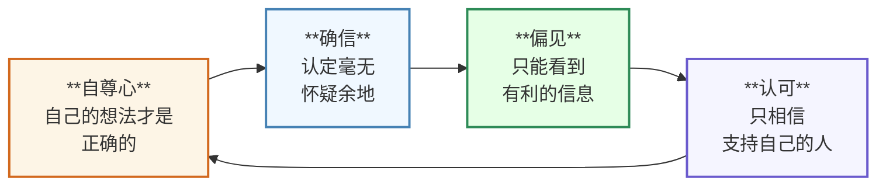
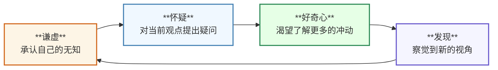

这是[is开发者网站 Advent 日历2025](/events/advent-calendar/2025/)的第2天文章！

## 引言

**书籍 [Think Again](https://amzn.asia/d/9dlmdqM)**

这是我非常喜欢的一本书。

本书中阐述了`重新思考`的重要性。

以下是本书的目录。

- **Part1:** 重新审视自己想法的方法
- **Part2:** 促使他人重新思考的方法
- **Part3:** 创建一个不断学习并持续重新思考的社会和组织的方法
- **Part4:** 结论

本书在`Part1`中以个人为焦点，在`Part2`中以他人为焦点，在`Part3`中以团队和组织为焦点，说明了重新思考的重要性。

在本文中，我想介绍`Part1`中给我留下深刻印象的以下内容。

- 什么是重新思考循环？
- 对比而言什么是过信循环？
- 为了持续进行重新思考循环需要什么？

## 我们是否还在把“化石化的知识”当作至宝？

随着信息技术的进步，人的知识也在不断增加。
根据本书，

> 回顾1950年，医疗知识从1900年到1950年花费50年才翻倍。  
> 而到1980年，这一过程加快到每7年翻倍，到2010年甚至用掉一半时间就翻倍了。

因此，随着社会的变化，我们需要比以前更频繁地重新思考那些曾被认为理所当然的事。  
但却很难做到……

## 牧师、检察官、政治家——人人都具备的三种思考模式

为什么我们无法重新审视自己的知识和观点？  
原因在于以下三种会在无意识中切换的思考模式。

- **牧师模式：**  
  - 当自己的信念动摇时，为了守护理想并使之牢固，会试图对他人进行说教。  
- **检察官模式：**  
  - 如果对他人的推论感到矛盾，就会寻找论据以揭示对方的错误。  
- **政治家模式：**  
  - 想要争取更多人站在自己一边时，会开展竞选或游说活动，以获取支持群体的认可。  

而且，这些思考模式会相互**循环**。  
如果考虑一个具体情境，大致如下 👇

**场景**  
一位通过SNS认识的“投资顾问”推荐的加密资产投资。  
对方说“现在开始可获月利20%，名额有限”，于是该男子投入了初始资金。

_月利20%太夸张了……已经偏离行情了……_

### 牧师模式

**自尊心产生确信**

> 这是我发现的正确投资方法。  
> 如果好好解释自己观点的正确性，大家就会认同。

- 认为真理已经被自己发现。  
- 为了证明自己有多么正确，试图说服他人。  

### 检察官模式

**确信产生偏见**

> 不了解机制的人都是错的。  
> 事实上已经赚取了这么多利润。

- 将对方的指责视为“无知”或“矛盾”并予以否定。  
- 只能看到肯定自己观点的信息。  

### 政治家模式

**偏见产生认可**

> 大家都在做，所以一定没错。  
> 反对者是不理解机制的无知者。

- 围绕在持相同观点的人群中感到安心。  
- 将反对意见视为“无知者的意见”并忽视。  

本书中将**此循环称为`过信循环`**。  
过信循环的危险在于，因为过度沉溺于以下方面，而**不再重新思考自己的观点可能是错误的**。

- 坚持自己的信念  
- 指责他人的错误  
- 获取大量支持  

## 假设、实验、结果、验证——科学家的思考模式

那么，在加密资产投资中陷入过信循环的那位男性，当时应当如何思考呢？

例如，  
- 应该思考月利20%的依据是什么。  
- 应收集更多关于加密资产投资的不同观点。  
- 在投入大量资金前，应先以少量资金进行实验。  

大概就是这些吧。

抽象来看，就是需要`科学家的思考模式`。  
`科学家的思考模式`由以下四个要素构成：

- **假设：**  
  - 将自己的想法语言化。  
    `例：`加密资产投资能带来月利20%的收益。  
- **实验：**  
  - 对自己的想法进行实验。  
    `例：`用少量资金进行投资尝试。  
- **结果：**  
  - 观察实验获得的结果。  
    `例：`记录投资金额与收益金额。  
- **验证：**  
  - 根据结果验证假设。  
    `例：`月利20%的依据是什么？与其他投资方法相比如何？

如果能反复进行这四个要素，就能摆脱过信循环，  
重新审视自己的想法。

## 重新思考过程的循环——重新思考循环

据说，即便科学家的思考模式所形成的重新思考过程中，也存在与过信循环类似的循环。  
本书中将此循环称为**重新思考循环**，并用以下四个要素来整理。

- **谦虚：**  
  - 在智识上保持谦逊。  
  - 认识到自己的无知。  
- **怀疑：**  
  - 对自己的观点产生疑问。  
  - 重新问自己“真的这样就好吗？”。  
- **好奇心：**  
  - 渴望了解自己所不具备的信息。  
  - 对之前未看到的视角和信息感到兴奋。  
- **发现：**  
  - 在疑问的尽头，获得新的视角与信息。  
  - 意识到世界比自己想象的更广阔。

通过**发现**意识到“还有很多值得学习和发现的内容”，  
就能保持**谦虚**。

::: info

**人们不进行重新思考的理由**

1. 与以往的方法不同  
2. 认为那根本不可能做到  
3. 与自己的经验不符  
4. 过于复杂，不想去思考

:::

## 过信循环 vs 重新思考循环

过信循环与重新思考循环对比如下。

- **过信循环**  
  - 自尊心 → 确信 → 偏见 → 认可

 

- **重新思考循环**  
  - 谦虚 → 怀疑 → 好奇心 → 发现

 

此外，即使在相同的情境下，自己处于哪个循环中，思考和行动也会不同。

|                    | 过信循环          | 重新思考循环      |
| ------------------ | ----------------- | ----------------- |
| 改变自己的想法     | 心灵脆弱的表现    | 体现出学术诚信    |
| 被他人说服         | 感觉自己输了      | 向真相更进一步    |
| 改变想法的依据     | 他人的反应        | 理性或证据        |

## 为了持续进行重新思考循环需要什么——充满自信的谦虚

要想不陷入过信循环，并持续进行重新思考循环，应当如何做？  
本书中指出，**平衡的自信与谦虚**非常重要。

 

- 自信  
  - 自我信任度  
    信任自己到什么程度  
    `注意！` 并不是对自己方法的盲目确信  
- 谦虚  
  - 扎实的知识与能力，也就是认识到自己过失与不确定性的能力  
    `注意！` 这并不意味着要抑制自信

 

在这里重要的是，**自信与谦虚是可以共存的**。

- 拥有自信并不意味着失去谦虚  
- 拥有谦虚并不意味着失去自信  

并非如此。

只要对自己具备足够的能力以实现未来目标充满自信，  
就可以保持谦虚，不断问自己达成目标的正确手段是什么。

也就是说，一方面相信自己的能力，另一方面承认自己的解决方案可能不正确，问题本身也可能被误解。  
当由此产生疑问时，就会对现有知识进行重新评估；只要拥有适度的自信，就能够去追求新的知识。

**不是对自己已有知识的信任，而是对自己学习能力的强烈信任**  

这种状态，便是拥有**充满自信的谦虚**的状态。

## 结语——作为软件工程师的知识与重新思考循环

我认为，软件工程师是一种以自身知识为武器的职业。在技术判断和设计决策中，迄今为止积累的知识和经验构成了决策的基础。

 

最近，我阅读了以下书籍：
- [リファクタリング 既存のコードを安全に改善する(第２版)](https://amzn.asia/d/404p1AP)
- [単体テストの考え方/使い方](https://amzn.asia/d/hLdncbh)
- [現場で役立つシステム設計の原則 ~変更を楽で安全にするオブジェクト指向の実践技法](https://amzn.asia/d/c1Pv1UA)
- [良いコード/悪いコードで学ぶ設計入門-保守しやすい 成長し続けるコードの書き方](https://amzn.asia/d/8ebl8L4)

等等，阅读之后，我学习了什么样的设计是好的设计，什么样的代码是好的代码。  
特别地，我认为为了开发对变更具有韧性的系统，与其进行过程式编程，不如通过精心设计领域模型并采用面向对象编程。

我非常赞同这些书籍的内容，但同时也有一个担忧：是否会将与这些书籍内容相矛盾的知识排除在外。

例如，据说单元测试的思路中存在“伦敦学派”和“古典学派”两种对立的方法。  
如果将其中一方当作“正确”来学习，将另一方视为“错误”而排除，那么就会无法接受被认为正确的学派以外的知识。

**我认为并不存在绝对正确，只是在各个场景中有相应的最优手段。** 如果把自己所掌握的知识当作世间的真理，就可能把自己以外的所有知识都视为错误。这正是过信循环早期阶段——`自尊心`的开始。

我认为，只要把自己所掌握的知识视为众多手段中的一种，并承认是否为特定场景的最优手段尚不得而知，就能启动重新思考循环。  
以谦虚之心质疑自己的知识，对不同的方法和思想保持好奇，并发现新的视角，就能做出更好的判断，不是吗？
