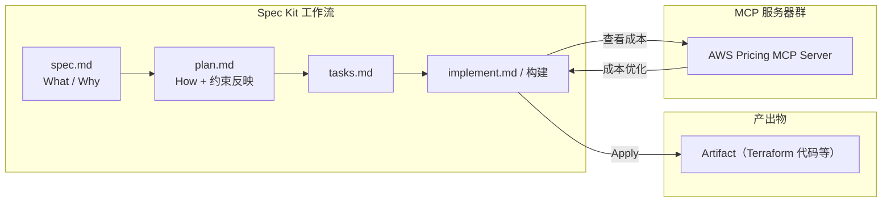
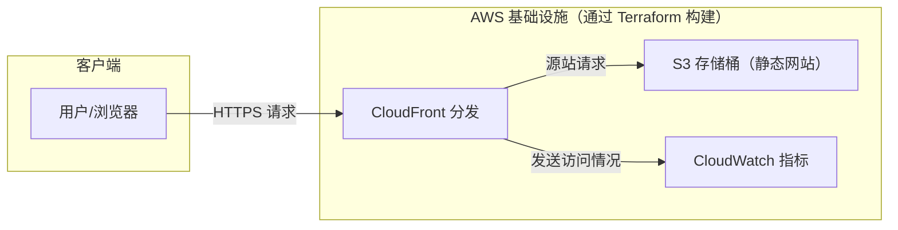

这是[is开发者网站降临节日历2025](/events/advent-calendar/2025/)第16天的文章。

## 1. 引言

从9月撰写了[使用 Kiro 进行规范驱动开发的文章](https://developer.mamezou-tech.com/blogs/2025/09/08/kiro-spec-terraform-iac/)至今已过去约3个月。

在此期间，生成式 AI 所处的生态系统和工具持续以惊人的速度演进。最近备受关注的 Gemini，相较于发布之初，我感觉它已经迅速成熟到可以考虑用于业务的程度。

这次我们将尝试结合 GitHub 提供的规范驱动开发（Spec-Driven Development；SDD）工具「[Spec Kit](https://github.com/github/spec-kit)」以及支持 Model Context Protocol（MCP）的 AI 客户端 Gemini CLI，来生成基础设施的开发方法。

在上一篇文章中，我们使用「Kiro × Claude」来实现 SDD + Terraform。本文将其替换为「Spec Kit × Gemini」，并特别使用 **AWS Pricing MCP Server** 来实现业务场景中重要的成本优化与成本掌握。

通过将这些结合，我们将验证使用 Spec Kit 能在多大程度上贯通完成从设计理念（Why）到具体实现（What），以及代码与架构的质量保证的一体化基础设施构建流程。

## 2. 文章目标

- **熟练使用 Spec Kit**  
  体验按照 GitHub Spec Kit 的四阶段流程（Specify、Plan、Tasks、Implement）定义基础设施规范并落地为 IaC 代码的过程。

- **理解基于 SDD 的基础设施构建流程**  
  学习一种利用 AI 从设计理念（Why）到实现（What），再到质量保证一体化的新型基础设施构建方法。

- **了解如何实现包含成本在内的质量保证**  
  结合 AWS Pricing MCP Server，一边估算由 Terraform 代码构建的基础设施运行成本，一边在规范层面纳入成本约束的思路。

- **能够构建实用的基础设施**  
  通过上述流程，目标是构建一个使用 S3 和 CloudFront 承载的静态网站，并具备可视化访问情况的 CloudWatch 指标的实用资源。

## 3. 预备知识 / 前提条件

本文面向以下读者：

目标读者  
- 对基础设施构建与运维或云环境设计感兴趣的读者  
- 对 SDD（规范驱动开发）或 IaC（特别是 Terraform）感兴趣的读者  
- 想在基础设施领域尝试使用生成式 AI 开发流程的读者

本文不涉及事项  
- GitHub Spec Kit 本身的安装步骤和详细配置方法  
- SDD 中细化的 Prompt 指令内容  
- MCP Server（例如 AWS Pricing MCP Server）的详细设置方法  
- 生成式 AI（如 Gemini）的账号注册及各类设置步骤  
- 不会对 Terraform 或 AWS 代码进行详细讲解或公开  

执行环境  
- Mac (M1) / macOS Sequoia 15.5[^1]  
- VSCode: `1.107.0`  
- Gemini CLI: `0.20.2`  
- Gemini 2.5 系列模型（如 Flash / Pro 等）  
- Spec Kit `v0.0.90`  

假设读者已具备上述前提知识与环境，本文将聚焦于“如何组合并活用”这些工具和流程。

## 4. “Vibe-Coding”的局限与被忽视的成本

AI 编码代理的能力日益提升，但其大部分使用方式仍停留在依赖开发者模糊指示（Vibe）的“Vibe-Coding”阶段。

在这种方法中，大家往往只关注代码无法编译或未准确反映开发者意图等眼前的生成错误。尤其严重的是，看似正常运行的代码会借助 Vibe-Coding 大量产生。这些代码中隐含了以下几类“容易被忽视的成本”：

- **个人依赖化与黑箱化**  
  - 由于生成时的 Prompt 和前提条件无法充分保留，无法从代码中读出“为何要这样设计（Why）”。  
  - 结果会成为其他开发者难以触及的黑箱，每次修正与优化都会产生巨大的认知成本。

- **架构一致性下降**  
  - 如果不断在当下进行 Vibe-Coding 来新增功能，系统整体架构会逐渐偏离最初的设计意图。  
  - 在 IaC 场景中，不同环境会出现微妙差异的定义，后续整理并重构以确定“哪个才是正确的”会产生极高成本。

- **评审与审计成本增加**  
  - 评审者每次阅读代码时，都需要从对话记录或提交信息中逆向推断“究竟为了什么做了此改动？”。  
  - 从安全或合规角度看，很难追踪哪些代码是基于哪些前提或策略生成的，检查会耗费大量时间。

如上所述，Vibe-Coding 可能短期内提高生产效率，但从长期维护性、质量和安全性来看，反而可能增加成本。

## 5. 规范驱动开发（SDD）理念

针对 Vibe-Coding 带来的长期挑战，GitHub 在官方博客中发布了 Spec Kit，并作为一种新开发范式提出了“规范驱动开发（SDD）”理念。

GitHub 如下阐述其理念：  
> "That’s why we’re rethinking specifications — not as static documents, but as living, executable artifacts that evolve with the project. Specs become the shared source of truth. When something doesn’t make sense, you go back to the spec; when a project grows complex, you refine it; when tasks feel too large, you break them down."  
>  
> (因此我们重新思考规范 — 不再将其视为静态文档，而是作为与项目共同演进的、可执行的实物。规范成为共享的真实来源。当出现不合理的地方时，您会回到规范；当项目变得复杂时，您会对其进行精炼；当任务显得过大时，您会将其拆分。)

上述引用的精髓可归纳为以下两个重要概念：

1. **规范是“活的、可执行的成果物”**  
   这一理念即认为，规范不是一成不变、很快过时的静态文档，而是与项目演进同步不断更新的“活”的文档，工具或 AI 在生成、测试、验证代码时可直接使用它作为“可执行”的文件。

2. **规范是“值得信赖的唯一信息源”**  
   它作为定义代码应如何运行的“契约”发挥作用。开发者在迷茫时可回到原点，AI 代理在决定行为时也将其视为绝对依托。

GitHub 所倡导的方向正是通过强力保持规范与实现的一致性，为 Vibe-Coding 的混沌带来秩序，并最大程度地发挥 AI 的力量。

## 6. GitHub Spec Kit 的角色

Spec Kit 是将此 SDD 融入 AI 编码代理（如 GitHub Copilot、Gemini CLI、Claude Code 等）工作流程的**开源工具包**。  
- `/speckit.specify`：创建规范（Spec）  
- `/speckit.plan`：整理技术栈和架构策略  
- `/speckit.tasks`：将任务分解为可执行单元并创建任务列表  
- `/speckit.implement`：基于任务执行实现  

通过这些命令，将“规范 → 计划 → 任务 → 实现”流程结构化，并为 AI 提供一致的上下文。

## 7. Spec Kit 的结构化开发工作流

Spec Kit 最大的优点是，不会过度依赖于使用哪种生成式 AI，而能通过通用的工作流推进开发。

实际上，出于成本等考量，同时利用多种生成式 AI 往往较难，组织可用的 AI 也会受限，但 Spec Kit 的工作流在这种约束下仍具备良好的可重用性。

Spec Kit 为了让与 AI 的协同工作更顺畅，定义了以下四个清晰的流程阶段。各阶段可通过特定命令执行。

**1. Specify（规范创建）— 定义 What 与 Why**  
`/speckit.specify` 命令用于定义规格（Spec），关注点不是技术栈，而是**用户旅程、预期成果和成功准则**。规格作为使用者或需求变更时不断更新的“活的成果物”对待，基础设施的架构也以此 Spec 为起点进行设计。

**2. Plan（计划创建）— 纳入约束**  
`/speckit.plan` 命令用于确定技术方向。向 AI 代理提供**技术栈、架构、合规要求、性能目标**等企业约束，生成综合技术实施计划 `plan.md`。此处也将集成来自 MCP Server 的约束。

**3. Tasks（任务分解）— 拆分为可审查单元**  
`/speckit.tasks` 命令将基于 Plan，将工作分解为**独立实现与测试的小型作业单元**（可审查差异）。通过明确依赖关系和可并行执行的任务 `[P]`，可以清晰地知道“该从哪里入手”。

**4. Implement（实现与验证）— 焦点明确的变更**  
`/speckit.implement` 命令让代理根据任务列表进行实现。开发者将审核非大规模代码块，而是解决特定问题的**聚焦变更**。这样可保持 AI 生成的变更在易于理解与验证的粒度。

### 7.1. Spec Kit 与 Kiro 的过程对应

Spec Kit 与 AWS Kiro 都是支持 SDD 的工具，但其阶段名称和成品划分略有不同。本文将大致按照以下对应关系进行说明。

| 视角                 | Spec Kit 阶段 / 命令              | 主要成果物（Spec Kit）                                                                                | 参考：Kiro 的流程 / 文件示例                      |
| :------------------- | :------------------------------- | :---------------------------------------------------------------------------------------------------- | :------------------------------------------------ |
| 需求与意图明确化     | Specify / `/speckit.specify`     | 整理产品目的、前提与范围等的规范文件（例如：`spec.md`）                                             | Requirements 阶段 / `requirements.md`            |
| 实现方式研究         | Plan / `/speckit.plan`           | 汇总架构策略、技术选型与基础设施构成等的计划文件（例如：`plan.md`）                                 | Design 阶段 / `design.md`                        |
| 拆分为作业单元       | Tasks / `/speckit.tasks`         | 分解为可实施与测试单元的任务列表（例如：`tasks.md`）                                                 | Tasks / Implementation 的任务列表                |
| 实现执行与验证       | Implement / `/speckit.implement` | 基于任务列表的代码、测试、配置文件等变更                                                             | Implementation 阶段整体（钩子与任务执行）         |

※ Kiro 由“Requirements → Design → Implementation”三个阶段构成，其中 Implementation 包含任务执行与代码生成。而 Spec Kit 则通过将 Tasks 与 Implement 分离，显式区分“任务分解”与“实现执行”。

## 8. 通过 AWS Pricing MCP Server 实现成本约束

本章将说明 [AWS Pricing MCP Server](https://awslabs.github.io/mcp/servers/aws-pricing-mcp-server) 的角色，以及如何在 Spec Kit 的工作流中，尤其是在 Implement 阶段之后整合该服务，从成本角度施加约束。

### 8.1. Model Context Protocol (MCP) 的角色

利用 MCP 及 MCP Registry，可使 Gemini CLI 等支持 MCP 的客户端连接到 AWS Pricing MCP Server 等外部服务。

在 Spec Kit 的“Spec / Plan / Tasks / Implement”工作流之后添加 MCP，可将外部工具的约束与建议（本文主要讨论成本信息）自然地整合进来。

### 8.2. 通过 AWS Pricing MCP Server 掌握成本

AWS Pricing MCP Server 是用于访问 AWS 价格信息的 MCP Server。  
可通过 Gemini CLI 调用它，输入服务类型、区域、使用预估等信息，查询费用估算。

在 Spec Kit 背景中，通过对 Implement 阶段生成的 Terraform 代码或架构方案进行成本查询，  
- 哪种架构可能更能节省月度成本  
- 在流量增加时成本可能如何扩展  
- 哪些资源可能成为成本瓶颈  
这些方面都可以通过 AI 代理进行评估。

### 8.3. 在 Implement 阶段后整合成本评估

在 `/speckit.implement` 命令执行后或在 Implement 阶段生成并部署 Terraform 代码后，调用 AWS Pricing MCP Server，获取基于实际资源架构的成本信息以及约束与建议。

这样，除了性能和可用性等非功能需求外，还可结合预估流量的运行成本估算，形成细化架构和代码的反馈循环。

Implement 执行后将按如下流程推进：
1. 从资源架构中估算成本
2. 评估性能与成本的平衡
3. 根据需要修正 Plan/Spec

从层级结构来看，关系如下。



## 9. 实践：使用 CloudFront 与 S3 构建静态网站并实现访问可视化

本章将使用 Spec Kit 与 Gemini CLI，构建基于 S3 与 CloudFront 的静态网站，并跟踪其访问情况在 CloudWatch 上实现可视化的过程。

首先在 SDD 中构建静态网站，然后新增规范，以创建通过 CloudWatch 可视化访问情况的仪表板。

本节目标不仅是构建基础设施，还要实践到在 CloudWatch 控制台中确认请求数图表的动态变化。这样做旨在让读者意识到规范（Spec）如何真正与实际运营（Monitoring）相连接的流程。



### 9.1. 设置 Gemini.md 及 `specify init` - 创建项目

使用 `specify init <PROJECT_NAME>` 创建项目。  
创建时，同时生成如下一层级的文件：

原则上，生成的文件均为英文，建议设置以下 Prompt 与 Gemini.md：

```md
# Gemini.md

## 使用语言
请使用日语。
若为英语，请译为日语。
```

```bash
# 提示
请将 .specify 下 templates 中的各文件翻译为日语。
```

```txt
+---.gemini
|   \---commands
|           speckit.analyze.toml
|           speckit.checklist.toml
|           speckit.clarify.toml
|           speckit.constitution.toml
|           speckit.implement.toml
|           speckit.plan.toml
|           speckit.specify.toml
|           speckit.tasks.toml
|           speckit.taskstoissues.toml
|
+---.specify
|   +---scripts
|   |   \---bash
|   |           check-prerequisites.sh
|   |           common.sh
|   |           create-new-feature.sh
|   |           setup-plan.sh
|   |           update-agent-context.sh
|   |
|   \---templates
|           agent-file-template.md
|           checklist-template.md
|           plan-template.md
|           spec-template.md
|           tasks-template.md
(及其他众多)
```

### 9.2. Constitution — 定义「规约」

首先执行 `/speckit.constitution`。  
在 Gemini 中会被翻译为“宪法”，但个人不太喜欢这种翻译，因此将该 constitution 设置为“规约”。  
执行简单指令后，会生成 `<workspace-name>/.specify/memory/constitution.md`。

constitution 用于先行明确“本项目中哪些是必需/允许”的内容，是后续 Spec/ Plan/ Tasks 质量稳定的基础。  
这里从实际创建的 `constitution.md` 中，摘录出特别重要的原则。（为易读性已做部分摘要）

```md
# spec-kit-entry-s3-static-site 规约

## Core Principles
1. 安全性：最小权限（开发环境无需获取访问日志）
2. 状态管理：S3 等远程后端（锁定非必需）
3. IaC 模块化：以功能单元独立模块
4. 命名规则：强制统一命名规则
5. 静态分析与测试：`tfsec` / `tflint` + MCP 检查必需
7. 文档语言：使用日语编写
9. 代码内语言：变量的 `description` 等也使用日语
```

### 9.3. Specify — 定义“要做什么”

首先创建 `spec.md`，定义“安全且高速的静态网站”这一目标。  
作为成功准则，可明确以下条件：
- 通过访问 CloudFront 端点，能够通过 HTTPS 分发静态内容

由于 `spec.md`（尤其是包含非功能需求时）篇幅较大，此处仅以“使用 S3 + CloudFront 托管静态网站”的示例，从实际创建的 `spec.md` 中摘录能传达整体氛围的部分。（为易读性已做部分摘要）

```md
# 功能规格书：S3 静态网站托管

## 用户场景与测试 *(必需)*

### 用户故事1 - S3 存储桶的预置 (优先级：P1)
- 验收标准：创建启用静态网站托管的 S3 存储桶

### 用户故事2 - 通过 CloudFront 分发内容 (优先级：P2)
- 验收标准：通过 HTTPS 访问 CloudFront URL 时展示 `index.html`

## 功能需求 (以下，FR)
- FR-003: 阻止对 S3 存储桶的直接公共访问
- FR-005: CloudFront 使用原点访问控制（OAC）访问 S3

## 成功准则 *(必需)*
- SC-001：通过 CloudFront URL 以 HTTPS 在 5 秒内展示 `index.html`
```

### 9.4. Plan — 规划“如何”构建

执行 `/speckit.plan` 时，需要提供技术栈（S3、CloudFront、OAC）、安全与运维要求等，主要为非功能需求与架构约束。  
此阶段尚无具体的 Terraform 代码，因此不会直接调用 AWS Pricing MCP Server 进行精确成本估算。  
取而代之，我们在 Spec/Plan 中写入流量预估与大致预算等内容，为后续 Implement 阶段生成代码的成本评估奠定基础。  

由此生成的 `plan.md` 会包含例如以下方针：  
- 将 S3 存储桶设置为私有，不允许直接公共访问  
- 仅允许通过 CloudFront 访问，使用 OAC（原点访问控制）

Plan 的目的是将“如何构建”以可审查的形式落地，因此会以一定粒度的检查项和架构方针进行明文化。以下也是从 `plan.md` 中摘录。（如 `specs/<feature>/` 目录布局方针也会写在此处。）

```md
# 实施计划书：S3 静态网站托管

## 规约检查
- [x] 1. 安全性：计划是否符合最小权限原则？(禁止 S3 公共访问，使用 OAC)
- [x] 2. 状态管理：是否为目标环境配置了带锁定的远程状态管理？(以 Terraform Cloud/S3 后端为前提)
- [x] 3. IaC 模块化：设计是否促进可复用模块？(计划以 s3、cloudfront 分割模块)

## 项目结构
specs/001-s3-cloudfront-site/
├── plan.md
├── spec.md
└── checklists/requirements.md

作为 IaC 项目，采用以下 Terraform 标准布局。  
结构决定：采用上述 Terraform 模块构成，明确区分环境（`environments`）和可复用组件（`modules`）。这样可遵守宪法中的“模块化”原则，并易于应对未来环境的新增（例如：生产环境）。

```text
.
├── environments/
│   └── dev/              # 开发环境用的根模块
│       ├── main.tf
│       ├── variables.tf
│       ├── outputs.tf
│       └── backend.tf    # 远程后端配置
│
└── modules/
    ├── s3-static-site/   # 管理 S3 存储桶及关联资源的模块
    │   ├── main.tf
    │   ├── variables.tf
    │   └── outputs.tf
    │
    └── cloudfront-cdn/   # 管理 CloudFront 分发的模块
        ├── main.tf
        ├── variables.tf
        └── outputs.tf
```

### 9.5. Tasks — 拆分为实施任务

基于 Plan，Gemini 会生成具体的任务列表。示例任务包括：  
- 创建 S3 存储桶并设置基本策略  
- 创建 CloudFront 分发（指定 S3 作为源站）  
- 创建 OAI（原点访问身份）并将其纳入 S3 存储桶策略  

通过在考虑依赖关系的同时排列任务，Terraform 实现的顺序也变得明确。  

下面是实际创建的 `tasks.md` 中的摘录。（其特点是会将阶段划分、依赖关系和独立测试视角等一同输出，此处根据需要已做摘要）

```md
# 任务：S3 静态网站托管

> 带 `[P]` 的任务可并行执行。

## 阶段1：设置
- [x] T001 [P] 创建 `environments/dev` 目录
- [x] T002 [P] 创建 `modules/s3-static-site` 目录
- [x] T003 [P] 创建 `modules/cloudfront-cdn` 目录

## 阶段3：用户故事1 (P1)
- [x] T010 [US1] 定义 S3 存储桶 + 网站设置 + 阻止公共访问

## 阶段4：用户故事2 (P2)
- [x] T015 [US2] 定义 OAC 及 CloudFront 分发

## 阶段5：用户故事3 - Terraform 实现 IaC (优先级：P3)

目标：建立保证基础设施定义质量与可复现性的流程。  
独立测试：确认 `terraform plan` 无差异完成，并且静态分析工具无警告。
```

### 9.6. Implement — 实现与运行验证

Gemini 将各任务实现为 Terraform 代码并进行部署。  
部署完成后，多次访问 CloudFront 端点，确认静态内容通过 HTTPS 分发。  
此验证工作可证明已满足最初规范中定义的成功准则。

此外，将生成的 Terraform 代码和部署的资源架构作为输入，调用 AWS Pricing MCP Server，获取运行成本估算。  
通过该方式，  
- 是否能在预期预算内  
- 哪些服务可能成为瓶颈  
基于这些视角，可回顾 Plan / Tasks / Implement 并形成反馈循环。

### 9.7. 添加需求与资源

前一节的静态网站创建与发布已顺利完成。  
接下来，我们将添加在 CloudWatch 上可视化网站访问情况的需求。  

新增规范（成功准则示例）如下：  
- 访问后，在 CloudWatch 的 CloudFront 指标中能够统计到请求数

为此，在 Plan / Tasks 中将添加以下任务：  
- 启用用于在 CloudWatch 中确认的指标和日志设置

在 Implement 阶段，将基于这些任务扩展 Terraform 代码并重新部署。  
部署完成后，访问 CloudFront 端点，并在 CloudWatch 的 CloudFront 指标页面确认“Requests”图表中已反映数据。  
此验证工作可证明已满足新增规范。

## 10. SDD 特别有效的 3 种场景

在 [GitHub 官方博客](https://github.blog/ai-and-ml/generative-ai/spec-driven-development-with-ai-get-started-with-a-new-open-source-toolkit/) 中，Spec Kit 背后的 Spec-Driven Development 特别在以下 3 种模式中发挥作用：

1. **Greenfield（从零开始的新开发）**  
   - 在从头开始创建系统时，重要的是“从意图和约束出发”而非“从代码出发”。  
   - 通过认真编写规范（Spec）并按序推进 Plan / Tasks / Implement，可减少对架构迷失的风险。

2. **Feature work（向现有系统添加功能）**  
   - 当向现有基础设施或系统添加功能时，将影响范围梳理及与现有策略、命名规范的对齐等内容在 Spec / Plan 阶段进行明文化，可使审查与回滚更为容易。  
   - GitHub 方表示这是规范驱动开发最能发挥威力的领域。

3. **Legacy modernization（遗留系统现代化）**  
   - 在将手动或脚本运维的遗留系统迁移到现代架构或 IaC 时，通过将隐性知识的规范与约束以 Spec / Plan 形式语言化并分阶段替换，SDD 被认为非常契合该过程。

## 11. 使用感想

在实际使用 Spec Kit 并与 Kiro 对比后，感受到以下区别。

#### 审查的严格程度  
Spec Kit 会在规范、计划、任务、实现各阶段频繁要求人工审查。由于需要逐步读取 AI 整理的内容再推进，虽然返工较少，但进度节奏稍慢。

#### Kiro 的推进方式  
Kiro 给人的印象是，AI 侧会先推进到一定程度再交由人工审查，适合希望通过较少交互快速推进的场景。

另一方面，此次验证中也注意到以下几点：  
- 有时未能完全遵守 Constitution（规约），偶尔提出偏离规则的建议  
- 相较 Kiro，SDD 各阶段（Requirements / Design / Implementation）的边界更容易模糊  

我认为这些在很大程度上也依赖于与 Spec Kit 配合使用的 AI 代理的实现与 Prompt 设计。

总体而言，  
- 希望从零开始深入设计新系统（Greenfield）  
- 希望团队在推进过程中对规范及任务进行认真审查  

在这些场景下，我感觉 Spec Kit 更加契合。

另一方面，  
- 只是想先轻量体验一下 SDD  
- 希望以 AWS 产品为中心的架构，并参考 Kiro 的模板或指南推进  

在这些情况下，我认为选择 Kiro 能降低引入门槛。

## 12. 可执行规范的实现示例

在本文所示的 S3 静态网站示例中，“可执行规范”以如下形式得以实现：

- `spec.md`  
  - 汇总用例、约束与非功能需求的文档
- `plan.md`  
  - 整理 Spec 中定义的需求以及非功能需求与架构约束的方针  
  - 确定使用的 AWS 服务及 Terraform 模块构成
- `tasks.md`  
  - 分解为实现、测试与审计任务的 ToDo 列表
- Terraform 代码  
  - 从这些成果物导出的具体 IaC 实现  
  - Implement 阶段后使用 AWS Pricing MCP Server 进行成本评估的对象

重要的是，  
**不仅仅是代码本身，而是“规范 → 计划 → 任务 → 代码”流程的整体一致性**。Spec Kit 的价值在于，它通过 AI 半自动化该流程，同时将其分割为便于人工审查的粒度。

## 13. 今后发展与课题

最后，简要整理未来的展望与挑战。

### 13.1. 可期的发展

- 与 IDE/编辑器的集成增强  
  - 目前需要在 AI 内部执行命令，若能在 VS Code 等编辑器中直接运行 `/speckit.*` 命令，将带来更自然的工作流。

- 多个实现方案的对比  
  - 可以考虑从同一 Spec / Plan 生成多个实现方案（例如：仅 S3 / S3 + CloudFront / S3 + CloudFront + WAF），并在成本、运维性、安全性等方面进行对比。

- 应用于大规模项目  
  - 对微服务群或复杂网络结构等更大范围内的 Spec-Driven Development 拓展，也是未来的课题。

### 13.2. 现阶段的课题与注意点

- MCP 生态系统的成熟度  
  - MCP 及各个 MCP Server 仍处于快速演进阶段，易受规范变更或版本升级影响。

- 安全与权限管理  
  - 在 MCP Server 的实现与部署方式上，需要格外注意凭证管理与访问控制。

- 如何将“人工审查”纳入流程  
  - 最终的责任在于人类。团队需要设计在 Spec / Plan / Tasks / 代码各阶段进行怎样的审查，这一点至关重要。

## 14. 最后

从本文内容来说，如果要一句话概括关键点，  
**将重心从“以代码为起点”转移到“以规范与意图为起点”**。  

我认为，代码始终是“将规范与意图具现化的结果”，若将 AI 及 MCP Server 视为桥梁与支持者，就更容易理解 Spec-Driven Development 的概念。

此外，使用 Spec Kit 的过程中，我也体会到，不仅是支持 SDD 的工具本身，不同的 AI 与 MCP Server 组合也会带来各自擅长的领域与工作流差异。今后，我将继续在基础设施构建与运维领域中增加应用示例，探寻更佳的组合方式。

我认为，规范驱动开发这一理念本身，尤其在基础设施构建中，是支撑长期维护性与质量的重要方法。  
希望本文能成为读者在自己的项目中尝试 SDD、Spec Kit 以及 AI/MCP 的契机。

[^1]: 撰写时在 Windows 上通过 GitBash 以 npm 安装 Gemini CLI 时，虽然可行，但会出现乱码等各种故障。这是由于在 Windows 环境中，Gemini CLI 在内部调用 PowerShell 所致。将 Windows 环境的默认终端切换为 PowerShell 后，即可解决这些故障。
