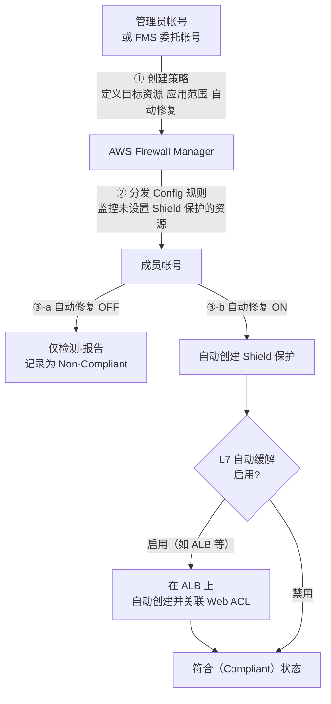
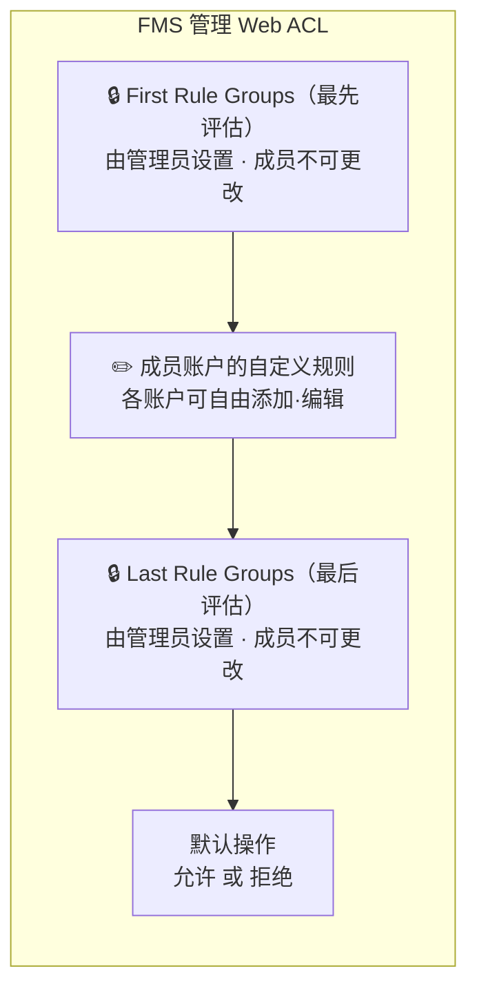
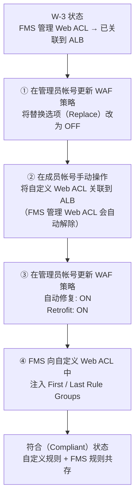

## 0. 引言

大家好。我是 is R&D 组的丹羽。这次想介绍一下 AWS 安全服务之一“AWS Firewall Manager”（以下简称 FMS）[^1] 的策略设置。

最近，在我参与的项目中需要引入 “AWS Shield Advanced”，对于通过 Organizations 进行账户管理的情况，如果想要将任意的 OU 或任意账户一次性设为 Shield Advanced 的保护对象，推荐使用 “AWS Firewall Manager” 的策略设置方法。由于这一策略设置的行为有点难以理解，因此这次我实际进行了验证并想分享结果。

当前，如果您正在使用 Organizations，并且想要“集中进行 DDoS 对策或应用 Web ACL”、“考虑引入 AWS Shield Advanced”、“希望事先了解 FMS 策略的行为”等，对于那些想要评估引入或理解行为，以及准备正式启动 AWS 安全运营的项目，希望本文能提供参考。

## 1. 本文可了解内容

本文将基于实际验证结果，解读 FMS 提供的 **两大主要安全策略** 的行为。

- **FMS Shield Advanced 策略**：在整个组织中集中应用 DDoS 保护的策略
- **FMS WAF 策略**：在整个组织中集中分发并应用 Web ACL[^2] 规则[^3] 的策略

我们将从“目的”、“机制”、“实际验证结果”这三个角度对这两种策略进行整理。特别是关注**自动修复功能（Auto Remediation）**[^4] 的行为，以及与现有 Web ACL（指自行定义的 Web ACL）共存的模式等，仅靠官方文档难以把握的真实操作，将在本文中重点呈现。

## 2. 前提知识与目标读者

### 前提知识

由于本文以“验证 FMS 策略设置的行为”为主要内容，下面简要整理一下 FMS 以及在验证过程中出现的 WAF、Shield 及其相关服务。对于其他出现的服务，将在文中各处进行补充说明。

:::column: AWS Firewall Manager 是什么

AWS Firewall Manager（FMS）是一项利用 AWS Organizations 对跨多个 AWS 账户的各类安全规则进行集中管理与应用的服务。使用 FMS 可以防止安全策略应用的遗漏，并保持整个组织的安全水平一致。

本文介绍的 FMS 策略如前所述有以下两种：

- **FMS Shield Advanced 策略**：在整个组织中集中应用 DDoS 保护的策略  
- **FMS WAF 策略**：在整个组织中集中分发并应用 Web ACL 规则的策略  

除了上述两种之外，FMS 还存在其他策略，但本文不做涉及，省略说明。

> **补充：什么是 AWS Organizations**  
> AWS Organizations 是一项将多个 AWS 账户作为一个组织进行集中管理的服务。它可以通过 **OU（Organizational Unit：组织单元）** 这样的分层结构对账户进行分组，并批量应用策略。FMS 策略即通过指定 OU 或单个账户为作用范围来进行分发。

:::

:::column: 什么是 AWS WAF

AWS WAF 是一项用于过滤针对 Web 应用程序的不合法请求的服务。在 Web ACL（访问控制列表）中定义规则，并将其关联到 CloudFront、ALB 等资源上使用。

例如，可细粒度地在资源级别设置如“阻止 SQL 注入攻击”、“限制特定国家的访问”等防御规则，这正是它的特点。

> **补充：相关 AWS 资源**  
> - **ALB（Application Load Balancer）**：在 HTTPS 级别分配流量的负载均衡器。是 WAF 和 Shield Advanced 的主要保护对象之一。  
> - **CloudFront**：AWS 的 CDN（内容分发网络）服务。可在全球边缘应用 WAF 规则。

:::

:::column: 什么是 AWS Shield

AWS Shield 是一项用于保护 AWS 资源免受 DDoS 攻击[^5] 的服务。它提供两种计划：

| 计划               | 概要                                                                                                      |
| ------------------ | --------------------------------------------------------------------------------------------------------- |
| **Shield Standard** | 免费提供给所有 AWS 用户。自动防御 L3/L4 层（网络层·传输层）的常见 DDoS 攻击                             |
| **Shield Advanced** | 收费。提供更高级的 DDoS 保护、免除 WAF 费用、可向 DRT（DDoS Response Team）[^6] 咨询，以及费用保护等功能 |

使用 Shield Advanced 时，需要在目标资源（如 ALB、CloudFront、EIP 等）上创建并启用“保护（Protection）”。

通过使用 FMS，可以在新建资源时自动应用 Shield Advanced 保护，避免设置遗漏，并可在 FMS 中集中管理 Organizations 内所有账户的 Shield Advanced 保护。

:::

### 本文目标读者

- 使用 Organizations 进行集中账户管理的人员  
- 正在考虑引入 Shield Advanced 的人员  
- 对 AWS 安全服务感兴趣，并考虑在组织范围内进行统一管控的人员  
- 希望使用 FMS 对“所有账户应用通用安全规则”的人员  

## 3. FMS Shield Advanced 策略

### 3-1. 目的

如前所述，要使用 Shield Advanced，需要对每个要保护的资源单独创建“保护”。然而，若要对由 AWS Organizations 管理的多个账户中的所有资源手动进行保护设置，说实话并不现实。

**FMS Shield Advanced 策略**正是为解决这一问题而设计。只需在管理员账户（或委托管理员账户）[^7] 中定义策略，例如“对该范围内所有账户中的 ALB 和 EIP 全部应用 Shield Advanced 保护”，FMS 即可检测到目标资源并集中应用保护。

### 3-2. 基本流程

整理 FMS Shield Advanced 策略的基本运行流程，如下所示。此处所说的**管理员账户**是指订阅了 Shield Advanced 的账户。（通常与 Organizations 的管理账户相同）

所谓“符合（Compliant）”，是指 FMS 已检测到目标资源并集中应用了保护的状态。若将自动修复关闭，FMS 仅进行检测而不添加保护，因此会显示为不符合（Non-Compliant）。

在此简单补充一下 AWS Config 服务的相关内容。  
:::column: 什么是 AWS Config（与 FMS 的关系）
AWS Config 是一项持续记录并评估 AWS 资源配置状态的服务。通过定义 **AWS Config Rule**（配置规则），可以自动评估“资源是否满足该基准？”。  
FMS 利用此机制，在策略分发时自动在成员账户中定义 Config 规则。Config 会持续监控“是否存在未设置 Shield 保护的资源”“是否应用了 FMS 管理的 Web ACL”，并以符合（Compliant）/不符合（Non-Compliant）状态进行报告。  
:::

特别重要的是，**L7 自动缓解（Automatic application layer DDoS mitigation）**[^8] 的设置。如果启用此功能，FMS 会在关联到 ALB 等目标资源的 Web ACL 中自动创建名为 `ShieldMitigationRuleGroup...` 的自动缓解用 Web ACL 规则。

:::info
此 Web ACL 规则的自动创建仅为“Shield Advanced 的 L7 自动缓解功能”所必需，与 WAF 策略创建的 Web ACL 不同，不会影响现有的 Web ACL。  
实际上，FMS 会将该规则（名为 `ShieldMitigationRuleGroup...`）添加到现有 Web ACL 规则的末尾。由于它被添加在最后，因此在规则评估顺序中也居于末尾，不会阻碍已有规则的检查内容。  
:::

### 3-3. 实际验证结果

在验证中，我们在成员账户上准备了 ALB 和 EIP（已附加到 EC2），并从管理员账户应用了 FMS Shield Advanced 策略进行测试。

:::alert
特别声明，以下验证仅作为“验证”操作，不建议直接在生产环境的账户或 OU 上执行此操作。即使不得不执行，也建议事先下载 Web ACL 的备份（JSON 配置定义文件）等，以做好回滚准备。
:::

#### **【验证模式 S-1：自动修复 OFF】**

| 项目           | 内容                                         |
| -------------- | -------------------------------------------- |
| FMS 设置       | 自动修复：**关闭（Disabled）**               |
| 事前状态       | ALB 和 EIP 上无 Shield 保护                  |
| 预期           | 检测为 Non-Compliant，不关联 Web ACL          |

**结果**：符合预期的行为

FMS 自动将 AWS Config 规则分发到成员账户，通过该规则检测到 ALB 和 EIP 未设置 Shield 保护。在 FMS 控制台中，账户本身的状态显示为“Non-Compliant（不符合）”，各个资源的状态也显示为“Non-Compliant（不符合）”。

**管理员账户的 FMS 控制台**
- 针对成员账户的状态为不符合  
  

- 成员账户内目标资源（ALB, EIP）显示不符合的原因  
  

**成员账户的 AWS Config 界面**
- 成员账户中创建的 Config 规则  
  

- 通过 Config 规则检测到的不符合资源  
  

- 例如，在目标资源 ALB 的 Config 详情的“资源时间线”中，可以确认 FMS 已应用了 Config 规则  
  

:::info
补充  
要通过 Config 规则确认资源的配置信息“之前是什么状态”“发生了怎样的变化”，可点击图中的“规则的合规性”或“配置更改”，查看**配置如何被修改而成为保护对象**（或不再成为保护对象）、以及**FMS 规则是否由不符合变为符合**。  
（由于会展示大量资源的专有信息，此处省略打开后的截图，敬请谅解。）  
:::

#### **【验证模式 S-2：自动修复 ON】**

| 项目           | 内容                                                              |
| -------------- | ----------------------------------------------------------------- |
| FMS 设置       | 自动修复：**开启（Enabled）**                                     |
| 事前状态       | ALB 和 EIP 上无 Shield 保护                                       |
| 预期           | 自动创建 Shield 保护，状态变为 Compliant（符合）                    |

**结果**：符合预期的行为。（**存在生效延迟**）

启用自动修复几分钟后，EIP 的状态率先变为 Compliant。另一方面，ALB 状态变为 Compliant 所需时间稍长，需要额外等待几分钟。

对于 ALB，除了创建 Shield 保护外，还确认**自动创建了用于 L7 自动缓解的 Web ACL 规则（`ShieldMitigationRuleGroup...`）**。这是 Shield Advanced 的功能，符合预期行为。

**管理员账户的 FMS 控制台**
- 启用自动修复设置  
  

:::info
补充  
图中“Replace~”选项，若勾选该选项，当目标资源（如 ALB、EIP 等）关联有使用 WAF Classic 创建的旧 Web ACL 时，FMS 会自动将其替换为 WAFv2 的 Web ACL。  
:::

**成员账户的控制台界面**
- WAF & Shield 控制台  
  FMS 会创建 Web ACL。  
  

  FMS 创建的 Web ACL 并未关联到 ALB 等资源，  
  

  取而代之的是，在现有 Web ACL 中添加了规则。  
  可确认名为 “ShieldMitigationRuleGroup_...” 的规则已被添加到现有 Web ACL 规则的末尾。  
  这似乎是用于 DDoS 保护的规则。  
  

  由于 Web ACL 的评估是从上到下依次应用，添加在末尾的方式可保证不影响现有 Web ACL 规则的评估顺序。

- Config 控制台  
  启用自动修复后，资源被纳入保护，状态变为符合（Compliant）。  
    
  

  同样可在资源时间线中查看目标资源被纳入 Shield Advanced 策略保护的记录。（此处省略截图。）

#### 策略删除时的行为

在验证完成后删除策略时，FMS 在成员账户创建的 Config 规则和 Web ACL 均已**被正确删除**。策略删除后，虽然资源会短暂保留，但稍等片刻即可自动清理完成。

**管理员账户的 FMS 控制台**
- 删除策略  
    
  

**成员账户的控制台界面**
- WAF & Shield 控制台  
    
  

- Config 控制台  
  规则被删除后显示为“不可用”。  
  

---

## 4. FMS WAF 策略

### 4-1. 目的

AWS WAF 是一项非常强大的服务，但要在组织内所有账户中贯彻“至少要遵守这些基本规则”这一共通规则，实际上十分困难。挨个请各账户管理员“请配置这些设置”，对管理者和被管理者而言都是很大的负担。

**FMS WAF 策略**允许管理员将 Web ACL 的配置内容（适用的规则组、默认操作等）定义为策略，并一次性向整个组织分发和应用。

### 4-2. 大致机制

FMS WAF 策略的设置项比 Shield Advanced 策略更多，尤其是“如果已存在 Web ACL，如何处理”是关键的设计要点。

#### 替换或合并

总的来说，创建 FMS WAF 策略并应用 Web ACL 时，有以下两种配置模式：

- 将成员账户上已有的 Web ACL **替换**为 FMS 管理的 Web ACL（包含管理员定义的规则）  
- 以类似将成员账户自定义规则**插入**的方式与 FMS 管理 Web ACL 合并  

:::info
补充  
First / Last Rule Groups 是 FMS WAF 策略中可配置的规则组位置。  
- **First Rule Groups**：在成员账户的自定义规则**之前**进行评估。用于强制管理员“绝对要拦截”的流量场景。  
- **Last Rule Groups**：在自定义规则**之后**进行评估。作为“最后一道防线”，用于配置组织共通的后置处理规则。  
- **Default Action**：对未匹配任何规则的请求所采取的最终操作（Allow 或 Block），由 FMS 策略设置。  

通过这种结构，可以在确保管理员强制的基础规则的同时，允许各个账户自由添加其自定义规则。  
:::

#### 验证 Web ACL 管理的 4 种模式

在 FMS WAF 策略中，对于如何将 Web ACL 应用于资源可能有多种模式，这次我们将尝试以下 4 种模式。

| 模式                           | 自动修复 | 替换选项 | Retrofit[^9] | 行为                                                                                          |
| ------------------------------ | -------- | -------- | ------------ | --------------------------------------------------------------------------------------------- |
| W-1: **仅检测**                | OFF      | -        | -            | 仅检测并报告策略违规。不对资源做任何更改                                                       |
| W-2: **自动修复（替换 OFF）**  | ON       | OFF      | OFF          | 对未设置 Web ACL 的资源应用 FMS 创建的 Web ACL。**已设置自定义 Web ACL 的资源不做更改**           |
| W-3: **自动修复（替换 ON）**   | ON       | ON       | OFF          | 对所有目标资源，**强制替换为 FMS 创建的 Web ACL**                                              |
| W-4: **自动修复（替换 OFF）**  | ON       | OFF      | ON           | 对所有目标资源，**注入 FMS 规则**                                                             |

### 4-3. 实际验证结果

我们在成员账户上准备了 ALB 以及自定义 Web ACL（`test-fms-waf-log`），并按照上述 4 种模式进行配置，确认了其行为。

#### **【验证模式 W-1：自动修复 OFF】**

| 项目       | 内容                                         |
| ---------- | -------------------------------------------- |
| FMS 设置   | 自动修复：**关闭**                           |
| 事前状态   | ALB 未关联 Web ACL                          |
| 预期       | 检测为 Non-Compliant，不关联 Web ACL          |

**结果**：符合预期。在 FMS 控制台中检测为 Non-Compliant，且 ALB 未做任何更改。

**管理员账户的控制台界面**
- 相关设置位置  
  

**成员账户的控制台界面**
- 策略设置后的 WAF/Config 界面  
  存在未关联到资源的自定义 Web ACL（事先创建），  
  

  在 Config 控制台中，由 FMS 创建的规则显示状态为不符合（Non-Compliant），因为自动修复为 OFF 且 ALB 未关联任何 ACL，FMS WAF 策略评估为不符合。  
  

**管理员账户的控制台界面**
- 策略应用后的 FMS 控制台界面  
  

#### **【验证模式 W-2：自动修复 ON·替换 OFF】**

| 项目       | 内容                                                            |
| ---------- | -------------------------------------------------------------- |
| FMS 设置   | 自动修复：**开启**、替换现有 Web ACL：**OFF**                   |
| 事前状态   | ALB 未关联 Web ACL                                              |
| 预期       | FMS 创建的 Web ACL 会自动关联到 ALB，状态变为 Compliant（符合） |

**结果**：符合预期，FMS 自动创建的 Web ACL 已关联到 ALB，状态也变为 Compliant。

**管理员账户的控制台界面**
- 更新相关设置  
  

**成员账户的控制台界面**
- FMS 创建的 Web ACL 已关联至 ALB  
  

- Config 规则状态也变为符合（Compliant）  
  

**管理员账户的控制台界面**
- 稍等片刻后在管理控制台中确认  
  

#### **【验证模式 W-3：在替换 ON 状态下分配自定义 Web ACL 测试】**

接下来是有趣的部分。在 W-2 中应用了 FMS 管理的 Web ACL 后，我们**在成员账户上手动将其替换为自定义 Web ACL（`test-fms-waf-log`）**进行测试。

| 项目       | 内容                                                                   |
| ---------- | ---------------------------------------------------------------------- |
| FMS 设置   | 自动修复：**开启**、替换现有 Web ACL：**ON**                            |
| 事前状态   | ALB 已关联 FMS 创建的 Web ACL → **手动更换为自定义 Web ACL**           |
| 预期       | FMS 管理的 Web ACL 会被强制重新关联到 ALB，并变为 Compliant（符合）     |

**结果**：符合预期

**成员账户的控制台界面**  
成员账户中刚分配自定义 Web ACL 后的画面  
  
↓  
  
↓  
  
由此可见，FMS 管理的 Web ACL 被解除，已设置为自定义 Web ACL。

**管理员账户的控制台界面**  
接下来，从管理员账户将替换选项改为 ON。  

**成员账户的控制台界面**  
在成员账户的 ACL 状态中，FMS 管理的 Web ACL 如下所示：  

而自定义 Web ACL 如下所示：  

如上，当替换设置为 ON 并启用自动修复后，如果手动将自定义 Web ACL 关联到 ALB，之前关联的 FMS 管理 Web ACL 会被自动移除，随后**FMS 管理的 Web ACL 会被强制重新关联到 ALB**，并显示为 Compliant。

也就是说，如果运维成员无意中将 FMS 管理的 Web ACL 从 ALB 中移除，可以强制将其恢复关联。但如果是有意操作，就会被强制恢复，可能会造成困扰。

#### **【验证模式 W-4：Retrofit（现有 Web ACL 改造）模式】**

针对这种情况，可能存在 **“Retrofit existing web ACLs”**[^9] 模式。

过程可能有些复杂，下面简单说明验证内容：  
从 W-3 状态（FMS 管理的 Web ACL 已关联到 ALB）开始，先将 FMS WAF 策略中的“替换现有关联 Web ACL”选项修改为 OFF，然后在此状态下手动将自定义 Web ACL 关联到 ALB，再将 WAF 策略更新为自动修复：ON 且 Retrofit：ON。

| 项目       | 内容                                                                                  |
| ---------- | ------------------------------------------------------------------------------------- |
| FMS 设置   | 自动修复：**开启**、替换现有 Web ACL：**OFF**、Retrofit：**ON**                        |
| 事前状态   | ALB 已关联 FMS 创建的 Web ACL → **手动更换为自定义 Web ACL**                           |
| 预期       | FMS 管理的 Web ACL 规则在保留自定义 Web ACL 内容的同时被合并，并变为 Compliant（符合） |

**结果**：符合预期

在 Retrofit 模式下，FMS 并未创建新的 Web ACL，而是**将 FMS WAF 策略定义时配置的规则组注入到现有的自定义 Web ACL 中**。

具体来说，保留了自定义 Web ACL 中已定义的规则，并将 FMS WAF 策略中设置的 First Rule Groups（优先规则组）和 Last Rule Groups（最后规则组）（本次仅为 First Rule Groups）**以夹心模式添加**。

AWS Config 的状态也变为符合（Compliant），可确认自定义 Web ACL 的自定义规则与 FMS 规则共存。

以下为验证时控制台的情况。（※从**事前状态**开始。）

**成员账户的控制台**  
- 成员账户中 Web ACL 的状态  
    
  

**管理员账户的控制台**  
- 在管理员账户中将 WAF 策略设置为“替换 OFF，并启用 Retrofit”  
  

  当 Retrofit 为 ON 时，无法自动选择替换模式（见下补充）  
  

**成员账户的控制台**  
FMS 管理的 Web ACL 未与资源关联，  

而自定义创建的 Web ACL 中已注入 FMS 规则。  
  

:::info
替换 ON 设置与 Retrofit 模式为**互斥设置**。如果在替换 ON 运行中切换为 Retrofit，需要先将替换设为 OFF，然后再启用 Retrofit。  
:::

## 5. 总结

通过本次验证，已实际确认了 FMS 两大安全策略的行为。将验证结果总结如下。

### Shield Advanced 策略要点

| 确认项目                   | 结果                                                      |
| -------------------------- | --------------------------------------------------------- |
| 自动修复 OFF 时检测       | ✅ 能正确检测为 Non-Compliant                              |
| 自动修复 ON 时保护创建     | ✅ 会自动创建 Shield 保护                                  |
| 通过 L7 自动缓解创建 Web ACL | ✅ ALB 上会自动创建用于 DDoS 缓解的 Web ACL               |
| 删除策略时的清理           | ✅ FMS 创建的资源（Config Rule、Web ACL）会被自动删除      |

### WAF 策略要点

| 确认项目                               | 结果                                                                                          |
| -------------------------------------- | --------------------------------------------------------------------------------------------- |
| 自动修复 OFF 时检测                      | ✅ 能正确检测为 Non-Compliant                                                                   |
| 自动修复 ON·替换 OFF 时应用 Web ACL      | ✅ 仅对未设置资源应用 FMS Web ACL                                                               |
| 替换 OFF 时保护现有 Web ACL              | ✅ 不会覆盖现有 Web ACL（可安全运维）                                                           |
| 替换 ON 时强制替换                        | ✅ 会将现有 Web ACL 切换为 FMS Web ACL（自定义 Web ACL 本身不会被删除）                          |
| Retrofit 模式                           | ✅ 在现有 Web ACL 中注入 FMS 规则，保留自定义规则                                                |

### 运营时的要点

基于验证结果，列出在运营 FMS 安全策略时应注意的要点。

1. **先从自动修复 OFF 开始**：不要一开始就启用自动修复，建议先以“仅检测”模式了解目标，再决定是否启用，能更安全。  
2. **慎用替换选项**：如果已有资源在运行 WAF，开启替换 ON 存在移除现有防护配置的风险，可考虑使用 Retrofit 模式。  
3. **考虑生效延迟**：FMS 策略设置的生效通常有几分钟到十几分钟的延迟，不要因为“已经设置却无变化”而慌张，建议稍等片刻再确认后再进行后续配置。  
4. **信任策略删除时的清理**：FMS 创建的资源会在删除策略时被妥善清理，但完全删除也需要一定时间，请耐心等待。

FMS 是“设置好后无需关心即可守护整个组织”的便利服务，但其背后会自动创建和管理大量资源。此次集中介绍了两种 FMS 策略，但若对其行为及背后自动执行的设置有大致了解，将能更有把握地实施安全措施。

:::column: 策略应用后的后续步骤

由于篇幅较大，此次未能展开，但在设置 FMS 策略后，建议进一步完善以下内容：

- **攻击通知的完善**：将 Shield Advanced 策略检测到的攻击通知管理员（可利用 SNS 或 CloudWatch 警报）  
- **请求日志的收集与分析**：将保护资源的请求日志汇集到 S3 存储桶，并通过 Athena 等进行分析  

> **补充：相关服务简介**  
> - **SNS（Simple Notification Service）**：AWS 的消息通知服务。可与 Shield Advanced 的攻击检测事件结合，用于告警通知。  
> - **CloudWatch**：AWS 的监控服务。可设置指标和警报，作为 DDoS 攻击检测时的自动通知或自动响应触发器。  
> - **S3（Simple Storage Service）**：存储 WAF 日志的目的地。汇总 CloudFront 或 ALB 的访问日志与 WAF 日志。  
> - **Athena**：可对 S3 上的数据进行 SQL 查询的分析服务。可直接对收集到的 WAF 日志进行 SQL 分析，便于攻击模式分析。  

我本人也计划在后续项目中实施这些内容，若有值得与大家分享的事项，今后也会整理分享。  
:::

希望上述验证内容能帮助您理解 Shield Advanced 与 FMS，并对安全对策有所助益。

## 注释

[^1]: **AWS Firewall Manager（FMS）**：与 AWS Organizations 集成，对组织范围内的 WAF、Shield、安全组等安全策略进行集中管理的服务。参考： [AWS Firewall Manager Developer Guide](https://docs.aws.amazon.com/waf/latest/developerguide/fms-chapter.html)

[^2]: **Web ACL（Web Access Control List）**：AWS WAF 的核心资源。将用于判断请求允许/拒绝的规则汇总的“容器”。关联到 ALB、CloudFront 等资源上使用。参考： [AWS WAF Web ACLs](https://docs.aws.amazon.com/waf/latest/developerguide/web-acl.html)

[^3]: **规则（Rule）**：在 Web ACL 中定义的单个检查条件。将用于评估流量的条件（如“IP 地址匹配”“请求主体检查”等）与匹配时的操作（Allow/Block/Count）组合而成。

[^4]: **自动修复（Auto Remediation）**：FMS 策略的功能之一。当检测到不符合策略的资源时，会自动修正资源设置（主要是与 Web ACL 规则相关的设置），并自动将目标资源（如 ELB、EIP 等）加入保护对象。参考： [FMS Policy actions](https://docs.aws.amazon.com/waf/latest/developerguide/creating-firewall-manager-policy.html)

[^5]: **DDoS 攻击（Distributed Denial of Service attack）**：通过大量计算机同时发送请求，使服务无法使用的攻击方式。

[^6]: **DRT（DDoS Response Team）**：AWS 的 DDoS 对策专家团队。Shield Advanced 订阅者可使用，在大规模攻击时可获得支援。参考： [DRT support](https://docs.aws.amazon.com/waf/latest/developerguide/ddos-srt-support.html)

[^7]: **委托管理账户**：由 AWS Organizations 管理账户将特定服务（如 FMS）的管理权限委托给的成员账户。最佳实践是不随意使用管理账户的权限，而是将职责分离到专用的管理账户。  
对于 FMS，将**订阅了 Shield Advanced 的账户视为管理账户**，并可从该管理账户中以精简权限的方式添加多个用于管理 FMS 的账户（成员账户）。

[^8]: **L7 自动缓解（Automatic application layer DDoS mitigation）**：Shield Advanced 的功能之一。自动检测应用层（第 7 层）的 DDoS 攻击模式，并在 WAF Web ACL 中自动添加规则进行缓解。参考： [Shield Advanced application layer DDoS mitigation](https://docs.aws.amazon.com/waf/latest/developerguide/ddos-automatic-app-layer-response.html)

[^9]: **Retrofit existing web ACLs**：FMS WAF 策略的 Web ACL 管理模式之一。与其创建新的 Web ACL，不如将资源已关联的现有 Web ACL 纳入 FMS 管理，并注入 FMS 策略的规则（First/Last Rule Groups）。参考： [FMS WAF policy](https://docs.aws.amazon.com/waf/latest/developerguide/waf-policies.html)
