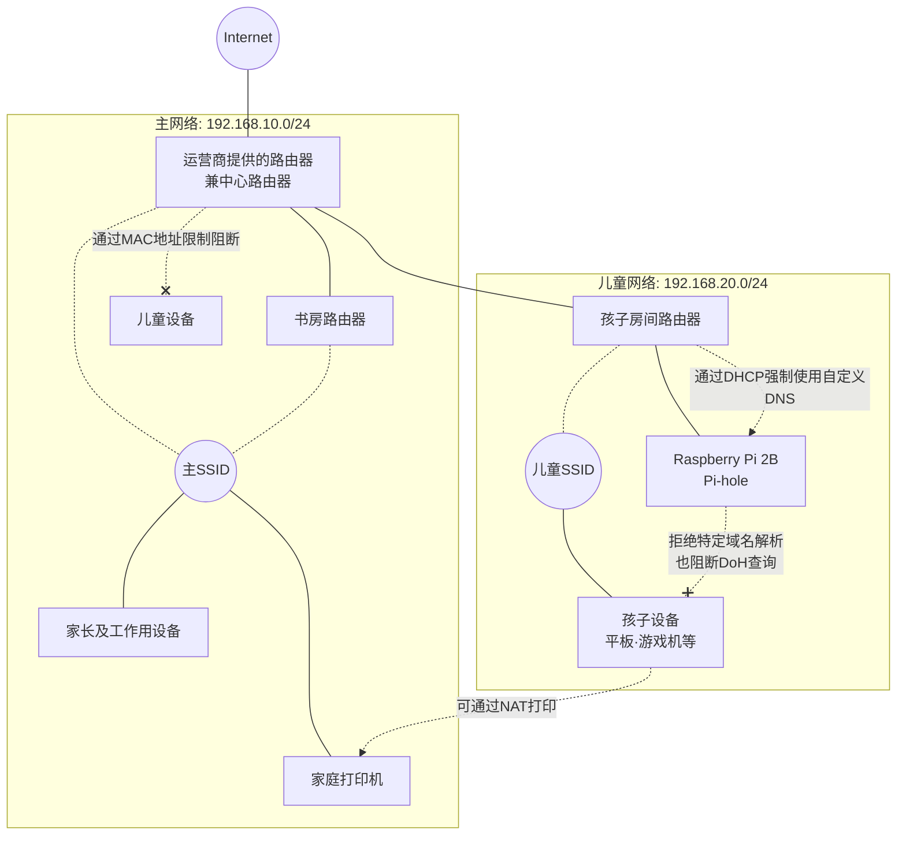

## 前言
大家好。我参与的项目组在每天的晨会上，都会利用“笑脸日历”来共享各自的状况（开怀大笑、微笑、一般、有点累、比较累、地狱模式等）。  
前些天，我在日历里把当天的状态设置为“有点累”，理由写了“睡眠不足”，结果被同事关心地问：“是鼻窦炎又加重了吗？”于是我随口回应：“最近鼻窦炎已经稳定了，不过其实是为了给孩子做网络限制，昨晚通宵在折腾家里网络……”，结果引来意想不到的请求：“很有趣，务必写篇文章分享一下！”  
到目前为止，我大多撰写与云计算相关的认证（如全冠认证等）文章，于是心想“偶尔也写篇与认证无关的轻松文章吧”，这才动笔写下了这篇。  
与本站其他文章不同，本文将涉及一些较为老旧的技术组合，但希望大家当作轻松阅读的调剂也能喜欢。不过，像本文中所探讨的那些“接地气”的网络基础知识（子网、DHCP、DNS机制等），如果亲自动手去理解，对于设计和构建云环境，以及应考云计算相关认证，都能成为极其有用的基础，这一点，**我这个几乎获得所有云计算认证的人来保证！**  
对于各位IT工程师来说，可能有不少人都在为孩子的上网和游戏习惯头疼吧。本文将介绍我家遇到的问题以及作为工程师父母所实施的“硬核网络对策”。（※本文中所记载的IP地址、子网等网络信息，均已从实际数值进行修改和模糊化处理，以考虑安全因素）

## 我家的网络状况与事件起因
首先，作为前提，介绍我家的基本情况（居住环境、家庭成员及工作方式）如下。

*   **家庭构成及工作方式**
    *   **孩子**：两名，一名初中生、一名小学生
    *   **妻子**：有时在家远程办公
    *   **我（作者）**：始终在家的书房全职远程办公
*   **居住环境**：4DK
    *   由于周边住宅电波干扰严重，2.4GHz频段（11g等）几乎无法使用
    *   因此，需要以虽然穿透力较弱但高速的5GHz频段（11a/ac/ax等）为主
    *   此外，为了满足夫妻二人的远程办公（视频会议等），无论在家中任何地点都必须具备“稳定的Wi-Fi环境”
    *   结果，覆盖各个房间的物理距离和隔墙情况，需要三台Wi-Fi路由器

孩子们各自都有学校配发的平板，小学生每周带回家一次，用于完成作业，而初中生的平板则一直放在家中。另外，孩子使用的手机是Android，通过Google的“Family Link”功能，已对可使用时间进行了严格限制。

然而某天，发现孩子把之前被忽视的“学校平板”带到床上，半夜在上面玩游戏等。结果因缺乏睡眠早上起不来，也经常因此逃避社团活动，陷入了恶性循环。（顺带一提，学校的平板是通过 Google Workspace 管理的，作为家长，我的真实想法是“希望能在 Google Workspace 端就限制可安装的应用和可访问的网站啊……”）

我觉得这样不行，于是最初对除手机以外的终端也实施了如下对策：

*   利用**Wi-Fi路由器的儿童控制功能**来限制可使用时间
*   通过**运营商提供的路由器与家用 Buffalo 路由器（2台）共计3台的架构**来分离接入点
    *   中央路由器（运营商提供）和我的书房路由器设置相同的主SSID
    *   孩子房间的路由器设置为另一个“儿童用SSID”
*   将游戏机、学校平板、Challenge Touch 等儿童终端全部连接到“儿童用SSID”

需要说明的是，此时网络并未真正划分，所有设备都在同一主网络中（例如：`192.168.10.0/24`）运行。

## 猫捉老鼠游戏的开始
刚在初期对策上松了口气没多久，孩子在平日回家后，在儿童控制允许的时间内，就不学习，改为看 YouTube 或玩游戏度过。  
更糟的是，不知何时孩子竟连接上了“主SSID”，我再次发现他们把设备带到床上。  
即使手机通过 Family Link 得到了限制，如果其他设备成为漏洞，一切就毫无意义。孩子因缺觉无法参加社团活动，学习也荒废……我判断不能继续只靠孩子的自制心，决定进行根本性的网络改造。

## 本次实施的根本性对策（硬核架构）
作为一名IT工程师的父母，我将网络架构改为能够在物理和逻辑上堵住所有漏洞。

事实上，最初我曾考虑过一个强硬手段：利用租赁房屋中免费附带的有线电视线路路由器，将孩子的设备完全踢到另一条线路上（物理回线隔离）。但由于该免费线路的下载速度实在太慢，一旦影响到学校远程课堂或查资料，就得不偿失。因此，我仍决定在利用主高速线路的同时，通过逻辑手段构建安全的网络。

另外，我家的环境是**由运营商提供的路由器与普通家用的 Buffalo 路由器组合**而成。在设计方案时，我不知仰望天花板多少次感叹：“啊，如果能用上VLAN该多轻松啊……！”如果用的是企业级多功能路由器，就可以利用 VLAN 轻松进行逻辑隔离了，但这次我们的隐藏主题是“尽可能将家里现有设备组合，一晚就完成”，所以就用手头的民用设备**一口气不眠不休、泥腿子式地搭建完成了**。

:::info
**💡 补充：何为 VLAN（虚拟LAN）**  
无需改变物理LAN电缆的布线或路由器的连接结构，仅通过网络设备（交换机或路由器）内部设置，就能在逻辑上安全地分割网络的机制。有了它，就不用跨多台物理路由器手动、泥腿子式地去分离子网了。
:::

在操作过程中，深夜我突然意识到：“想起了在加入 is 之前，就职公司的内部基础设施建设了……”。话虽如此，采取的对策如下：

1.  **引入 MAC 地址限制**  
    在中心路由器上配置 MAC 地址黑名单，彻底阻断孩子的设备连接主SSID。  
2.  **子网隔离**  
    将儿童SSID的路由器配置为主子网下的独立子网（例如：`192.168.20.0/24`），在逻辑上隔离网络。由于这个儿童子网以 NAT 方式挂在主子网之下，因此仍可访问位于主子网的家庭打印机等设备。  
3.  **使用 Raspberry Pi 构建专用 DNS（Pi-hole）**  
    虽然市售路由器也具备通过黑名单屏蔽特定域名的功能，但仅靠路由器的标准功能，很难灵活地“持续导入志愿者在互联网上公开的海量黑名单”。因此，我们在儿童子网内部署了一台 Raspberry Pi，利用其强大的域名过滤功能 Pi-hole 构建了专用 DNS 服务器。  
    （别问为什么家里正好有块树莓派。为了通宵加班完成这套，深夜我把家里剩余的各种设备都翻出来，最后用到的是一台稍旧的 Raspberry Pi 2B。）  
4.  **通过 DHCP 强制使用自定义 DNS**  
    修改儿童路由器的 DHCP 设置，将 Raspberry Pi 的 IP 地址作为 DNS 服务器下发。  
5.  **拒绝特定域名查询并转发正常解析（上游 DNS）**  
    在 Pi-hole 的过滤设置中，将与游戏和视频网站相关的所有 DNS 查询全部拒绝（黑洞化）。另一方面，对非阻断目标的正常查询（如学习用网站）则从 Pi-hole 转发到上游公共 DNS（如 Google DNS 的 `8.8.8.8`、Cloudflare 的 `1.1.1.1` 等），仅允许安全的通信。  
6.  **应对加密 DNS（DoH / DoT）**  
    实际上学校平板使用了 DNS over HTTPS（DoH）等加密的 DNS 通信，仅过滤传统的 53 端口无法阻断其“走后门”。因此，还额外添加了拒绝与 Cloudflare 等主要公共 DNS 服务的加密通信的配置。

:::info
**💡 补充：家长（管理员）头疼的 DoH (DNS over HTTPS)**  
传统的 DNS 通信（53 端口）未加密，因此可以通过放在网络路径中的 Pi-hole 等轻松监控和拦截“访问目标”。但近年来出于隐私保护的考虑，操作系统或浏览器往往默认将 DNS 通信对接到 HTTPS（443 端口）的加密通道（即 DoH）。一旦用户使用该功能，通信内容就只会表现为普通的 HTTPS 流量，本地的 DNS 服务器就可能被意外地绕过或跳过。虽然从安全性角度来看这是一项了不起的技术，却成为家庭网络管理员的一道难以逾越的墙。
:::

基于以上内容，我家最终的网络架构图如下。

## 今后的展望与父母的纠结
到目前为止，这样已经能够完全阻止孩子夜间熬夜上网冲浪。  
作为家长，心里其实是希望不要用这种“铁桶般”的系统来管理，最好能交给孩子自制，静待他们成长。然而现实是无法完全信任孩子的自制，这次只得做出痛苦的决定，加强系统限制。  
不过，这套架构也并非完美。由于允许儿童子网发起到外部的标准 DNS 通信（UDP 53 端口），若将来孩子掌握了相关知识，通过终端的网络设置自行配置 Google DNS（`8.8.8.8`、`8.8.4.4` 等），就能突破上述限制。届时就需要进行额外的对策。  
……话虽如此，如果孩子真的能够自主理解网络的原理，并掌握到能突破限制的水平，作为 IT 工程师的父母，我也会有“那样也许是一件值得高兴的事？”的复杂心情。只希望有一天能解除所有这些限制，让他们真正凭自己的力量去掌控一切。

## 结语
我深切体会到，家庭网络也需要根据实际需求（家庭成员的工作方式、孩子的使用情况、技术素养、现有设备等）不断地调整架构。希望能为有类似困扰的朋友提供一些参考。
