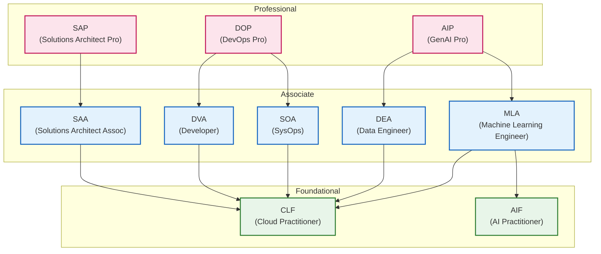

## 引言

[上一篇文章](/blogs/2026/04/13/google_cloud_all_certified_revenge/)中，我报告了突破了Google Cloud认证中的难关“Professional Security Operations Engineer（PSOE）”，并达成了梦寐以求的“Google Cloud认证全冠”。

这次，AWS方面唯一起还未取得的最新认证 “[AWS Certified Generative AI Developer - Professional (AIP-C01)](https://aws.amazon.com/jp/certification/certified-generative-ai-developer-professional/)” 已于2026年4月14日正式发布，因此我立刻前往参加考试。结果顺利 **通过**！由此，我终于实现了所设目标 **“AWS 和 Google Cloud 双全冠达成”**。

本文将回顾过去 Beta 考试中的未通过经历，介绍为复考采取的对策，以及对正式发布版考试的感受进行总结。

:::info
由于存在保密协议（NDA），无法涉及详细的考试内容，还请谅解。  
此外，所述信息截至2026年4月。  
:::

## 考试概览：AWS Certified Generative AI Developer - Professional

AWS Certified Generative AI Developer - Professional (AIP-C01) 是面向承担 GenAI 开发者角色的人员的专业级认证。认证将验证将基础模型（FM）有效集成到应用程序和业务工作流程，以及使用 AWS 技术将 GenAI 解决方案在生产环境中实施的实践性知识。

主要出题领域及其权重如下。  
- 内容领域 1：基础模型的集成、数据管理、合规性 (31%)  
- 内容领域 2：实施与集成 (26%)  
- 内容领域 3：AI 的安全性、信息安全、治理 (20%)  
- 内容领域 4：GenAI 应用的运营效率与优化 (12%)  
- 内容领域 5：测试、验证与故障排除 (11%)  

考试由75道题组成（其中10题不计分），使用100～1,000的换算分制，750分以上为合格线。

## Beta 考试的失败原因与问题

实际上我在2025年12月参加过该认证的 Beta 考试，但遗憾的是 **未通过**，感到非常懊恼。正如当时回顾中提到的，主要失败原因在于以下几点。

- **长篇题导致时间不足**：专业级别特有的超长题干和选项令人应接不暇。从多个服务组合的复杂场景中快速在脑海里构建需求和架构图非常耗时，结果将时间用到了最后一刻。  
- **缺乏考虑生产环境运维的实践知识**：在以 Amazon Bedrock 为核心的架构中，需要基于可扩展性、安全性、成本优化等最佳实践做出判断，但在多个看似都正确的选项中无法挑选出最优解。

## 为复考采取的对策

基于上次的反思，为在正式版考试中复考，我重点进行了以下对策。

- **重新确认考试指南并深入各领域**：重新确认考试指南中列出的核心技术要素，如向量存储和 RAG 的设计、提示工程的应用、自治式 AI 解决方案的实现等。  
- **学习相关服务的最佳实践**：想象使用 Amazon Bedrock 构建实际应用，加深对 AWS Lambda、Amazon API Gateway、Amazon CloudFront 等服务群的详细理解。同时重点学习了通过 Amazon Bedrock 安全护栏实现 AI 安全性和治理，以及利用 Amazon Comprehend 等进行数据保护。  
- **应对长篇场景题**：有意识地进行训练，从长文本中迅速梳理“需求是什么”“限制条件是什么（是优先成本还是优先延迟等）”，并在脑海中构思架构图。

## 实际考试考察的技术主题趋势

通过这次考试，我感觉不仅仅是对生成式 AI 的功能知识，还深入考察了与企业“生产运维”直接相关的实践见解。在 NDA 范围内，分享一些我觉得特别重要的主题。

- **具有严格合规性要求的用例**：频繁出现处理金融、医疗、研究机构等高机密数据的场景。不仅需要使用 AI，还需要考虑如何确保“数据驻留”（即数据不得离开特定区域/地域的原则）等合规要求。  
- **数据保护与安全性保障**：如利用 Amazon Comprehend 等对 PII（个人身份信息）进行隐私保护，以及通过 Amazon Bedrock 的安全护栏功能来过滤诸如暴力、仇恨等不当表达等，为安全提供 AI 的防护机制实现方法是必备知识。  
- **高效的运维与治理**：考察了在多个部门共享平台时，如何在架构中引入“按部门划分的权限与成本分摊（IAM 和标签策略）”。此外，还考察了诸如“无需修改应用端代码，就能灵活切换后台基础模型（FM）的架构”之类的重要主题。  
- **提示管理与运行时的自动评估·告警**：除了使用 Amazon Bedrock 提示管理等实现“提示版本管理及生产环境应用审批流程”外，还深入考察了根据业务指标对运行中的 AI 响应结果进行持续且自动的评估，并“检测到质量下降时发出告警（通过 CloudWatch 异常检测）”等发布后质量监控运营相关知识。  
- **多账号环境下的权限管理与私有网络连接**：针对企业使用场景，在“应用账号”和“数据湖账号”分离的多账号架构中，如何进行安全的跨账号权限配置。同时，频繁考察了无需将信息暴露到互联网、通过 VPC 终端节点（AWS PrivateLink）等在私有网络内调用 AI API 的网络架构。  
- **生成式 AI 特有的 MLOps（LLMOps）**：在基础模型微调（Fine-tuning）和 RAG 运营中，部分题目要求具备将“添加数据 → 重新训练与评估模型 → 测试 → 部署”这一系列流程自动化的 MLOps 知识。  
- **提升生成式 AI 用户体验（UX）与前端联动**：作为提升应用用户体验的实践性架构，考察了使用 Amplify AI Kit 的联动，以及通过 Amazon API Gateway 对 AI 生成结果进行流处理并返回给前端的用例。  
- **Human-in-the-loop（HITL）工作流程设计**：不仅考察 AI 完全自动化，还考察了使用 AWS Step Functions 等实现“对基础模型（FM）响应内容进行最终人工检查与审批（Human-in-the-loop）”的工作流程设计方法，以保障实际运行的安全性。  
- **根据目的选择最优向量数据库**：在构建 RAG（检索增强生成）时，并非一律选择 Amazon OpenSearch Serverless，而是根据现有数据特性和用例，判断如 Amazon Aurora PostgreSQL（pgvector）或 Amazon DocumentDB 等哪种向量数据库最为合适的设计能力受到考察。  
- **根据处理时间选择架构**：事先粗略评估推理或数据处理所需的“预估处理时间”，如果是短时间可完成则使用 AWS Lambda；如属于长时间异步流程则使用 AWS Step Functions 或 Amazon EKS；若强调自治型架构则使用 AI 代理（Agents for Amazon Bedrock 等），这种根据需求精确分配资源的方法也是重要主题。  
- **为成本与延迟优化的缓存策略**：在提高响应速度和降低 API 成本的需求下，相较于将推理结果自行保存到 Amazon ElastiCache 或 Amazon DynamoDB 等传统架构，利用基础模型层级的内置功能“提示缓存（Prompt Caching）”的方案，更被视为更智能的最优解。  
- **根据目的区分监控方法（审计与指标）**：在监控需求方面，要区分“跟踪谁在何时使用了 API 的操作记录（通过 AWS CloudTrail 审计功能）”还是“跟踪 LLM 响应延迟增加或 Token 消耗量等性能变化（通过 Amazon CloudWatch 的指标监控与告警）”，根据目的准确选择合适的 AWS 服务与架构的运营知识也非常重要。  
- **超越限制（配额）后的弹性与监控**：当 AI 服务达到每小时使用上限（限流）时，需要实现利用“指数退避（Exponential Backoff）”进行重试，以及搭建通过 Amazon CloudWatch 等适当监控并发送告警的机制，提高系统可用性的架构也受到考察。  
- **通过跨区域推理实现负载均衡**：与前述限制超越对策相关，为规避某一区域流量骤增带来的暂时吞吐量下降，题目还考察了利用 Amazon Bedrock 的“跨区域推理（Cross-region inference）”配置自动将负载分发（路由）到多个区域的实践性优化方法。

在专业级别考试中，一个长篇场景题往往同时交织考察这 3～4 个方面。因此，要从迷惑的选项中选出最优设计，就必须快速梳理“在该问题中需要优先达成的核心要求是什么”，并在短时间内准确判断各选项是否满足这些要求，这就需要具备综合能力。

## 考试感想（终于实现双全冠！）

这次复考中，我对长篇题的时间管理也得到了改善，比 Beta 考试时更沉着地去解读场景。经过不断学习，在成本与性能权衡、负责式 AI 的实现、运维效率优化等方面，我能够更自信地筛选选项，这点非常关键。

最终结果是通过。顺利补齐了 AWS 方面唯一尚未取得的认证！恰好在4月11日才实现了 Google Cloud 认证的全冠，因此接连不断的好消息令人感慨万千。

## 【附言】关于 AIP 通过后下级认证的自动更新

AWS 认证如[官方再认证计划](https://aws.amazon.com/jp/certification/recertification/)所述，具有“通过高级别资格后，相关的下级资格也会自动更新”的令人欣喜的功能。

此次，究竟通过 AIP 后哪些 Associate 和 Foundational 级别认证将被更新，此前在官方页面并未明确说明（※截至本文发布时），不过这次实际通过后终于确认了具体详情！

结果是，AIP 通过后，**DEA（Data Engineer）、MLA（Machine Learning Engineer）、AIF（AI Practitioner）、CLF（Cloud Practitioner）** 这四个认证被一次性自动更新了。

将各级别（Professional、Associate、Foundational）之间的更新关联整理并作图，示例如下。当通过箭头源头的认证时，箭头指向的认证即被更新。

由于 AIP 深度涵盖生成式 AI 和数据处理两大领域，因此它一次性覆盖了对 DEA、MLA 等多个新近添加的 Associate 级认证的更新。尤其是 DEA、MLA、AIF 这三项是在 2024 年新设并依次取得的认证，明年正好是它们的更新周期，这次通过后一次性更新实在帮了大忙。对于需要维护多项认证的身份而言，这种更新设计非常贴心。

## 结语

**13 项 AWS 认证全冠，以及 14 项 Google Cloud 认证全冠** —— 我长久以来的云认证挑战故事至此迎来一个重要里程碑。

我相信，这次能够系统地学习 AWS 和 Google Cloud 这两个主要云平台，将无疑成为未来挑战多云环境下架构设计与方案实践的有力基石。首先，也为了整理这次的经验和知识，计划积极撰写 **“对比 AWS 与 Google Cloud 的架构与理念差异的文章”** 等，与大家分享见解。

此外，我不仅满足于单纯地持有认证，还希望通过持续向开发者网站投稿文章和信息发布，为未来入选 **“Top Engineer（顶尖工程师）”** 奠定基础，从而进一步推动云技术普及与社区发展。

（由于在短时间内一口气拿下了如此多的认证，不得不回避来自“数年后将迎来一大波集中更新恐怖”的心理阴影……）

希望能对今后挑战云认证的各位有所帮助！
