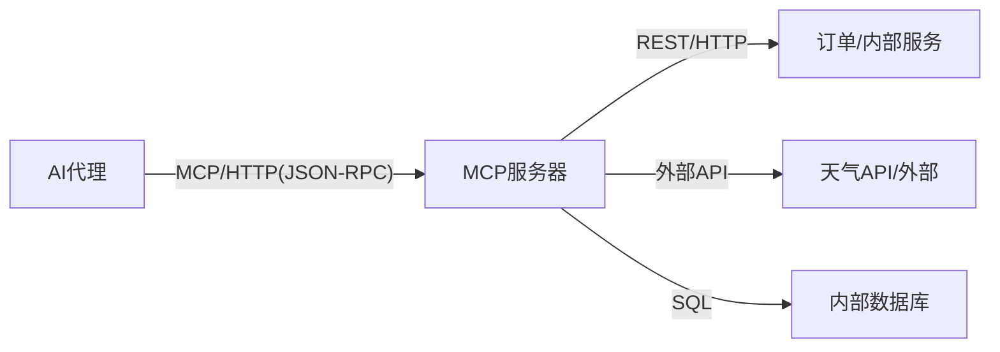
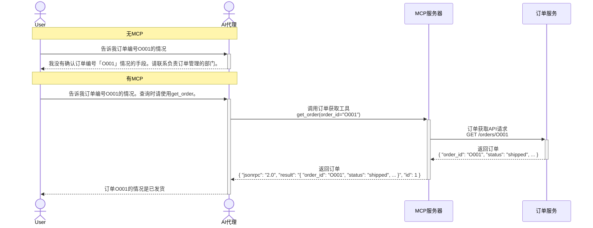

## 引言

本系列将分阶段解读 MCP (Model Context Protocol) 的基础到实现。  
内容面向“希望让 AI 代理掌握公司内部系统或外部 API 的知识”的读者。  

这次将介绍 MCP 本身。  
今后计划展开按传输方式（stdio、Streamable HTTP）的实现、MCP 的自动生成等内容。

## 为什么需要 MCP

AI 代理（Claude、GPT-4、Gemini 等）拥有海量知识，但无法直接访问“此刻的数据”或“公司内部系统的信息”。  
例如，即使询问 AI 关于“最新的订单状况”或“库存数量”，只要学习数据中未包含，就无法回答。  

MCP 是突破这种“知识壁垒”的机制。  
通过使用 MCP，AI 代理能够安全地与公司内外的系统和数据库联动。  
同时，将认证与授权（访问控制）以自身方式集成也是需要考虑的重要课题。

## 什么是 MCP

MCP 是 AI 代理与外部服务通信的规范，首版由 Anthropic 公司在 2024/11 发布。（[官网](https://modelcontextprotocol.io)）  
使用 MCP，AI 代理可以有效利用外部服务的功能。  
MCP 服务器是指实现了 MCP 协议的服务器，用于 AI 代理与外部工具或数据源通信。  
MCP 客户端是指 AI 代理等 MCP 服务器的使用者。  

※MCP 起到类似“连接 AI 代理与内部和外部服务”的枢纽作用。

| 项目 | MCP |
| --- | --- |
| **协议** | JSON-RPC 2.0 over stdio 或 HTTP/SSE（Streamable HTTP） |
| **数据格式** | JSON (JSON-RPC 2.0) |
| **端点** | 统一端点（仅 `/mcp`） |
| **操作** | JSON-RPC 方法（`tools/list`, `tools/call`） |
| **错误** | JSON-RPC 错误（code, message） |

:::info: SSE (Server-Sent Events) 是
一种在保持 HTTP 连接的同时，由服务器逐次发送事件的机制。（`text/event-stream`）  
在 MCP 中，用于分阶段返回工具调用结果或流式响应。
:::

## MCP 服务器的主要职责

MCP 服务器的主要职责如下。  
可以说相当于 BFF 的 MCP 客户端版。
* 协议转换（MCP⇔REST）
* 认证与授权
* 流量限制
* 审计日志
* 路由
* 错误处理
* 响应转换与合成

## 通过 MCP 服务器的效果

AI 代理无法利用学习数据中不包含的最新数据或外部数据。  
通过在 MCP 服务器上公开可访问外部工具或数据源的工具，就能基于实时数据进行回答。  

**MCP 的应用示例**
* 当 AI 聊天机器人被问及“告诉我订单编号 O001 的出货情况”时，通过 MCP 向公司内部的订单管理系统查询并返回最新信息
* 企业内部 FAQ 机器人通过 MCP 从人事系统或考勤数据库获取必要信息，回答员工问题
* 与外部 API（天气、汇率等）联动，AI 根据实时数据提供建议

## 传输方式（通信方式）的种类

MCP 的传输方式有 `stdio` 和 `Streamable HTTP`。

### stdio（标准输入输出）

MCP 客户端（如 AI 代理）将 MCP 服务器作为子进程启动，在本地环境中进行通信的方式。  
* 通信  
  * 数据格式：换行分隔的 JSON-RPC 消息。为了允许换行，消息中不能包含换行符。  
  * 数据收发：使用标准输入输出（stdin/stdout）。  
  * 会话终止：客户端关闭输入流或进程结束。  
* 用途  
  * 让在个人电脑上运行的 AI 代理操作本地资源（文件或工具）。

### Streamable HTTP

MCP 服务器作为独立进程运行，通过单一 HTTP 端点接受多个 MCP 客户端连接的通信方式。

* 通信  
  * POST 与 SSE 结合：客户端使用 POST 发送请求，服务器通过 SSE 进行响应或通知的流式传输。  
  * 异步・准双向通信：使用 GET 打开独立的接收流，服务器可以在任意时机主动发送通知。  
  * 恢复与状态管理：网络断开时可使用 `Last-Event-ID` 从中断处重新连接，并可通过 `MCP-Session-Id` 头进行会话管理。  
* 用途  
  * 远程服务器使用：适用于利用网络中部署的服务器功能（如云端数据库或外部 API）。  
  * 多客户端使用：当需要让多个 MCP 客户端使用同一 MCP 服务器时，类似 Web 服务的架构中大显身手。

:::info: `MCP-Session-Id`
是用于管理客户端与服务器之间交互（会话）的 ID。

在 Streamable HTTP 中，服务器在初始化时会发放会话 ID（如 UUID 或 JWT 等）。  
客户端需要在此后的所有 HTTP 请求（POST 或 GET）中，将该值作为 `MCP-Session-Id` 头包含进去。
:::

:::info: Last-Event-ID
是在会话内打开的 SSE 流通信中，用于保证连续性的 ID。

服务器向客户端发送消息的 SSE 流中的每个事件都带有 ID。  
当流断开时，客户端在重新连接时通过 `Last-Event-ID` 头告知服务器“最后收到的事件 ID”，即可从中断处恢复流。
:::

## 今后展望

本系列将从 MCP 的基础到实践性实现方法进行讲解。  
计划分阶段介绍不同传输方式的差异、自动生成工具的应用等。  
旨在让“AI 代理与系统的联动”更加贴近。  
敬请期待下一篇。
