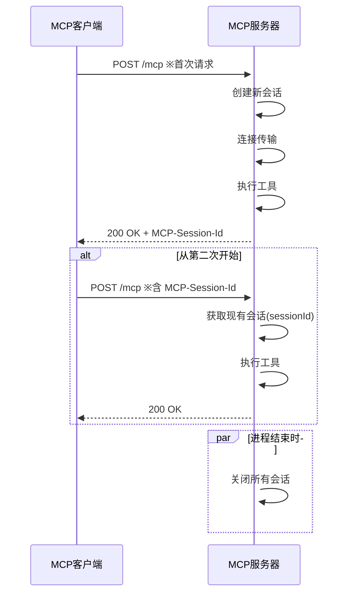

## 前言

本页面是“AI代理人和系统连接的MCP入门”的续篇。  
这次将介绍使用 StreamableHTTP 通信的 MCP 服务器的有状态实现。  

有状态结构适用于希望将同一用户的连续操作视为同一会话的场景。  
例如“将工具调用结果传递到下次调用”“在会话层面保持临时状态”“维护连接中的上下文”等用途。  

本文将聚焦于与无状态实现的差异，并梳理在有状态结构中需要掌握的要点。  
示例代码已在此开源：[https://github.com/ubata-mamezou/developer-site-article-examples/tree/main/mcp-server_http](https://github.com/ubata-mamezou/developer-site-article-examples/tree/main/mcp-server_http) 。

:::info: 系列目录
**连载：AI代理人和系统连接的MCP入门**
* [介绍](/blogs/2026/04/24/mcp-impl_introduction/)
* [stdio 实现篇](/blogs/2026/05/08/mcp-impl_stdio/)
* [StreamableHTTP 无状态实现篇](/blogs/2026/05/22/mcp-impl_http_stateless/)
* **StreamableHTTP 有状态实现篇（本页）**
:::

## 本次使用的库等

* npm@11.11.1
* node@22.22.0
* typescript@6.0.3
* @modelcontextprotocol/sdk@1.29.0
* zod@4.3.6

## 与无状态的不同

首先梳理一下实现策略的差异。

| 视角 | 无状态 | 有状态 |
|---|---|---|
| 服务器及传输的生命周期 | 每次请求时创建并销毁 | 作为会话级连接上下文创建并复用 |
| 会话 ID | 基本不使用 | 使用 `sessionIdGenerator` 决定并管理与各传输关联的 ID |
| 连接处理 | 每次请求 | 会话首次请求时进行一次 |
| 结束处理 | 响应后 | 通过 SIGINT 等统一关闭所有会话 |

:::info: 服务器、传输、会话的关系
如果想象“1 个服务器使用 1 个传输管理多个会话”的形式，会在实现会话管理时感到困惑。

本示例所用版本中，`McpServer` 同时可连接的 `transport` 仅为 1 个，`StreamableHTTPServerTransport` 也仅可保持单个 `sessionId`。  
因此，本示例采用了按会话分别管理服务器和传输的方式。
:::

:::column: SIGINT 是什么
`SIGINT` 是“中断信号”。  
在终端按下 `Ctrl + C` 时会发送到进程，在 Node.js 中可以通过 `process.on("SIGINT", ...)` 实现结束前的处理。  
本例中用于销毁服务器上保持的连接和状态。
:::

## 服务器的实现

简单实现 MCP 服务器并说明与无状态的差异。  
完整代码请参见：[https://github.com/ubata-mamezou/developer-site-article-examples/blob/main/mcp-server_http/src/index.stateful.ts](https://github.com/ubata-mamezou/developer-site-article-examples/blob/main/mcp-server_http/src/index.stateful.ts) 。



### 差异1：保持会话上下文

在无状态中，每次请求都会重新生成。  
在有状态中，会以会话 ID 为键来保持连接上下文。  
此处的 `SessionContext` 并不是“MCP 服务器进程本身”，而是与 SDK 的连接模型相匹配的会话级实现上下文。

```ts
type SessionContext = {
	server: McpServer;
	transport: StreamableHTTPServerTransport;
};

const sessions = new Map<string, SessionContext>();
```

:::info: 实际运营中管理状态时
本示例优先简洁性，使用内存来管理状态。  
实际运营时，考虑到防止内存泄漏和分布式环境下运行，更安全的做法是使用 NoSQL 等外部存储。
:::

### 差异2：将请求按会话进行分发

如果存在既有的会话 ID，则使用对应的上下文，否则创建新的会话上下文。

* `sessionIdGenerator`  
  名称容易让人误解，但它并非通用编号策略。  
  它是在初始化时为传输决定会话 ID 的回调。

* `MCP-Session-Id`  
  在首次请求时生成，客户端会接收。  
  在第二次及以后的请求中，将其作为 `MCP-Session-Id` 头部附加并重用。

```ts
async function createSessionContext() {
  const transport = new StreamableHTTPServerTransport({
    sessionIdGenerator: () => randomUUID(),
  });
  const server = createServer(() => transport.sessionId);
  await server.connect(refineTransport(server, transport));
  return { server, transport };
}

app.post("/mcp", async (req, res) => {
	const sessionId = req.headers["mcp-session-id"] as string | undefined;
	let context: SessionContext | undefined;

	if (sessionId) {
		context = sessions.get(sessionId);
	} else {
		context = await createSessionContext();
	}

	await context.transport.handleRequest(req, res, req.body);

	// 在 initialize 之后，将设置到 transport 本身的 sessionId 用作键进行保存。
	const issuedSessionId = context.transport.sessionId;
	if (issuedSessionId) {
		sessions.set(issuedSessionId, context);
	}
});
```

### 差异3：在进程结束时统一关闭所有会话

由于按会话分别保持了服务器和传输，结束时需要显式关闭所有会话。

```ts
process.on("SIGINT", async () => {
	for (const context of sessions.values()) {
		await context.transport.close();
		await context.server.close();
	}
	process.exit(0);
});
```

:::info: 实际运营中的会话结束处理
本示例在进程结束时统一关闭所有会话。  
实际运营中，自动销毁一定时间内无操作的会话，或提供客户端可显式结束会话的机制也很重要。
:::

## 验证会话管理

我们通过为每个会话保留值的 `counter` 工具添加实现，来确认每个会话都能保留自己的值。  
确认需要在多个会话中进行操作，因此同时使用 MCP Inspector 和 Postman。

* MCP Inspector 的运行结果  

* Postman 的运行结果  


这是从 MCP Inspector 执行 3 次，从 Postman 执行 2 次工具的结果。  
如图所示，可以确认不同的会话 ID 被分配，并且每个会话的 counter 递增值得到了管理。

:::info: 在 Postman 中添加 MCP 的位置  
很久没用 Postman 了，添加 MCP Collection 时有些迷茫，所以记录一下位置。  

:::

## 验证会话切换

重启 MCP 服务器，验证会话是否切换。


可以确认分配了与之前不同的会话 ID，且 count 已重置为 1。

## 总结

* 有状态可以在同一会话内跨请求保持状态。  
* 另一方面，采用有状态后，在结束时的关闭和会话管理等运维职责增加。对于需要保证工具调用顺序的场景，可以选择有状态，但优先考虑简单性的情况下，使用无状态是更现实的选择。
