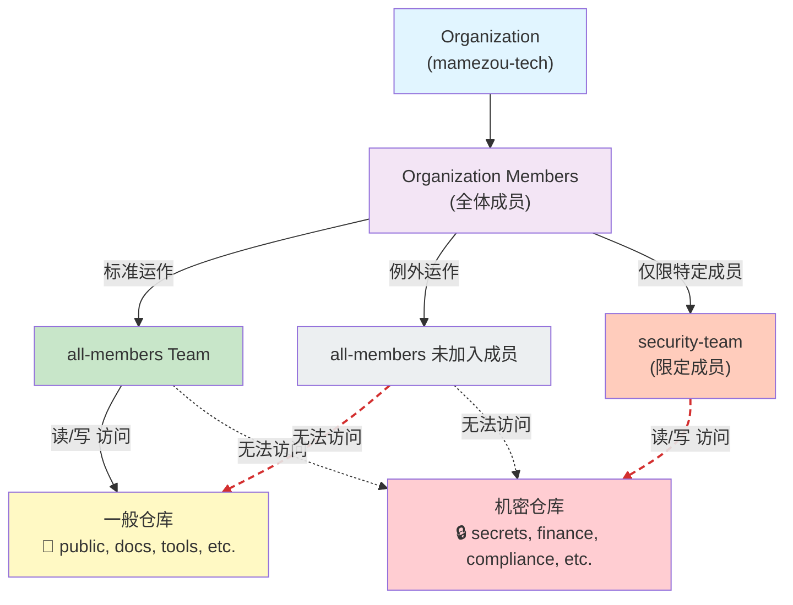

## 前言

GitHub Organization 的运维需要在安全性和便利性之间取得平衡。前些天，有人向我咨询：“想创建一个包含高度机密数据的仓库，希望将组织的 Basic Permission 从 `write` 修改为 `no permission`。”

这个需求是合理的，但如果直接这么做，每次创建新仓库时都必须单独配置成员的访问权限，管理员的负担会大幅增加。

本文将介绍一种可在 Teams 计划（而非 Enterprise 计划）限制下实现的访问权限管理策略。

## 问题整理

### 环境限制
前提条件如下。

- 不是 GitHub Enterprise 而是 Team 计划
- 可以基于团队进行访问控制，但精细设置有限

### 原始问题

- Basic Permission 设置为 write
- 成员会默认获得机密仓库的访问权限
- 为避免此情况，希望将 Basic Permission 设置为 no permission

### 后续问题

- 将 Basic Permission 改为 no permission 后，所有新仓库都需要单独配置成员访问
- 添加新成员时也需要逐个仓库配置访问
- 管理工作量呈爆发式增长

## 本次解决方案
既然要问 GitHub，便向 Web 版的 Copilot 咨询，决定在组织内通过团队来构建安全边界。

### 访问权限管理总体架构

以下展示了构建的访问权限管理总体架构。



在此配置中，`all-members` 的归属决定了访问权限的边界，未加入该团队的组织成员无法访问一般仓库和机密仓库。

### 基本策略：转为“白名单方式”

按以下方针整理访问权限。

**1. 创建包含所有成员的统一团队**

创建一个名为 `all-members` 的团队，将所有成员统一加入。为该团队赋予对大多数通用仓库的访问权限。

优点：
- 添加新成员时，只需将其加入该团队，即可访问大多数仓库
- 无需在仓库创建后进行默认访问配置

**2. 隔离机密仓库**

对高度机密的仓库（如：配置信息、个人信息、商业机密等），不让 `all-members` 团队可见。

改为创建只包含必要成员的专用团队（如：`security-team`、`finance-team`），仅为这些团队赋予访问权限。

**3. 按仓库设置权限**

```
仓库A（面向一般）
  └─ all-members 团队: read
  
仓库B（面向一般）
  └─ all-members 团队: write
  
仓库C（机密：安全）
  └─ security-team 团队: write
  └─ 特定用户: admin

仓库D（机密：财务）
  └─ finance-team 团队: write
  └─ 特定用户: admin
```

## 实施步骤

### 步骤1：创建 all-members 团队
1. 组织设置 → 团队  
2. 在“Create a team”中创建 `all-members` 团队  
3. 添加新成员时，从界面选择此团队并添加  

### 步骤2：设置仓库访问权限
1. 仓库的 Settings → Collaborators and teams  
2. 添加 `all-members` 团队，并设置适当的权限（Read/Write）  

### 步骤3：修改组织的 Basic Permission
1. 组织设置 → Member privileges  
2. 将 Base permissions 设置为 `No permission`  

### 步骤4：对机密仓库进行单独设置
1. 对机密仓库不添加 `all-members` 团队  
2. 创建并添加专用团队（如：`security-team`）  
3. 或者，直接添加特定用户  

## 通过自动化提高向仓库添加团队的效率

实现上述策略时，关键在于**对所有现有和新仓库都不遗漏地添加 `all-members` 团队**。可以使用 GitHub Actions 自动化该流程。

### 实施中的挑战

- 在创建新仓库后，可能会忘记添加 `all-members` 团队  
- 当现有仓库数量众多时，手动批量添加十分麻烦  
- 仓库管理员可能会遗漏添加  

### 自动化机制

使用 GitHub API 与 GitHub CLI 自动执行以下操作。

**脚本示例**

```bash
#!/bin/bash
set -e

ORG="mamezou-tech"
TEAM="all-members"
DRY_RUN=${DRY_RUN:-false}

if [ "$DRY_RUN" = "true" ]; then
  echo "🔍 DRY RUN MODE - No actual changes will be made"
fi

# 设置排除的仓库（如机密仓库等）
EXCLUDE_REPOS=(
  "secret-repo-1"
  "confidential-data"
)

# 获取组织的仓库列表
repos=$(gh api --paginate /orgs/$ORG/repos --jq '.[].name')

success_count=0
skip_count=0
fail_count=0

for repo in $repos; do
  # 跳过排除的仓库
  if [[ " ${EXCLUDE_REPOS[@]} " =~ " ${repo} " ]]; then
    echo "⊘ Skipping: $repo (excluded)"
    ((skip_count++)) || true
    continue
  fi

  echo "Adding $TEAM to $ORG/$repo..."

  if [ "$DRY_RUN" = "true" ]; then
    echo "✓ (dry-run)"
    ((success_count++)) || true
  else
    if gh api --method PUT \
      /orgs/$ORG/teams/$TEAM/repos/$ORG/$repo \
      -f permission=push \
      --silent; then
      echo "✓"
      ((success_count++)) || true
    else
      echo "✗ Failed"
      ((fail_count++))
    fi
  fi
done

echo ""
echo "================================"
echo "Repository Sync Summary:"
echo "  Success: $success_count"
echo "  Skipped: $skip_count"
echo "  Failed:  $fail_count"
echo "================================"
```

**脚本要点**

- `EXCLUDE_REPOS`: 明确管理排除的仓库（机密仓库在此列出）  
- `permission=push`: 授予写入权限（`permission=pull` 则仅授予读取权限）  
- `DRY_RUN`: 为 true 时执行模拟  
- 通过 API 调用批量处理，减少人工操作  

:::info
起初 Copilot 将 `permission=push` 写成了 `write`，导致运行时出现问题。GitHub API 在一些地方缺乏对称性，即使是 Copilot 也会出错，因此需要注意。
:::

### GitHub Actions 工作流

```yaml
name: Sync all-members Team

on:
  workflow_dispatch:
  schedule:
    - cron: '0 2 1 * *'  # 每月1日 2:00 UTC 执行
  pull_request:
    paths:
      - '.github/workflows/sync-all-members-team.yml'
      - 'scripts/sync-all-members-repos.sh'

jobs:
  sync-team: 
    runs-on: ubuntu-latest
    
    steps:
      - name: Checkout
        uses: actions/checkout@v6
      
      - name: Add all-members team to repositories
        run: bash scripts/sync-all-members-repos.sh
        env:
          GH_TOKEN: ${{ secrets.ORG_MEMBER_PAT }}
          DRY_RUN: ${{ github.event_name == 'pull_request' }}
```

**工作流配置要点**

- `workflow_dispatch`: 可手动执行，立即检查同步遗漏  
- `schedule`: 定期执行（例如：每月1日）自动检测同步遗漏  
- `pull_request`: 在脚本更新时自动执行测试  
- `DRY_RUN`: 在 PR 中为 true，以模拟修改  

**所需的 Secrets 设置**

- `ORG_MEMBER_PAT`: 具有组织仓库管理权限的个人访问令牌 (Personal Access Token)  
- 范围（scopes）：`admin:org`, `repo` 等  

### 运维要点

✅ 脚本更新时，通过 PR 自动执行确认后再合并  
✅ 对排除的仓库进行带注释的明确管理  
✅ 通过定期执行定期检测并修复同步遗漏  
✅ 可通过手动执行（workflow_dispatch）进行按需同步  
✅ 在创建新仓库后立即手动执行即可立刻添加团队  

## 联通性验证
虽然应该已成功构建，但为了确认访问控制是否按预期工作，让组织成员（非限定成员）实际打开机密仓库的链接并检查其行为。

:::column:Slack 对话
👦 kondoh 16:16  
有个小忙，请帮我打开一下这个仓库，看看会发生什么。  
https://github.com/mamezou-tech/[private-repo-for-restricted-team]  
👧 nakamura 16:27  
变成 404。  
👦 kondoh 16:28  
谢谢！这是个高度机密的仓库，出现 404 就好了。💯  
:::

## 要点和注意事项
此次配置具有以下优点和注意事项。

### 优点

✅ 在不更改 Basic Permission 的情况下提升安全性  
✅ 添加新成员时所需操作降到最低  
✅ 自动获得对大多数仓库的访问权限  
✅ 与 GitHub Enterprise 相比成本更低  

### 缺点及注意事项

⚠️ 机密仓库的管理需手动操作  
⚠️ 团队结构变更时也需进行相应调整  
⚠️ 需要定期审计访问权限  

## 结语
GitHub 组织的访问权限管理，在安全性和可操作性之间寻找平衡非常重要。即使没有 Enterprise 计划，也可以利用团队功能实现一定程度的控制。

关键在于明确区分“所有人都应访问的仓库”和“需要限定访问的仓库”。如果分类不够明确，可能会带来安全风险，或导致运维变得复杂，因此需要注意。
