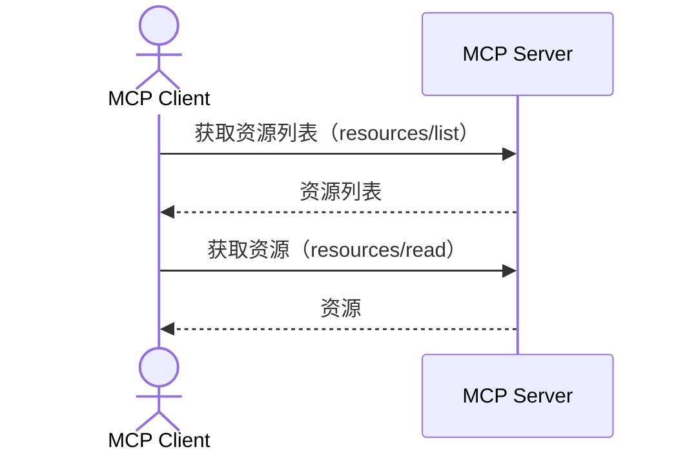

## 介绍

本页面是“AI代理与系统衔接的MCP入门”的续篇。  
这次说明资源。  

MCP 的资源是为 AI 模型在生成回答时参考的上下文信息（文件、指南、规范等）提供功能。  
与工具在“AI 模型的判断”中执行、提示词由“用户意图”选择不同，资源由“应用程序主导（Application-driven）”决定其集成。

本文中所示代码已在 [此处](https://github.com/ubata-mamezou/developer-site-article-examples/tree/main/mcp-server_http)公开。

:::info: 系列目录
**连载：AI代理与系统衔接的MCP入门**
* [介绍](/blogs/2026/04/24/mcp-impl_introduction/)
* [stdio实现篇](/blogs/2026/05/08/mcp-impl_stdio/)
* [StreamableHTTP无状态实现篇](/blogs/2026/05/22/mcp-impl_http_stateless/)
* [StreamableHTTP有状态实现篇](/blogs/2026/06/05/mcp-impl_http_stateful/)
* [提示词篇](/blogs/2026/06/19/mcp-impl_prompt/)
* **资源篇（本页面）**
:::

## 使用的库等

* npm@11.11.1
* node@22.22.0
* typescript@6.0.3
* @modelcontextprotocol/sdk@1.29.0
* zod@4.3.6

## 使用示例

* 分享开发指南：将编码规范和设计方针资源化，作为 AI 生成时的前提信息传递  
* 引用规范片段：将 API 规范、错误代码定义、输入约束等摘录作为资源公开，提高代码生成的准确性  
* 根据动态参数切换信息提供：使用 URI 模板，提供内容随可变参数变化的资源  

## 工具、提示词与资源的区别

在之前的特辑中我们已经介绍过工具、提示词和资源的主要要素，因此在此回顾它们的角色。

| 要素名   | 主要作用                           | 控制主体           | 标识方法         |
|--------|--------------------------------|----------------|---------------|
| 资源     | 提供数据和上下文（静态知识）               | 应用程序主导         | 资源的 URI      |
| 提示词    | 消息和工作流模板                        | 用户主导           | 提示词名称        |
| 工具     | 执行具体函数（主动操作）                  | 由 AI 模型执行      | 工具名称         |

## 资源的类型

MCP 的资源根据 URI 的提供方式分为两类。

| 类型       | 说明                          | 用例                         |
|----------|-----------------------------|----------------------------|
| 静态资源     | 通过固定 URI 唯一确定的资源             | 指南、固定规范、配置信息等             |
| 资源模板     | 使用 URI 模板（RFC 6570）参数化的资源 | 内容随 ID 或名称等可变元素变化的信息 |

## 协议消息

与 MCP 资源相关的消息分为 6 种。

| 消息                                         | 方向          | 说明                                                         |
|--------------------------------------------|-------------|------------------------------------------------------------|
| `resources/list`                           | 客户端 → 服务器 | 获取可用资源列表（支持分页）                                          |
| `resources/templates/list`                 | 客户端 → 服务器 | 获取资源模板列表                                                   |
| `resources/read`                           | 客户端 → 服务器 | 指定 URI 获取资源内容                                              |
| `resources/subscribe`                      | 客户端 → 服务器 | 订阅指定 URI 的资源更改通知（需具备能力 `subscribe: true`）        |
| `notifications/resources/updated`          | 客户端 ← 服务器 | 通知已订阅的资源发生了更改                                            |
| `notifications/resources/list_changed`     | 客户端 ← 服务器 | 通知资源列表已变化（需具备能力 `listChanged: true`）             |

※为了验证通知，需要在其他地方设置资源源并检测源端的更改，因此样例中未包含该部分。



## 数据结构 (Data Types)

* 资源内容  
  * `uri`: 能唯一标识资源的 URI  
  * `name`: 资源名称  
  * `title`: 用于显示的标题  
  * `description` (可选): 资源的说明  
  * `icons` (可选): 图标列表  
  * `mimeType` (可选): 内容的 MIME 类型。可指定文本或二进制（需 Base64 编码）。  
  * `size` (可选): 字节数  
* 注释 (Annotations): 给客户端的提示  
  * `audience`: 表示资源面向的对象。可指定 `user`、`assistant` 或两者。  
  * `priority`: 以 0.0～1.0 的数值表示的重要性（1.0 最重要）  
  * `lastModified`: 最后更新时间（ISO8601 格式时间戳）  

## URI 方案

应根据目的为资源的 URI 选择适当的方案。

| 方案       | 用途                         | 备注                                                        |
|----------|----------------------------|-----------------------------------------------------------|
| `https://` | 引用 Web 上的资源               | 当客户端自身可以访问时使用。若通过服务器获取，建议考虑自定义方案  |
| `file://`  | 表示类似文件系统结构的资源        | 与文件系统的映射非必需，获取值的来源可自由（数据库或外部 API 等） |
| `git://`   | Git 资源                    | 用于表示 Git 特有结构，如提交、分支、路径等                     |
| 自定义       | 通过自定义方案的任意资源           | 遵循 RFC3986。本示例中的 `memory://`、`orders://` 即属于此类   |

:::info
**服务器要验证所有的资源 URI**  
示例中略去了，但需要防止路径遍历等意外访问。

**使用 file 表示目录时**  
建议在 mimeType 中指定 `inode/directory`（XDG 规范）。
:::

## 实现示例

完整代码请参见 [此处](https://github.com/ubata-mamezou/developer-site-article-examples/blob/main/mcp-server_http/src/index.prompt-and-resource.ts)。

### 静态资源的注册

下面是通过固定 URI 发布资源的示例。  
将 URI 字符串作为 `registerResource` 的第二个参数即可创建静态资源。

```ts
// 资源：带注释的静态资源（文本内容）
const testGuideUri = "memory://guides/testcase-prompt-playbook";
server.registerResource(
  "testcase-prompt-playbook",
  testGuideUri,
  {
    mimeType: "text/markdown",
    description: "测试视角生成指南",
    annotations: {
      audience: ["assistant"],           // 将其定位为 AI 的参考信息
      priority: 0.8,                     // 重要度（较高）
      lastModified: "2026-06-28T00:00:00Z",
    },
  },
  async () => ({
    contents: [{
      uri: testGuideUri, mimeType: "text/markdown",
      text: [
        // 在实际工作中需要更详细的指示，但为减少行数，此处仅保留最简要内容
        "# API 测试用例创建指南",
        "- 规范视角：正常情况、替代情况、异常情况、边界值、授权、幂等性",
        "- 以基本流程的正常情况为中心，添加替代情况、异常情况等其他视角进行归纳。",
        "- 以用例验证为重点，不包含输入值验证等内容（通过单元测试保证）",
        "- 根据需要进行分类，并通过要点列表简洁归纳",
      ].join("\n")
    }]
  }),
);
```

* 运行确认：可通过 Postman 验证 `resources/read`  
	

#### 二进制内容的指定示例

二进制内容（如图片）需在 `blob` 中设置 Base64 编码字符串。

```ts
// 资源：二进制内容示例（图片）
server.registerResource(
  "company-logo",
  "file://assets/logo.png",
  { mimeType: "image/png", description: "公司徽标图像" },
  async () => ({
    contents: [{ uri: "file://assets/logo.png", mimeType: "image/png", blob: "<Base64 编码后的数据>" }],
  }),
);
```

### 注册资源模板

使用 `ResourceTemplate` 类可以公开通过 URI 模板（RFC 6570）参数化的资源。  
如 `{orderId}` 这样的占位符会在请求时被展开。  
`list` 回调用于定义在 `resources/templates/list` 中返回的候选列表（此项不可省略，如不需要可传 `undefined`）。

在 `resources/read` 请求时，客户端指定类似 `orders://O00001/detail` 的展开后 URI。  
服务器端会将 `{orderId}` 部分解析为变量并传递给处理函数。

```ts
// 资源模板：基于 URI 参数动态变化的资源
server.registerResource(
  "order-detail",
  new ResourceTemplate("orders://{orderId}/detail", {
    list: async () => ({
      resources: [
        { uri: "orders://O00001/detail", name: "O00001", mimeType: "application/json" },
        { uri: "orders://O00002/detail", name: "O00002", mimeType: "application/json" },
      ],
    }),
  }),
  { mimeType: "application/json", description: "订单详情" },
  async (uri, { orderId }) => ({
    contents: [{ uri: uri.href, mimeType: "application/json", text: JSON.stringify({ orderId, status: "pending" }) }],
  }),
);
```

* 运行确认  
  * 资源模板检查：可在 MCP Inspector 中验证 `resources/templates/list`  
	  
  * 资源模板运行确认：可通过 Postman 验证 `resources/read`  
	  

## 总结

* 当需要对 AI 的参考信息进行显式管理时，资源非常有效。  
* 静态资源适用于固定信息（指南、规范等），资源模板适用于可变信息（基于 ID 的详情等）。  
* 通过设置注释，客户端可以适当选择资源并进行优先级排序  
* 与提示词结合使用，可同时标准化生成指令和参考信息
