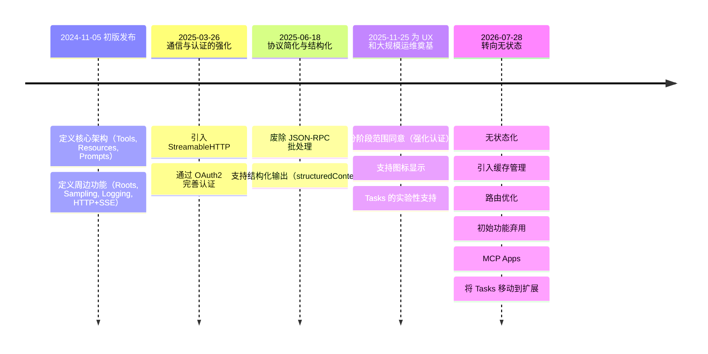
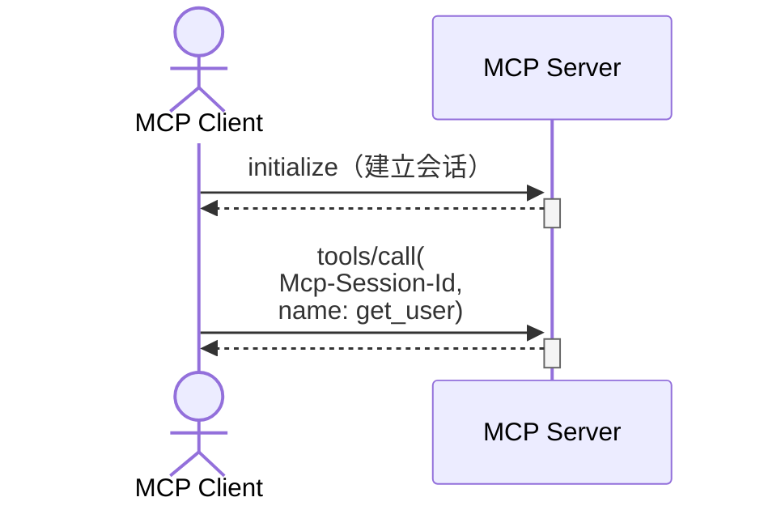
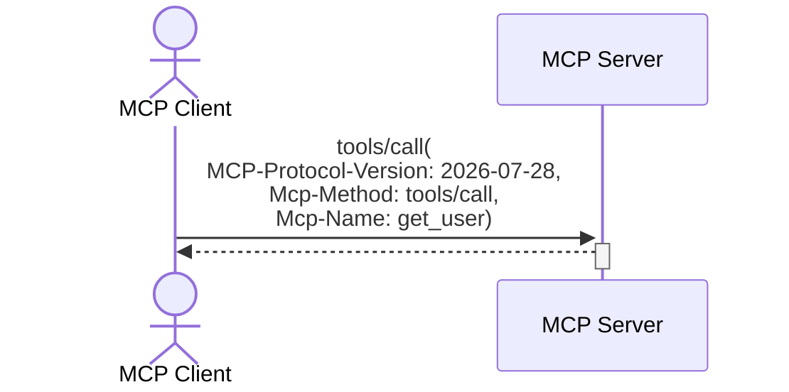
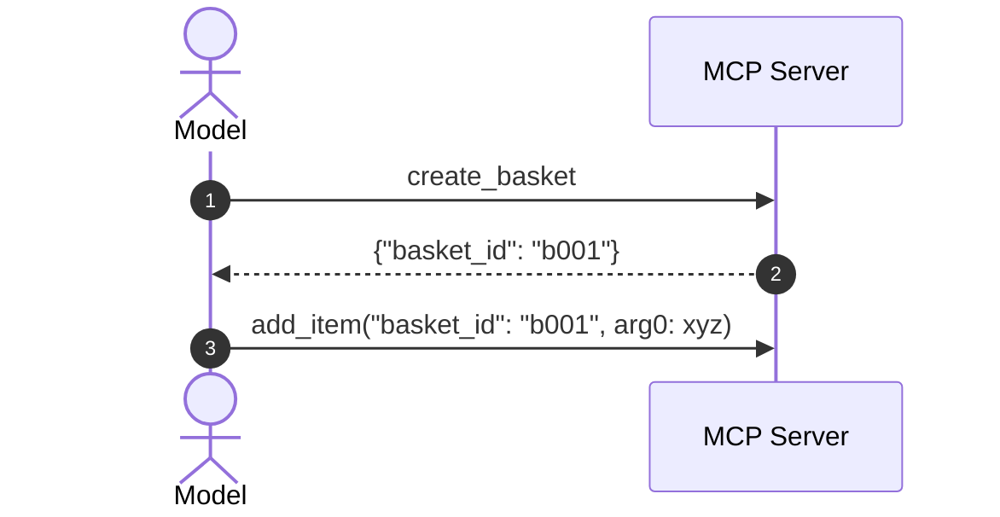
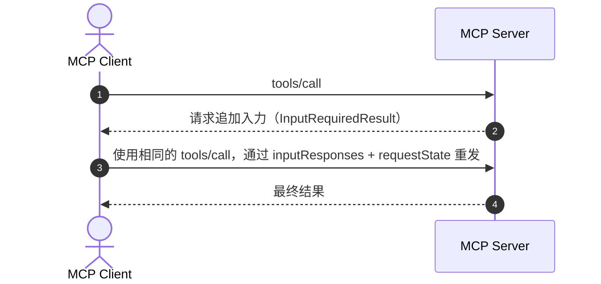

## 前言

Model Context Protocol (MCP) 自 2024年11月首个版本发布以来，一直迅速发展，成为连接 AI 模型与外部数据和功能的标准协议。  
此次 2026-07-28 Release Candidate（以下简称 RC），不仅仅是功能新增，更是大幅改变协议实际运用前提的修订。

尤其值得关注的是协议层的无状态化。通过去除会话管理，将负载均衡、重试、可观测性和缓存运维向接近 HTTP 标准的方式靠拢，旨在向企业环境下也易于使用的架构转变。

本文将从规格差异和实现视角，按照 RC 要点、规格演变、具体变更点的顺序进行说明。

官方博客: [The 2026-07-28 MCP Specification Release Candidate](https://blog.modelcontextprotocol.io/posts/2026-07-28-release-candidate/)

## RC 要点

此次 RC 的重心是“在实际运用前提下重新设计”多于“功能新增”。  
尤其是通过废除协议层会话并转向无状态，使得负载均衡、重试、可观测性和缓存运维更接近 HTTP 标准的惯例。  
此外，同时引入了 Extensions（MCP Apps/Tasks）、强化了授权、引入了废弃生命周期，并完善了规格演进流程。

* 最大的 Breaking Change 是废除协议层会话，转向 **无状态优先**。  
* Streamable HTTP 转向 **自包含请求 + 必要头部**。  
* 服务器发起的输入请求从 SSE 持续模式转向 **InputRequiredResult + 重发** 的多轮往返。  
* 建议将 Dynamic Client Registration 迁移到 Client ID Metadata Documents。  
* MCP Apps 和 Tasks 正式纳入为 Extension。  
* 输入输出模式遵循 JSON Schema（2020-12）。

## MCP 规格演变


* 2026-05-21：RC 确定  
* 2026-07-28：最终规格公开预定  
* 废弃确定后至少 12 个月内：禁止删除废弃功能  

## 规格更改详情

此次计划中的规格更改如下。  
🚨 表示破坏性变更（Breaking Change）。

1. 协议无状态化：废除 `initialize`/会话依赖，转向自包含请求  
   * 🚨 请求模型变更：每个请求都需发送必需头部和 `_meta`  
   * 🚨 响应模型变更：`resultType` 变为必需  
   * 🚨 废除握手和会话：废除 `initialize`、`initialized`、`Mcp-Session-Id`  
   * 无状态协议中的有状态应用：通过 Explicit Handle 方式传递状态  
   * 🚨 重构服务器向客户端的请求：转向使用 `input_required`、`requestState` 的重发模型  
   * 🚨 路由（通过必需 HTTP 头部进行流量控制）：支持无解析请求体的路由，并严格校验  
   * 引入缓存机制：通过 `ttlMs`、`cacheScope` 明确新鲜度和可共享性  
   * 可观测性（标准化 W3C Trace Context 传播）：通过 `traceparent` 等标准化分布式追踪关联  
   * 🚨 重组变更通知：以 `subscriptions/listen` 为中心重组，整理旧订阅 API  

2. MCP Apps：将服务端渲染 UI 作为官方 Extension 处理  

3. 🚨 Tasks API 迁移至扩展：将其从核心实验功能重新设计为扩展  

4. 强化授权：强化针对 OAuth2.0/OIDC 运用的要件  

5. 🚨 功能弃用：Roots、Sampling、Logging 标记为弃用  

6. 输入输出模式遵循 JSON Schema（2020-12）：扩展表达力并明确验证要求  

7. 治理变更：将 Lifecycle、Extensions Track 与 Conformance 联动规则书面化  

### 1. 协议无状态化

此前在 Streamable HTTP 通信中，首先需要通过 `initialize` 请求建立会话，随后在后续请求中附带 `Mcp-Session-Id` 头部。  
在 2026-07-28 中，**整个该连接建立流程将从协议层移除。**

#### 请求模型的变更

请求模型将有以下变更：  
* 每个请求都应在 `_meta` 中包含协议版本和功能声明（`capabilities`）。  
* 头部和 `_meta` 中指定的协议版本必须一致。不一致时将以 `HeaderMismatchError`（`-32020`）拒绝。  
* 如果请求的版本本身服务器不支持，则返回 `UnsupportedProtocolVersionError`（`-32022`）。

**2025-11-25 规格**
```json: 首次
{
"jsonrpc":"2.0","id":1,"method":"initialize",
"params":{
    "protocolVersion":"2025-11-25",
    "capabilities":{},
    "clientInfo":{"name":"sample-client","version":"1.0.0"}
}
}
```
```json: 第二次及以后
Mcp-Session-Id: 1a2b3c4d-5e6f-7g8h
{
"jsonrpc": "2.0","id": 2,"method": "tools/call",
"params": {
    "name": "get_user",
    "arguments":{"user_id":"u123"}
}
}
```

**2026-07-28 规格**
```json
MCP-Protocol-Version: 2026-07-28
Mcp-Method: tools/call
Mcp-Name: get_user

{
"jsonrpc": "2.0","id": 1,"method": "tools/call",
"params": {
    "name": "get_user",
    "arguments": { "user_id": "u123" },
    "_meta": {
    "io.modelcontextprotocol/protocolVersion":"2026-07-28",
    "io.modelcontextprotocol/clientInfo":{"name":"sample-client","version":"1.0.0"},
    "io.modelcontextprotocol/clientCapabilities":{}
    }
}
}
```

#### 响应模型的变更

响应模型将有以下更改：  
* `resultType` 变为必需（可能取值：`complete`, `input_required`）

```json
{
"resultType": "input_required",
"inputRequests": {
    "confirm": {
    "type": "elicitation",
    "message": "确定要删除 3 个文件吗？",
    "schema": { "type": "boolean" }
    }
},
"requestState": "1a2b3c4d5e6f7g8h9i0j..."
}
```

#### 废除握手和会话

用于启动和维护通信的会话管理将被改变。  
这样便无需粘性路由和会话管理，从而更易进行水平扩展。

| 项目 | 2025-11-25 | 2026-07-28 |
|---|---|---|
| `initialize`, `initialized` 握手 | 必需 | 废除([SEP-2575](https://github.com/modelcontextprotocol/modelcontextprotocol/pull/2575)) |
| `Mcp-Session-Id` 头部 | 在第二次及以后请求中必需 | 废除（[SEP-2567](https://github.com/modelcontextprotocol/modelcontextprotocol/pull/2567)） |
| 协议版本、客户端信息 | 初始化时交换一次 | 每次请求包含于 `_meta` |
| 获取服务器能力 | 在初始化响应中接收 | 通过新设的 `server/discover` 方法每次获取 |

**2025-11-25 规格**


**2026-07-28 规格**


#### 无状态协议中的有状态应用

即使协议为无状态，应用仍可持有状态。  

随着无状态化，状态管理的责任将从传输层转移到应用层（与模型的交互）。  
取代对会话的依赖，服务器应当以工具返回值的形式发放显式句柄，并在下次工具调用时传入。  
这样一来，状态将被整合到模型的推理上下文中，实现更灵活的推理控制。


* 第2步响应：需要将如 `basket_id` 或 `context_token` 之类的显式句柄（Explicit Handle）作为工具的返回值发放。

#### 重构服务器向客户端的请求

服务器在处理过程中向客户端发起追加入力请求时，不再维持连接，而是返回 `InputRequiredResult`，并由客户端在后续请求中重发。


* 服务器发起的输入请求仅限于“正在处理的活动客户端请求”期间。禁止“突发提示”，所有征询都必须与用户发起的操作关联。  
* 第2步响应
    ```json
    {
    "resultType": "input_required",
    "inputRequests": {
        "confirm": {
        "type": "elicitation",
        "message": "确定要删除 3 个文件吗？",
        "schema": { "type": "boolean" }
        }
    },
    "requestState": "1a2b3c4d5e6f7g8h9i0j..."
    }
    ```
    * `InputRequiredResult` 需要包含 `requestState`。

**相关 SEP**
* 多轮往返: [SEP-2322 Multi Round-Trip Requests](https://github.com/modelcontextprotocol/modelcontextprotocol/pull/2322)  
* 服务器发起的输入请求限制: [SEP-2260 Server-initiated requests constraints](https://github.com/modelcontextprotocol/modelcontextprotocol/pull/2260)

#### 路由（通过必需 HTTP 头部进行流量控制）

在 Streamable HTTP 中，下列 3 个头部将成为必需。  
由此，负载均衡器、网关及速率限制器可无需解析请求体（DPI）即可路由。  
若头部与请求体内容不一致，服务器将拒绝请求。

| 头部 | 概述 | 用途 |
|---|---|---|
| `MCP-Protocol-Version` | 协议版本（例如：2026-07-28） | 验证版本一致性 |
| `Mcp-Method` | JSON 方法名（例如：`tools/call`） | 按方法进行路由与速率限制 |
| `Mcp-Name` | 工具名或资源名（例如：`search`） | 按工具及资源进行路由 |

**相关 SEP**
* 路由头部: [SEP-2243](https://github.com/modelcontextprotocol/modelcontextprotocol/pull/2243)

#### 引入缓存机制

将对列表响应（如 tools/list 等）引入缓存机制。  
这样，MCP 客户端可知悉响应的有效期（ttlMs）及作用域（cacheScope）。  
此前若要获知列表变更，唯一手段是维持 SSE 流进行检测，但现在可作为替代手段。  
* ttlMs：以毫秒为单位的有效期  
* cacheScope：public（可共享）或 private（仅限单个用户）

**相关 SEP**
* 缓存机制: [SEP-2549](https://github.com/modelcontextprotocol/modelcontextprotocol/pull/2549)

#### 可观测性（标准化 W3C Trace Context 的传播）

为支持分布式追踪，已在 `_meta` 字段中标准化 W3C Trace Context（`traceparent`、`tracestate`、`baggage`）的传播。  
这样，在兼容 OpenTelemetry 的后端，可将从主机到服务器以及后端的整个调用过程可视化为统一的 span 树。

**相关 SEP**
* 可观测性: [SEP-414](https://github.com/modelcontextprotocol/modelcontextprotocol/pull/414)

#### 变更通知的重组

变更通知也已根据无状态化进行重组。  
从以往“依附于连接或会话的通知”，转变为与显式请求关联的通知。

**主要变更点**
* 将变更通知统一为在 `subscriptions/listen` 的响应流中接收。  
* 整理旧有的订阅 API（`resources/subscribe`, `resources/unsubscribe`）。  
* 旧有基于 GET 的 SSE 接收及重启机制（`Last-Event-ID`）不再适用。  
* `notifications/progress` 和 `notifications/message` 不再通过 `subscriptions/listen`，而是流向“该请求自身的响应流”。  
* 客户端实现需要将“变更通知流”和“单独请求的进度通知”分离处理。  
* 连接断开恢复时，前提是不通过恢复历史流，而是重新发送所需请求。

### 2. MCP Apps

服务器提供 HTML UI 模板，客户端在沙箱化的 iframe 中渲染。  
可实现数据可视化及复杂表单输入。  
UI 中的所有操作都通过 JSON-RPC 协议传递，因此可作为审计日志与同意流程的一部分进行统一管理。

**特点**
* 不仅是简单的文本响应，还可嵌入由 MCP 服务器主导的 UI 体验  
* 需要在工具定义时声明 UI 模板  
* 安全审查范围扩大至“工具实现 + UI 模板”

**相关 SEP**
* MCP Apps: [SEP-1865](https://github.com/modelcontextprotocol/modelcontextprotocol/pull/1865)

### 3. 将 Tasks API 迁移至扩展

在 2025-11-25 作为核心功能实验性引入的 Tasks 将**重新设计为扩展**。  
若已实现 2025-11-25 版的 Tasks API，则需进行迁移。

| 项目 | 2025-11-25 | 2026-07-28 |
|---|---|---|
| 定位 | 核心功能（实验性） | 扩展（正式） |
| 任务创建 | 客户端主导 | 服务器主导（作为对 `tools/call` 的响应返回） |
| 获取任务 | `tasks/result`（阻塞） | `tasks/get`（轮询） |
| 任务输入 | 通过重发 `tools/call` 实现 | 使用 `tasks/update` 发送输入响应 |
| 取消任务 | `tasks/cancel` | `tasks/cancel` |
| `tasks/list` | 存在 | 废除（因为在无会话情况下无法设置安全范围） |

**相关 SEP**
* Tasks API: [SEP-2663](https://github.com/modelcontextprotocol/modelcontextprotocol/pull/2663)

### 4. 强化授权

授权规范将以符合 OAuth2.0+OIDC (OpenID Connect) 实际运用的形式进行强化。  
特别是对 [iss](https://github.com/modelcontextprotocol/modelcontextprotocol/pull/2468) 的验证（参见 [RFC9207](https://www.rfc-editor.org/info/rfc9207/)），这是防范 MCP 多服务器连接配置中易发生的 mix-up 风险的重要对策。

* 验证授权响应（Authorization Response）中的 `iss`  
  * MCP 客户端必须验证授权响应中包含的 `iss` 参数。  
  * 这样可以低成本地防范在 MCP 中客户端与多个服务器连接时易发生的“混淆攻击”（即授权码被恶意服务器窃取的攻击）。  
* 在动态客户端注册（Dynamic Client Registration）时声明 `application_type`  
  * 在进行动态客户端注册时，客户端必须声明适当的 `application_type`。  
  * 这样可避免授权服务器误将桌面或 CLI 误判为 Web 应用，从而因安全原因拒绝 localhost 重定向 URI 等实现上的冲突。  
* 强化客户端凭证（Credentials）与授权服务器（issuer）的绑定  
  * 客户端凭证必须严格绑定到其颁发的授权服务器，禁止在其他授权服务器间复用。当资源服务器的授权服务器变更时，必须重新注册。  
* 明确刷新令牌的请求方式  
* 定义权限逐步升级中的 scope 累积行为  
  * 通过累积权限进行分阶段授权的操作（如：先授予 read 权限，再添加 write 权限，以累积形式构成权限）  
* 定义 `.well-known` discovery 后缀  

**相关 SEP**
* 验证授权响应的 `iss`: [SEP-2468](https://github.com/modelcontextprotocol/modelcontextprotocol/pull/2468)  
* 声明动态客户端注册的 `application_type`: [SEP-837](https://github.com/modelcontextprotocol/modelcontextprotocol/pull/837)  
* 客户端凭证与 issuer 的绑定: [SEP-2352](https://github.com/modelcontextprotocol/modelcontextprotocol/pull/2352)  
* 刷新令牌请求: [SEP-2207](https://github.com/modelcontextprotocol/modelcontextprotocol/pull/2207)  
* 权限升级中的 scope 累积: [SEP-2350](https://github.com/modelcontextprotocol/modelcontextprotocol/pull/2350)  
* `.well-known` discovery 后缀: [SEP-2351](https://github.com/modelcontextprotocol/modelcontextprotocol/pull/2351)

### 5. 功能弃用

有 3 项功能将被弃用（Deprecated）。  
从弃用到删除有 12 个月的宽限期，因此需要在此期间完成迁移。

| 弃用功能 | 原因 | 建议的迁移目标 |
|---|---|---|
| Roots | 与有状态设计不符 | 工具输入参数（inputSchema）、资源 URI |
| Sampling | 明确责任边界 | 客户端控制，直接对接提供商 API |
| Logging | 推荐使用行业标准的可观测性工具 | stdio：stderr，结构化日志：OpenTelemetry（W3C Trace Context） |

**相关 SEP**
* 功能弃用: [SEP-2577](https://github.com/modelcontextprotocol/modelcontextprotocol/pull/2577)

### 6. 输入输出模式遵循 JSON Schema（2020-12）

工具的输入输出模式（`inputSchema`, `outputSchema`）已支持 JSON Schema（2020-12）。  
由此，借助 `oneOf`、`anyOf`、`allOf` 及 `$ref` 可进行高级模式定义，从而提升工具的类型安全性。

输出模式不仅限于对象，还可使用任意 JSON 值。

此外，资源未找到的错误码将从 MCP 自定义（-32002）变更为 JSON-RPC 标准（-32602：无效参数）。

**相关 SEP**
* JSON Schema 2020-12: [SEP-2106](https://github.com/modelcontextprotocol/modelcontextprotocol/pull/2106)  
* 资源未找到错误码更改: [SEP-2164](https://github.com/modelcontextprotocol/modelcontextprotocol/pull/2164)

### 7. 治理变更

此外，还同时引入了防止此类大规模破坏性变更常态化的机制。

* 功能生命周期（Feature Lifecycle）（Active/Deprecated/Removed）  
  * 为所有功能定义 Active、Deprecated 及 Removed 状态，并强制要求从 Deprecated 到 Removed 至少保留 12 个月的宽限期。  
  * 如此可使未来修订中的破坏性变更变得可预测。  
* Extensions Track 的正式化  
  * 新功能首先作为扩展进行提案和验证，仅成熟后才纳入核心规范。  
  * 官方扩展在独立仓库（`ext-*`）中管理，可与核心规范独立演进。  
* 强化 SEP 与 Conformance Suite 的联动  
  * 标准化追踪中的 SEP 在其对应场景未纳入 Conformance Suite 前，无法达到 Final 状态。  
  * 通过抑制规范制定与实现验证的脱节，提高 SDK 实现的互操作性。  

**相关 SEP**
* Feature Lifecycle: [SEP-2596](https://github.com/modelcontextprotocol/modelcontextprotocol/pull/2596)  
* Extensions Track: [SEP-2133](https://github.com/modelcontextprotocol/modelcontextprotocol/pull/2133)  
* Conformance Suite 联动: [SEP-2484](https://github.com/modelcontextprotocol/modelcontextprotocol/pull/2484)  
* SDK 分层系统: [SEP-1777](https://github.com/modelcontextprotocol/modelcontextprotocol/pull/1777)

## 实现者行动项

为实现者简单整理了需确认的项目。

* 协议无状态化：传输层迁移  
   * 清理依赖 `initialize`、`initialized` 的前提代码  
   * 找出依赖 `Mcp-Session-Id` 的代码  
   * 在请求头中设置 `Mcp-Method`、`Mcp-Name`、`MCP-Protocol-Version`  
   * 在每次请求的 `_meta` 中设置必需键（`protocolVersion`、`clientInfo`、`clientCapabilities`）  
   * 处理 HTTP 头部与 `_meta` 校验不匹配（`-32020`）及不支持版本（`-32022`）  
   * 实现对 `server/discover` 的调用，预先检查支持的版本和 capabilities  
   * 在响应中设置 `resultType`  
   * 将变更通知接收设计迁移至以 `subscriptions/listen` 为前提  
* 强化授权：审视授权运维  
   * 确认对 Authorization 响应中 `iss` 验证的支持  
   * 梳理 Dynamic Client Registration 的迁移策略  
   * 检查 Trace Context 的传播情况并重新审视日志收集设计  
* 整理扩展功能与已弃用功能  
   * 判断是否引入 MCP Apps  
   * 抽取 Tasks API 旧 API 的使用场景  
   * 制定 Roots、Sampling、Logging 的迁移计划  
   * 错误码变更：从 `-32002` 到 `-32602`  
* 更新 SDK  
   * 将各语言的 Tier 1 SDK 更新到最新版本，并迁移至无状态实现  

## 总结

此次修订不仅是简单的规范更新，而是将 MCP 重新设计为“可在无状态 HTTP 基础上运行的协议”。  
无状态化带来的可扩展性，以及 W3C Trace Context 等带来的运维治理强化，有望降低企业部署时的技术门槛。
