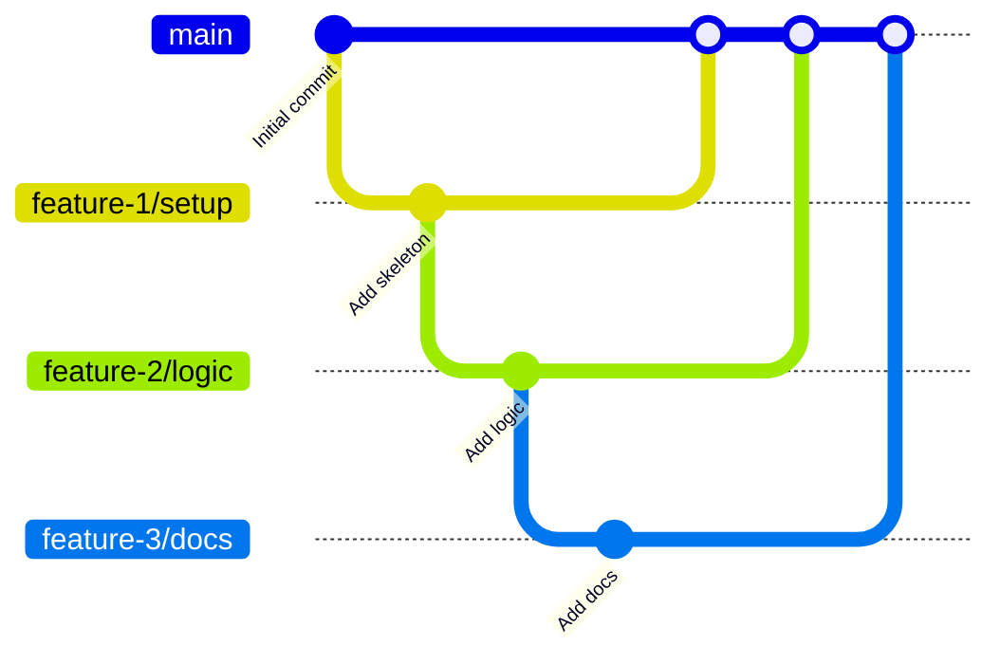

## 引言
上个月，GitHub 的 Stacked PRs (堆叠的 pull requests) 已进入公共预览阶段。

@[og](https://github.blog/changelog/2026-07-30-stacked-pull-requests-are-now-in-public-preview/)

过去也可以在一个 PR 分支上再创建分支，从而实现 PR 堆叠。通过堆叠小的 PR，单个 PR 会更小、更易评审，但维护堆叠需要付出较高的成本。  
接下来我们看看使用 Stacked PRs 能在多大程度上提高效率。

## 概念
在创建 PR 时，经常会遇到想在未合并的修复 A 分支基础上进行修复 B 的场景，于是便从 A 分支拉出 B 分支继续开发。

- 第一个 PR 的基础分支（base）指向 main  
- 第二个及以后 PR 的基础分支（base）指向前一个 PR 的分支  



通过堆叠小的 PR，每个 PR 的规模更小，评审也更轻松，这是它的优点。然而，当把 PR 堆叠起来之后，需要频繁地在 PR 描述中写明基础分支，或者将中间堆叠分支的变更 rebase 到上层分支中，维护成本就变高了。  
Stacked PRs 可以大幅减少与“以某个分支为起点的一系列 PR 堆叠”相关的繁琐操作。

## 验证环境与文档
本文在以下版本中进行试验。

- GitHub CLI (gh): 2.98.0  
- gh-stack 插件: 0.1.0  

请先安装 GitHub CLI 并完成 `gh auth login`。然后运行以下命令安装 Stacked PRs 的插件。

```shell
gh extension install github/gh-stack
```

官方文档的概述和快速入门如下页面。

@[og](https://docs.github.com/en/pull-requests/get-started/about-stacked-prs)  
@[og](https://docs.github.com/en/pull-requests/get-started/stacked-prs-quickstart)  

Stacked PRs 的命令参考可见以下页面。

@[og](https://docs.github.com/en/pull-requests/reference/stacked-prs-cli-commands)

## 示例仓库结构
下面创建一个简单的仓库进行验证。

在 main 分支上只放一个 README.md，此时可以直接 push 到远程。

```shell
.
└── README.md
```

feature/01-setup 分支，添加了源码和文档。

```shell
.
├── README.md
├── docs
│   └── notes.md
└── src
    └── hello.py
```

feature/02-add-logic 分支，添加了文档和源码。

```shell
├── README.md
├── docs
│   ├── notes.md
│   └── stacked-pr.md
└── src
    ├── calculator.py
    └── hello.py
```

feature/03-add-docs 分支，添加了文档。

```shell
.
├── README.md
├── docs
│   ├── notes.md
│   ├── stacked-pr.md
│   └── usage.md
└── src
    ├── calculator.py
    └── hello.py
```

## 初始化堆叠

以下命令将 3 个分支初始化为一个堆叠：

```shell
$ gh stack init --base main feature/01-setup feature/02-add-logic feature/03-add-docs
```
堆叠已创建。
```
? Enable git rerere to remember conflict resolutions? (Y/n) 
✓ Adopted 3 branches: main ← feature/01-setup ← feature/02-add-logic ← feature/03-add-docs
  You're on feature/03-add-docs (top of stack).

What's next:
  • see the full stack:                          gh stack view
  • move between branches:                       gh stack switch
  • link these PRs into a Stack on GitHub:       gh stack submit
```

本地的分支关系现在被识别为以 main 为起点的三层堆叠。

查看堆叠。

```shell
gh stack view
```
可以看到构成堆叠的各分支及其变更一览。
```
▶ feature/03-add-docs (current)  +61 -12
│  ▾ 2 files changed
│    README.md  +58 -12
│    docs/usage.md  +3 -0
│  ▸ 2 commits
│
├ feature/02-add-logic  +6 -0
│  ▸ 2 files changed
│  ▸ 1 commit
│
├ feature/01-setup  +4 -0
│  ▸ 2 files changed
│  ▸ 1 commit
│
└ main
```

:::info
在此示例中，我们使用 init 一次性添加了 3 个分支，但若要单独添加某个分支，可以使用 `gh stack add`。不过，这个命令同时完成了分支创建和堆叠添加。目前好像还没有对已有分支进行堆叠添加的功能。

```shell
gh stack add <branch>
```
:::

:::info
由于当时还没有在 GitHub 上创建仓库，因此在创建后使用以下命令设置了 origin。关键在于首次要先 push 用作堆叠基础的 `main` 分支。如果是从已有仓库 clone，则无需此操作。

```shell
git remote add origin https://github.com/kondoumh/stacked-pr-demo.git
```
:::

使用 `gh stack submit` 将本地堆叠信息提交到远程。TUI 界面会打开，可分别编辑各 PR 的标题和描述，并选择以 Ready for Review 还是 Draft 状态创建。


选择堆叠的最上层后，屏幕右下角会出现 `SUBMIT 3 PRs` 按钮。


该按钮可用鼠标点击，点击后开始将变更推送到远程仓库。

```shell
gh stack submit
Checking stack state...
Pushing to origin...
✓ Created PR #5 for feature/01-setup
✓ Created PR #6 for feature/02-add-logic
✓ Created PR #7 for feature/03-add-docs
✓ Stack created on GitHub with 3 PRs (stack #8)
✓ Pushed and synced 3 branches
```

在 Web UI 中可以看到，3 个分支及对应的 PR 都已创建。


:::info
PR 从 #5 开始是因为堆叠曾一度不一致后重做了。可以用 unstack 清理堆叠，操作如下：
```shell
# 本地
gh stack unstack --local
# 远程
gh stack unstack
```
:::

以下是堆叠中第二个 PR 的页面。其合并 UI 与普通 PR 不同，展示了堆叠结构。


## 分支的 rebase
在堆叠 PR 进行开发时，常见的场景是在中间某个分支做了变更后，需要将上层分支 rebase，以使其包含最新变更。我们来试试在堆叠内的分支上做开发并执行 rebase。

在 feature/02-add-logic 分支的 calculator.py 中添加了逻辑。（在已有的 add 函数上新增 multiply）

```diff
@@ -1,2 +1,5 @@
 def add(a: int, b: int) -> int:
     return a + b
+
+def multiply(a: int, b: int) -> int:
+    return a * b
```

```shell
git status
On branch feature/02-add-logic
Changes to be committed:
  (use "git restore --staged <file>..." to unstage)
        modified:   src/calculator.py
```

提交改动。

```shell
git commit -m 'add logic to calculator.py'
```

上层的 feature/03-add-docs 分支尚未包含这次更改。传统做法是切换到 feature/03-add-docs，然后用 git rebase 手动 rebase。使用 Stacked PRs，只需执行：

```shell
gh stack rebase --upstack
```

feature/02-add-logic 的内容会通过一系列 rebase 流向上层分支。

```shell
✓ Fetched latest main from origin
✓ Trunk main is already up to date
Stack detected: (main) <- feature/01-setup <- feature/02-add-logic <- feature/03-add-docs
Rebasing branches in order, starting from feature/02-add-logic to feature/03-add-docs
✓ Rebased feature/02-add-logic onto feature/01-setup
✓ Rebased feature/03-add-docs onto feature/02-add-logic
All upstack branches from feature/02-add-logic rebased locally with main (c137e85)
To push up your changes, run `gh stack push`
```

切换到 feature/03-add-docs 并查看 git log，可以看到这次对 calculator.py 的提交已被 rebase 到分支顶端。

```shell
commit 8279783de1fb932c4754b59cb01ad69cf7f7c3da (HEAD -> feature/03-add-docs)
Author: Copilot <copilot@example.com>
Date:   Sun Aug 23 12:51:14 2026 +0900

    Add workflow

commit 3b0f02f3523811819e0eaffda2c28f6443f8ff28
Author: Copilot <copilot@example.com>
Date:   Wed Aug 5 23:00:29 2026 +0900

    Document stacked PR workflow

commit 177241ca3fdd9c99462dc90b40f1072600e8fd3f (feature/02-add-logic)
Author: Copilot <copilot@example.com>
Date:   Sun Aug 23 15:45:01 2026 +0900

    add logic to calculator.py # 添加计算逻辑的提交
```

:::info:
如果不加 --upstack 选项，命令会对从 main 开始的所有分支执行必要的 rebase。

```shell
gh stack rebase
```

如果在 rebase 过程中出现冲突，操作会暂停。修改对应文件并 git add 后，运行 `gh stack rebase --continue` 即可继续。执行 `gh stack rebase --abort` 可将整个堆叠恢复到初始状态。
:::

要将包括 rebase 在内的更改推送到远程，执行 `gh stack push`。

```shell
$ gh stack push
Pushing 3 branches to origin...
✓ Pushed 3 branches
Run `gh stack view` to see your stack of PRs
```

PR 中也已正确反映这些更改。


## 合并 Stacked PRs
Stacked PRs 可以在任意层级进行合并。我们在第二个堆叠 PR 的页面点击合并按钮试试。


它会按堆叠顺序依次合并。


这是最上层堆叠 PR 的页面。它的基础分支自动切换为 main。


:::info
切换到 main 似乎有些延迟。合并后按钮仍然可在已合并分支上点击。虽然没试过，但万一误点合并，应该也可通过 revert，然后手动将基础分支改为 main 来恢复。  
为避免此类事故，建议在合并后启用“自动删除源分支（Automatically delete head branches）”功能。
:::

## 与合并队列的结合
虽然本文未实测，但若与合并队列（merge queue）结合，可进一步减轻合并工作本身的负担。在栈式 PR（main ← PR1 ← PR2 ← PR3）中，最可怕的意外是顺序颠倒或依赖关系被破坏。

- 无合并队列： 需要人工确认 PR1 是否已通过审核并合并，再等 PR2 的 CI 通过后再点合并按钮…… 人为地监督顺序。  
- 有合并队列： 将通过审核的 PR 投入队列，系统会自动按依赖顺序依次验证并合并。  

由此可将“中途某个 PR 导致 main 出现问题”的风险降为零。  
作为开发体验，就是“审核通过 = 立即放手”，评审者 approve 后，就可“先把它丢入队列，然后我去做下一个任务”了。

:::info
虽然是很早之前的文章，但也有介绍合并队列的博文：

@[og](/blogs/2023/02/15/github-pr-merge-queue/)
:::

## 结语
随着 AI 助力编写代码，PR 创建速度大幅提升，单个 PR 涵盖的文件也更多。在各地的项目中，我想都可能出现“PR 堆积，审核滞后”的现象。

PR 体量增大的原因，也有开发者心理层面的因素。当正在处理一个任务时，往往也会把与该任务无关的修改一起带进来。虽然可以堆叠，但由于堆叠相关操作繁琐，通常会干脆一并完成。

若在支持 Stacked PRs 的环境下，只要觉得“这个改动已经超出了原 PR 的范围”，就可以用 `gh stack add` 将一个新分支堆叠进来。

借助系统代管堆叠管理，就能自然而然地保持“做小改动，小范围评审”这一最佳实践。

下面总结一下手动堆叠 PR 与官方 Stacked PRs 的区别。

| 比较项 | 传统的手动堆叠 (main ← PR1 ← PR2) | 官方 Stacked PR 支持 |
|:---|:---|:---|
| 堆叠的可视化 | 需要在说明栏手动写“依赖 #100”等 | 在 PR 页面上以 UI 形式显示堆叠的整体和前后关系 |
| 父 PR 合并时的行为 | 父分支合并后，需要手动将子分支的基础分支指向 main | 父 PR 合并后，子 PR 的基础分支会自动更新 |
| 父 PR 修改时的跟进 | 当在父 PR 上因评审意见而添加提交或执行 rebase 时，子 PR 的 rebase --onto 操作非常痛苦 | 堆叠内的变更传播和差异管理在 GitHub 的引导下得到良好支持 |
| 评审者的负担 | 容易搞不清“本 PR 的差异从哪里到哪里” | 可以在保留堆叠上下文的同时，只关注各 PR 的纯粹差异进行评审 |

GA 发布后，期待这一功能在更多项目中得到推广。
