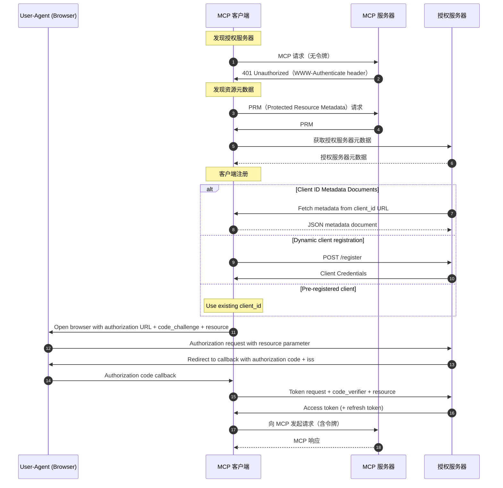

## 前言

本页面是“将 AI 代理与系统连接的 MCP 入门”的续篇。  
这次，我们将介绍认证/授权。

在 MCP 规范中，授权功能为可选，但在 MCP 的实际运营中可以说是必备功能。  
本文将涵盖以下内容。  
* Streamable HTTP 中 MCP 的认证与授权流程  
* PRM 与授权服务器的发现  
* 使用 Keycloak 和令牌内省验证 MCP 服务器端  

本文中展示的代码已在[此处](https://github.com/ubata-mamezou/developer-site-article-examples/tree/main/mcp-auth)公开。

:::info: 系列目录
**连载：将 AI 代理与系统连接的 MCP 入门**
* [介绍](/blogs/2026/04/24/mcp-impl_introduction/)
* [stdio 实现篇](/blogs/2026/05/08/mcp-impl_stdio/)
* [Streamable HTTP 无状态实现篇](/blogs/2026/05/22/mcp-impl_http_stateless/)
* [Streamable HTTP 有状态实现篇](/blogs/2026/06/05/mcp-impl_http_stateful/)
* [提示词篇](/blogs/2026/06/19/mcp-impl_prompt/)
* [资源篇](/blogs/2026/07/03/mcp-impl_resource/)
* **认证/授权篇（本页）**
:::

## 本次使用的库等

* npm@12.0.2
* node@26.6.0
* @modelcontextprotocol/express@2.0.0
* @modelcontextprotocol/node@2.0.0
* @modelcontextprotocol/server@2.0.0
* typescript@7.0.2
* zod@4.4.3
* Keycloak 26.3.4
* Docker compose

:::check: 关于本次使用的库
由于 @modelcontextprotocol v2 已发布，本文从此使用 v2。  
同时使用最新的 Node 和 TypeScript。  

**关于 MCP 模块**  
在 v1 中使用了 `@modelcontextprotocol/sdk`。  
由于 v2 对模块进行了拆分，因此使用 `@modelcontextprotocol/server, express, node`。  
:::

## MCP 规范：认证/授权

### 按传输方式的认证方法

根据传输（通信方式），认证的实现指南会有所不同。

**Streamable HTTP**

授权为可选（OPTIONAL），但如要实现必须遵循 MCP 的授权规范。

**stdio（标准输入输出）**

不在 MCP 规范定义的认证规范范围内。  
认证信息（如 API 密钥）将在子进程启动时从运行环境中直接获取并使用。  

**其他**

遵循该协议中既定的最佳实践。

### 遵循标准

为了确保安全性和互操作性的同时实现简化，采用了以下标准规范的子集。

* OAuth 2.1 (IETF 草案)
* OAuth 2.0 Bearer Token 用法 (RFC 6750)
* OAuth 2.0 授权服务器元数据 (RFC 8414)
* OAuth 2.0 动态客户端注册协议 (RFC 7591)
* OAuth 2.0 资源指示符 (RFC 8707)
* OAuth 2.0 受保护资源元数据 (RFC 9728)
* OAuth 客户端 ID 元数据文档 (CIMD)

### 角色

定义了以下角色。

* MCP 服务器（OAuth 2.1 资源服务器）：接收访问令牌并响应对受保护资源的请求。
* MCP 客户端（OAuth 2.1 客户端）：代表资源所有者向受保护资源发起请求。
* 授权服务器：与用户交互并颁发访问令牌。可以与 MCP 服务器相同，也可独立部署。

### 认证流程

以下是 MCP 官方文档中“Authorization Flow Steps”的部分中文翻译。  

:::check
在 MCP 规范中，客户端需要获取 PRM 和授权服务器元数据，并使用 PKCE 的授权码流程（Authorization Code Flow）获取令牌。

本次验证代码主要针对资源服务器的行为进行验证，省略了客户端浏览器的认证流程。  
1. 使用在 Keycloak 事先获取的访问令牌，MCP 服务器接收 Bearer 令牌。  
2. 使用 Keycloak 的 `Introspection endpoint` 验证令牌的有效性、受众（Audience）和作用域（Scope）。  
:::



### 授权服务器的发现

MCP 客户端通过以下步骤确定授权服务器的位置和功能。

1. 发现资源元数据（RFC 9728）  
   当客户端收到 `401 Unauthorized` 响应时，必须获取 `resource_metadata`（资源元数据）。

   **优先级**  
   1. `WWW-Authenticate` 头中 `resource_metadata` 参数所指示的 URL  
   2. MCP 服务器端点下的 Well-Known URI（例如 `/.well-known/oauth-protected-resource/path/to/mcp`）  
   3. 域名根目录下的 Well-Known URI（例如 `/.well-known/oauth-protected-resource`）  

2. 获取授权服务器元数据（RFC 8414）  
   客户端根据从资源元数据中获得的 Issuer（发行者）URL 的格式来确定授权服务器的端点。  

   **优先级**  
   * 当有路径组件时（例如：/tenant1）  
     1. OAuth 2.0 方式（例如 `/.well-known/oauth-authorization-server/tenant1`）  
     2. OIDC 方式路径插入（例如 `/.well-known/openid-configuration/tenant1`）  
     3. OIDC 方式路径附加（例如 `tenant1/.well-known/openid-configuration`）  
   * 当无路径组件时  
     1. OAuth 2.0 方式（例如 `/.well-known/oauth-authorization-server`）  
     2. OIDC 方式（例如 `/.well-known/openid-configuration`）  

   **严格的验证规则**  
   * 元数据文档中的 issuer 值必须与用于构建 Well-Known URL 的发行者标识符完全一致。  
   * 不一致时，客户端应视该元数据为不可用。  

:::check:
在验证代码中，使用了“有路径组件”下的“OAuth 2.0 方式”。  
:::

### 客户端注册

在开始认证流程之前，客户端需要获取客户端 ID。

**注册机制及优先级**  
1. 预注册（Pre-registration）：当客户端与服务器之间已存在关系时，使用静态认证信息。  
2. Client ID Metadata Documents (CIMD)：当客户端与服务器之间无预先关系时，使用 HTTPS URL 作为客户端 ID。  
3. 动态客户端注册 (Dynamic Client Registration)：为与不支持 CIMD 的服务器保持向后兼容性而保留，但不推荐使用，一般不选择。  
4. 用户输入：在没有其他手段时，让用户输入信息。  

:::check
在验证代码中，使用了在 Keycloak 中预注册的静态认证信息（相当于 Pre-registration）。  
:::

## 验证代码解读

### 验证代码规范

以下使用如下验证代码进行说明。  
依赖于 Keycloak 的处理集中在 keycloak.ts 中。

| 项目 | 内容 | 备注 |
|---|---|---|
| 传输方式 | Streamable HTTP（无状态） |
| 授权服务器 | Keycloak | 在 8081 端口公开 |
| MCP 端点 | `POST /mcp` | 必须使用 Bearer 认证 |
| 令牌验证 | 令牌内省（Keycloak 的 `Introspection endpoint`） |
| 认证错误 | `401 Unauthorized` + `WWW-Authenticate` | 当令牌无效或与预期 Audience 不匹配时抛出 |
| 授权错误 | `403 Forbidden` + `WWW-Authenticate` | 即使令牌有效，但作用域不足时抛出 |
| PRM | `GET /.well-known/oauth-protected-resource/mcp` |

* 本次验证不涉及  
  * 浏览器的授权界面  
  * PKCE 参数生成  
  * 接收授权码的回调  
  * 从授权码交换令牌  
  * CIMD  
  * 动态客户端注册  

### Keycloak 配置

使用 Docker Compose 启动时，使用随附的 Realm 配置进行自动生成。  
这样，Keycloak 启动时就已配置好后续验证所需的所有 Realm。

* realm：`mcp-demo`
* Client Scope：  
  * `mcp:tools`：aud=`http://localhost:3000/mcp`  
  * `mcp:no-scope`：aud=`http://localhost:3000/mcp`  
  * `mcp:diff-audience`：aud=`http://localhost:3000/mcp-diff`  
* Client  
  * 用于内省：`mcp-server`  
  * 用于获取正常令牌：`mcp-demo-client`（授予 `mcp:tools`）  
  * 用于作用域不足验证：`mcp-demo-no-scope-client`（授予 `mcp:no-scope`）  
  * 用于无 Audience 验证：`mcp-demo-no-audience-client`  
  * 用于 Audience 不匹配验证：`mcp-demo-diff-audience-client`（授予 `mcp:diff-audience`）  

:::info
* Audience：令牌面向哪个资源服务器  
* Scope：在资源服务器上可以执行何种操作  
:::

### PRM 的公开

公开 MCP 客户端用来发现授权服务器的 PRM。公开由 `mcpAuthMetadataRouter` 负责。  
当客户端在未认证的情况下访问 MCP 端点时，`WWW-Authenticate` 头中也会包含 PRM 的 URL。客户端可通过该 URL 获取 PRM，从而得知授权服务器的位置。

```ts
app.use(
  mcpAuthMetadataRouter({
    oauthMetadata,
    resourceServerUrl: mcpServerUrl,
    scopesSupported: [REQUIRED_SCOPE],
    resourceName: "MCP Auth Streamable HTTP",
  }),
);
```

**PRM 示例**
```json
{
  "resource": "http://localhost:3000/mcp",
  "authorization_servers": ["http://localhost:8081/realms/mcp-demo"],
  "scopes_supported": ["mcp:tools"],
  "resource_name": "MCP Auth Streamable HTTP"
}
```
* `resource`：受保护的 MCP 服务器标识符  
* `authorization_servers`：授权服务器的 Issuer URL  
* `scopes_supported`：MCP 服务器可用的 Scope 候选项  
* `resource_name`：资源显示名  

### Bearer 认证中间件

在 MCP 端点的前端进行 Bearer 认证。  
`requireBearerAuth` 是在 MCP 端点启动之前执行的中间件。  
如果 `authMiddleware` 检测到错误，会在此处中断处理，后续流程不会执行。  

```ts
const authMiddleware = requireBearerAuth({
  // ※1
  verifier: tokenVerifier,
  // ※2
  requiredScopes: [REQUIRED_SCOPE],
  resourceMetadataUrl: getOAuthProtectedResourceMetadataUrl(mcpServerUrl),
});

//omit

app.post(MCP_PATH, authMiddleware, async (req, res) => {
  const server = createServer(); // 如果在 authMiddleware 中发生错误，此处将不会执行
  // omit
```
* ※1: 令牌验证（详细的验证内容后文说明）  
* ※2: 作用域验证  
  * 验证令牌是否具有指定的作用域。  
  * `requireBearerAuth` 会比较令牌所持有的作用域与 `requiredScopes` 中设置的作用域。  

### 使用 Keycloak 内省进行令牌验证

MCP 服务器接收到的访问令牌通过 Keycloak 的 `Introspection endpoint` 进行验证。  
这里需要注意，仅 HTTP 200 并不能证明令牌有效。

```ts
export function createTokenVerifier(mcpServerUrl: URL): OAuthTokenVerifier {
  return {
    verifyAccessToken: async (token) => {
      // 使用 Keycloak 的内省进行令牌验证 ※1
      const params = new URLSearchParams({token, client_id: OAUTH_CLIENT_ID});
      if (OAUTH_CLIENT_SECRET) params.set("client_secret", OAUTH_CLIENT_SECRET);
      const response = await fetch(KEYCLOAK_INTROSPECTION_ENDPOINT, {
        method: "POST",
        headers: { "Content-Type": "application/x-www-form-urlencoded" },
        body: params.toString(),
      });

      // 如果返回非 200 状态 ※2
      if (!response.ok) {
        const text = await response.text().catch(() => "");
        throw new OAuthError(OAuthErrorCode.InvalidToken, `Invalid or expired token: ${text}`);
      }

      // omit

      // 如果令牌无效或过期 ※3
      if (!data.active) throw new OAuthError(OAuthErrorCode.InvalidToken, "Inactive token");
```
* ※1  
  * token：要验证的令牌  
  * `OAUTH_CLIENT_ID`, `OAUTH_CLIENT_SECRET`：不是 MCP 客户端的信息，而是 MCP 服务器向 Keycloak 发起内省请求时使用的认证信息  
* ※2, 3  
  * 如果返回非 200，则视为无效或过期并返回 `InvalidToken`。  
  * 即使返回了 200，但如果 `active` 为 `false`，也因令牌无效同样返回 `InvalidToken`。  

## Audience 验证

令牌中设置的 `aud` 表示“令牌是发给哪个资源服务器的”。  
即使令牌有效，也要验证 Audience，以避免接收为其他资源颁发的令牌。

```ts
      // 验证 Audience (aud) 声明
      if (OAUTH_STRICT) { // 如果启用了 OAUTH_STRICT，将执行验证
        // ※1
        if (!data.aud) throw new OAuthError(OAuthErrorCode.InvalidToken, "Resource indicator (aud) missing");
        const audiences = Array.isArray(data.aud) ? data.aud : [data.aud];
        const allowed = audiences.some((audience) =>
          checkResourceAllowed({ requestedResource: audience, configuredResource: mcpServerUrl }),
        );
        // ※2
        if (!allowed) throw new OAuthError(OAuthErrorCode.InvalidToken, `Expected audience compatible with ${mcpServerUrl}, got: ${audiences.join(",")}`);
      }
```
* ※1  
  * 如果 aud 不存在，则返回资源指示符缺失的错误  
* ※2  
  * 如果 aud 与允许的值不匹配，则返回期望的 Audience 不一致错误  

## 使用验证代码进行行为验证

1. 基本流程（验证授权流程的步骤）  
   1. 在未设置 Authorization 头时发起请求（MCP Inspector）  
   2. 在未设置 Authorization 头时发起请求（curl）  
   3. PRM (Protected Resource Metadata) 请求  
   4. 使用有效令牌进行正常访问  
2. 异常流程  
   1. 在 Authorization 头中设置格式错误的值发起请求  
   2. 在 Authorization 头中设置无效令牌发起请求  
   3. 使用作用域不足的客户端发起请求  
   4. 使用缺少 Audience 的客户端发起请求  
   5. 使用设置了不同 Audience 的客户端发起请求  

### 1. 在未设置 Authorization 头时发起请求（MCP Inspector）

在未设置 Authorization 头的情况下，从 MCP Inspector 连接到 MCP 服务器。

**界面上的弹窗消息**
```txt
OAuth Authorization Failed
Policy 'Allowed Client Scopes' rejected request to client-registration service. Details: Not Permitted to use specified clientScope
```

**控制台输出的日志**
```sh
Error from MCP server: StreamableHTTPError: Streamable HTTP error: Error POSTing to endpoint: {"error":"invalid_token","error_description":"Missing Authorization header"}
    at StreamableHTTPClientTransport.send (file:///xxx/node_modules/@modelcontextprotocol/sdk/dist/esm/client/streamableHttp.js:364:23)
    at process.processTicksAndRejections (node:internal/process/task_queues:104:5) {
  code: 401
}
```

由于无法确认响应头，使用 curl 重新验证。

### 2. 在未设置 Authorization 头时发起请求（使用 curl 重新验证）

同样在未设置 Authorization 头的情况下，使用 curl 调用 `tools/list`。

```sh
curl -i -X POST http://localhost:3000/mcp \
  -H "Accept: application/json, text/event-stream" \
  -H "Content-Type: application/json" \
  -d '{"jsonrpc":"2.0","id":1,"method":"tools/list","params":{}}'

HTTP/1.1 401 Unauthorized
WWW-Authenticate: Bearer error="invalid_token", error_description="Missing Authorization header", scope="mcp:tools", resource_metadata="http://localhost:3000/.well-known/oauth-protected-resource/mcp"
```

**结果**

* 返回了 HTTP 状态 `401 Unauthorized`。  
* `error` 表示“令牌无效”。  
* `error_description` 表示“找不到 Authorization 头”。  
* `resource_metadata` 包含了 PRM 端点的 URL。  

### 3. 验证 PRM (Protected Resource Metadata)

访问 `resource_metadata` 中的 URL，确认认证所需的元数据。

```sh
curl -s http://localhost:3000/.well-known/oauth-protected-resource/mcp

{
  "resource":"http://localhost:3000/mcp",
  "authorization_servers":["http://localhost:8081/realms/mcp-demo"],
  "scopes_supported":["mcp:tools"],
  "resource_name":"MCP Auth Streamable HTTP"
}
```

**在 MCP Inspector 中**


**结果**

返回了 PRM。  
* resource：用于识别受保护资源的 URL  
* authorization_servers：授权服务器的 Issuer URL  
* scopes_supported：可用的授权 Scope  

### 4. 使用有效令牌进行正常访问

先进行认证并获取有效令牌，然后调用 `tools/list`。

1. 获取令牌  
   从 Keycloak 获取访问令牌。

```sh
curl -s -X POST http://localhost:8081/realms/mcp-demo/protocol/openid-connect/token \
-H "Content-Type: application/x-www-form-urlencoded" \
-d "grant_type=client_credentials" \
-d "client_id=mcp-demo-client" \
-d "client_secret=mcp-demo-client-secret"

{
  "access_token":"<valid_token>",
  "expires_in":300,
  "refresh_expires_in":0,
  "token_type":"Bearer",
  "not-before-policy":0,
  "scope":"mcp:tools"
}
```

2. 访问 MCP 服务器  
   使用从 Keycloak 获取的 `access_token` 访问 MCP。

```sh
curl -s -X POST http://localhost:3000/mcp \
  -H "Accept: application/json, text/event-stream" \
  -H "Authorization: Bearer <valid_token>" \
  -H "Content-Type: application/json" \
  -d '{"jsonrpc":"2.0","id":1,"method":"tools/list","params":{}}'

event: message
data: {"result":{"tools":[{"name":"sum_numbers","title":"sum_numbers","description":"Sum two numbers","inputSchema":{"type":"object","$schema":"https://json-schema.org/draft/2020-12/schema","properties":{"a":{"type":"number","description":"first number"},"b":{"type":"number","description":"second number"}},"required":["a","b"]},"outputSchema":{"$schema":"https://json-schema.org/draft/2020-12/schema","type":"object","properties":{"result":{"type":"number","description":"sum result"}},"required":["result"],"additionalProperties":false}},{"name":"get_server_policy","title":"get_server_policy","description":"Return simple authorization policy for demo","inputSchema":{"type":"object","properties":{}},"outputSchema":{"$schema":"https://json-schema.org/draft/2020-12/schema","type":"object","properties":{"resource":{"type":"string","description":"resource server url"},"requiredScope":{"type":"string","description":"required scope"}},"required":["resource","requiredScope"],"additionalProperties":false}}]},"jsonrpc":"2.0","id":1}
```

**结果**

正常访问成功，可查看 `tools/list` 的结果。

:::info
该响应中包含了在 `2026-07-28 RC` 中支持的 JSON 模式（2020-12）的 `$schema`。  
关于 RC 的变更内容，请参阅[MCP 2026-07-28 RC 解读](/blogs/2026/07/10/mcp-spec-2026-07-28-rc/)。  
:::

**在 MCP Inspector 连接时**  


### 5.1. 在 Authorization 头中设置格式错误的值并发起请求

以下是假设在 Authorization 头中设置了“格式不正确的令牌（不以 `Bearer ` 开头的值）”并发起请求的场景，以验证异常处理。

```sh
curl -i -X POST http://localhost:3000/mcp \
  -H "Accept: application/json, text/event-stream" \
  -H "Content-Type: application/json" \
  -H "Authorization: bad_format_token" \
  -d '{"jsonrpc":"2.0","id":1,"method":"tools/list","params":{}}'

HTTP/1.1 401 Unauthorized
WWW-Authenticate: Bearer error="invalid_token", error_description="Invalid Authorization header format, expected 'Bearer TOKEN'", scope="mcp:tools", resource_metadata="http://localhost:3000/.well-known/oauth-protected-resource/mcp"

{
  "error":"invalid_token",
  "error_description":"Invalid Authorization header format, expected 'Bearer TOKEN'"
}
```

**结果**

* 返回 HTTP 状态 `401 Unauthorized`。  
* `error_description` 表示“格式无效”。  

### 5.2. 在 Authorization 头中设置无效令牌并发起请求

以下是假设在 Authorization 头中设置了格式正确但“不存在的令牌”的值并发起请求的场景，以验证异常处理。

```sh
curl -i -X POST http://localhost:3000/mcp \
  -H "Accept: application/json, text/event-stream" \
  -H "Content-Type: application/json" \
  -H "Authorization: Bearer unknown_token" \
  -d '{"jsonrpc":"2.0","id":1,"method":"tools/list","params":{}}'

HTTP/1.1 401 Unauthorized
WWW-Authenticate: Bearer error="invalid_token", error_description="Inactive token", scope="mcp:tools", resource_metadata="http://localhost:3000/.well-known/oauth-protected-resource/mcp"

{
  "error":"invalid_token",
  "error_description":"Inactive token"
}
```

**结果**

* 返回 HTTP 状态 `401 Unauthorized`。  
* `error_description` 表示“令牌无效”。  

### 5.3. 使用作用域不足的客户端发起请求

以下是假设使用权限不足的令牌（在未设置所需客户端作用域的客户端认证）发起请求的场景，以验证异常处理。  

1. 获取令牌  
```sh
curl -s -X POST http://localhost:8081/realms/mcp-demo/protocol/openid-connect/token \
  -H "Content-Type: application/x-www-form-urlencoded" \
  -d "grant_type=client_credentials" \
  -d "client_id=mcp-demo-no-scope-client" \
  -d "client_secret=mcp-demo-no-scope-client-secret"

{"access_token":"<valid_token>","expires_in":300,"refresh_expires_in":0,"token_type":"Bearer","not-before-policy":0,"scope":"mcp:no-scope"}
```
2. 访问 MCP 服务器  
```sh
curl -i -X POST http://localhost:3000/mcp \
  -H "Accept: application/json, text/event-stream" \
  -H "Authorization: Bearer <valid_token>" \
  -H "Content-Type: application/json" \
  -d '{"jsonrpc":"2.0","id":1,"method":"tools/list","params":{}}'

HTTP/1.1 403 Forbidden
WWW-Authenticate: Bearer error="insufficient_scope", error_description="Insufficient scope", scope="mcp:tools", resource_metadata="http://localhost:3000/.well-known/oauth-protected-resource/mcp"

{"error":"insufficient_scope","error_description":"Insufficient scope"}
```

**结果**

* 返回 HTTP 状态 `403 Forbidden`。  
* `error` 表示“作用域不足”。  
* `error_description` 表示“作用域不足”。  

### 5.4. 使用未设置 Audience 的客户端发起请求

以下是假设使用未设置预期 Audience 的令牌（在未设置所需 Audience 的客户端认证）发起请求的场景，以验证异常处理。  

1. 获取令牌  
```sh
curl -s -X POST http://localhost:8081/realms/mcp-demo/protocol/openid-connect/token \
  -H "Content-Type: application/x-www-form-urlencoded" \
  -d "grant_type=client_credentials" \
  -d "client_id=mcp-demo-no-audience-client" \
  -d "client_secret=mcp-demo-no-audience-client-secret"
{"access_token":"<valid_token>","expires_in":300,"refresh_expires_in":0,"token_type":"Bearer","not-before-policy":0,"scope":""}
```
2. 访问 MCP 服务器  
```sh
curl -i -X POST http://localhost:3000/mcp \
  -H "Accept: application/json, text/event-stream" \
  -H "Authorization: Bearer <valid_token>" \
  -H "Content-Type: application/json" \
  -d '{"jsonrpc":"2.0","id":1,"method":"tools/list","params":{}}'

HTTP/1.1 401 Unauthorized
WWW-Authenticate: Bearer error="invalid_token", error_description="Resource indicator (aud) missing", scope="mcp:tools", resource_metadata="http://localhost:3000/.well-known/oauth-protected-resource/mcp"

{"error":"invalid_token","error_description":"Resource indicator (aud) missing"}
```

**结果**

* 返回 HTTP 状态 `401 Unauthorized`。  
* `error_description` 表示“找不到资源指示符”。  

### 5.5. 使用设置了不同 Audience 的客户端发起请求

以下是假设使用面向其他资源的令牌（在客户端中设置了与预期 Audience 不同的值）发起请求的场景，以验证异常处理。  

1. 获取令牌  
```sh
curl -s -X POST http://localhost:8081/realms/mcp-demo/protocol/openid-connect/token \
  -H "Content-Type: application/x-www-form-urlencoded" \
  -d "grant_type=client_credentials" \
  -d "client_id=mcp-demo-diff-audience-client" \
  -d "client_secret=mcp-demo-diff-audience-client-secret"
{"access_token":"<valid_token>","expires_in":300,"refresh_expires_in":0,"token_type":"Bearer","not-before-policy":0,"scope":"mcp:diff-audience"}
```
2. 访问 MCP 服务器  
```sh
curl -i -X POST http://localhost:3000/mcp \
  -H "Accept: application/json, text/event-stream" \
  -H "Authorization: Bearer <valid_token>" \
  -H "Content-Type: application/json" \
  -d '{"jsonrpc":"2.0","id":1,"method":"tools/list","params":{}}'

HTTP/1.1 401 Unauthorized
WWW-Authenticate: Bearer error="invalid_token", error_description="Expected audience compatible with http://localhost:3000/mcp, got: http://localhost:3000/mcp-diff", scope="mcp:tools", resource_metadata="http://localhost:3000/.well-known/oauth-protected-resource/mcp"

{"error":"invalid_token","error_description":"Expected audience compatible with http://localhost:3000/mcp, got: http://localhost:3000/mcp-diff"}
```

**结果**

* 返回 HTTP 状态 `401 Unauthorized`。  
* `error_description` 表示“与预期的 Audience 不符”。  

## 总结

在 Streamable HTTP 中，可以利用基于 MCP 规范的认证与授权机制。  

MCP 客户端通过 `401` 响应中的 `WWW-Authenticate` 头或 PRM 发现授权服务器并获取访问令牌。  
MCP 服务器验证接收到的 Bearer 令牌，并决定允许或拒绝对受保护资源的访问。  

本次验证代码使用了 Keycloak 和令牌内省，验证了 MCP 服务器端的认证与授权处理流程。  
确认了对未设置 Authorization 头、格式不正确、无效令牌、Audience 不符合的情况返回 401，对作用域不足的情况返回 403。  

在实际发布 MCP 服务器时，应为各用户和客户端定义所需的 Scope，并根据受保护资源验证相应的 Audience。
