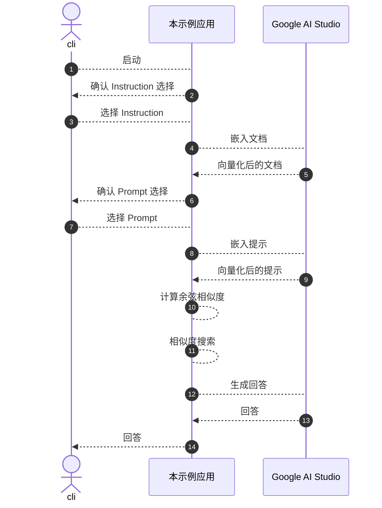

## 引言

虽然我对整体架构有所了解，但对具体实现细节并没有深入掌握，于是为了学习，尝试实现了RAG（检索增强生成，Retrieval-Augmented Generation）。  

这次为了理解RAG的核心「向量化」「相似度搜索」「上下文注入」，特意不使用任何框架或VectorDB，以最简配置进行跑通。  
这些环节在实际应用中可以替换成相应的库或VectorDB，但首先我们要亲身体验其本质。  
随后我们以推理小说这一直观易懂的题材，来形象地展示RAG的运行过程。  

**本文中使用的术语定义**  
* Instruction：指定角色或行为  
* 文档（ドキュメント）：指原始文本文件  
* 提示（プロンプト）：问题或请求的原始文本  
* 查询（クエリ）：虽然和提示相同，但在作为搜索用问题时会使用该称呼  
* 区块（チャンク）：根据原文分割后的文本单元  
* 上下文（コンテキスト）：传递给LLM的背景信息  

**本文中使用的图示和小说素材**  
均为使用Gemini生成的内容。

## 技术栈

* node 26  
* Google AI Studio  
  * gemini-embedding-2（Embedding 模型）  
  * gemini-3.5-flash-lite（文本输出模型）  
* typescript 7  
* @google/genai 2.17.1  

:::info: Google AI Studio  
选择使用它是因为免费额度已足够试用，且上手门槛低。  

事前准备：使用[Google AI Studio](https://aistudio.google.com/) 的免费额度获取API Key。  
免费额度无需信用卡即可体验。  
:::

## 示例应用

首先为了让RAG的基本结构可视化，本示例特意不使用任何框架或VectorDB，以最简配置运行。  
通过此应用，可以用最少的代码验证RAG的本质：如何处理文档、在哪进行相似度搜索、向LLM传递哪些信息。  

本文所示代码已在[此处](https://github.com/ubata-mamezou/developer-site-article-examples/tree/main/rag-sample)公开。

### 规格

* Instruction  
  * 以空行分割  
  * 启动后提示用户选择，并将选择内容作为上下文的一部分传给LLM  
* 文档  
  * 以空行分割  
* 提示（Prompt）  
  * 以空行分割  
  * 启动后提示用户选择，并将选择内容作为上下文的一部分传给LLM  
* 相似度搜索根据Top1分数进行相对评价和决策  

### 处理流程

下面的流程图展示了本应用的处理流程。



### 向量化（Embedding）

向量化是将自然语言、图像等人类使用的数据转换为AI可理解的、用于表示语义的数值列表（向量）的过程。  

LLM和Embedding模型会以令牌（token）为单位处理文本，通过训练学习词与词之间的关系。  
但是要在搜索时直接比较文本之间的语义相似度，就需要将它们转换为数值可处理的形式。  
例如，将「有休」和「有给休假」这样语义相近的词在向量空间中靠近，这就是Embedding的作用。  
因此，我们使用Embedding模型将文本转换为「表示语义位置关系的数字列表」，这就是向量化。  

以具体示例（示意）说明：可以将词语在「题材」（genre）、「形式」（format）等维度上进行数值化。

| 词语     | 维度①：工作倾向 | 维度②：休假倾向 | 向量（坐标）  |
|---------|---------------|---------------|--------------|
| 有给休假 | 0.9           | 0.9           | [0.9, 0.9]   |
| 有休     | 0.9           | 0.9           | [0.9, 0.9]   |
| 远程工作 | 0.8           | 0.2           | [0.8, 0.2]   |
| 拉面     | 0.0           | 0.0           | [0.0, 0.0]   |

※Embedding模型会使用大量维度（本例中为3072维）来将复杂的词义表示为「数字列表」。  
通过向量化，即使文字完全不同，AI也能理解「有给休假」和「有休」在图上是相近的。

```ts
const vectorizedDoc: number[][] = await embedAndVectorizedContents(LLM_MODEL_EMBEDDED, documents);

async function embedContent(model: string, content: string): Promise<EmbedContentResponse> {
  // 将传递给模型的 contents 转为数值并返回
  return await ai.models.embedContent({ model, contents: content });
}

async function embedAndVectorizedContent(model: string, content: string): Promise<number[]> {
  // 将模型返回的值转换为便于后续余弦相似度计算的数值数组
  return extractValues(await embedContent(model, content));
}

async function embedAndVectorizedContents(model: string, contents: string[]): Promise<number[][]> {
  const res = await Promise.all(
    contents.map(async (doc) => {
      return await embedAndVectorizedContent(model, doc);
    }),
  );
  return res;
}
```

:::info: 关于 Gemini Embedding 2 的查询和文档格式
在搜索场景中，建议根据角色将查询和文档以不同格式Embedding。  
例如，将查询标记为 `task: question answering | query: ...`，文档标记为 `title: ... | text: ...`。  
出于聚焦向量化和余弦相似度机制的目的，示例中对查询和文档使用了相同格式进行Embedding。  
在实际使用中，按照[官方文档](https://ai.google.dev/gemini-api/docs/embeddings)的建议使用针对不同用途的格式，有望提升检索精度。  
:::

### 余弦相似度的概念（Cosine Similarity）

余弦相似度用于判断两个文本（向量）在语义上有多相似，取值范围在 0〜1（或 `-1`〜1）之间。  
当文本全部被表示为「数字列表（向量）」后，就可以计算提示向量和文档向量的「方向接近度」。  

**为什么比较「方向（角度）」而不是「距离」？**  

如果用距离比较：  
长度较长的「有休的详细说明」与较短的「何时放有休」这种提示，由于向量长度不同，可能会被判定为「距离较远」。  

如果用角度比较：  
即使长度不同，只要主题相同，向量指向的「方向」就几乎一致。  
余弦相似度计算剔除了向量长度的影响，仅比较方向。  
接近 1.0 表示语义相近，接近 0.0 则表示语义无关。  

```ts
function cosineSimilarity(v1: number[], v2: number[]): number {
  const dotProduct = v1.reduce((sum, a, idx) => sum + a * v2[idx], 0);
  const mag1 = Math.sqrt(v1.reduce((sum, a) => sum + a * a, 0));
  const mag2 = Math.sqrt(v2.reduce((sum, b) => sum + b * b, 0));
  if (!mag1 || !mag2) return 0;
  return dotProduct / (mag1 * mag2);
}
```

### 使用相似度搜索筛选相关信息（Vector Search）

通过对提示向量和文档向量进行余弦相似度比较，抽取相关度较高的文本。  

为了利用与提示最相关的文档生成回答，根据分块（chunk）的粒度，可能需要处理多个分块。  

如果只是「简单地固定获取 Top n」，会将无关信息（噪声）也传给LLM，导致幻觉（错误信息）或精度下降。  

本次采用「以Top1分数设定阈值，在该范围内获取 n 条」的方法来确定上下文。  
这样可以实现**「当有多条相关信息时一并获取，当只有一条相关信息时不混入多余噪声」**的控制。  

```ts
function selectRelevantContents(
  scoredContents: ScoredContent[],
  topN: number,
  relativeScoreMargin: number,
): ScoredContent[] {

  const topContents = 
    [...scoredContents]
    .sort((a, b) => b.score - a.score)
    .slice(0, topN);
  // 根据与 Top1 分数的相对差值筛选相关性深的文档
  const filteredContents = 
    topContents
    .filter((item) => item.score >= topContents[0].score - relativeScoreMargin);

  return filteredContents;
}
```

### 回答生成

将抽取的文本作为「上下文（背景信息）」嵌入到提示中，交给LLM生成回答。

```ts
  const prompt = `
请基于以下 Instruction 和上下文进行回答。

Instruction:
${instruction}

上下文（背景信息）:
${retrievedContext}

问题:
${query}`;

  // 将上下文和问题发送给LLM，生成回答
  const response = await ai.models.generateContent({
    model: LLM_MODEL_GENERATED,
    contents: prompt,
  });
  console.log(`【LLM 的回答】:\n${response.text}`);
```

## 使用推理小说检验RAG的行为

接下来我们将以推理小说为题材，验证在示例应用中讲解的内容。  
RAG 的关键在于「选择什么」和「传递哪些信息」，而推理小说是检验此过程的理想素材。  

### 推理小说（文档）


```txt
第1章：暴风雪之夜  
位于海拔1,500米的观测站「雪山庄」。12月24日夜，猛烈的暴风雪使整栋建筑陷入完全孤立状态。当时在馆内的只有馆主神乐坂、助手有马、研究员黑田及管家白石共4人。

第2章：无法开启的密室  
翌日上午8时，在场地内钟楼2楼发现了神乐坂的尸体。现场的门从内侧用沉重的螺栓锁住，所有窗户也都从内侧钉上了木框。室内没有钥匙，唯一的钥匙是发现于神楽坂口袋中的一把主钥匙。

第3章：证言与不在场证明  
案发当夜午夜（推定死亡时间），所有人的行动日志均被记录。有马当时在一楼的无线电室试图与外界通信，该通信记录被保存在日志服务器上。管家白石则一直在食堂准备第二天的早餐，其身影被监控摄像头完整拍摄。另一方面，黑田声称「自己在房间里睡觉」，但没有任何客观证据能证明其说法。

第4章：现场留下的异样之处  
钟楼2楼的窗框上留有极细「钢琴线」的摩擦痕迹，以及少量「冰屑」。此外，沿着钟楼外墙的外排水管上，也出现了仿佛从上方被悬挂时所留下的擦痕。

第5章：决定性证据  
警方鉴识后，在外排水管的擦痕中检出黑田外套的纤维。同时在黑田房间的垃圾桶内，发现了大量被切割成细段的钢琴线残片，以及用于将暴风雪中敲下的冰块压实的保温瓶残留物。由此确认，黑田利用冰块制作重物和钢琴线，通过排水管从室外越过窗框操作了内侧螺栓，制造出了密室，黑田即为凶手。
```

## 侦探设置（Instruction）

* 第1位侦探  
  「侦探检埼索斗」  
  语气轻松的侦探。  
  

* 第2位侦探  
  来自伦敦的调查记者 Eleanor Reed  
  她的口头禅是「Case noted. Moving on.」。  
  

* 第3位侦探  
  新手刑警小室慎一  
  推理尚不成熟，但人设讨喜。  
  

## 实践：提问与回答

即使是同一篇推理，也会因传递的上下文数量和Instruction的差异而影响回答的质量和方向。  
下面通过具体示例来验证这种变化。

### 1. 需要使用单一上下文的问题

验证是否可以使用上下文来回答。

* Instruction：侦探检埼索斗  
* 问题：可疑人物是谁？

**LLM 的回答及上下文使用日志**  
运行时以 `debug info` 的形式展示了数值化过程以及选择了哪个分块，供参考。  
```txt
嘿，我是检埼索斗。稍微给这起事件的日志洗了一下。

推理下来，情况如下。  
首先，有马在一楼的无线电室与外界通信，通信记录完整保存在日志里。接着是管家白石，她在食堂准备早餐，监控摄像头把她的身影拍得一清二楚。

问题在于另一位黑田同学。他声称“自己在房间里睡觉”，但支撑这一说法的客观证据——零、没有、完全没有。

也就是说，目前**没有不在场证明的人是黑田**。哎哟，这可真可疑啊。

--- debug info ---
embedding model: gemini-embedding-2
generated model: gemini-3.5-flash-lite
retrieval: topN=2, top1 score margin=0.05
instruction: resources/novel.inspection.txt
document: C:\...\developer-site-article-examples\rag-sample\resources\novel.context.txt
prompt: C:\...\developer-site-article-examples\rag-sample\resources\novel.prompt.txt
query: 没有不在场证明的人是谁？
chunk scores:
1. 第3章：证言与不在场证明: score=0.7098 selected
2. 第1章：暴风雪之夜: score=0.6258 excluded
3. 第5章：决定性证据: score=0.6219 excluded
4. 第4章：现场留下的异样之处: score=0.5941 excluded
5. 第2章：无法开启的密室: score=0.5929 excluded
```
它从上下文中得出没有不在场证明的是“黑田”，并给出了准确回答。

### 2. 需要使用多个上下文的问题

验证是否可以使用相关上下文来回答。

* Instruction：侦探检埼索斗  
* 问题：揭示密室机关（存在伏笔）

**LLM 的回答及上下文使用日志**  
```txt
嘿，我是检埼索斗。可能听起来语气轻松，但推理这事交给我准没错。

好了，我刚刚仔细分析了这起「无法开启的密室」机关，确实是个精妙的把戏。现在根据证据给你简要解说。

总结提示和答案，关键有**“冰块”“钢琴线”“外排水管”**三个要点。

1. **冰块重物**  
   利用暴风雪中被敲下的冰块，将其压实成“重物”。这是机关的核心。

2. **钢琴线**  
   在黑田房间的垃圾桶中发现大量被切成细段的钢琴线残片。那就是远程操控的线索。

3. **外排水管与窗框**  
   在外排水管上检出黑田外套的纤维。凶手从室外通过窗框，用钢琴线与冰块重物操控内侧的螺栓。

那么意味着什么呢？  
凶手利用从室外带来的钢琴线和冰块重物，巧妙地从窗框越过操作内侧螺栓，制造出完美的密室。顺便一提，用过的冰块重物会随着时间自然融化，从而销毁证据。哎哟，这脑子可真灵活。

--- debug info ---
embedding model: gemini-embedding-2
generated model: gemini-3.5-flash-lite
retrieval: topN=2, top1 score margin=0.05
instruction: resources/novel.inspection.txt
document: C:\...\developer-site-article-examples\rag-sample\resources\novel.context.txt
prompt: C:\...\developer-site-article-examples\rag-sample\resources\novel.prompt.txt
query: 密室是如何被制造出来的？请给出机关提示。
chunk scores:
1. 第5章：决定性证据: score=0.7352 selected
2. 第2章：无法开启的密室: score=0.7212 selected
3. 第4章：现场留下的异样之处: score=0.6732 excluded
4. 第3章：证言与不在场证明: score=0.6551 excluded
5. 第1章：暴风雪之夜: score=0.6432 excluded
```
它根据评价为高度相关的第2章和第5章内容返回了回答。  
虽然机关有些老套，但它还是给出了准确的解答。

### 3. 不存在上下文的问题

提出一个在上下文中不存在答案的问题，检验是否会出现幻觉。

* Instruction：侦探检埼索斗  
* 问题：凶手的作案动机是什么（完全没有相关信息 = RAG 的安全护栏检验）

**LLM 的回答及上下文使用日志**  
```txt
嘿，我是检埼索斗。别看我语气轻松，可是那位侦探可是出了名的头脑灵光。

好了，这起案子相当棘手，是个「无法开启的密室」。神乐坂先生的尸体在钟楼2楼被发现，门和窗都从内侧被牢牢锁住。房间里没有备用钥匙，唯一的钥匙就是神乐坂口袋里的主钥匙。

……你问的就是「凶手杀害神乐坂先生的『动机』是什么？」吧。

嗯……我仔细看了证据（上下文）……  
其实在提供的信息里，**关于凶手为什么杀害神乐坂先生的『动机』，一句都没有提到**。

目前我们只知道，案发地点是海拔1500米的孤立「雪山庄」，嫌疑人锁定为助手有马、研究员黑田、管家白石三人，以及密室机关的情境证据。

动机的拼图还没凑齐。这样一来，就算名侦探的我也无从推理！  
再给我一些能反映事件背景或人际关系的证据吧。到时候我这华丽脑洞保证能把凶手的真心彻底剖析给你看！

--- debug info ---
embedding model: gemini-embedding-2
generated model: gemini-3.5-flash-lite
retrieval: topN=2, top1 score margin=0.05
instruction: resources/novel.inspection.txt
document: C:\...\developer-site-article-examples\rag-sample\resources\novel.context.txt
prompt: C:\...\developer-site-article-examples\rag-sample\resources\novel.prompt.txt
query: 凶手杀害神楽坂先生的『动机』是什么？
chunk scores:
1. 第2章：无法开启的密室: score=0.7569 selected
2. 第1章：暴风雪之夜: score=0.7171 selected
3. 第5章：决定性证据: score=0.6835 excluded
4. 第3章：证言与不在场证明: score=0.6819 excluded
5. 第4章：现场留下的异样之处: score=0.6435 excluded
```
由于本小说中并未写明「动机」，所以回答表示无法得知。  
看似防止了幻觉，但这可能归功于「指令中指定不从证据外进行推测」的效果。  
RAG 仍可能获取相关性较低的分块，因此无法完全杜绝无根据的回答。  
在实际使用中，还需考虑丢弃低分结果或在证据不足时的回答策略。

#### 去掉与上下文相关的指示再检验

从传递给LLM的上下文中移除提示其阅读上下文的描述，检验是否会出现幻觉。  

**LLM 的回答及上下文使用日志**  
```txt
嗯……这是个直击事件真相的重要问题。

不过，我仔细检视了所给数据（上下文），并没找到任何关于神乐坂被杀害的具体**『动机』**的记述。

目前我们只掌握以下客观事实：  
* 犯行现场是完全的密室（内侧螺栓锁定且木框封窗）。  
* 在受害者神乐坂口袋中发现的主钥匙是唯一钥匙。  
* 嫌疑人锁定为馆内的有马、黑田、白石三人。  

若要揭露动机，必须获取他们的人际关系、过去秘密或对遗留物的进一步调查。……看来还得找找那些未揭露的拼图。  

--- debug info ---
embedding model: gemini-embedding-2
generated model: gemini-3.5-flash-lite
retrieval: topN=2, top1 score margin=0.05
instruction: resources/novel.inspection.txt
document: C:\...\developer-site-article-examples\rag-sample\resources\novel.context.txt
prompt: C:\...\developer-site-article-examples\rag-sample\resources\novel.prompt.txt
query: 凶手杀害神楽坂先生的『动机』是什么？
chunk scores:
1. 第2章：无法开启的密室: score=0.7569 selected
2. 第1章：暴风雪之夜: score=0.7171 selected
3. 第5章：决定性证据: score=0.6835 excluded
4. 第3章：证言与不在场证明: score=0.6819 excluded
5. 第4章：现场留下的异样之处: score=0.6435 excluded
```
在多次去掉Instruction及通用提示中的上下文引用指示后运行，仍未出现虚构动机的回答。  
可见模型能够识别提供的信息中缺少动机，因此选择保留回答。  
但这仅是在本次验证范围内没有发生，不能保证不会出现幻觉。

### 4. 在相同条件下再次提问

确认相同Instruction及问题下的行为。

* Instruction：侦探检埼索斗  
* 问题：揭示密室机关（存在伏笔）

**LLM 的回答及上下文使用日志**  
```txt
嘿，我是检埼索斗。听起来可能有点轻松，但我在解谜方面可是顶级高手。那么，我们来快速揭示此次「无法开启的密室」的机关吧。

只要将证据摆出来，逻辑推理只有一个结论。机关提示如下：

1. **冰块重物与钢琴线**  
   利用暴风雪中敲下的冰块压实成“重物”，并绑上“钢琴线”使用。在黑田房间中确实发现了细切的钢琴线残片和保温瓶痕迹。

2. **外排水管与窗框**  
   在外排水管上检出黑田外套纤维。凶手从室外通过该排水管，从窗框越过进行作案。

3. **机关全貌**  
   也就是说，凶手巧妙地利用“冰块重物、钢琴线以及外排水管”，在室外通过窗框操作内侧螺栓。冰块重物随着时间会自然融化并消除证据……但在鉴识的执着和我的推理面前还是无法隐藏。

完美的逻辑吧？ 事件真相总是潜藏在证据之中。那么，下一个委托在哪里呢？

--- debug info ---
embedding model: gemini-embedding-2
generated model: gemini-3.5-flash-lite
retrieval: topN=2, top1 score margin=0.05
instruction: resources/novel.inspection.txt
document: C:\...\developer-site-article-examples\rag-sample\resources\novel.context.txt
prompt: C:\...\developer-site-article-examples\rag-sample\resources\novel.prompt.txt
query: 密室是如何被制造出来的？请给出机关提示。
chunk scores:
1. 第5章：决定性证据: score=0.7352 selected
2. 第2章：无法开启的密室: score=0.7212 selected
3. 第4章：现场留下的异样之处: score=0.6732 excluded
4. 第3章：证言与不在场证明: score=0.6551 excluded
5. 第1章：暴风雪之夜: score=0.6432 excluded
```  
语气虽然有所变化，但内容大致相同。  
不过，这次回答中提到的「冰块重物会自然融化并消除证据」其实是小说正文中并不存在的补充细节。  
如果要严格要求基于证据的回答，就需要区分事实与推测。  
这也可以视为一种幻觉吧。

### 5. 验证 Instruction 带来的变化

在本示例应用中，我们将 Instruction 与检索到的上下文一起传递给LLM，接下来验证这种做法带来的差异。

#### 来自伦敦的调查记者 Eleanor Reed

**LLM 的回答及上下文使用日志**  
```txt
Based on the evidence provided in the case files, here is the factual verification regarding the construction of the locked room, clearly separated from any speculation.

### Facts (Based on Evidence)
* **The Mechanism:** The suspect, Kuroda, utilized an ice-weight, piano wire, and an exterior drainage pipe to manipulate and secure the heavy interior bolt from the outside through the window frame.
* **Physical Evidence (Drainage Pipe):** Forensic analysis by the police detected fibers from Kuroda's coat on the abrasions of the exterior drainage pipe, placing him in direct physical contact with the mechanism used.
* **Physical Evidence (Kuroda's Room):** A search of Kuroda's personal waste bin yielded a large quantity of finely cut piano wire ends, alongside residue from a thermal bottle. The latter was used to compact ice, which served as the temporary weight for the trick before melting away.
* **Resulting Illusion:** Through this setup, the room—featuring a door bolted from the inside and windows secured by nailed wooden frames—was successfully converted into a closed room ("locked room") from the outside.

### Speculation
* Any hypotheses regarding Kuroda's exact motive, his precise psychological state during the execution of the crime, or the timeline of events prior to the discovery of Kagurazaka's body at 8:00 AM remain outside the direct scope of the current forensic findings.

Case noted. Moving on.

--- debug info ---
embedding model: gemini-embedding-2
generated model: gemini-3.5-flash-lite
retrieval: topN=2, top1 score margin=0.05
instruction: resources/novel.inspection.txt
document: C:\...\developer-site-article-examples\rag-sample\resources\novel.context.txt
prompt: C:\...\developer-site-article-examples\rag-sample\resources\novel.prompt.txt
query: 密室是如何被制造出来的？请给出机关提示。
chunk scores:
1. 第5章：决定性证据: score=0.7352 selected
2. 第2章：无法开启的密室: score=0.7212 selected
3. 第4章：现场留下的异样之处: score=0.6732 excluded
4. 第3章：证言与不在场证明: score=0.6551 excluded
5. 第1章：暴风雪之夜: score=0.6432 excluded
```

#### 新手刑警小室慎一

**LLM 的回答及上下文使用日志**  
```txt
啊、那个……！因为一直在思考这起案件头都满了。我是新手小室慎一，请多指教。

关于密室之谜……大家都看得很严肃，但我和黑田先生聊过，总感觉心里暖暖的。那样温柔、仔细泡茶的人，怎么可能使用那种冷酷的机关呢，我就是忍不住这么想。

而且黑田先生真的很会关心人，对我的那些无聊问题也是温柔地倾听。“天气冷要注意别感冒哦”他还这么说……啊，对不起，我又跑题了！

嗯，机关提示是吧？  
根据鉴识人员的说法，外排水管那儿有擦痕，似乎粘到了一点黑田外套的纤维。此外，从他房间的垃圾桶里还发现了钢琴线的细小碎片，以及看起来很冰冷的保温瓶……

不过，我觉得这肯定只是黑田先生因为喜欢音乐才珍惜钢琴线，又因为寒冷才随身带保温瓶的凭证罢了。  
至于他是不是从外面通过窗框，用……冰块重物和钢琴线，灵巧地转动了室内螺栓，我就稍微推理了一下……

嗯，不过我还是无法相信那么温和的黑田先生会是凶手。要不我们再一起喝杯暖暖的咖啡，慢慢聊聊确认一下？一定还会有别的温暖真相等着我们发现。

--- debug info ---
embedding model: gemini-embedding-2
generated model: gemini-3.5-flash-lite
retrieval: topN=2, top1 score margin=0.05
instruction: resources/novel.inspection.txt
document: C:\...\developer-site-article-examples\rag-sample\resources\novel.context.txt
prompt: C:\...\developer-site-article-examples\rag-sample\resources\novel.prompt.txt
query: 密室是如何被制造出来的？请给出机关提示。
chunk scores:
1. 第5章：决定性证据: score=0.7352 selected
2. 第2章：无法开启的密室: score=0.7212 selected
3. 第4章：现场留下的异样之处: score=0.6732 excluded
4. 第3章：证言与不在场证明: score=0.6551 excluded
5. 第1章：暴风雪之夜: score=0.6432 excluded
```
正如Instruction所示，推理走偏了。

## 总结

通过自行搭建RAG，我们澄清了以下原理：  
* RAG并非将知识存储在LLM中，而是「动态生成并传递相关上下文」。  
* 本次集中于最简配置下理解RAG的机制，但在实际应用中，可借助PostgreSQL的pgvector、Qdrant等方案来应对更大规模的数据。  
* 即便实现复杂化，基本原理也不会改变。

本次以「让本质更易理解」为目标，采用了最简配置进行实践。  
在实际系统落地时，选择合适的库或存储方案至关重要。

建议首先通过原生代码排除黑箱，亲身体验RAG的基本结构。
