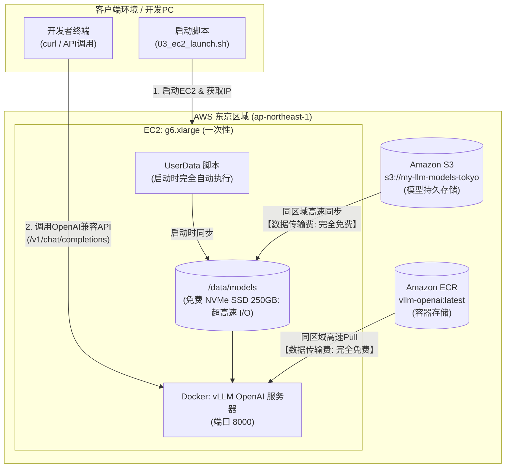

## 引言

在开源LLM飞速发展的当下，我就想着，“想要一个可以毫无顾虑地处理机密信息和公司内部代码的专属本地LLM环境啊”。  
但如果真要在本地（On-Premise）正式部署，就必须配备大容量VRAM的GPU服务器，而**采购费用就要几十万日元的初始投入（初始成本）**。在“想先试试看效果如何”的验证阶段，就要突然提交高额硬件采购审批，门槛就太高了。  
正因如此，我想充分利用云服务最大的优势——**“小规模启动”**：无需初期投资，只需按使用时间付费（数十日元到数百日元级别），随时开始，随时退出。

在思考“如何在云端轻松运行LLM……”时，也曾考虑过在管理控制台手动启动GPU实例并进行设置的方法。  
但作为一名基础设施工程师，在探索实用的开发环境时，有一个念头一直让我无法释怀。

**“想要一个可以毫无顾虑地不断试用日后出现的各种开源模型的环境！”**

如今新模型层出不穷，每次切换或验证模型都要手动重新设置，非常麻烦；同时还想避免在不使用期间持续产生大容量存储（EBS）（月费约1500日元以上）的维护费。  
而且即使想着“用完后手动停止/删除”，也会担心一不小心忘记停止，就会产生意想不到的费用。

因此，这次我搭建了一个临时（一次性）推理平台，作为日后舒适试用各种模型的基础，兼顾了**“启动全自动化（UserData）”**与**“闲置期间固定费用几乎归零（S3模型存储 & EBS即时销毁）”**。

### 本次构建架构的目标

1. **通过 Linux (Ubuntu 22.04 Deep Learning AMI) × UserData 实现完全无人设置**  
2. **模型数据存放在 S3、容器镜像存放在 ECR，启动时在同区域内（数据传输免费）高速同步 & Pull**  
3. **自动启动高吞吐量推理引擎“vLLM”Docker容器**  
4. **验证结束后立即对实例执行“结束（Terminate）”并销毁EBS！闲置时持有成本几乎归零**

有了这个架构，只要更改 S3 路径就能切换模型，随时一条命令即可安全且最低成本无限制试用最新开源LLM。  
下面将从云认证全奖章工程师的视角，详细介绍这一追求成本与自动化的构建步骤！

---

## 整体架构与临时（一次性）设计

本次整体架构如下所示。



### 该架构要点

* **完全临时（一次性）EC2运维**  
  将庞大的模型主体（约15GB）永续存放在 Amazon S3，将 vLLM 容器镜像永续存放在 Amazon ECR。EC2 启动时通过 UserData 从 S3/ECR 快速拉取到本地，验证结束后毫不犹豫地**Terminate（终止）** EC2。由于根卷也会自动销毁，可完全消除昂贵 EBS 的闲置费用。

* **充分利用附带的免费本地 NVMe SSD（实例存储 250GB）**  
  `g6.xlarge` 默认附带**250GB 本地 NVMe SSD（实例存储）**且无需额外费用（免费）。本架构采用**“权重存S3、容器存ECR、EC2一次性使用”**的设计，挥发性不再是缺点。利用 PCIe 直连的超高速 I/O（超过1,000~2,000MB/s），将模型加载到GPU的时间缩短至十几秒级，同时将根EBS容量从100GB大幅瘦身至**40GB**。

* **闲置时维护成本“几乎为零（约145日元/月）” & 下载传输量完全免费**  
  实际成本（按1美元=165日元换算）：  
  * S3 Standard存储费：15GB × $0.025/GB = 约$0.38/月（约62日元/月）  
  * ECR存储费：5GB × $0.10/GB = 约$0.50/月（约83日元/月）  
  * 存储总成本：约$0.88/月（约145日元/月）  
  * 数据传输费（S3/ECR→EC2）：同区域免费（0 日元）  
  * 若保留同为100GB的EBS卷，月费约$9.6（约1,584日元），节省约91%。

* **为何使用 Amazon ECR 而非 Docker Hub**  
  Docker Hub 下载易遭遇网络拥堵及匿名拉取速率限制。同区域 ECR 可通过 AWS 内部骨干网稳定且极速拉取。

* **采用 vLLM**  
  基于 PagedAttention 技术，可高吞吐量且省内存地处理大规模模型。默认开放 OpenAI 兼容API（端口8000），可直接被各种AI工具和脚本调用。

---

## 事前准备和前提条件

在进行本步骤前，假设本地终端已安装以下工具：

1. **AWS CLI**：用于创建 S3 存储桶及启动 EC2，请使用具有 S3/EC2 访问权限的 IAM 用户/角色执行 `aws configure`。  
2. **Hugging Face CLI (`huggingface-cli`)**：用于下载模型，执行：  
   ```bash
   pip install -U "huggingface_hub[cli]"
   ```  
   若需要使用需同意条款的门控模型，或绕过速率限制稳定下载，请先执行 `huggingface-cli login` 配置令牌。  
3. **jq**：用于脚本中 JSON 解析，建议安装（`sudo apt install jq` 或 `brew install jq`）。  
4. **【最重要】AWS Service Quotas（GPU 实例配额提升）**：多数新账号默认 GPU 实例 vCPU 配额为0，须在管理控制台 Service Quotas 中对 `Running On-Demand G and VT instances` 提升配额（至少4 vCPU），否则启动时会报 `VcpuLimitExceeded` 错误。

---

## 环境构建步骤

以下脚本已将所有构建流程脚本化，您可逐步执行。

### 通用设置参数（环境变量列表）

| 环境变量名               | 默认值                                   | 必需/可选       | 说明 / 示例                                                     |
| :----------------------- | :--------------------------------------- | :-------------- | :------------------------------------------------------------- |
| `AWS_REGION`            | `ap-northeast-1`                         | 可选            | 部署目标的 AWS 区域（东京: `ap-northeast-1`, 俄勒冈: `us-west-2`） |
| `S3_BUCKET_NAME`        | `my-llm-models-tokyo`                    | **需修改**      | 存储模型权重的 S3 存储桶名称（全局唯一）                         |
| `HF_MODEL_ID`           | `Qwen/Qwen2.5-Coder-7B-Instruct`         | 可选            | Hugging Face 上的模型标识符                                     |
| `SERVED_MODEL_NAME`     | `Qwen/Qwen2.5-Coder-7B-Instruct`         | 可选            | 在 OpenAI 兼容 API 中公开的模型名称                             |
| `DOCKER_IMAGE`          | `vllm/vllm-openai:latest`                | 可选            | vLLM 镜像（ECR URI 或 Docker Hub 名称）                         |
| `INSTANCE_TYPE`         | `g6.xlarge`                              | 可选            | GPU 实例类型 (`g6.xlarge`: NVIDIA L4 24GB VRAM + 250GB NVMe)    |
| `EBS_SIZE_GB`           | `40`                                     | 可选            | 根 EBS 大小（GB），40GB 足够                                    |
| `IAM_ROLE_NAME`         | `EC2-S3-ECR-ReadOnly-Profile`            | 可选            | EC2 附加的 IAM 配置文件名（脚本可自动生成）                     |
| `SECURITY_GROUP_IDS`    | *(未指定时自动创建)*                     | 可选            | 应用的安全组 ID                                                |
| `KEY_NAME`              | *(未指定)*                               | 可选            | SSH 密钥对名称                                                 |
| `MAX_MODEL_LEN`         | `4096`                                   | 可选            | vLLM 最大上下文令牌长度                                        |
| `GPU_MEMORY_UTILIZATION`| `0.85`                                   | 可选            | vLLM 预留 GPU 内存比例 (0.85~0.90)                             |

:::check
**💡 以最简配置快速启动示例**  
只需将 S3 存储桶名称设为您专属的唯一名称，其他参数保持默认即可立即启动。  
```bash
export AWS_REGION="ap-northeast-1"
export S3_BUCKET_NAME="my-llm-models-$(aws sts get-caller-identity --query Account --output text)-tokyo"
```
:::

---

### 第1步：将模型上传到 S3 & 容器镜像注册到 ECR

首先，在东京区域准备 S3 存储桶和 ECR 仓库，并将模型和镜像注册。本例以 [Qwen/Qwen2.5-Coder-7B-Instruct](https://huggingface.co/Qwen) 为例，您可按需替换。

:::check
**💡 适用于本构成（g6.xlarge / 24GB VRAM）的模型选择指南**  
1. 参数规模建议（24GB 限制）：  
   - 7B~9B 级（bfloat16/fp16）：最佳平衡点（14~18GB 权重 + 4~8GB KV 缓存）。  
   - 14B 级：选用量化版（AWQ/GPTQ/FP8，约8~10GB）。  
   - 32B 级：可用 4bit AWQ（约17GB），但需限长上下文。  
2. 架构：推荐 GQA（Grouped Query Attention）模型。  
3. 类型：务必选择带 `-Instruct`/`-it`/`-Chat` 的指令/对话调优模型。  
4. 门控模型：需先在 Hugging Face 同意许可并设置 `HF_TOKEN`。
:::

执行 `01_sync_assets.sh`：

```bash
#!/bin/bash
set -euo pipefail

AWS_REGION="ap-northeast-1"
AWS_ACCOUNT_ID=$(aws sts get-caller-identity --query Account --output text)
S3_BUCKET_NAME="my-llm-models-tokyo"
MODEL_ID="Qwen/Qwen2.5-Coder-7B-Instruct"
LOCAL_MODEL_DIR="/tmp/models/${MODEL_ID}"
ECR_REPO_NAME="vllm-openai"
ECR_IMAGE="${AWS_ACCOUNT_ID}.dkr.ecr.${AWS_REGION}.amazonaws.com/${ECR_REPO_NAME}:latest"

# 1. 在东京区域创建 S3 存储桶
if ! aws s3api head-bucket --bucket "${S3_BUCKET_NAME}" 2>/dev/null; then
    aws s3api create-bucket \
        --bucket "${S3_BUCKET_NAME}" \
        --region "${AWS_REGION}" \
        --create-bucket-configuration LocationConstraint="${AWS_REGION}"
fi

# 2. 从 Hugging Face 下载模型并同步到 S3
mkdir -p "${LOCAL_MODEL_DIR}"
huggingface-cli download "${MODEL_ID}" --local-dir "${LOCAL_MODEL_DIR}" --local-dir-use-symlinks False
aws s3 sync "${LOCAL_MODEL_DIR}" "s3://${S3_BUCKET_NAME}/models/${MODEL_ID}" \
    --region "${AWS_REGION}" \
    --no-progress

# 3. 创建 Amazon ECR 仓库并注册容器镜像
if ! aws ecr describe-repositories --repository-names "${ECR_REPO_NAME}" --region "${AWS_REGION}" 2>/dev/null; then
    aws ecr create-repository \
        --repository-name "${ECR_REPO_NAME}" \
        --region "${AWS_REGION}" \
        --image-scanning-configuration scanOnPush=true
fi

# 登录到 ECR
aws ecr get-login-password --region "${AWS_REGION}" | \
    docker login --username AWS --password-stdin "${AWS_ACCOUNT_ID}.dkr.ecr.${AWS_REGION}.amazonaws.com"

# 拉取 vLLM 官方镜像并推送到 ECR
docker pull vllm/vllm-openai:latest
docker tag vllm/vllm-openai:latest "${ECR_IMAGE}"
docker push "${ECR_IMAGE}"
```

只需首次执行一次，即可在 AWS 内部极速拉取。

---

### 第2步：UserData 自动设置脚本

以下脚本 `02_ec2_userdata.sh` 会在 EC2 启动时自动执行。

```bash
#!/bin/bash
set -euo pipefail

# ==============================================================================
# 02_ec2_userdata.sh
# 在 EC2 启动时执行的 UserData 脚本
#
# 前提条件：
#   - AMI: Ubuntu 22.04 Deep Learning AMI（已预装 NVIDIA 驱动 & Docker）
#   - 实例类型: g6.xlarge（NVIDIA L4 GPU: 24GB VRAM, 附带 250GB NVMe SSD）
#   - 已附加 IAM 角色: 包含 S3（只读/完全访问）及 ECR（只读）权限
# ==============================================================================

LOG_FILE="/var/log/userdata-vllm.log"
exec > >(tee -a "${LOG_FILE}") 2>&1
echo "=== [$(date '+%Y-%m-%d %H:%M:%S')] UserData 执行开始 ==="

# 配置参数
AWS_REGION="${AWS_REGION:-ap-northeast-1}"
S3_BUCKET_NAME="${S3_BUCKET_NAME:-my-llm-models-tokyo}"
HF_MODEL_ID="${HF_MODEL_ID:-Qwen/Qwen2.5-Coder-7B-Instruct}"
SERVED_MODEL_NAME="${SERVED_MODEL_NAME:-Qwen/Qwen2.5-Coder-7B-Instruct}"
VLLM_PORT="8000"
GPU_MEMORY_UTILIZATION="0.85"
MAX_MODEL_LEN="4096"
DOCKER_IMAGE="${DOCKER_IMAGE:-vllm/vllm-openai:latest}"

echo "获取模型 (HF) : ${HF_MODEL_ID}"
echo "公开模型名   : ${SERVED_MODEL_NAME}"
echo "S3 存储桶    : s3://${S3_BUCKET_NAME}"

# 1. 检测并利用本地 NVMe 实例存储（250GB）
# ※ AWS Deep Learning AMI 会自动将本地 NVMe 挂载到 /opt/dlami/nvme
NVME_DIR="/opt/dlami/nvme"
if mountpoint -q "${NVME_DIR}" || [ -d "${NVME_DIR}" ]; then
    echo "检测到 DLAMI 默认 NVMe 挂载 (${NVME_DIR})。将其用作模型 & Docker 存储区域..."
    mkdir -p "${NVME_DIR}/models" "${NVME_DIR}/docker"
    mkdir -p /data
    ln -sfn "${NVME_DIR}/models" /data/models
else
    # 回退处理：非 DLAMI AMI 或未挂载
    NVME_DEV=$(lsblk -d -n -o NAME,SIZE | grep -E '250G|232G' | head -n1 | awk '{print $1}')
    if [ -n "${NVME_DEV}" ]; then
        echo "检测到本地 NVMe SSD (/dev/${NVME_DEV})。挂载到 /data..."
        mkfs.ext4 -F "/dev/${NVME_DEV}" || true
        mkdir -p /data
        mount -o noatime "/dev/${NVME_DEV}" /data || true
    else
        mkdir -p /data
    fi
    mkdir -p /data/models /data/docker
    NVME_DIR="/data"
fi

LOCAL_MODEL_ROOT="/data/models"
LOCAL_MODEL_DIR="${LOCAL_MODEL_ROOT}/${HF_MODEL_ID}"
mkdir -p "${LOCAL_MODEL_DIR}"
chmod 777 "${LOCAL_MODEL_ROOT}"

# 2. 将 Docker & containerd 数据目录放到 NVMe 上，防止 EBS 耗尽 & 加速层展开
# ※ Docker 24+ & containerd 会在 /var/lib/containerd 展开快照，绑定挂载到 NVMe
echo "停止 Docker/containerd 并设置绑定挂载到 NVMe 区域..."
systemctl stop docker containerd || true
mkdir -p "${NVME_DIR}/docker" "${NVME_DIR}/containerd"
mkdir -p /var/lib/docker /var/lib/containerd
cp -a /var/lib/docker/* "${NVME_DIR}/docker/" 2>/dev/null || true
cp -a /var/lib/containerd/* "${NVME_DIR}/containerd/" 2>/dev/null || true
mount --bind "${NVME_DIR}/docker" /var/lib/docker
mount --bind "${NVME_DIR}/containerd" /var/lib/containerd
if ! grep -q "/var/lib/docker" /etc/fstab; then
    echo "${NVME_DIR}/docker /var/lib/docker none defaults,bind 0 0" >> /etc/fstab
fi
if ! grep -q "/var/lib/containerd" /etc/fstab; then
    echo "${NVME_DIR}/containerd /var/lib/containerd none defaults,bind 0 0" >> /etc/fstab
fi
mkdir -p /etc/docker
cat <<EOF > /etc/docker/daemon.json
{
  "data-root": "/var/lib/docker"
}
EOF
systemctl daemon-reload
systemctl start containerd
systemctl start docker

# 3. 模型数据准备 (S3已有则同步，否则直接从 Hugging Face 获取并备份)
echo "=== [$(date '+%Y-%m-%d %H:%M:%S')] 确认模型数据准备... ==="
S3_SRC="s3://${S3_BUCKET_NAME}/models/${HF_MODEL_ID}"
echo "S3 目标: ${S3_SRC}/ (区域: ${AWS_REGION})"
aws configure set default.s3.max_concurrent_requests 20
echo "正在确认 IAM 认证及 S3 存储桶连接..."
for i in {1..15}; do
    if aws s3 ls "s3://${S3_BUCKET_NAME}" --region "${AWS_REGION}" >/dev/null 2>&1; then
        echo "已确认对 S3 存储桶的连接。"
        break
    fi
    echo "等待 S3 连接 / IAM 认证 ($i/15)..."
    sleep 2
done
HAS_S3_MODEL=false
echo "正在执行 S3 上模型存在检查..."
S3_CHECK=$(aws s3 ls "${S3_SRC}/" --region "${AWS_REGION}" 2>/dev/null || true)
echo "S3 检查结果："
echo "${S3_CHECK}"
if echo "${S3_CHECK}" | grep -E '(\.safetensors|\.bin|\.json)' >/dev/null; then
    HAS_S3_MODEL=true
fi
if [ "${HAS_S3_MODEL}" = "true" ]; then
    echo "=== [$(date '+%Y-%m-%d %H:%M:%S')] 在 S3 上发现模型。正在同步... ==="
    aws s3 sync "${S3_SRC}" "${LOCAL_MODEL_DIR}" --region "${AWS_REGION}" --no-progress
else
    echo "=== [$(date '+%Y-%m-%d %H:%M:%S')] S3 上未发现模型。正在直接下载... ==="
    python3 -m pip install -U "huggingface_hub[cli]" || pip3 install -U "huggingface_hub[cli]" || true
    echo "正在从 Hugging Face ('${HF_MODEL_ID}') 直接下载模型..."
    python3 -c "
import sys
from huggingface_hub import snapshot_download
try:
    snapshot_download(repo_id='${HF_MODEL_ID}', local_dir='${LOCAL_MODEL_DIR}', local_dir_use_symlinks=False)
    print('成功从 Hugging Face 下载模型。')
except Exception as e:
    print(f'下载错误: {e}', file=sys.stderr)
    sys.exit(1)
"
    echo "下载完成。容量："
    du -sh "${LOCAL_MODEL_DIR}"
fi
echo "模型准备完成。本地容量确认："
du -sh "${LOCAL_MODEL_DIR}"

# 4. 启动 vLLM 容器
echo "=== [$(date '+%Y-%m-%d %H:%M:%S')] 启动 vLLM 容器 ==="
CONTAINER_NAME="vllm-server"
if [[ "${DOCKER_IMAGE}" == *".dkr.ecr."* ]]; then
    echo "检测到 ECR 镜像。正在登录认证..."
    ECR_REGISTRY=$(echo "${DOCKER_IMAGE}" | cut -d'/' -f1)
    aws ecr get-login-password --region "${AWS_REGION}" | docker login --username AWS --password-stdin "${ECR_REGISTRY}" || true
fi
if docker ps -a --format '{{.Names}}' | grep -q "^${CONTAINER_NAME}$"; then
    echo "正在停止并删除已有的 ${CONTAINER_NAME}..."
    docker rm -f "${CONTAINER_NAME}"
fi
docker run -d \
    --name "${CONTAINER_NAME}" \
    --restart unless-stopped \
    --gpus all \
    --ipc=host \
    -p "${VLLM_PORT}:8000" \
    -v "${LOCAL_MODEL_ROOT}:/models" \
    "${DOCKER_IMAGE}" \
    --model "/models/${HF_MODEL_ID}" \
    --served-model-name "${SERVED_MODEL_NAME}" \
    --gpu-memory-utilization "${GPU_MEMORY_UTILIZATION}" \
    --max-model-len "${MAX_MODEL_LEN}" \
    --trust-remote-code

# 5. 启动健康检查
echo "开始健康检查 (端口 ${VLLM_PORT})..."
MAX_RETRIES=120 # 最多等待10分钟
RETRY_COUNT=0
while [ ${RETRY_COUNT} -lt ${MAX_RETRIES} ]; do
    if curl -s "http://127.0.0.1:${VLLM_PORT}/health" >/dev/null 2>&1; then
        echo "=== [$(date '+%Y-%m-%d %H:%M:%S')] vLLM 服务器正常启动！ ==="
        break
    fi
    echo "等待启动… (${RETRY_COUNT}/${MAX_RETRIES})"
    sleep 5
    RETRY_COUNT=$((RETRY_COUNT + 1))
done
if [ ${RETRY_COUNT} -eq ${MAX_RETRIES} ]; then
    echo "警告: 健康检查超时，请查看 'docker logs ${CONTAINER_NAME}'。"
else
    if [ "${HAS_S3_MODEL}" = "false" ]; then
        echo "=== [$(date '+%Y-%m-%d %H:%M:%S')] 启动完成，后台开始 S3 备份… ==="
        (
            ionice -c 3 aws s3 sync "${LOCAL_MODEL_DIR}" "${S3_SRC}" --region "${AWS_REGION}" --no-progress || true
            echo "[$(date '+%Y-%m-%d %H:%M:%S')] S3 模型备份完成！"
        ) > /var/log/s3-backup.log 2>&1 &
    fi
fi

# 6. 空闲自动结束守护进程
echo "=== 设置并启动空闲自动结束守护进程 ==="
cat <<'EOF' > /usr/local/bin/auto-idle-shutdown.sh
#!/bin/bash
IDLE_LIMIT_SEC=3600  # 1小时 (3600秒)
IDLE_COUNT=0
CHECK_INTERVAL=300   # 每5分钟检查一次

while true; do
    sleep "${CHECK_INTERVAL}"
    # 从日志中统计最近5分钟内 vLLM 的推理请求数
    REQ_COUNT=$(docker logs --since 5m vllm-server 2>&1 | grep -c "POST /v1" || true)
    if [ "${REQ_COUNT}" -eq 0 ]; then
        IDLE_COUNT=$((IDLE_COUNT + CHECK_INTERVAL))
        echo "[$(date '+%Y-%m-%d %H:%M:%S')] 空闲中: ${IDLE_COUNT}s / ${IDLE_LIMIT_SEC}s"
        if [ "${IDLE_COUNT}" -ge "${IDLE_LIMIT_SEC}" ]; then
            echo "[$(date '+%Y-%m-%d %H:%M:%S')] 空闲1小时，执行自动结束。"
            shutdown -h now
            exit 0
        fi
    else
        IDLE_COUNT=0
    fi
done
EOF
chmod +x /usr/local/bin/auto-idle-shutdown.sh
nohup /usr/local/bin/auto-idle-shutdown.sh >/var/log/auto-idle-shutdown.log 2>&1 &
echo "=== [$(date '+%Y-%m-%d %H:%M:%S')] UserData 全部处理完成 (自动空闲监控已启动) ==="
```

:::check
**💡 基础设施极限调优：为何要使用“免费 NVMe”而非 100GB EBS？**  
AWS GPU 实例规格表标注**“1 x 250 NVMe SSD”**，这是实例附带的本地 SSD，**完全免费**。  
| 比较项目            | EBS (gp3 40~100GB)           | 本地 NVMe SSD (250GB)         |
| :------------------ | :--------------------------- | :---------------------------- |
| **额外费用**         | 按量计费                     | **完全免费（0 日元/实例附带）** |
| **读写带宽**         | 网络传输（约125 MB/s）       | **PCIe 直连 1,000~2,000 MB/s+** |
| **15GB 模型加载时间** | **约15分钟**                 | **<1分钟**                    |
| **数据持久性**       | 可保留                       | 停止/终止后消失（易失性）      |

实测：EBS 上加载需15分钟，NVMe 上加载<1分钟，性能飞跃！通过**“S3/ECR 永续存储，EC2 一次性使用”**的架构，彻底消除易失性缺点，仅享高速 I/O 优势。

更棒的是，AWS 官方 Deep Learning AMI 会自动将 NVMe 挂载到 `/opt/dlami/nvme`，无需分区，连 Docker/containerd 存储都指向此 SSD，即可完全规避 EBS 瓶颈并极速展开容器层。
:::

:::check
**💡 防止睡着忘记停止！“1小时空闲自动自爆”安全装置**  
若测试投入太深睡着了，或忘记销毁命令，一晚8小时按需 GPU 实例费约1,600日元。  
本架构在 UserData 末尾部署**“空闲自动结束守护进程”**：若1小时内无推理请求，自动执行关机并终止实例&销毁EBS，无需额外 CloudWatch/Lambda，零额外成本实现自我防御！
:::

---

### 第3步：一条命令启动脚本 (`03_ec2_launch.sh`)

在控制台手动点击太麻烦，下面脚本可一键启动：

```bash
#!/bin/bash
set -euo pipefail

SCRIPT_DIR="$(cd "$(dirname "${BASH_SOURCE[0]}")" && pwd)"
USER_DATA_FILE="${SCRIPT_DIR}/02_ec2_userdata.sh"
INSTANCE_STATE_FILE="${SCRIPT_DIR}/../.current_instance_id"

AWS_REGION="${AWS_REGION:-ap-northeast-1}"
INSTANCE_TYPE="${INSTANCE_TYPE:-g6.xlarge}" # NVIDIA L4 GPU (24GB VRAM)
IAM_ROLE_NAME="${IAM_ROLE_NAME:-EC2-S3-ECR-ReadOnly-Profile}"
EBS_SIZE_GB="${EBS_SIZE_GB:-40}" # DLAMI 快照限制下最小40GB

# 1. 自动查找最新 Deep Learning AMI
echo "正在自动查找 Ubuntu 22.04 Deep Learning AMI..."
AMI_ID=$(aws ec2 describe-images \
    --region "${AWS_REGION}" \
    --owners amazon \
    --filters "Name=name,Values=Deep Learning OSS Nvidia Driver AMI GPU PyTorch * (Ubuntu 22.04)*" "Name=state,Values=available" \
    --query 'sort_by(Images, &CreationDate)[-1].ImageId' \
    --output text)

# 2. 自动检查/创建安全组 (8000,22)
DEFAULT_VPC=$(aws ec2 describe-vpcs --region "${AWS_REGION}" --filters "Name=isDefault,Values=true" --query "Vpcs[0].VpcId" --output text)
EXISTING_SG=$(aws ec2 describe-security-groups --region "${AWS_REGION}" --filters "Name=vpc-id,Values=${DEFAULT_VPC}" "Name=group-name,Values=vllm-sg" --query "SecurityGroups[0].GroupId" --output text 2>/dev/null || echo "")
if [ -n "${EXISTING_SG}" ] && [ "${EXISTING_SG}" != "None" ]; then
    SG_ID="${EXISTING_SG}"
else
    SG_ID=$(aws ec2 create-security-group --region "${AWS_REGION}" --group-name "vllm-sg" --description "SG for vLLM API" --vpc-id "${DEFAULT_VPC}" --query "GroupId" --output text)
    aws ec2 authorize-security-group-ingress --region "${AWS_REGION}" --group-id "${SG_ID}" --protocol tcp --port 8000 --cidr "0.0.0.0/0"
    aws ec2 authorize-security-group-ingress --region "${AWS_REGION}" --group-id "${SG_ID}" --protocol tcp --port 22 --cidr "0.0.0.0/0"
fi

# 3. 创建 IAM 实例配置文件 (S3 & ECR 读取)
if ! aws iam get-instance-profile --instance-profile-name "${IAM_ROLE_NAME}" >/dev/null 2>&1; then
    aws iam create-role --role-name "${IAM_ROLE_NAME}-Role" \
        --assume-role-policy-document '{"Version":"2012-10-17","Statement":[{"Effect":"Allow","Principal":{"Service":"ec2.amazonaws.com"},"Action":"sts:AssumeRole"}]}'
    aws iam attach-role-policy --role-name "${IAM_ROLE_NAME}-Role" --policy-arn arn:aws:iam::aws:policy/AmazonS3ReadOnlyAccess
    aws iam attach-role-policy --role-name "${IAM_ROLE_NAME}-Role" --policy-arn arn:aws:iam::aws:policy/AmazonEC2ContainerRegistryReadOnly
    aws iam create-instance-profile --instance-profile-name "${IAM_ROLE_NAME}"
    aws iam add-role-to-instance-profile --instance-profile-name "${IAM_ROLE_NAME}" --role-name "${IAM_ROLE_NAME}-Role"
    sleep 5 # 等待 IAM 权限传播
fi

# 4. Base64 编码 UserData 并启动实例
USERDATA_BASE64=$(base64 -w 0 "${USER_DATA_FILE}" 2>/dev/null || base64 "${USER_DATA_FILE}" | tr -d '\r\n')
INSTANCE_ID=$(aws ec2 run-instances \
    --region "${AWS_REGION}" \
    --image-id "${AMI_ID}" \
    --instance-type "${INSTANCE_TYPE}" \
    --iam-instance-profile "Name=${IAM_ROLE_NAME}" \
    --security-group-ids "${SG_ID}" \
    --user-data "${USERDATA_BASE64}" \
    --block-device-mappings "[{\"DeviceName\":\"/dev/sda1\",\"Ebs\":{\"VolumeSize\":${EBS_SIZE_GB},\"VolumeType\":\"gp3\",\"DeleteOnTermination\":true}}]" \
    --instance-initiated-shutdown-behavior terminate \
    --tag-specifications "ResourceType=instance,Tags=[{Key=Name,Value=vllm-server-temp}]" \
    --query 'Instances[0].InstanceId' \
    --output text)
echo "实例启动开始: ${INSTANCE_ID}"
echo "${INSTANCE_ID}" > "${INSTANCE_STATE_FILE}"

# 5. 等待启动完成 & 获取公网 IP
aws ec2 wait instance-running --region "${AWS_REGION}" --instance-ids "${INSTANCE_ID}"
PUBLIC_IP=$(aws ec2 describe-instances --region "${AWS_REGION}" --instance-ids "${INSTANCE_ID}" --query 'Reservations[0].Instances[0].PublicIpAddress' --output text)
echo "实例启动完成: IP = ${PUBLIC_IP}"
echo "等待健康检查 (约7~10分)..."
while ! curl -s "http://${PUBLIC_IP}:8000/health" >/dev/null 2>&1; do
    echo -n "."
    sleep 5
done
echo ""
echo "🎉 vLLM 服务器已准备就绪！ (http://${PUBLIC_IP}:8000)"
```

:::check
**⏱️ 实际启动耗时（约7~10分钟）明细**  
1. EC2 初始化 & NVMe 挂载：约30s~1min  
2. 从 ECR 拉取 vLLM 镜像 & 展开层：约4~6min  
3. 从 S3 高速同步模型（约15GB）：约1~2min  
4. 启动 vLLM & 加载权重到 GPU、构建 CUDA 图：约1~2min  
   （使用 NVMe 后加载<1min，EBS 时需15min）
:::

---

## 功能验证：调用 OpenAI 兼容 API 试试

在终端使用 `curl` 发送请求，建议创建 JSON 文件并使用 `-d @req.json`：

```bash
PUBLIC_IP="<启动的 EC2 公网 IP>"

# 1. 创建请求体 JSON
cat <<'EOF' > req.json
{
  "model": "Qwen/Qwen2.5-Coder-7B-Instruct",
  "messages": [
    {"role": "user", "content": "请用三行说明在 AWS 东京区域临时（一次性）运行 GPU 实例的优势。"}
  ]
}
EOF

# 2. 向 vLLM 的 OpenAI 兼容端点发送请求
curl http://${PUBLIC_IP}:8000/v1/chat/completions \
  -H "Content-Type: application/json" \
  -d @req.json
```

:::info
**Windows 环境小贴士**：直接 `-d '{ ... }'` 内联 JSON 易因转义导致双引号被剥离，出现 `{"detail":"There was an error parsing the body"}` 错误。推荐使用文件方式（`-d @req.json`）保证跨平台稳定。
:::

**执行结果（响应示例）:**
```json
{
  "id": "chatcmpl-a662010ed226ea08",
  "object": "chat.completion",
  "created": 1789410574,
  "model": "Qwen/Qwen2.5-Coder-7B-Instruct",
  "choices": [
    {
      "index": 0,
      "message": {
        "role": "assistant",
        "content": "1. 成本效率：临时 GPU 实例适合短时或一次性作业，可利用无费用时段。\n2. 可扩展性：可根据需求轻松增删实例。\n3. 安全性：使用后实例会被立即删除，降低数据泄露等风险。"
      },
      "finish_reason": "stop"
    }
  ],
  "usage": {
    "prompt_tokens": 58,
    "total_tokens": 163,
    "completion_tokens": 105
  }
}
```

响应迅速地来自自建 GPU 服务器！  
这是标准的 OpenAI 兼容端点，可通过 Python `openai` 库或各种 GUI 客户端直接连接。

:::alert
**⚠️ 关于安全性的关键注意事项：明文通信（HTTP）与加密**  
本架构为测试方便，使用**端口8000 HTTP（明文）**通信。公网明文通信存在被窃听或篡改风险。  
生产或高敏环境请务必加密通信，可选：  
1. SSH 端口转发：建立 `ssh -i <key> -N -L 8000:localhost:8000 ubuntu@<IP>` 隧道。  
2. 反向代理+SSL：Nginx/Caddy + Let’s Encrypt 或 ALB+ACM。  
3. 私有网络：VPN/Tailscale/WireGuard。
:::

---

## 验证结束后立即完全销毁！（睡着也无忧的双重保险）

操作结束后，请**选择“终止（Terminate）”实例**，而非“停止（Stop）”。  
执行 `04_ec2_terminate.sh`：

```bash
#!/bin/bash
set -euo pipefail

SCRIPT_DIR="$(cd "$(dirname "${BASH_SOURCE[0]}")" && pwd)"
INSTANCE_STATE_FILE="${SCRIPT_DIR}/../.current_instance_id"
AWS_REGION="${AWS_REGION:-ap-northeast-1}"

INSTANCE_ID="${1:-}"
if [ -z "${INSTANCE_ID}" ] && [ -f "${INSTANCE_STATE_FILE}" ]; then
    INSTANCE_ID=$(cat "${INSTANCE_STATE_FILE}" | tr -d '[:space:]')
fi

if [ -z "${INSTANCE_ID}" ]; then
    echo "错误：未指定要终止的实例 ID。"
    exit 1
fi

echo "=== 完全终止 EC2 实例 (Terminate) ==="
echo "目标实例 ID: ${INSTANCE_ID}"
echo "※ EBS 卷(DeleteOnTermination=true)也将一并销毁。"

aws ec2 terminate-instances \
    --region "${AWS_REGION}" \
    --instance-ids "${INSTANCE_ID}" \
    --output table

echo "正在等待实例终止完成..."
aws ec2 wait instance-terminated \
    --region "${AWS_REGION}" \
    --instance-ids "${INSTANCE_ID}"

rm -f "${INSTANCE_STATE_FILE}"

echo "=========================================================="
echo " 实例及 EBS 卷已完全销毁！"
echo " 之后，该实例相关的计算/EBS 计费将不再发生。"
echo "=========================================================="
```

执行命令：

```bash
./scripts/04_ec2_terminate.sh
```

由于已启用“Terminate 时删除”选项，实例终止同时 EBS 清空，彻底消除闲置成本！  
若忘记手动执行，UserData 中的“空闲自动结束守护进程”将在1小时无请求后自动关机并终止实例&EBS，双重保险，深夜也可安心入眠。  
若需重启，只需再次执行 `./scripts/03_ec2_launch.sh`，数分钟后相同环境即刻恢复。

---

## 常见问题与对策

### 1. 忘记附加 IAM 角色或策略不足  
UserData 执行 `aws s3 sync` 与 `aws ecr get-login-password`，附加到 EC2 的 IAM 角色**必须**含：  
* S3 读取权限（`s3:GetObject` + `s3:ListBucket` 或 `AmazonS3ReadOnlyAccess`）  
* ECR 拉取权限（`AmazonEC2ContainerRegistryReadOnly`）  
否则 `/var/log/userdata-vllm.log` 会报 `AccessDenied`，导致镜像/模型获取失败。

### 2. 区域不一致导致的数据传输费  
若 S3 与 EC2 区域不一致（如 S3在us-east-1，EC2在ap-northeast-1），跨区域流量费会按GB计费。请确保同一区域（本例为东京ap-northeast-1），同区域传输费 **0 日元**。

### 3. vLLM 启动时的 VRAM 预留设置 (`--gpu-memory-utilization`)  
vLLM 默认预占 GPU VRAM 90%~95%。若上下文长度过大，可能导致 KV 缓存不足 OOM 崩溃。24GB VRAM 实例上，建议从 `--gpu-memory-utilization 0.90`、`--max-model-len 8192` 开始调优。

### 4. GPU 实例启动错误 (`VcpuLimitExceeded`)  
若启动时报 `VcpuLimitExceeded`，表示 GPU vCPU 配额为0。请在控制台 Service Quotas 中对 `Running On-Demand G and VT instances` 申请至少4 vCPU。

---

## 总结

这次，作为日常开发与技术验证中充分利用开源LLM的基础，构建了**“Linux × UserData × vLLM × S3 & ECR” 的完全自动化、临时（一次性）LLM 验证环境**。

* **环境构建完全自动化**：通过 UserData，实现从启动到 vLLM 容器运行的全流程自动化。  
* **闲置时维护费用“几乎为零”**：模型存 S3、容器存 ECR，使 EC2 一次性使用并终止，彻底消除昂贵 EBS 闲置费（仅约145日元/月存储费）。  
* **自动自爆功能**：1小时无请求自动关机并终止实例&EBS，防止计费爆发。  
* **OpenAI 兼容端点**：标准 API 在端口8000提供，可被各种客户端直接连接。

“想尝试云端 GPU，却担心成本与维护……”的你，不妨体验这款“无持有即奢华”的临时架构！
