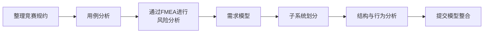

## 引言

在上一篇文章中，我介绍了自己参与ETロボコン四年来的历程，以及在去年基础组中将AI作为“设计评审伙伴”加以利用并获得银牌模型的经历。

@[og](https://developer.mamezou-tech.com/blogs/2026/07/29/et-robocon-001/)

在那篇文章的结尾，我提到本年度为了让模型创建达到更高水平，挑战了**应用类**。本篇文章即是其续篇。

去年，我们主要让AI对人编写的模型进行评审，用于探讨改进方案和检查遗漏。今年不仅在评审环节使用AI，还将AI的应用范围扩展到需求候选项的梳理和图示初稿的生成等**建模流程本身**。

上一篇文章将AI介绍为开发的“新武器”。正因为在评审环节收获了成果，我认为扩大AI的职责范围会大大简化模型创建过程。实际上，从无到有生成方案的速度确实加快了。然而，在将这些方案整理为可提交的模型阶段，却在需求与实现方式的区分、图示之间的整合确认以及修正差异的审核上，耗费了比想象中更多的时间。

本文将回顾ETロボコン2026的模型创建过程，通过实际遇到的三个陷阱来说明**为什么尽管使用AI生成方案更快，却没有让完成过程变得轻松**。如果说上篇文章是AI应用成果的展示，本篇则记录了在扩大AI应用范围后所显现出的另一层难题。

## 1. 本年度的挑战：在应用类中进行模型创建

在2026年度应用类地区赛中，**ET拉力赛**成为模型评审的对象。  
ET拉力赛是在赛道上布置红、蓝、黄三种关门，要求按指定顺序依次通过的比赛项目。

:::info
如果是第一次了解ETロボコン，请参阅[ETロボコン官方网站](https://www.etrobo.jp/)。2026年物理组比赛内容也可在[官方比赛规则解说视频](https://www.youtube.com/watch?v=Sa_zXKC643A)中查看。
:::

我们以以下三张图组成提交模型：

- 摘要页  
- 需求模型  
- 系统分析模型  

建模流程如下所示：

AI主要在以下工作中得到利用：

- 整理竞赛规约  
- 列出需求候选项  
- 生成图示初稿  
- 检查UML/SysML表达及遗漏  
- 推敲说明文字  

从零开始生成首个方案的时间缩短了，但要将方案整理为可提交的模型，则需要超出预期的调整工作量。

## 2. 使用AI建模带来的三个陷阱

当将AI应用范围扩大后，最困扰我们的主要有以下三点：

1. 越多需求候选项，需求与设计越易混淆  
2. 修正越多，距离完成越远  
3. 各自负责的图示难以有效衔接  

这些问题并非AI方案本身的质量问题，而是在人工整理和整合这些方案时浮现的。

### 陷阱1：越多需求候选项，需求与设计越易混淆

最初遇到的困扰是，**候选需求越多，就越难区分哪些应作为需求保留**。

当向AI提供竞赛规约或讨论信息时，AI能在短时间内扩展出各种可能的需求候选项，这在制作初步方案时非常便利。另一方面，输出的候选中往往不仅包含规约中明示的事实，还混杂了设计假设、异常情况对策，甚至具体实现方式。

回头审视中期的需求整理记录，例如在“达到目标坐标”这一需求下，列出了以下几种行驶方式：

- 线路追踪行驶  
- 基于地面QR坐标系的行驶  
- 基于IMU坐标系的行驶  

另在某处，为获取提示卡信息的需求，AI甚至细化到 Base64 解码、AES-128 ECB 解密、输入四位数解密密钥等具体处理。虽然个别内容看似必要，但它们并未明确区分“系统必须满足的需求”与“为实现需求所做的设计选择”，却被放在同一层级。

当时的讨论笔记中，诸如“手段夹杂其中”“算法不应在设计阶段决定”“是否过于详细”等疑问随处可见。我觉得，与其说让AI扩展需求候选本身有问题，不如说后续人工重新分类的工作更为困难。

在最终版本中，我们原则上不将具体实现方式写入需求，而是作为设计要素另行分离。对于FMEA中提取的风险对策，也不是直接写出对策本身，而是先导出所需需求，再将其映射到设计要素。

需要说明的是，我们并未保留AI在制作需求图时所有交互的完整记录，因此无法逐一确定“哪个需求是AI添加的”。这里所述，基于**使用AI过程中遗留的中期资料，真实反映了我们面临的整理挑战**。

基于此经验，我们认为在让AI生成需求候选前，至少应明确以下区分：

- 从竞赛规约或用例可推导的事实  
- 系统必须满足的需求  
- 设计假设与实现方式  
- 基于风险新增的对策需求  
- 尚未决定采纳的想法  

与其简单地“请列出需求”，不如让AI**针对每个候选项标注类别与依据**，以便后续整理。

### 陷阱2：修正越多，距离完成越远

接着遇到的困扰是，**越反复请求修正，反而增加工作量**。

实际操作中，我们会对AI说“对此处有疑虑，请修改”，看过结果后又感觉“不太对”，再继续提出修正请求，如此往复。由于最初指令不够明确，往往连非目标位置的描述也被修改。

这样一来，不仅要确认被修改的部分，还要检查这些改动是否导致新的不一致。每次修正后确认范围不断扩大，团队甚至不清楚是否真的在向完成靠近。

有成员在数日内的交互就消耗了一个月的AI使用额度。虽然生成文字和图示的时间缩短，但之后的差异确认却耗时颇多。

因此，后半程我们重点关注：

- 在一次请求中明确要修改的范围和保留部分  
- 要求AI仅输出差异部分，而非整体  
- 团队统一使用的最新版本文件  
- 在持续修正前，由团队成员先行判断方向  

相比反复让AI修正，**先由人工整理疑点并明确修改目标**更为关键。

### 陷阱3：各自负责的图示难以有效衔接

本次模型由团队多名成员分工绘制图示，利用AI后各自的图都能快速生成。

然而将完成的图示合并后，发现：

- 同一概念使用了不同名称  
- 需求图与系统分析图的职责粒度不一致  
- 关联方向或立体类型（stereotype）未统一  
- 单张图虽无问题，但跨图时难以追踪关系  

AI会根据各自提供的上下文生成“最合理的方案”，因此放大了各成员的理解差异。虽然归根到底是分工协作时缺乏统一规则和整合方法，但我们必须意识到AI会加剧这一差异。

下次我们计划在建模前，先统一模型全局用语和命名规则、在上游阶段确定的需求及子系统ID，以及UML/SysML记法，并在团队成员向AI请求时附上相同的用语和建模方针。同时，也计划在最终整合前，安排中期汇报和审查环节。

## 3. 陷阱背后的人为挑战

回顾上述三大陷阱，绝非全归咎于AI。更确切地说，**AI将人尚未决定的模糊部分合理具体化，反而增加了需要整理的工作量**。

### 未能完全界定目标系统的边界

在从整个竞赛中剥离出ET拉力赛时，并未充分决定此次分析对象应包含哪些范围。

中期资料中，例如对解密密钥，是将“由运行体接收”纳入需求，还是将启动器、PC与无线通信设备的边界划在哪里，都未有明确结论。在尚未明确边界的情况下展开需求，就会把本可能不在分析范围内的处理也细化出来。

此外，我们在同一需求树中同时讨论了正常行驶需求、无法读取QR时的恢复流程、目标未达时的超时处理，以及顺序外通过关门时的重跑等。虽然考虑异常情况是必要的，但当正常流程、风险对策和设计方案同时增加时，就难以看出需求是从哪一视角被分解的。

问题不在于AI，而在于**尚未确定目标范围与分类轴，就过早扩展候选，从而使人尚未决定的部分被AI具体化**。

### 未制定讨论的结束条件

由于在FMEA和需求图粒度调整上投入过多时间，导致系统分析模型和提交模型的说明文字制作时间不足。

使用AI时，“这种情况也可能”“这种对策也需要”之类的案子可轻易增加，让人倾向于“还可以再优化一点”而继续讨论。然而在模型评审中，有限的篇幅和时间内必须决定要传达的内容。

此次反思不仅涉及AI输出精度，也在于**团队未能先设定何为讨论完成的结束条件**。

## 4. AI仍发挥作用的场景

尽管提到了多个陷阱，但并不意味着不用AI更好。实际上，在很多场景中AI都发挥了重要作用。

- 快速生成模型的初步方案  
- 比较多种表达方案  
- 发掘团队忽略的视角  
- 检查UML/SysML表达及矛盾  
- 整理并优化说明文字  

尤其是在从零开始生成首个方案时，AI帮助尤为明显。另一方面，对于要建模的内容、分析范围以及最终采纳方案，仍需由人来决定。AI可以提出方案，但不会替团队判断要实现什么。

## 5. 如果下次重做同样工作

基于这次的反思，下次希望按以下步骤推进：

1. **由团队先决定模型目的和分析范围**  
2. **将AI输出分为“事实・需求・假设・实现方式・提案”**  
3. **对需求候选标注依据和是否采纳**  
4. **团队共享上游阶段确定的用语和ID**  
5. **以差异修正为主，而非全量重生成模型**  
6. **保留中间方案及判断理由，以便后续追溯变更**  
7. **最终的整合一致性和采纳决策由人来判断**  

本次虽然保留了部分中期资料，却未能完整追溯与AI的所有交互及需求新增过程。下次不仅要保留完成模型，还要简单记录“为何添加”“为何删除”，这样不仅便于评估AI输出，也能为多人整合模型提供决策依据。

此外，在向AI请求下次修正前，团队要先判断是否确实需要修改，以及什么状态可视为修正完成。除了在提示词上做文章，还要统一团队谁负责决策、哪份文件视为最新、哪个状态作为审查对象。

## 6. 面向东海地区大会

我们已提交模型，目前正集中力量为10月3日的东海地区大会进行实机走行准备。

接下来将验证模型中讨论的风险对策在实际行驶中是否有效，重点审查利用行驶日志的状态转换、遇到关门识别错误时的恢复机制，以及模型与实现的对应关系。

此次最深切的感受是：即使AI能**加速“开始思考”阶段**，但在**“何为需求、何归设计、何时结束讨论”**的决策上，仍无法自动提速。

AI擅长填补模糊并扩展方案，但建模时必须决定哪些模糊可保留、在哪里划定边界。下次我们将在利用AI扩展方案之余，更加关注**分类、舍弃与终结**等人为决策环节。
