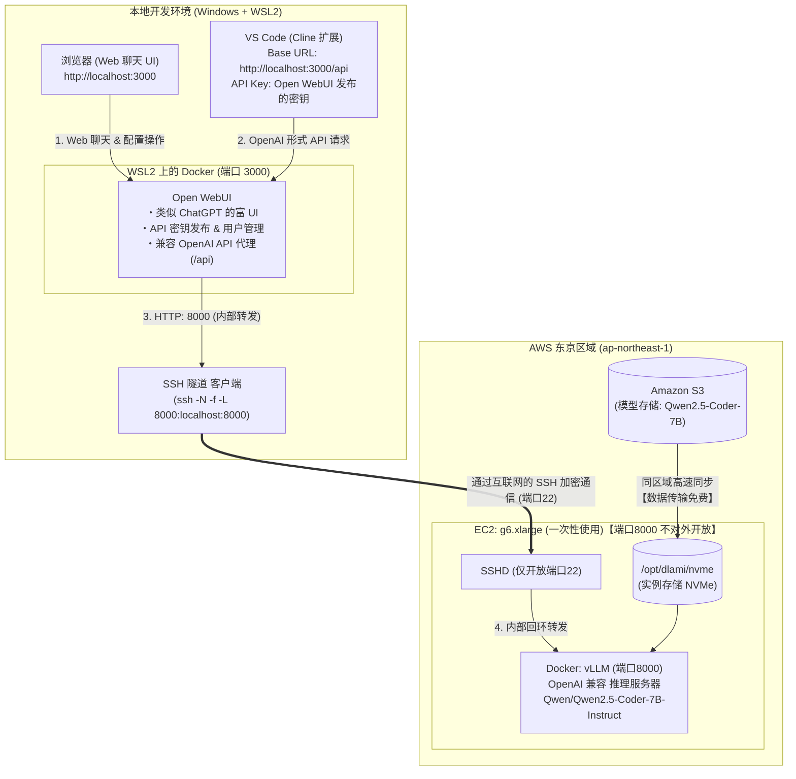

## 前言

在上一篇文章（[使用 AWS×UserData 自动启动 vLLM！停止时几乎零成本的本地 LLM 环境](/blogs/2026/09/16/vllm_autolaunch/)）中，我们利用 AWS 的 UserData 和 S3，实现了 vLLM 的全自动启动，并在使用完毕后 Terminate（终止）实例，从而使停止期间的 EBS 维护成本几乎为零，构建了一个临时的 LLM 推理环境。

在执行一条命令即可启动 GPU 实例，轻松调用自建推理 API 之后，下一步是将此流程整合到日常开发工作流中的 **“如何实用”** 环节。

如果能将 VS Code 上的 AI 编码代理「**Cline**」作为大脑，利用自建 GPU，那么就无需担心商用 API 的按量计费和速率限制，只需为实例运行时间付费，就能无限制地运行代理。

但是，在让代理完全自主之前，首先想在浏览器上轻松地对模型推理速度和日语响应质量进行对话式验证。

因此，这次我们选用了目前开源社区中开发最活跃的前端 **「Open WebUI」**（GitHub Star 超过 6 万）。Open WebUI 不仅提供了美观的聊天界面，还是一个兼容 OpenAI API 的网关，**能够一举实现「浏览器中的对话验证」和「VS Code 集成」**。

本文将介绍在本地 PC（**Windows WSL2 + Docker**）上运行 Open WebUI，并通过 SSH 端口转发，安全直连 AWS 上 GPU 实例中运行的常用开源模型 [Qwen/Qwen2.5-Coder-7B-Instruct](https://huggingface.co/Qwen/Qwen2.5-Coder-7B-Instruct)，实现无 Token 限制的自主编码环境的步骤和心得！

---

## 为什么选择「Open WebUI」？

> 📌 本节要点  
> 虽然单独使用 vLLM 常会变成 CUI 或直接调用，但借助 Open WebUI，就能在固定的本地 URL（`http://localhost:3000`）下，实现「浏览器中轻松对话验证」和「VS Code 调用 OpenAI 兼容 API」的双重体验。

在自建推理基础设施和客户端之间引入 **Open WebUI**，能显著提升开发体验。



### 1. 「Web 聊天」和「VS Code 集成」一举两得

Open WebUI 提供与 ChatGPT / Claude 同等的精致 Web UI。

- 在将大型任务交给编码代理之前，**可以在浏览器中轻松对话验证「模型如何回答日语指令？」「如何生成函数原型？」等内容。**
- 会话历史保存、提示模板管理、Markdown 代码高亮等功能，让它也能作为日常 LLM 前端使用，非常便利。

### 2. 原生支持 OpenAI 兼容 API 代理（`/api`）

Open WebUI 不仅是一个界面工具，还具备作为 **OpenAI 兼容 API 网关** 的功能。

- 在设置界面中可以发布自定义 **API 密钥**。
- 外部工具（如 Cline）只需调用 `http://localhost:3000/api`，Open WebUI 会负责认证、日志记录，并将请求安全路由到后台的 vLLM。

### 3. 通过 SSH 端口转发实现「固定连接 URL」及安全性

一次性使用的 EC2 每次启动都会分配不同的公网 IP。

- 在 EC2 安全组中 **不对外公开端口8000，仅开放 SSH（端口22）**。
- 在本地 PC（WSL2）执行 `ssh -N -f -L 8000:localhost:8000`，建立加密隧道。
- Open WebUI 始终通过主机网络连接到本地的 `http://127.0.0.1:8000/v1`。
- **Cline 端也只需固定使用 `http://localhost:3000/api`**，无论 EC2 重启或销毁多少次，都无需修改编辑器或浏览器配置。

---

## 为什么选择「Cline」作为编码代理？

结合 vLLM 的 AI 编码扩展 **Cline** 之所以脱颖而出，原因如下：

1. 原生支持 **OpenAI 兼容 API**  
   与专有工具不同，Cline 官方支持「OpenAI Compatible」提供商，无需处理自定义 schema 转换，可无缝连接标准 `/v1/chat/completions` 接口。  
2. 与 VS Code 编辑器高度一体化且具备自律执行能力  
   只需在侧边栏聊天窗口输入指令，即可在编辑器内部完成文件树扫描、Diff 展示与应用、集成终端中的构建和测试执行，并自动完成。  
3. 通过 Plan / Act 模式确保任务完成  
   可在「Plan 模式」进行设计与策略决策，在「Act 模式」执行实际文件编辑与命令运行，在 7B–32B 级开源模型下也能不偏离目标地推进编码。

---

## 环境搭建步骤

### Step 1: 在 WSL2 + Docker 中启动 Open WebUI

> 📌 本步骤目标  
> 在 WSL2 上拉起官方 Docker 容器，使用主机网络（`--net=host`）来与后续的 SSH 隧道无缝对接。

首先在本地 WSL2 环境中启动 Open WebUI。官方提供了 Docker 镜像，可通过 Docker Compose 或 `docker run` 一条命令启动。

#### 方法 A: 使用 Docker Compose (推荐)

```yaml
# docker-compose.open-webui.yml
services:
  open-webui:
    image: ghcr.io/open-webui/open-webui:main
    container_name: open-webui
    restart: always
    network_mode: host
    environment:
      # 监听端口 3000
      - PORT=3000
      # 将 SSH 隧道（localhost:8000）指定为 OpenAI 兼容后端
      - OPENAI_API_BASE_URL=http://127.0.0.1:8000/v1
      - OPENAI_API_KEY=none
    volumes:
      - open-webui-data:/app/backend/data

volumes:
  open-webui-data:
```

```bash
docker compose -f docker-compose.open-webui.yml up -d
```

#### 方法 B: 使用 `docker run` 命令启动

```bash
docker run -d --net=host \
  -v open-webui-data:/app/backend/data \
  -e PORT=3000 \
  -e OPENAI_API_BASE_URL=http://127.0.0.1:8000/v1 \
  -e OPENAI_API_KEY=none \
  --name open-webui \
  --restart always \
  ghcr.io/open-webui/open-webui:main
```

:::info
💡 为什么使用主机网络（`network_mode: host` / `--net=host`）？  
在 WSL2 环境执行 SSH 端口转发（`ssh -L 8000:localhost:8000`）时，SSH 进程只能监听主机的回环地址（`127.0.0.1:8000`）。  
如果容器使用默认桥接网络（`-p 3000:8080`），则 `host.docker.internal` 的访问会从 Docker 虚拟 NIC（`docker0`）进来，无法到达仅绑定在 `127.0.0.1` 的 SSH 隧道，导致连接被拒绝。  
使用主机网络后，容器与 WSL2 主机共享同一网络空间（`127.0.0.1`），可直接通过 `http://127.0.0.1:8000/v1` 访问。
:::

启动后，在浏览器打开 `http://localhost:3000`。  
※ 首次访问会出现管理员账号（名称、邮箱、密码）创建页面，由于是本地环境，请根据个人喜好注册。  
※ 本文截图中，登录后通过左下用户图标 → **「设置（Settings）」 → 「通用（General）」 → 「语言（Language）」** 将界面语言设置为 **「日本語」**（英语 UI 同样可用）。

---

### Step 2: 启动 EC2 & 自动建立加密 SSH 隧道

> 📌 本步骤目标  
> 一条命令自动完成 EC2（GPU）启动、UserData 自动部署 vLLM，以及安全加密 SSH 隧道（端口8000）的后台建立。

:::info
📋 脚本执行前检查列表  
- 本地环境：已安装 Windows (WSL2) + Docker  
- EC2 密钥对：`~/.ssh/` 下存在私钥（`.pem`）  
- IAM 角色：已创建具备 S3 读取（模型获取）权限的 IAM 角色（如 `EC2-S3-FullAccess-Profile`）  
- AWS CLI：已通过 `aws configure` 完成认证  
:::

EC2 自动构建与连接分两步：

1. `02_ec2_userdata.sh`：EC2 启动时自动运行，负责从 S3 同步模型并启动支持工具调用的 vLLM 容器的 UserData 脚本  
2. `02_ec2_launch_and_tunnel.sh`：在本地启动 EC2 并注入上述 UserData，同时自动在后台建立加密 SSH 隧道

#### 1. EC2 内部自动构建脚本（`02_ec2_userdata.sh`）

以下为在 EC2 启动时于服务器内部执行的 UserData 脚本，基于上一篇脚本，并为支持 Cline 及 Open WebUI 的工具调用，**在 vLLM 启动参数中添加了 `--enable-auto-tool-choice` 与 `--tool-call-parser hermes`**。

<details><summary>02_ec2_userdata.sh（点击展开）</summary>

```bash
#!/bin/bash
set -euo pipefail

# ==============================================================================
# 02_ec2_userdata.sh
# EC2 启动时执行的 UserData 脚本
#
# 前提:
#   - AMI: Ubuntu 22.04 Deep Learning AMI (已安装 NVIDIA 驱动 & Docker)
#   - 实例类型: g6.xlarge (NVIDIA L4 GPU: 24GB VRAM, 250GB NVMe SSD)
#   - IAM 角色: 已附加 S3(ReadOnly/FullAccess) 与 ECR(ReadOnly) 权限
# ==============================================================================

LOG_FILE="/var/log/userdata-vllm.log"
exec > >(tee -a "${LOG_FILE}") 2>&1
echo "=== [$(date '+%Y-%m-%d %H:%M:%S')] UserData 执行开始 ==="

# 配置参数
AWS_REGION="${AWS_REGION:-ap-northeast-1}"
S3_BUCKET_NAME="${S3_BUCKET_NAME:-my-llm-models-tokyo}"
HF_MODEL_ID="${HF_MODEL_ID:-Qwen/Qwen2.5-Coder-7B-Instruct}"
SERVED_MODEL_NAME="${SERVED_MODEL_NAME:-Qwen/Qwen2.5-Coder-7B-Instruct}"
VLLM_PORT="8000"
GPU_MEMORY_UTILIZATION="0.90"
MAX_MODEL_LEN="16384"
DOCKER_IMAGE="${DOCKER_IMAGE:-vllm/vllm-openai:latest}"

echo "获取模型(HF) : ${HF_MODEL_ID}"
echo "公开模型名   : ${SERVED_MODEL_NAME}"
echo "S3 桶       : s3://${S3_BUCKET_NAME}"

# 1. 检测并使用本地 NVMe 实例存储（250GB）
# ※ AWS Deep Learning AMI (DLAMI) 会在启动时自动将本地 NVMe 挂载到 /opt/dlami/nvme
NVME_DIR="/opt/dlami/nvme"
if mountpoint -q "${NVME_DIR}" || [ -d "${NVME_DIR}" ]; then
    echo "检测到 DLAMI 默认的 NVMe 挂载 (${NVME_DIR})，将其用作模型 & Docker 存储..."
    mkdir -p "${NVME_DIR}/models" "${NVME_DIR}/docker"
    mkdir -p /data
    ln -sfn "${NVME_DIR}/models" /data/models
else
    # 非 DLAMI 或未挂载时的回退处理
    NVME_DEV=$(lsblk -d -n -o NAME,SIZE | grep -E '250G|232G' | head -n1 | awk '{print $1}')
    if [ -n "${NVME_DEV}" ]; then
        echo "检测到本地 NVMe SSD (/dev/${NVME_DEV})，将挂载到 /data..."
        mkfs.ext4 -F "/dev/${NVME_DEV}" || true
        mkdir -p /data
        mount -o noatime "/dev/${NVME_DEV}" /data || true
    else
        mkdir -p /data
    fi
    mkdir -p /data/models /data/docker
    NVME_DIR="/data"
fi

LOCAL_MODEL_ROOT="/data/models"
LOCAL_MODEL_DIR="${LOCAL_MODEL_ROOT}/${HF_MODEL_ID}"
mkdir -p "${LOCAL_MODEL_DIR}"
chmod 777 "${LOCAL_MODEL_ROOT}"

# 2. 将 Docker & containerd 数据目录调整到 NVMe，以防 EBS 空间耗尽 & 加快层展开
echo "停止 Docker/containerd 并设置 NVMe 绑定挂载..."
systemctl stop docker containerd || true

mkdir -p "${NVME_DIR}/docker" "${NVME_DIR}/containerd"
mkdir -p /var/lib/docker /var/lib/containerd

# 若存在旧数据则迁移
cp -a /var/lib/docker/* "${NVME_DIR}/docker/" 2>/dev/null || true
cp -a /var/lib/containerd/* "${NVME_DIR}/containerd/" 2>/dev/null || true

mount --bind "${NVME_DIR}/docker" /var/lib/docker
mount --bind "${NVME_DIR}/containerd" /var/lib/containerd

if ! grep -q "/var/lib/docker" /etc/fstab; then
    echo "${NVME_DIR}/docker /var/lib/docker none defaults,bind 0 0" >> /etc/fstab
fi
if ! grep -q "/var/lib/containerd" /etc/fstab; then
    echo "${NVME_DIR}/containerd /var/lib/containerd none defaults,bind 0 0" >> /etc/fstab
fi

mkdir -p /etc/docker
cat <<EOF > /etc/docker/daemon.json
{
  "data-root": "/var/lib/docker"
}
EOF

systemctl daemon-reload
systemctl start containerd
systemctl start docker

# 3. 模型数据准备 (若 S3 存在则高速同步，否则 EC2 上从 Hugging Face 下载并备份至 S3)
echo "=== [$(date '+%Y-%m-%d %H:%M:%S')] 开始检查模型数据... ==="
S3_SRC="s3://${S3_BUCKET_NAME}/models/${HF_MODEL_ID}"
echo "S3 目标: ${S3_SRC}/ (区域: ${AWS_REGION})"
aws configure set default.s3.max_concurrent_requests 20

# 等待 IAM 凭证及 S3 通信 (启动时元数据服务更新 STS token 可能需要几秒)
echo "检查 IAM 认证与 S3 连接..."
for i in {1..15}; do
    if aws s3 ls "s3://${S3_BUCKET_NAME}" --region "${AWS_REGION}" >/dev/null 2>&1; then
        echo "已确认可访问 S3 桶。"
        break
    fi
    echo "等待 S3 连接/IAM 认证 ($i/15)..."
    sleep 2
done

HAS_S3_MODEL=false
echo "检查 S3 上模型是否存在: aws s3 ls ${S3_SRC}/ --region ${AWS_REGION}"
S3_CHECK=$(aws s3 ls "${S3_SRC}/" --region "${AWS_REGION}" 2>/dev/null || true)
echo "S3 检查结果:"
echo "${S3_CHECK}"

if echo "${S3_CHECK}" | grep -E '(\.safetensors|\.bin|\.json)' >/dev/null; then
    HAS_S3_MODEL=true
fi

if [ "${HAS_S3_MODEL}" = "true" ]; then
    echo "=== [$(date '+%Y-%m-%d %H:%M:%S')] 在 S3 上发现模型，从 S3 高速同步... ==="
    aws s3 sync "${S3_SRC}" "${LOCAL_MODEL_DIR}" \
        --region "${AWS_REGION}" \
        --no-progress
else
    echo "=== [$(date '+%Y-%m-%d %H:%M:%S')] S3 上未发现模型，直接从 Hugging Face 下载... ==="
    python3 -m pip install -U "huggingface_hub[cli]" || pip3 install -U "huggingface_hub[cli]" || true
    
    echo "从 Hugging Face ('${HF_MODEL_ID}') 下载模型..."
    python3 -c "
import sys
from huggingface_hub import snapshot_download
try:
    snapshot_download(repo_id='${HF_MODEL_ID}', local_dir='${LOCAL_MODEL_DIR}', local_dir_use_symlinks=False)
    print('成功从 Hugging Face 下载模型。')
except Exception as e:
    print(f'下载错误: {e}', file=sys.stderr)
    sys.exit(1)
"
    echo "下载完成，占用空间:"
    du -sh "${LOCAL_MODEL_DIR}"
fi

echo "模型准备完毕，本地磁盘使用情况:"
du -sh "${LOCAL_MODEL_DIR}"

# 4. 启动 vLLM 容器
echo "=== [$(date '+%Y-%m-%d %H:%M:%S')] 启动 vLLM 容器 ==="
CONTAINER_NAME="vllm-server"

# 若使用 ECR 镜像，则先登录
if [[ "${DOCKER_IMAGE}" == *".dkr.ecr."* ]]; then
    echo "检测到 ECR 镜像，执行登录认证..."
    ECR_REGISTRY=$(echo "${DOCKER_IMAGE}" | cut -d'/' -f1)
    aws ecr get-login-password --region "${AWS_REGION}" | docker login --username AWS --password-stdin "${ECR_REGISTRY}" || true
fi

# 若已有同名容器则停止并移除
if docker ps -a --format '{{.Names}}' | grep -q "^${CONTAINER_NAME}$"; then
    echo "停止并移除现有容器 ${CONTAINER_NAME}..."
    docker rm -f "${CONTAINER_NAME}"
fi

docker run -d \
    --name "${CONTAINER_NAME}" \
    --restart unless-stopped \
    --gpus all \
    --ipc=host \
    -p "${VLLM_PORT}:8000" \
    -v "${LOCAL_MODEL_ROOT}:/models" \
    "${DOCKER_IMAGE}" \
    --model "/models/${HF_MODEL_ID}" \
    --served-model-name "${SERVED_MODEL_NAME}" \
    --gpu-memory-utilization "${GPU_MEMORY_UTILIZATION}" \
    --max-model-len "${MAX_MODEL_LEN}" \
    --trust-remote-code \
    --enable-auto-tool-choice \
    --tool-call-parser hermes

# 5. 健康检查 (等待启动)
echo "开始检查 vLLM 服务健康状态 (端口 ${VLLM_PORT})..."
MAX_RETRIES=120 # 留出最多10分钟的时间用于第一次启动与 CUDA 图构建
RETRY_COUNT=0

while [ ${RETRY_COUNT} -lt ${MAX_RETRIES} ]; do
    if curl -s "http://127.0.0.1:${VLLM_PORT}/health" > /dev/null 2>&1; then
        echo "=== [$(date '+%Y-%m-%d %H:%M:%S')] vLLM 服务已正常启动！ ==="
        break
    fi
    echo "等待启动... (${RETRY_COUNT}/${MAX_RETRIES})"
    sleep 5
    RETRY_COUNT=$((RETRY_COUNT + 1))
done

if [ ${RETRY_COUNT} -eq ${MAX_RETRIES} ]; then
    echo "警告: vLLM 健康检查超时，请查看 'docker logs ${CONTAINER_NAME}'。"
else
    # 若首次下载未使用 S3，则后台同步至 S3 以优化下次启动 (降低 I/O 优先级，不影响推理)
    if [ "${HAS_S3_MODEL}" = "false" ]; then
        echo "=== [$(date '+%Y-%m-%d %H:%M:%S')] 启动完成，后台同步模型到 S3... ==="
        (
            if ! aws s3 ls "s3://${S3_BUCKET_NAME}" --region "${AWS_REGION}" 2>/dev/null; then
                if [ "${AWS_REGION}" = "us-east-1" ]; then
                    aws s3api create-bucket --bucket "${S3_BUCKET_NAME}" 2>/dev/null || true
                else
                    aws s3api create-bucket --bucket "${S3_BUCKET_NAME}" --region "${AWS_REGION}" --create-bucket-configuration LocationConstraint="${AWS_REGION}" 2>/dev/null || true
                fi
            fi
            ionice -c 3 aws s3 sync "${LOCAL_MODEL_DIR}" "${S3_SRC}" --region "${AWS_REGION}" --no-progress 2>/dev/null || \
            aws s3 sync "${LOCAL_MODEL_DIR}" "${S3_SRC}" --region "${AWS_REGION}" --no-progress 2>/dev/null || true
            echo "[$(date '+%Y-%m-%d %H:%M:%S')] S3 模型备份完成！下次可快速同步。"
        ) > /var/log/s3-backup.log 2>&1 &
    fi
fi

# 6. 启动空闲自动关机（自爆 Terminate）守护进程
echo "=== 设置并启动空闲自动关机守护程序 ==="
cat <<'EOF' > /usr/local/bin/auto-idle-shutdown.sh
#!/bin/bash
IDLE_LIMIT_SEC=3600  # 1 小时 (3600 秒)
IDLE_COUNT=0
CHECK_INTERVAL=300   # 每 5 分钟检查一次

while true; do
    sleep "${CHECK_INTERVAL}"
    
    # 统计最近 5 分钟内发送到 vLLM 的推理请求数
    REQ_COUNT=$(docker logs --since 5m vllm-server 2>&1 | grep -c "POST /v1" || true)
    
    if [ "${REQ_COUNT}" -eq 0 ]; then
        IDLE_COUNT=$((IDLE_COUNT + CHECK_INTERVAL))
        echo "[$(date '+%Y-%m-%d %H:%M:%S')] 空闲中: ${IDLE_COUNT}s / ${IDLE_LIMIT_SEC}s"
        
        if [ "${IDLE_COUNT}" -ge "${IDLE_LIMIT_SEC}" ]; then
            echo "[$(date '+%Y-%m-%d %H:%M:%S')] 已连续空闲 1 小时，执行自动关机 (Terminate)。"
            shutdown -h now
            exit 0
        fi
    else
        IDLE_COUNT=0  # 若有请求则重置计时
    fi
done
EOF

chmod +x /usr/local/bin/auto-idle-shutdown.sh
nohup /usr/local/bin/auto-idle-shutdown.sh > /var/log/auto-idle-shutdown.log 2>&1 &
echo "=== [$(date '+%Y-%m-%d %H:%M:%S')] UserData 全部完成 (空闲监控已启动) ==="
```

</details>

#### 2. 启动 EC2 & 自动建立 SSH 隧道脚本（`02_ec2_launch_and_tunnel.sh`）

接下来，从本地将上述 UserData 注入 EC2，启动实例，并在后台自动开启 SSH 隧道。

<details><summary>02_ec2_launch_and_tunnel.sh（点击展开）</summary>

```bash
#!/bin/bash
set -euo pipefail

# ==============================================================================
# 02_ec2_launch_and_tunnel.sh
# 启动 EC2 GPU 实例，并通过 SSH 端口转发将 vLLM 安全连接到本地(8000)的脚本
#
# 特点:
#   - 不对外公开 EC2 的端口8000，仅开放端口22 (SSH)
#   - 本地自动建立 SSH 隧道(-L 8000:localhost:8000)
#   - Open WebUI 仅需指向本地 (http://127.0.0.1:8000/v1)，无需更改
# ==============================================================================

SCRIPT_DIR="$(cd "$(dirname "${BASH_SOURCE[0]}")" && pwd)"
USER_DATA_FILE="${USER_DATA_FILE:-${SCRIPT_DIR}/02_ec2_userdata.sh}"
INSTANCE_STATE_FILE="${SCRIPT_DIR}/.current_instance_id"
TUNNEL_PID_FILE="${SCRIPT_DIR}/.current_ssh_tunnel_pid"

# --- AWS 设置 ---
AWS_REGION="${AWS_REGION:-ap-northeast-1}"
INSTANCE_TYPE="${INSTANCE_TYPE:-g6.xlarge}" # NVIDIA L4 GPU (24GB VRAM)
AMI_ID="${AMI_ID:-}"
IAM_ROLE_NAME="${IAM_ROLE_NAME:-EC2-S3-ReadOnly-Profile}"
SECURITY_GROUP_IDS="${SECURITY_GROUP_IDS:-}"
SUBNET_ID="${SUBNET_ID:-}"
KEY_NAME="${KEY_NAME:-my-vllm-models-hackathon-2026}"
KEY_PATH="${KEY_PATH:-${HOME}/.ssh/${KEY_NAME}.pem}"
EBS_SIZE_GB="${EBS_SIZE_GB:-40}"

# --- 模型 & UserData 设置 ---
S3_BUCKET_NAME="${S3_BUCKET_NAME:-my-vllm-models-hackathon-2026-$(aws sts get-caller-identity --query Account --output text)-ap-northeast-1-an}"
HF_MODEL_ID="${HF_MODEL_ID:-Qwen/Qwen2.5-Coder-7B-Instruct}"
SERVED_MODEL_NAME="${SERVED_MODEL_NAME:-Qwen/Qwen2.5-Coder-7B-Instruct}"
MAX_MODEL_LEN="${MAX_MODEL_LEN:-16384}"
GPU_MEMORY_UTILIZATION="${GPU_MEMORY_UTILIZATION:-0.90}"
DOCKER_IMAGE="${DOCKER_IMAGE:-vllm/vllm-openai:latest}"

echo "=== 1. 配置确认 ==="
if [ ! -f "${USER_DATA_FILE}" ]; then
    echo "错误: 未找到 UserData 脚本: ${USER_DATA_FILE}"
    echo "请放置第 1 步的 02_ec2_userdata.sh，或通过环境变量 USER_DATA_FILE 指定。"
    exit 1
fi

echo "使用的 SSH 私钥: ${KEY_PATH}"

# 生成带注入环境变量的临时 UserData 脚本
TEMP_USERDATA=$(mktemp)
trap 'rm -f "${TEMP_USERDATA}"' EXIT

sed -e "s|^AWS_REGION=.*|AWS_REGION=\"${AWS_REGION}\"|" \
    -e "s|^S3_BUCKET_NAME=.*|S3_BUCKET_NAME=\"${S3_BUCKET_NAME}\"|" \
    -e "s|^HF_MODEL_ID=.*|HF_MODEL_ID=\"${HF_MODEL_ID}\"|" \
    -e "s|^SERVED_MODEL_NAME=.*|SERVED_MODEL_NAME=\"${SERVED_MODEL_NAME}\"|" \
    -e "s|^MAX_MODEL_LEN=.*|MAX_MODEL_LEN=\"${MAX_MODEL_LEN}\"|" \
    -e "s|^GPU_MEMORY_UTILIZATION=.*|GPU_MEMORY_UTILIZATION=\"${GPU_MEMORY_UTILIZATION}\"|" \
    -e "s|^DOCKER_IMAGE=.*|DOCKER_IMAGE=\"${DOCKER_IMAGE}\"|" \
    "${USER_DATA_FILE}" > "${TEMP_USERDATA}"

if [ -z "${AMI_ID}" ]; then
    echo "自动搜索 Ubuntu 22.04 Deep Learning AMI..."
    AMI_ID=$(aws ec2 describe-images \
        --region "${AWS_REGION}" \
        --owners amazon \
        --filters "Name=name,Values=Deep Learning OSS Nvidia Driver AMI GPU PyTorch * (Ubuntu 22.04)*" "Name=state,Values=available" \
        --query 'sort_by(Images, &CreationDate)[-1].ImageId' \
        --output text)
    echo "使用的 AMI ID: ${AMI_ID}"
fi

# 自动获取或创建仅开放 SSH 的安全组
if [ -z "${SECURITY_GROUP_IDS}" ]; then
    SG_NAME="vllm-ssh-tunnel-sg"
    SG_ID=$(aws ec2 describe-security-groups \
        --region "${AWS_REGION}" \
        --filters "Name=group-name,Values=${SG_NAME}" \
        --query 'SecurityGroups[0].GroupId' --output text 2>/dev/null || true)
    
    if [ -z "${SG_ID}" ] || [ "${SG_ID}" = "None" ]; then
        echo "创建 SSH 专用安全组 (${SG_NAME})..."
        DEFAULT_VPC=$(aws ec2 describe-vpcs --region "${AWS_REGION}" --filters "Name=isDefault,Values=true" --query 'Vpcs[0].VpcId' --output text)
        SG_ID=$(aws ec2 create-security-group \
            --region "${AWS_REGION}" \
            --group-name "${SG_NAME}" \
            --description "仅允许 SSH 22 端口 (vLLM 隧道)" \
            --vpc-id "${DEFAULT_VPC}" \
            --query 'GroupId' --output text)
        aws ec2 authorize-security-group-ingress \
            --region "${AWS_REGION}" --group-id "${SG_ID}" \
            --protocol tcp --port 22 --cidr "0.0.0.0/0"
    fi
    SECURITY_GROUP_IDS="${SG_ID}"
fi

# --- 2. 启动 EC2 实例 ---
echo "=== 2. 启动 EC2 实例 (一次性使用) ==="
INSTANCE_ID=$(aws ec2 run-instances \
    --region "${AWS_REGION}" \
    --image-id "${AMI_ID}" \
    --instance-type "${INSTANCE_TYPE}" \
    --key-name "${KEY_NAME}" \
    --iam-instance-profile "Name=${IAM_ROLE_NAME}" \
    --security-group-ids ${SECURITY_GROUP_IDS} \
    --instance-initiated-shutdown-behavior terminate \
    --block-device-mappings "[{\"DeviceName\":\"/dev/sda1\",\"Ebs\":{\"VolumeSize\":${EBS_SIZE_GB},\"VolumeType\":\"gp3\",\"DeleteOnTermination\":true}}]" \
    --user-data "file://${TEMP_USERDATA}" \
    --tag-specifications "ResourceType=instance,Tags=[{Key=Name,Value=vllm-openwebui-server}]" \
    --query 'Instances[0].InstanceId' \
    --output text)

echo "实例启动请求已提交: ${INSTANCE_ID}"
echo "${INSTANCE_ID}" > "${INSTANCE_STATE_FILE}"

echo "等待实例启动..."
aws ec2 wait instance-running --region "${AWS_REGION}" --instance-ids "${INSTANCE_ID}"

PUBLIC_IP=$(aws ec2 describe-instances \
    --region "${AWS_REGION}" \
    --instance-ids "${INSTANCE_ID}" \
    --query 'Reservations[0].Instances[0].PublicIpAddress' \
    --output text)
echo "公网 IP     : ${PUBLIC_IP}"

# --- 3. 建立 SSH 端口转发 (加密隧道) ---
echo "=== 3. 建立 SSH 端口转发 (加密隧道) ==="
while ! nc -z -w 3 "${PUBLIC_IP}" 22 2>/dev/null; do
    sleep 3
done
echo "EC2 SSHD 响应正常！"

if [ -f "${TUNNEL_PID_FILE}" ]; then
    OLD_PID=$(cat "${TUNNEL_PID_FILE}" | tr -d '[:space:]')
    kill -9 "${OLD_PID}" 2>/dev/null || true
    rm -f "${TUNNEL_PID_FILE}"
fi

ssh -i "${KEY_PATH}" \
    -o StrictHostKeyChecking=no \
    -o UserKnownHostsFile=/dev/null \
    -o ServerAliveInterval=15 \
    -o ServerAliveCountMax=3 \
    -N -f -L 8000:localhost:8000 \
    "ubuntu@${PUBLIC_IP}"

TUNNEL_PID=$(pgrep -f "ssh.*-L 8000:localhost:8000.*ubuntu@${PUBLIC_IP}" | head -n1 || true)
if [ -n "${TUNNEL_PID}" ]; then
    echo "${TUNNEL_PID}" > "${TUNNEL_PID_FILE}"
fi
echo "SSH 隧道已建立！ (PID: ${TUNNEL_PID})"

# --- 4. 等待 vLLM 服务启动 (http://localhost:8000/health) ---
echo "=== 4. 等待 vLLM 服务启动 (http://localhost:8000/health) ==="
while ! curl -s -m 3 "http://localhost:8000/health" > /dev/null 2>&1; do
    sleep 10
done

echo "=========================================================="
echo " 全部流程已完成！"
echo " EC2 实例 ID: ${INSTANCE_ID}"
echo " SSH 隧道   : localhost:8000 -> EC2:8000 (加密中)"
echo " Web UI URL : http://localhost:3000"
echo "=========================================================="
```

</details>

```bash
# 执行命令
export KEY_NAME="my-vllm-models-hackathon-2026"
export IAM_ROLE_NAME="EC2-S3-FullAccess-Profile"

./02_ec2_launch_and_tunnel.sh
```

该脚本将自动完成：

1. 通过 `aws ec2 run-instances` 启动 GPU 实例（`DeleteOnTermination: true` 及 `--instance-initiated-shutdown-behavior terminate`），  
   安全组仅允许 SSH 22 端口，无需公开端口8000。  
2. 实例启动完成后获取公网 IP。  
3. 确认 SSHD 响应后，**在后台自动建立 SSH 端口转发**（`ssh -N -f -L 8000:localhost:8000 ubuntu@<PUBLIC_IP>`）。  
4. 本地等待 `http://localhost:8000/health` 返回成功。

:::check
⚠️ 相较第一回的更新：为代理集成优化启动参数

相较于第一回仅用于聊天验证的 UserData，此次 `02_ec2_userdata.sh` 及启动脚本新增/调整了以下参数以支持 Cline 集成与 Open WebUI 工具调用：

1. **`MAX_MODEL_LEN=16384`（上下文长度由 4096 扩充至 16384）**  
   自主编码代理（如 Cline）在首次请求时会一次性发送「系统提示」「工具定义」「项目环境信息」等，约消耗近 4000 token，默认 4096 容易在几轮迭代后出现 `400 BadRequest: maximum context length exceeded` 错误，因此将上下文扩展至 16k。  
2. **`GPU_MEMORY_UTILIZATION=0.90`（VRAM 利用率由 0.85 提升至 0.90）**  
   扩展上下文长度会增加 KV 缓存占用，通过提高至 90%，最大化利用 g6.xlarge（24GB VRAM）的剩余内存，避免缓存枯竭。  
3. **`--enable-auto-tool-choice` & `--tool-call-parser hermes`（启用 Tool Calling / 函数调用）**  
   Open WebUI 与 Cline 会发起文件操作、终端命令、Web搜索等工具调用（Function Calling / `tool_choice: "auto"`），上述参数为必需项，否则会报 `"auto" tool choice requires --enable-auto-tool-choice and --tool-call-parser to be set` 错误。Qwen2.5 支持 Hermes 格式工具调用，故指定 `hermes` 解析器。
:::

:::info
💡 小贴士：上下文长度还能扩展到更高？（32k 设置与 FP8 KV 缓存）

“16k 足够，但想加载更庞大的代码库，能否扩展到 32k 或 64k？”答案是：**完全可以扩展**！

- **个人使用可直接设置 `MAX_MODEL_LEN=32768`（32k）**：  
  Qwen2.5-Coder-7B 采用 GQA（Grouped Query Attention），KV 缓存占用极小，32k 约需 1.9 GB，L4 GPU（24GB VRAM）加载模型后保留的 ~6.6 GB 可稳定支撑 32k。本文选 16k 为了保留在多用户（3–5 人）并发时的内存余量。  
- **进阶技巧：FP8 KV 缓存**：  
  g6.xlarge 的 NVIDIA L4 原生支持 FP8 运算，仅需在启动参数中添加 `--kv-cache-dtype fp8`，即可将 KV 缓存内存消耗减半（约 28 KB/token）。这样在多用户环境下也能稳定支持 32k、甚至 64k。  
- **注意事项（权衡）**：  
  上下文过长会拖慢首字生成速度（TTFT），且 7B 模型易出现“Lost in the Middle”现象。综合响应速度与准确性，建议在 16k–32k 区间。
:::

```bash
# 脚本执行日志示例
=== 1. 配置确认 ===
使用的 SSH 私钥: /home/user/.ssh/my-key.pem
=== 2. 启动 EC2 实例 (一次性使用) ===
实例启动请求已提交: i-0123456789abcdef0
实例启动完成！
公网 IP     : 54.xxx.xxx.xxx
=== 3. 建立 SSH 端口转发 (加密隧道) ===
EC2 SSHD 响应正常！
SSH 隧道已建立！ (PID: 12345)
本地 http://localhost:8000 安全转发至 EC2 内部 vLLM。
=== 4. 等待 vLLM 服务启动 (http://localhost:8000/health) ===
...............................
vLLM 服务已正常响应！
==========================================================
 全部流程已完成！
 SSH 隧道   : localhost:8000 -> EC2:8000 (加密中)
 Web UI URL : http://localhost:3000
==========================================================
```

看到完成提示后，即可确认 AWS 上的 vLLM 与本地环境通过加密隧道直连！

---

### Step 3: 在浏览器中验证聊天 & 发布 API 密钥

#### 1. 浏览器中验证聊天功能

在浏览器打开 `http://localhost:3000`，顶部模型选择下拉框若自动识别出 **`Qwen/Qwen2.5-Coder-7B-Instruct`**，则表明配置已完成。

在输入框内输入：

```
「こんにちは！自己紹介と、得意なプログラミング言語を教えてください。」
```

你将看到来自 GPU 的平滑日文流式响应，借此验证推理服务是否正常。


:::info
💡 浏览器聊天小贴士（解除内置工具）  
若聊天时模型输出类似 `{"name": "ask_user", ...}` 的 JSON 参数，则说明模型绑定了内置工具。  
点击左下用户图标 → **「设置（Settings）」** → **「模型（Models）」** (或工作区模型管理)，在目标模型（`Qwen/Qwen2.5-Coder-7B-Instruct`）的「编辑」中，取消勾选「Ask User（向用户提问）」工具，保存后即可正常对话（Step 4 在连接 Cline 时，Cline 会使用自定义工具定义，不受影响）。


:::

#### 2. 发布 Cline 连接用 API 密钥

要让 Cline 通过 Open WebUI 访问，需发布一个 API 密钥：

1. 在左下用户图标中打开 **「管理面板（Admin Panel）」** → **「设置（Settings）」** → **「系统（System）」** → **「认证（Authentication）」**，确保 **「API Key」** 已开启（ON），若关闭请开启并保存。

   

2. 点击左下用户图标，进入 **「设置（Settings / 个人资料）」** → **「账户（Account）」**。
3. 在 **「API Key」** 区域，点击 **「＋ 创建新密钥」**（或密钥创建图标）。
4. 复制生成的密钥（非 `sk-` 格式，为一长串字母数字），备用。

   

---

### Step 4: 在 VS Code 中配置与使用 Cline

> 📌 本步骤目标  
> 在 VS Code 扩展「Cline」中配置 Open WebUI 的终端点与 API 密钥，开始无 Token 限制的自主编码。

现在，从 VS Code 连接到自建的 vLLM 环境！

#### 1. 安装 Cline

在 VS Code 扩展市场搜索并安装 **「Cline」**。

#### 2. 配置提供商

点击侧边栏的 Cline 图标（机器人），打开顶部齿轮图标（Settings），设置如下项：

| 设置项                     | 值                                   | 备注                                                              |
| :------------------------- | :----------------------------------- | :---------------------------------------------------------------- |
| API Provider               | `OpenAI Compatible`                 | 下拉选择                                                        |
| Base URL                   | `http://localhost:3000/api`         | Open WebUI 终端点（末尾 `/api`），若 404，可尝试 `http://localhost:3000/api/v1` |
| OpenAI Compatible API Key  | 发布的 API 密钥                      | Step 3 获取的 Open WebUI 密钥                                    |
| Model ID                   | `Qwen/Qwen2.5-Coder-7B-Instruct`    | vLLM 提供的模型名称                                              |
| Context Window Size        | `16384`                              | 与 vLLM 的 max_model_len（16k）一致                             |
| Max Output Tokens          | `8192` (或 `4096`)                   | 每次请求的最大输出 token 数                                        |


:::check
⚠️ Token 数设置注意（重要）  
Cline 默认 `max_tokens` 可能为 `32000`，若超过 vLLM 的最大上下文长度（16384）会出现：  
`max_tokens=32000 cannot be greater than max_model_len=16384. Please request fewer output tokens.`  
请务必将 **Context Window Size** 设置为 `16384`，**Max Output Tokens** 设置为 `8192`（或 `4096`）。若在设置界面未见相应项，可展开「MODEL CONFIGURATION」或「Advanced Settings」。  
※ 若在 Step 2 中将 vLLM 配置为 32k（32768），则相应设置为 `32768` 与 `8192`。
:::

设置完成后，点击「Done」或「Save」。

#### 3. 验证：执行自主编码

在 VS Code 中打开一个空文件夹，在 Cline 聊天输入框中发送开发任务：

```
请在一个空项目中，用 Python 创建一个简单的 TODO 管理 CLI 工具。
- 支持添加任务、列出任务、完成任务
- 使用 Python 标准的 unittest 编写单元测试
- 在终端运行测试并确认全部通过
```

发送后，Cline 将自主生成项目结构、创建文件、撰写代码，并通过集成终端执行测试。  
请求将通过 Open WebUI 及加密 SSH 隧道，直达 AWS 上运行的 `Qwen/Qwen2.5-Coder-7B-Instruct`，并且在 VS Code 中实时流式输出文件 `todo.py`、`test_todo.py` 等的创建与编辑。  
若切换到 Act 模式，还会自动在终端运行测试，完成验证。


在 Open WebUI 管理界面中，可看到对应的请求日志被完整记录。

:::check
🔧 常见问题及解决方案（Q&A）

- Q1. 提示「API Key 无效 / 401 Unauthorized」  
  → Open WebUI 的密钥不是 `sk-...` 格式，请确认复制的为英数字长串。同时检查管理面板的「Authentication」中 **API Key 已开启**。  
- Q2. 提示「404 Not Found」  
  → 不同 Open WebUI 版本路径可能不同，可将 Base URL 从 `http://localhost:3000/api` 改为 `http://localhost:3000/api/v1` 再试。  
- Q3. 提示 `400 BadRequest: max_tokens cannot be greater than max_model_len`  
  → Cline 的 Max Output Tokens（默认值例如 32000）超过了 vLLM 的 max_model_len（16384），请在设置中降至 **8192** 或 **4096**。  
- Q4. 提示「Connection refused」  
  → 检查 SSH 隧道是否断开，或 Open WebUI 是否以桥接网络启动。确保后台存在 `ssh -L 8000:localhost:8000` 进程，并且 Open WebUI 使用 `--net=host`。
:::

---

## 实际体验与感想

在自建的 `Qwen/Qwen2.5-Coder-7B-Instruct` 后端上使用 Cline，体验到的优势如下：

1. **无需担心按量付费，心理更安全**：  
   使用官方 API 时，总会担心长日志或大代码消耗数千 token（数十元），从而不敢尽情尝试。但自建 GPU 只需为实例运行付费，无论消耗多少 token 都不额外收费，可毫无顾虑地上传大型代码库和测试输出。  
2. **高性能响应**：  
   借助 vLLM 的优化引擎，即使计入东京区域内延迟，响应速度依旧出色。  
3. **完全私有 & 安全通信**：  
   不仅代码和提示不流向第三方 API，还通过 SSH 隧道加密 EC2 连接，可安心验证公司机密代码。

### 团队可同时使用人数？

> 📌 本节要点  
> 在 24GB VRAM（L4）环境下，考虑到工程师的「思考时间」，**1 台共享给 3–5 人最具成本效益与实用性**。

作为工程师，自然会关心「几位团队成员能共享一台推理服务器」？

结合 g6.xlarge（NVIDIA L4 / 24GB VRAM）规格与 Cline 特性，推荐人数如下：

| 使用场景                | 建议人数 | 使用感受                             |
| :---------------------- | :-------: | :----------------------------------- |
| **专属舒适**            | **1–2 人** | 几乎无等待；可充分利用 60–80 tokens/sec 流速 |
| **团队实用 (★ 推荐)**   | **3–5 人** | **实战中最平衡**；并发时仍可维持 20–30 tokens/sec |
| **拥堵（边缘可用）**    | **6–8 人** | 并发请求时 TTFT 增长数秒               |
| **超负荷（不推荐）**    | **10 人以上** | 常出现排队与速度下降，且 VRAM 缓存溢出风险 |

#### 为什么 3–5 人最合适？

1. **KV 缓存（上下文内存）容量**  
   VRAM 24GB 中，除模型自身（约15GB）外剩余约6.5–7GB 用于会话缓存。自主代理一次请求消耗约 300–500MB，可并行保持约 12–14 条活跃会话。  
2. **工程师的思考时间**  
   工程师并非持续敲键，而是「发送提示 → 推理 15–30秒 → 查看/编译/测试 → 思考 3–5分钟 → 再发送下一提示」。单人推理利用率仅约 10–15%，因而 3–5 人间的请求冲突概率较低，能舒适共享 GPU。  
   从成本角度来看，g6.xlarge 按需约 $1.38/h（约228日元/h，1美元=165日元），拆分给 3–5 人，每人每小时约 45–75 日元。再加上存储 S3 月费约 62 日元，性价比极高。

---

## 验证结束后，一键完全销毁

完成验证后，为避免闲置付费，应立即 Terminate 实例。

<details><summary>04_ec2_terminate.sh（点击展开）</summary>

```bash
#!/bin/bash
set -euo pipefail

# ==============================================================================
# 04_ec2_terminate.sh
# 验证结束时立即彻底销毁 EC2 实例的脚本
#
# 要点:
#   - EBS 卷一并删除，实现停止时费用归零
# ==============================================================================

SCRIPT_DIR="$(cd "$(dirname "${BASH_SOURCE[0]}")" && pwd)"
INSTANCE_STATE_FILE="${SCRIPT_DIR}/.current_instance_id"
TUNNEL_PID_FILE="${SCRIPT_DIR}/.current_ssh_tunnel_pid"
AWS_REGION="${AWS_REGION:-ap-northeast-1}"

INSTANCE_ID="${1:-}"
if [ -z "${INSTANCE_ID}" ] && [ -f "${INSTANCE_STATE_FILE}" ]; then
    INSTANCE_ID=$(cat "${INSTANCE_STATE_FILE}" | tr -d '[:space:]')
fi

if [ -z "${INSTANCE_ID}" ]; then
    echo "错误: 未指定要结束的实例 ID。"
    echo "用法: ./04_ec2_terminate.sh <i-xxxxxxxxxxxxxxxxx>"
    exit 1
fi

echo "=== 彻底销毁 EC2 实例 (Terminate) ==="
echo "目标实例 ID: ${INSTANCE_ID}"
echo "区域       : ${AWS_REGION}"
echo ""
echo "※ EBS 卷 (DeleteOnTermination=true) 会一并删除。"

aws ec2 terminate-instances \
    --region "${AWS_REGION}" \
    --instance-ids "${INSTANCE_ID}" \
    --output table

echo "等待实例终止..."
aws ec2 wait instance-terminated \
    --region "${AWS_REGION}" \
    --instance-ids "${INSTANCE_ID}"

rm -f "${INSTANCE_STATE_FILE}"

# 停止后台的 SSH 隧道进程
if [ -f "${TUNNEL_PID_FILE}" ]; then
    TUNNEL_PID=$(cat "${TUNNEL_PID_FILE}" || true)
    if [ -n "${TUNNEL_PID}" ] && kill -0 "${TUNNEL_PID}" 2>/dev/null; then
        echo "停止 SSH 隧道进程 (PID: ${TUNNEL_PID})..."
        kill "${TUNNEL_PID}" 2>/dev/null || true
    fi
    rm -f "${TUNNEL_PID_FILE}"
fi

echo "=========================================================="
echo " 已彻底销毁实例及 EBS 卷！"
echo " 此后不会产生任何计费（计算/存储）。"
echo "=========================================================="
```

</details>

```bash
# 执行命令
./04_ec2_terminate.sh
```

上述脚本会读取记录的实例 ID 和 SSH 隧道进程 ID，**一键完成 EC2 & EBS 的销毁，以及本地 SSH 隧道进程的终止**，令停止期间不会产生任何存储费用。

:::check
😴 作者亲身经历：即使测试时睡着，也有自动终止守护

事实上，我在夜间测试模型响应和提示行为时，电脑忘关机就睡着了。  
早上起床后担心 GPU 实例仍在运行，但登录 AWS 控制台发现，当时设置的 **“1 小时空闲自动结束守护”** 正常工作，在最后一次推理请求后一小时将实例自动 Terminate。  
最终的额外费用仅几十日元，切身感受到临时设计与空闲监控自动结束的便利。
:::

---

## 总结

本文在前一篇文章构建的 vLLM 自动启动环境基础上，进一步结合 **“Open WebUI 的富 Web 对话 & API 网关功能”** 与 **“SSH 端口转发的安全通信”**，将 VS Code 的自主编码代理「Cline」的后端完整自建化。

- **Web 聊天与编码代理并存**：在浏览器中进行对话验证，随后使用发布的 API Key，直接在 VS Code (Cline) 中执行自主编码。  
- **Open WebUI 带来的稳定性**：活跃的全球社区确保安全与新功能的持续更新。  
- **SSH 隧道的一举多得**：在不暴露端口8000 的前提下加密通信，并固定本地 Base URL 解决 IP 变动问题。  
- **无 Token 限制的开发环境**：仅需为实例运行时长付费，让编码代理可尽情使用。

借助一次性启动销毁的临时部署方式，您可以低风险地尝试现代前端与开源模型的组合。感兴趣的朋友不妨动手实践看看！
