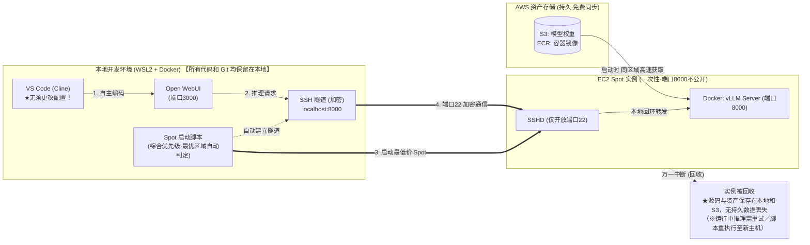

## 前言

在上一篇文章（[自建 vLLM 通过 Open WebUI 连接到 VS Code（Cline）！免令牌开发](/blogs/2026/09/29/vllm_openwebui_cline/)）中，我们采用了开源的 Web UI 与 API 网关 “Open WebUI”，将自建 vLLM 服务器在 AWS 上运行，并直接作为 VS Code 扩展 “Cline” 的后端。

在上次的测试中，我们探讨了“团队 3～5 人共享一台 GPU 服务器（g6.xlarge）”的运维模型，并确认了其实用的性价比。然而，随着团队开发的深入，也出现了如下问题与需求：

* 请求集中时初始速度下降：多名成员同时发起代码生成或测试请求时，会出现排队或流式传输速度下降。
* 专属环境需求：希望无视他人使用状况，始终以 GPU 全性能进行高速试验。

但若给每位成员都分配一台按需实例（约 $1.38/h ≒ 约 228 日元/h，1 美元=165 日元），基础设施费用将大幅飙升。

因此，我们关注到了云上闲置容量的利用——**EC2 Spot 实例**。

此外，除了实际解决成本问题，我个人还有一个强烈动机：**“在 AWS 认证考试中频出 Spot 实例，真想实战用一次！”**。在准备 AWS 认证（如 SAA、SAP 等）时，试题和解答往往都会出现“对无状态或具备容错性的批处理使用 Spot 实例以大幅削减成本”的经典模式。“虽说知识上理解，也考试常见，但还没在手边实际实现中断处理并投入实战……想一次用透！”的好奇心也推波助澜。

使用 Spot 实例，在测试时市价相比按需实例可 **约 60% 折扣（每小时约 80～90 日元）**。在此价格下，不妨采用“各自仅在所需时刻启动专属 GPU，用完即弃”的短时使用模式，从而用不超过全天维持一台按需实例的成本来运营。

当然，Spot 实例会伴随 “AWS 需求激增时可能被突击回收（中断）” 的风险。但本系列已构建的 **“模型存 S3，容器存 ECR，服务器与 EBS 全部一次性（临时化）”** 架构，使得源代码与 Git 历史都保存在本地，Spot 中断不会导致开发资产丢失。唯运行中推理请求或服务器端暂存数据可能丢失，需依赖频繁 Git 提交与基于重试的设计。

也就是说，**临时化设计与 Spot 实例是兼顾中断风险与成本优势的绝佳组合**。

本文将介绍如何在 Spot 实例上稳定运行此临时化 vLLM 环境，并解读**“综合考量价格、容量与中断耐性进行多区域优先级自动判定”**的实现思路。

:::info
**📚 过往系列文章一览**  
如需了解前置知识或过往进展，请一并查阅：
* **想了解基础架构（UserData×S3 的临时化自动构建）**：  
  第1回：[AWS×UserData 自动启动 vLLM！停止时成本几乎为零的本地 LLM 环境](/blogs/2026/09/16/vllm_autolaunch/)
* **想了解 Open WebUI 与 VS Code（Cline）的联动配置**：  
  第2回：[自建 vLLM 通过 Open WebUI 连接到 VS Code（Cline）！免令牌开发](/blogs/2026/09/29/vllm_openwebui_cline/)
:::

---

## Spot 实例的成本削减效果与注意事项

> **📌 本节要点**  
> 利用 `g6.xlarge`（NVIDIA L4 24GB）作为 Spot 实例，在测试时市价可比按需实例便宜约 60%（每小时约 80～90 日元），但 Spot 价格会随供需、时段实时波动，“并非始终保证此折扣”，且前提需以短时集中使用为主。

首先，来看测试时东京区域（`ap-northeast-1`）的价格情况。

| 实例类型 | GPU 规格 | 世代／判定 | 按需费用 (USD/h) | Spot 折扣率（测试时） | Spot 费用 (USD/h) | 日元 (1$=165¥) |
| :--- | :--- | :--- | :--- | :--- | :--- | :--- |
| **g6.xlarge (★首选 推荐)** | NVIDIA L4 (24GB VRAM) | **现行世代 (Current)** | 约 $1.38/h | **约 60% OFF** | **约 $0.55/h** | **约 91 日元/h** |
| **g5.xlarge (参考)** | NVIDIA A10G (24GB VRAM) | 前一世代 (Previous) | 约 $1.41/h | 约 65% OFF | 约 $0.49/h | 约 81 日元/h |
| **g4dn.xlarge (参考)** | NVIDIA T4 (16GB VRAM) | 更前世代 (VRAM 不足) | 约 $0.71/h | 约 65% OFF | 约 $0.25/h | 约 41 日元/h |

*以上数据为撰写时（2026 年 9 月）的实测值。Spot 价格与折扣率会随 AWS 全域供需、时段、区域实时变动。汇率按实际 1 美元=165 日元（汇率 160 日元+手续费）估算。*

:::info
**💡 实例类型选择理由（本测试推荐 g6.xlarge）**  
* **g4dn (16GB)**：模型权重 (~15GB) 即接近满载，无法容纳 AI 编码代理的长上下文 (KV 缓存)，易 OOM（内存不足）。  
* **g5 (24GB) vs g6 (24GB)**：对本文测试场景，Ada Lovelace 世代的 `g6.xlarge` 推理效率高且定价更低，是最佳平衡。但各区域库存与 Spot 价格不同，旧世代 `g5` 可能在某些区域更易获取、更具成本优势。  
:::

### 💡 停止时的维护成本（S3 & ECR 存储约每月数百日元）

临时化运维核心——“模型存 S3”与“容器存 ECR” 的维护费用几乎可忽略：  
* **S3 Standard 存储（模型权重）**：15GB × $0.025 = **约 $0.38/月（约 62 日元/月）**（分散至 3 区域约 176 日元/月）  
* **ECR 存储（容器镜像）**：约 10–15GB × $0.10/GB = **约 $1.0–$1.5/月（约 165–248 日元/月）**  
* **数据传输费（S3/ECR → EC2）**：同区域内**完全免费（0 日元）**  
* **相比持续持有 EBS**：若持续保留等量 EBS (gp3)，每月将支付约 1,600 日元的高额卷费；模型与容器迁移至 S3/ECR 并彻底丢弃 EC2/EBS，停止时维护成本可降至 **约每月数百日元**。

### ⚠️ “一人一台专属”是否真的便宜，取决于运行率（使用方式）

需注意，**“一人一台专属环境比共享服务器更便宜，仅限每人短时使用（1–2 小时），用完立即终止”** 才成立。

| 运行模型 | 预期使用模式 | 月度成本估算（5 人团队） | 适用场景 |
| :--- | :--- | :--- | :--- |
| **A. 共享按需一台** | 工作日白天（8h/天 × 20 天）全天运行 | 约 $1.38 × 160h ≒ **约 $220/月（约 3.6 万日元）** | 需零启动等待、有人持续使用的团队 |
| **B. Spot 一人一台（短时集中）** | 每人每天仅启动 2h (2h×5 人×20 天) | 约 $0.55 × 200h ≒ **约 $110/月（约 1.8 万日元）** | 个人开发或集中测试最佳 |
| **C. Spot 一人一台（全天闲置）** | 5 人全天 (8h/天) 持续运行 | 约 $0.55 × 800h ≒ **约 $440/月（约 7.3 万日元）** | **❌ 成本反转！** 远高于共享一台 |

若因“Spot 就便宜”而长时间闲置，或全员全天保持实例，即便配置了闲置自动终止守护进程，**共享一台按需实例（或使用 Reserved Instances/Savings Plans）在总成本与运维负担上更具优势**。

因此，本文推荐的“一人一台 Spot 运维”是**“手边一键启动，作业结束后立刻终止的临时化工作流”**能够真正落地的个人或团队的最佳方案。

---

## Spot 运维的挑战与现实应对

> **📌 本节要点**  
> 针对 Spot 运维两大挑战——“突发中断”与“库存枯竭／价格波动”，通过临时化设计（最小化持久数据损失）与多区域自动探索，实现实用级别的稳定性。

在将 Spot 实例用于实战时，不可回避的两大难题，本架构如何巧妙化解如下。

(因篇幅所限，后续内容将分段继续…)
