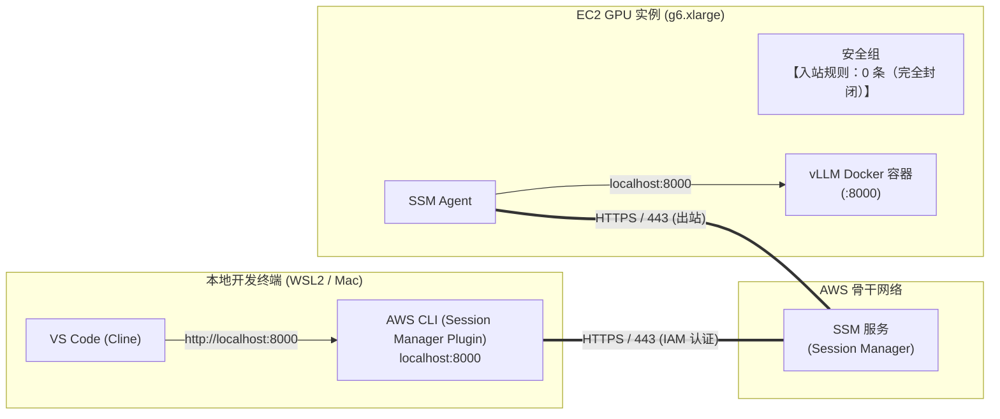

## 介绍

在上一篇文章（[EC2 Spot 实例×vLLM 大幅削减 GPU 成本](/blogs/2026/10/02/vllm_spot_instance/)）中，我们引入了兼顾时差、价格和中断容忍度的“多区域综合优先级自动选择”机制，以每小时仅约 80～90 日元的超低价格获取 `g6.xlarge`（NVIDIA L4 24GB）Spot 实例。由此，我们实现了只在需要时快速启动、完成后立即销毁的短暂（ephemeral）开发模式，彻底摆脱了昂贵的云端 GPU 固定成本。

但是，到第 3 回的运维架构中，仍有两个不可忽视的安全与管理难题：

1. **开放端口 22（SSH）的风险**  
   由于通过 SSH 隧道（转发本地端口 8000）访问实例，必须在安全组里允许入站端口 22。即便做了 IP 限制，每当在家中、办公室或远程环境切换公网 IP 时，都要不停更新安全组，运维极为繁琐。

2. **SSH 私钥（`.pem`）的管理负担**  
   对于要探索的多个区域（东京、俄勒冈、弗吉尼亚等），都必须事先创建各自的密钥对，并在本地安全地保存和管理私钥文件。密钥轮换、丢失风险或误提交到 Git 的担忧，让人心力交瘁。

本次我们将引入 AWS 管理服务 **“AWS Systems Manager (SSM) Session Manager” 的端口转发功能**。  
借助它，可以在**安全组保持“入站规则 0 条”（完全封闭）**的前提下，通过 SSM 安全地将本地 PC 的 8000 端口和 EC2 实例上运行的 vLLM 容器（端口 8000）打通，并彻底取消 SSH 私钥管理。下面将详细讲解这一方案的实现步骤。

:::info
**📚 相关往期文章**  
* **第1回（基础架构）** : [使用 AWS×UserData 自动启动 vLLM！停止时几乎零成本的本地 LLM 环境](/blogs/2026/09/16/vllm_autolaunch/)  
* **第2回（Cline 联动）** : [自建 vLLM 通过 Open WebUI 连接 VS Code（Cline）！免 Token 开发](/blogs/2026/09/29/vllm_openwebui_cline/)  
* **第3回（Spot 实例）** : [EC2 Spot 实例×vLLM 大幅削减 GPU 成本](/blogs/2026/10/02/vllm_spot_instance/)  
:::

---

## 为什么要从 SSH 切换到 SSM 端口转发？

> **📌 本节要点**  
> 采用 SSM 端口转发后，可以同时实现“入站全封闭（零端口开放）”和“彻底取消 SSH 私钥管理”。所有连接授权由 AWS IAM 统一管控，并自动在 CloudTrail 中留下审计日志。

### 1. 零端口开放（无需任何入站规则）

传统 SSH 连接需要在 EC2 安全组中允许入站端口 22。  
而 SSM Session Manager 的架构是：**在 EC2 实例内部运行的 SSM Agent 会主动向 AWS SSM 端点发起外向的 WebSocket 连接（HTTPS/443 出站）**。



这样，EC2 的安全组可以没有任何入站规则（入站 0 条），从网络层面完全阻断外部的端口扫描和暴力破解攻击，将入站攻击面降到最低。

### 2. 彻底取消 SSH 私钥（`.pem`）管理

像第3回那样在俄勒冈、弗吉尼亚等多区域启动实例时，需要为每个区域创建密钥对，并在本地保管私钥。密钥轮换、丢失、误提交等风险让人头痛。  

使用 SSM 端口转发后，认证与授权完全整合到 **AWS IAM**。开发者使用本地 `aws configure` 或 SSO（IAM Identity Center）配置的 AWS 凭证（访问密钥、会话令牌）启动会话，**无需任何 SSH 私钥**。

### 3. SSH 隧道 vs. SSM 端口转发对比

| 项目                 | 传统 SSH 隧道 (第3回)           | SSM 端口转发 (本次)                  | 优势                                          |
| -------------------- | ---------------------------- | ----------------------------------- | --------------------------------------------- |
| 入站端口             | 必须开放 22                  | **完全封闭（零端口）**              | 从互联网彻底切断直接入侵路径                  |
| 源 IP 限制           | 每次 IP 变更需更新安全组      | **无需**（由 IAM 认证保护）          | 远程办公也无须频繁变更 IP                     |
| 密钥管理             | 每区维护 `.pem` 私钥         | **无需（无密钥方案）**              | 免除私钥存储、轮换及丢失风险                  |
| 审计日志             | 需在服务器端额外收集 SSH 日志 | **自动记录到 CloudTrail / CloudWatch** | 自动留下何时谁发起了会话的审计痕迹            |
| 多区域部署           | 每区需单独创建 KeyName       | **全区域通用，无需额外设置**        | 脚本可移植性和自动化更佳                      |

---

## 前提条件与本地环境准备

要使用 SSM 端口转发，需要在本地安装 `session-manager-plugin`。

### 安装 Session Manager Plugin

根据官方文档执行以下步骤：

Ubuntu / WSL2:
```bash
curl "https://s3.amazonaws.com/session-manager-downloads/plugin/latest/ubuntu_64bit/session-manager-plugin.deb" -o "session-manager-plugin.deb"
sudo dpkg -i session-manager-plugin.deb
rm session-manager-plugin.deb
```

macOS (Homebrew):
```bash
brew install --cask session-manager-plugin
```

Windows:
```powershell
winget install Amazon.SessionManagerPlugin
```

安装完成后，执行：
```bash
session-manager-plugin
# 若输出 “The Session Manager plugin is installed successfully. Use the AWS CLI to start a session.” 即表示安装成功
```

---

## AWS 资源预先设置

要通过 SSM 建立连接，需要在每个区域准备以下两项资源：

1. IAM 实例配置文件：让 EC2 实例上的 SSM Agent 能与 AWS SSM 服务通信的角色（附带 `AmazonSSMManagedInstanceCore` 策略）。  
2. 入站完全封闭的安全组：只有出站规则、入站规则为 0 的安全组（命名为 `vllm-ssm-isolated-sg`）。

下面提供了一个脚本，一键在所有候选区域创建上述资源。

<details><summary>00_setup_ssm_assets.sh（点击展开）</summary>

```bash
#!/bin/bash
set -euo pipefail

# ==============================================================================
# 00_setup_ssm_assets.sh
# 为 SSM 端口转发在各区域创建 IAM 角色及入站完全封闭的安全组
# ==============================================================================

ROLE_NAME="vllm-ssm-instance-role"
PROFILE_NAME="vllm-ssm-instance-profile"
SG_NAME="vllm-ssm-isolated-sg"
REGIONS=("ap-northeast-1" "us-west-2" "us-east-1" "us-east-2" "eu-central-1")

echo "=== 1. 创建 IAM 角色 & 实例配置文件 ==="

# 信任策略 (EC2)
TRUST_POLICY='{
  "Version": "2012-10-17",
  "Statement": [
    {
      "Effect": "Allow",
      "Principal": { "Service": "ec2.amazonaws.com" },
      "Action": "sts:AssumeRole"
    }
  ]
}'

# 如果角色不存在则创建
if ! aws iam get-role --role-name "${ROLE_NAME}" >/dev/null 2>&1; then
    echo "正在创建 IAM 角色 ${ROLE_NAME}..."
    aws iam create-role --role-name "${ROLE_NAME}" --assume-role-policy-document "${TRUST_POLICY}"
    # 附加 SSM 管理策略
    aws iam attach-role-policy --role-name "${ROLE_NAME}" \
        --policy-arn "arn:aws:iam::aws:policy/AmazonSSMManagedInstanceCore"
    # S3 模型读取权限
    aws iam attach-role-policy --role-name "${ROLE_NAME}" \
        --policy-arn "arn:aws:iam::aws:policy/AmazonS3ReadOnlyAccess"
    # ECR 容器读取权限
    aws iam attach-role-policy --role-name "${ROLE_NAME}" \
        --policy-arn "arn:aws:iam::aws:policy/AmazonEC2ContainerRegistryReadOnly"
else
    echo "IAM 角色 ${ROLE_NAME} 已存在。"
fi

# 如果实例配置文件不存在则创建并关联角色
if ! aws iam get-instance-profile --instance-profile-name "${PROFILE_NAME}" >/dev/null 2>&1; then
    echo "正在创建实例配置文件 ${PROFILE_NAME}..."
    aws iam create-instance-profile --instance-profile-name "${PROFILE_NAME}"
    aws iam add-role-to-instance-profile --instance-profile-name "${PROFILE_NAME}" --role-name "${ROLE_NAME}"
    echo "等待 IAM 实例配置文件生效 (10 秒)..."
    sleep 10
else
    echo "实例配置文件 ${PROFILE_NAME} 已存在。"
fi

echo "=== 2. 在各区域创建入站完全封闭的安全组 ==="
for REGION in "${REGIONS[@]}"; do
    echo "检查区域 [${REGION}]..."
    VPC_ID=$(aws ec2 describe-vpcs --region "${REGION}" --filters "Name=is-default,Values=true" --query "Vpcs[0].VpcId" --output text)
    
    EXISTING_SG=$(aws ec2 describe-security-groups --region "${REGION}" --filters "Name=group-name,Values=${SG_NAME}" --query "SecurityGroups[0].GroupId" --output text 2>/dev/null || true)
    
    if [ -z "${EXISTING_SG}" ] || [ "${EXISTING_SG}" = "None" ]; then
        echo "  在 VPC (${VPC_ID}) 中创建 ${SG_NAME}..."
        SG_ID=$(aws ec2 create-security-group \
            --region "${REGION}" \
            --group-name "${SG_NAME}" \
            --description "Zero-inbound security group for vLLM SSM port forwarding" \
            --vpc-id "${VPC_ID}" \
            --query "GroupId" --output text)
        
        # 默认允许所有出站，不添加任何入站规则（端口开放为零）
        echo "  创建完成: ${SG_ID} (入站规则：0 条)"
    else
        echo "  已存在: ${EXISTING_SG}"
    fi
done

echo "预置资源创建完成！"
```

</details>

执行此脚本后，各区域将拥有：  
- 入站规则为 0 条的安全组 `vllm-ssm-isolated-sg`  
- 可与 SSM 通信的实例配置文件 `vllm-ssm-instance-profile`

---

## 启动脚本的 SSM 支持

我们基于第3回的启动脚本 `01_ec2_launch_spot_and_sync_openwebui.sh`，编写了新的脚本 `01_start_vllm_ssm.sh`，将 SSH 连接改为 SSM 端口转发。

### 主要变更点

1. 移除 SSH 密钥指定：删除 `--key-name` 参数  
2. 指定 IAM 实例配置文件和入站全封闭的安全组：  
   `--iam-instance-profile Name=vllm-ssm-instance-profile` 与 `--security-group-ids vllm-ssm-isolated-sg`  
3. 等待 SSM Agent 在线：用 `aws ssm describe-instance-information` 查询 `PingStatus == "Online"`  
4. 建立 SSM 端口转发会话：  
```bash
aws ssm start-session \
    --region "${AWS_REGION}" \
    --target "${INSTANCE_ID}" \
    --document-name AWS-StartPortForwardingSession \
    --parameters '{"portNumber":["8000"],"localPortNumber":["8000"]}'
```

### 完整脚本：`01_start_vllm_ssm.sh`

<details><summary>01_start_vllm_ssm.sh（点击展开）</summary>

```bash
#!/bin/bash
set -euo pipefail

# ==============================================================================
# 01_start_vllm_ssm.sh
# 探索并启动 Spot 实例，通过 SSM 端口转发安全直连 vLLM
# ==============================================================================

SCRIPT_DIR="$(cd "$(dirname "${BASH_SOURCE[0]}")" && pwd)"
USER_DATA_FILE="${USER_DATA_FILE:-${SCRIPT_DIR}/02_ec2_userdata.sh}"
INSTANCE_STATE_FILE="${SCRIPT_DIR}/.current_instance_id"
TUNNEL_PID_FILE="${SCRIPT_DIR}/.current_tunnel_pid"
REGION_STATE_FILE="${SCRIPT_DIR}/.current_region"
TUNNEL_LOG="${SCRIPT_DIR}/.current_tunnel.log"

CANDIDATE_REGIONS=("ap-northeast-1" "us-west-2" "us-east-1" "us-east-2" "eu-central-1")
CANDIDATE_INSTANCE_TYPES=("g6.xlarge")
IAM_PROFILE_NAME="vllm-ssm-instance-profile"
SG_NAME="vllm-ssm-isolated-sg"
EBS_SIZE_GB="40"

echo "=== 1. 多区域 Spot 综合优先级探索 ==="
ITYPE="${CANDIDATE_INSTANCE_TYPES[0]}"
START_TIME="$(date -u +%Y-%m-%dT%H:%M:%SZ)"

# 从 Spot Advisor 获取中断频率
declare -A REGION_INTR_TIERS
PY_BIN=""
command -v python3 >/dev/null 2>&1 && PY_BIN="python3" || (command -v python >/dev/null 2>&1 && PY_BIN="python")
if [ -n "${PY_BIN}" ]; then
    ADVISOR_DATA=$("${PY_BIN}" -c "
import urllib.request, json
try:
    with urllib.request.urlopen('https://spot-bid-advisor.s3.amazonaws.com/spot-advisor-data.json', timeout=4) as res:
        adv = json.loads(res.read()).get('spot_advisor', {})
        for r, info in adv.items():
            print(f'{r}:{info.get(\"Linux\", {}).get(\"${ITYPE}\", {}).get(\"r\", 4)}')
except Exception: pass
" 2>/dev/null || true)
    while IFS=':' read -r r_id r_tier; do
        r_id=$(echo "${r_id}" | tr -d '[:space:]')
        r_tier=$(echo "${r_tier}" | tr -d '[:space:]')
        [ -n "${r_id}" ] && REGION_INTR_TIERS["${r_id}"]="${r_tier}"
    done <<< "${ADVISOR_DATA}"
fi

declare -A REG_STATUS REG_MIN_PRICES REG_AZ_COUNTS REG_SCORES REG_RANKS
BEST_PRICE="999.0"

for REGION in "${CANDIDATE_REGIONS[@]}"; do
    RAW_PRICES=$(aws ec2 describe-spot-price-history \
        --region "${REGION}" \
        --instance-types "${ITYPE}" \
        --product-descriptions "Linux/UNIX" \
        --start-time "${START_TIME}" \
        --no-paginate \
        --query 'SpotPriceHistory[*].[AvailabilityZone, SpotPrice]' \
        --output text 2>/dev/null | tr -d '\r' || true)

    if [ -z "${RAW_PRICES}" ]; then
        REG_STATUS["${REGION}"]="unavailable"
        continue
    fi

    REG_MIN_PRICE="999.0"
    AZ_COUNT=0
    while read -r AZ PRICE; do
        AZ=$(echo "${AZ}" | tr -d '[:space:]')
        PRICE=$(echo "${PRICE}" | tr -d '[:space:]')
        [ -z "${AZ}" ] || [ -z "${PRICE}" ] && continue
        AZ_COUNT=$((AZ_COUNT + 1))
        if awk -v p="${PRICE}" -v m="${REG_MIN_PRICE}" 'BEGIN {exit !(p < m)}'; then
            REG_MIN_PRICE="${PRICE}"
        fi
    done <<< "${RAW_PRICES}"

    if [ "${REG_MIN_PRICE}" = "999.0" ]; then
        REG_STATUS["${REGION}"]="unavailable"
        continue
    fi

    REG_STATUS["${REGION}"]="ok"
    REG_MIN_PRICES["${REGION}"]="${REG_MIN_PRICE}"
    REG_AZ_COUNTS["${REGION}"]="${AZ_COUNT}"

    if awk -v p="${REG_MIN_PRICE}" -v m="${BEST_PRICE}" 'BEGIN {exit !(p < m)}'; then
        BEST_PRICE="${REG_MIN_PRICE}"
    fi
done

# 计算评分（价格 40 + 中断 20 + 可用 AZ 40 = 100 分）
for REGION in "${CANDIDATE_REGIONS[@]}"; do
    if [ "${REG_STATUS[${REGION}]:-}" != "ok" ]; then
        echo "  - [${REGION}]: 无库存或未提供"
        continue
    fi

    PRICE="${REG_MIN_PRICES[${REGION}]}"
    TIER="${REGION_INTR_TIERS[${REGION}]:-4}"
    AZ_COUNT="${REG_AZ_COUNTS[${REGION}]}"

    # 价格得分 (最高40)
    P_SCORE=$(awk -v min="${BEST_PRICE}" -v cur="${PRICE}" 'BEGIN {printf "%.0f", 40*(min/cur)}')

    # 中断得分 (最高20)
    case "${TIER}" in
        0) I_SCORE=20; I_TEXT="<5% (极低)" ;;
        1) I_SCORE=15; I_TEXT="5-10% (低)" ;;
        2) I_SCORE=10; I_TEXT="10-15% (中)" ;;
        3) I_SCORE=5;  I_TEXT="15-20% (中高)" ;;
        *) I_SCORE=0;  I_TEXT=">20% (高)" ;;
    esac

    # 可用 AZ 得分 (最高40)
    if [ "${AZ_COUNT}" -ge 5 ]; then C_SCORE=40
    elif [ "${AZ_COUNT}" -eq 4 ]; then C_SCORE=32
    elif [ "${AZ_COUNT}" -eq 3 ]; then C_SCORE=24
    elif [ "${AZ_COUNT}" -eq 2 ]; then C_SCORE=16
    else C_SCORE=8
    fi

    TOTAL_SCORE=$((P_SCORE + I_SCORE + C_SCORE))
    REG_SCORES["${REGION}"]="${TOTAL_SCORE}"

    if [ "${TOTAL_SCORE}" -ge 75 ]; then RANK="Rank S"
    elif [ "${TOTAL_SCORE}" -ge 65 ]; then RANK="Rank A"
    elif [ "${TOTAL_SCORE}" -ge 50 ]; then RANK="Rank B"
    else RANK="Rank C"
    fi
    REG_RANKS["${REGION}"]="${RANK}"

    PRICE_FMT=$(awk -v p="${PRICE}" 'BEGIN {printf "%.4f", p}')
    echo "  - [${REGION}] 价格=\$${PRICE_FMT}/h, 中断率=${I_TEXT}, 可用AZ=${AZ_COUNT} -> 总分: ${TOTAL_SCORE} (${RANK})"
done

# 按得分降序排序
SORTED_REGIONS=($(for r in "${!REG_SCORES[@]}"; do echo "$r ${REG_SCORES[$r]}"; done | sort -k2 -nr | awk '{print $1}'))

echo "----------------------------------------------------------"
echo "综合优先级排行："
for i in "${!SORTED_REGIONS[@]}"; do
    r="${SORTED_REGIONS[$i]}"
    echo "  第$((i+1))位: ${r} (${REG_RANKS[$r]} / ${REG_SCORES[$r]} 分, 最低价: \$${REG_MIN_PRICES[$r]}/h)"
done
echo "----------------------------------------------------------"

# --- 2. 尝试启动 Spot 实例 ---
echo "=== 2. 尝试启动 Spot 实例 ==="
SELECTED_REGION=""
INSTANCE_ID=""

for REGION in "${SORTED_REGIONS[@]}"; do
    echo "在区域 [${REGION}] 尝试启动 Spot..."
    
    SG_ID=$(aws ec2 describe-security-groups --region "${REGION}" --filters "Name=group-name,Values=${SG_NAME}" --query "SecurityGroups[0].GroupId" --output text 2>/dev/null || true)
    if [ -z "${SG_ID}" ] || [ "${SG_ID}" = "None" ]; then
        echo "  警告：在 ${REGION} 未找到 ${SG_NAME}，跳过。"
        continue
    fi

    AMI_ID=$(aws ec2 describe-images \
        --region "${REGION}" \
        --owners amazon \
        --filters "Name=name,Values=Deep Learning OSS Nvidia Driver AMI GPU PyTorch * (Ubuntu 22.04)*" "Name=state,Values=available" \
        --query 'sort_by(Images,&CreationDate)[-1].ImageId' \
        --output text 2>/dev/null || true)

    AWS_ACCOUNT_ID=$(aws sts get-caller-identity --query Account --output text 2>/dev/null || echo "")
    S3_BUCKET_NAME="my-vllm-models-hackathon-2026-${AWS_ACCOUNT_ID}-${REGION}-an"
    DOCKER_IMAGE="${AWS_ACCOUNT_ID}.dkr.ecr.${REGION}.amazonaws.com/vllm-openai:latest"
    TMP_USERDATA=$(mktemp)
    sed -e "s|^AWS_REGION=.*|AWS_REGION=\"${REGION}\"|" \
        -e "s|^S3_BUCKET_NAME=.*|S3_BUCKET_NAME=\"${S3_BUCKET_NAME}\"|" \
        -e "s|^DOCKER_IMAGE=.*|DOCKER_IMAGE=\"${DOCKER_IMAGE}\"|" \
        "${USER_DATA_FILE}" > "${TMP_USERDATA}"

    LAUNCH_RES=$(aws ec2 run-instances \
        --region "${REGION}" \
        --image-id "${AMI_ID}" \
        --instance-type "${ITYPE}" \
        --iam-instance-profile Name="${IAM_PROFILE_NAME}" \
        --security-group-ids "${SG_ID}" \
        --instance-market-options '{"MarketType":"spot","SpotOptions":{"SpotInstanceType":"one-time","InstanceInterruptionBehavior":"terminate"}}' \
        --block-device-mappings "[{\"DeviceName\":\"/dev/sda1\",\"Ebs\":{\"VolumeSize\":${EBS_SIZE_GB},\"VolumeType\":\"gp3\",\"DeleteOnTermination\":true}}]" \
        --user-data "file://${TMP_USERDATA}" \
        --tag-specifications "ResourceType=instance,Tags=[{Key=Name,Value=vllm-ssm-spot-node}]" \
        --query "Instances[0].InstanceId" \
        --output text 2>&1 || true)
    rm -f "${TMP_USERDATA}"

    if [[ "${LAUNCH_RES}" =~ ^i-[0-9a-f]+$ ]]; then
        INSTANCE_ID="${LAUNCH_RES}"
        SELECTED_REGION="${REGION}"
        echo "  启动成功！实例 ID: ${INSTANCE_ID} (${SELECTED_REGION})"
        break
    else
        echo "  因容量不足或错误跳过：${LAUNCH_RES}"
    fi
done

if [ -z "${INSTANCE_ID}" ]; then
    echo "错误：所有候选区域 Spot 启动失败。"
    exit 1
fi

echo "${INSTANCE_ID}" > "${INSTANCE_STATE_FILE}"
echo "${SELECTED_REGION}" > "${REGION_STATE_FILE}"

echo "等待实例切换到 running 状态..."
aws ec2 wait instance-running --region "${SELECTED_REGION}" --instance-ids "${INSTANCE_ID}"

# 在 Git Bash 下添加 SessionManagerPlugin 路径
if [ -d "/c/Program Files/Amazon/SessionManagerPlugin/bin" ]; then
    export PATH="${PATH}:/c/Program Files/Amazon/SessionManagerPlugin/bin"
fi

# --- 3. 等待 SSM Agent 在线 ---
echo "=== 3. 等待 SSM Agent 在线 ==="
echo "正在等待 EC2 内部的 SSM Agent 建立连接..."
SSM_OK=false
for i in {1..30}; do
    STATUS=$(aws ssm describe-instance-information \
        --region "${SELECTED_REGION}" \
        --filters "Key=InstanceIds,Values=${INSTANCE_ID}" \
        --query "InstanceInformationList[0].PingStatus" \
        --output text 2>/dev/null || true)
    
    if [ "${STATUS}" = "Online" ]; then
        echo " SSM Agent 已在线！（第 ${i} 次尝试）"
        SSM_OK=true
        break
    fi
    echo -n "."
    sleep 3
done
echo ""

if [ "${SSM_OK}" != "true" ]; then
    echo "错误：SSM Agent 未能在线。请检查 IAM 角色和出站通信设置。"
    exit 1
fi

# --- 4. 等待服务器端 vLLM 启动 (http://127.0.0.1:8000/health) ---
echo "=== 4. 等待服务器端 vLLM 启动 (http://127.0.0.1:8000/health) ==="
echo "通过 UserData 下载模型并启动 vLLM（通常需 2~4 分钟）..."
SERVER_READY=false
for i in {1..90}; do
    CMD_ID=$(aws ssm send-command \
        --region "${SELECTED_REGION}" \
        --instance-ids "${INSTANCE_ID}" \
        --document-name "AWS-RunShellScript" \
        --parameters 'commands=["curl -s -m 2 http://127.0.0.1:8000/health >/dev/null && echo OK || echo WAITING"]' \
        --query "Command.CommandId" \
        --output text 2>/dev/null || true)
    
    if [ -n "${CMD_ID}" ]; then
        sleep 2
        RES=$(aws ssm get-command-invocation \
            --region "${SELECTED_REGION}" \
            --command-id "${CMD_ID}" \
            --instance-id "${INSTANCE_ID}" \
            --query "StandardOutputContent" \
            --output text 2>/dev/null || true)
        if [[ "${RES}" =~ "OK" ]]; then
            echo "  服务器端 vLLM 已正常响应！"
            SERVER_READY=true
            break
        fi
    fi
    echo -n "."
    sleep 5
done
echo ""

if [ "${SERVER_READY}" != "true" ]; then
    echo "警告：服务器端 vLLM 启动等待超时。请检查 UserData 日志。"
fi

# --- 5. 清理旧隧道并建立新的 SSM 端口转发 ---
echo "=== 5. 建立 SSM 端口转发（零端口开放隧道） ==="
if [ -f "${TUNNEL_PID_FILE}" ]; then
    OLD_PID=$(cat "${TUNNEL_PID_FILE}" | tr -d '[:space:]')
    if [ -n "${OLD_PID}" ] && ps -p "${OLD_PID}" > /dev/null 2>&1; then
        echo "正在终止旧的端口转发进程 (PID: ${OLD_PID})..."
        kill -9 "${OLD_PID}" 2>/dev/null || true
    fi
    rm -f "${TUNNEL_PID_FILE}"
fi
pkill -f "AWS-StartPortForwardingSession.*8000" 2>/dev/null || true

# 后台启动 SSM 端口转发，并将日志输出到 .current_tunnel.log
nohup aws ssm start-session \
    --region "${SELECTED_REGION}" \
    --target "${INSTANCE_ID}" \
    --document-name AWS-StartPortForwardingSession \
    --parameters '{"portNumber":["8000"],"localPortNumber":["8000"]}' \
    > "${TUNNEL_LOG}" 2>&1 &

TUNNEL_PID=$!
echo "${TUNNEL_PID}" > "${TUNNEL_PID_FILE}"
echo "已启动 SSM 端口转发 (PID: ${TUNNEL_PID})"
sleep 2

# --- 6. 本地连通性检查 ---
echo "=== 6. 本地连通性检查 (http://localhost:8000/health) ==="
LOCAL_OK=false
for i in {1..10}; do
    if curl -s -m 3 "http://localhost:8000/health" > /dev/null 2>&1; then
        echo " 本地直连测试通过！ (HTTP 200 OK)"
        LOCAL_OK=true
        break
    fi
    echo -n "."
    sleep 2
done
echo ""

if [ "${LOCAL_OK}" != "true" ]; then
    echo "警告：本地连接失败。请检查隧道日志："
    cat "${TUNNEL_LOG}" 2>/dev/null || true
fi

echo "=========================================================="
echo " 零端口开放 SSM 环境启动完成！"
echo " EC2 实例 ID  : ${INSTANCE_ID} (Spot, 区域: ${SELECTED_REGION})"
echo " 安全组       : 入站规则 0 条（完全封闭）"
echo " 隧道连接     : localhost:8000 -> EC2:8000 (SSM 加密)"
echo " Web UI / API: http://localhost:8000/v1"
echo ""
echo "请在 VS Code 的 Cline 中使用 Base URL: http://localhost:8000/v1 进行连接"
echo "测试结束后，请执行以下命令彻底销毁："
echo "  ./02_stop_vllm_ssm.sh"
echo "=========================================================="
```

</details>

---

## 实际运行演示

### 1. 执行启动脚本

运行脚本后，会自动完成多区域探索、Spot 实例启动、等待 SSM Agent 在线、等待服务器端 vLLM 启动及端口转发建立等所有步骤。

```bash
$ ./01_start_vllm_ssm.sh
=== 1. 多区域 Spot 综合优先级探索 ===
  - [ap-northeast-1] 价格=$0.5510/h, 中断率=<5% (极低), 可用AZ=3 -> 总分: 72 (Rank A)
  - [us-west-2]    价格=$0.3850/h, 中断率=<5% (极低), 可用AZ=4 -> 总分: 92 (Rank S)
  - [us-east-1]    价格=$0.5830/h, 中断率=5-10% (低), 可用AZ=6 -> 总分: 81 (Rank S)
  - [us-east-2]    价格=$0.4210/h, 中断率=<5% (极低), 可用AZ=3 -> 总分: 80 (Rank S)
  - [eu-central-1] 价格=$0.4120/h, 中断率=<5% (极低), 可用AZ=3 -> 总分: 81 (Rank S)
----------------------------------------------------------
综合优先级排行：
  第1位: us-west-2 (Rank S / 92 分, 最低价: $0.3850/h)
  第2位: us-east-1 (Rank S / 81 分, 最低价: $0.5830/h)
  第3位: eu-central-1 (Rank S / 81 分, 最低价: $0.4120/h)
  第4位: us-east-2 (Rank S / 80 分, 最低价: $0.4210/h)
  第5位: ap-northeast-1 (Rank A / 72 分, 最低价: $0.5510/h)
----------------------------------------------------------
=== 2. 尝试启动 Spot 实例 ===
在区域 [us-west-2] 尝试启动 Spot...
  启动成功！实例 ID: i-0abc12345678def01 (us-west-2)
等待实例切换到 running 状态...

=== 3. 等待 SSM Agent 在线 ===
正在等待 EC2 内部的 SSM Agent 建立连接...
..... SSM Agent 已在线！（第 5 次尝试）

=== 4. 等待服务器端 vLLM 启动 (http://127.0.0.1:8000/health) ===
通过 UserData 下载模型并启动 vLLM（通常需 2~4 分钟）...
................................ 服务器端 vLLM 已正常响应！

=== 5. 建立 SSM 端口转发（零端口开放隧道） ===
已启动 SSM 端口转发 (PID: 41820)

=== 6. 本地连通性检查 (http://localhost:8000/health) ===
 本地直连测试通过！ (HTTP 200 OK)

==========================================================
 零端口开放 SSM 环境启动完成！
 EC2 实例 ID  : i-0abc12345678def01 (Spot, 区域: us-west-2)
 安全组       : 入站规则 0 条（完全封闭）
 隧道连接     : localhost:8000 -> EC2:8000 (SSM 加密)
 Web UI / API: http://localhost:8000/v1

 请在 VS Code 的 Cline 中使用 Base URL: http://localhost:8000/v1 进行连接
 测试结束后，请执行以下命令彻底销毁：
   ./02_stop_vllm_ssm.sh
==========================================================
```

### 2. 验证入站规则为 0

在 AWS 管理控制台或 CLI 中查看对应安全组，结果如下：

```bash
$ aws ec2 describe-security-groups \
    --region us-west-2 \
    --filters "Name=group-name,Values=vllm-ssm-isolated-sg" \
    --query "SecurityGroups[0].IpPermissions"
[]
```

输出为 `[]`，即**没有任何入站规则**。  
即使完全不开放任何端口，本地依然可以通过 `http://localhost:8000/v1/models` 获取模型信息：

```bash
$ curl -s http://localhost:8000/v1/models | jq .data[0].id
"Qwen/Qwen2.5-Coder-14B-Instruct-AWQ"
```

与传统 SSH 方案相比，这种零端口开放的体验在管理和安全性上都大幅提升。

---

## 完全销毁脚本

测试结束后，运行 `02_stop_vllm_ssm.sh` 脚本可彻底释放资源。

<details><summary>02_stop_vllm_ssm.sh（点击展开）</summary>

```bash
#!/bin/bash
set -euo pipefail

# ==============================================================================
# 02_stop_vllm_ssm.sh
# 结束 SSM 端口转发进程并完全销毁 Spot 实例
# ==============================================================================

SCRIPT_DIR="$(cd "$(dirname "${BASH_SOURCE[0]}")" && pwd)"
INSTANCE_STATE_FILE="${SCRIPT_DIR}/.current_instance_id"
TUNNEL_PID_FILE="${SCRIPT_DIR}/.current_tunnel_pid"
REGION_STATE_FILE="${SCRIPT_DIR}/.current_region"
TUNNEL_LOG="${SCRIPT_DIR}/.current_tunnel.log"

AWS_REGION=$(cat "${REGION_STATE_FILE}" 2>/dev/null | tr -d '[:space:]' || echo "ap-northeast-1")
INSTANCE_ID=$(cat "${INSTANCE_STATE_FILE}" 2>/dev/null | tr -d '[:space:]' || echo "${1:-}")

# 1. 结束 SSM 端口转发进程
echo "=== 1. 结束 SSM 端口转发进程 ==="
if [ -f "${TUNNEL_PID_FILE}" ]; then
    TUNNEL_PID=$(cat "${TUNNEL_PID_FILE}" | tr -d '[:space:]')
    if [ -n "${TUNNEL_PID}" ] && ps -p "${TUNNEL_PID}" > /dev/null 2>&1; then
        echo "正在结束 SSM 端口转发进程 (PID: ${TUNNEL_PID})..."
        kill -9 "${TUNNEL_PID}" 2>/dev/null || true
    fi
    rm -f "${TUNNEL_PID_FILE}"
fi
pkill -f "AWS-StartPortForwardingSession.*8000" 2>/dev/null || true

# 2. 终止 EC2 实例 (Terminate)
if [ -n "${INSTANCE_ID}" ]; then
    echo "=== 2. 终止 EC2 实例 ==="
    echo "目标实例 ID: ${INSTANCE_ID} (${AWS_REGION})"
    aws ec2 terminate-instances --region "${AWS_REGION}" --instance-ids "${INSTANCE_ID}" --output table
    echo "等待实例终止完成..."
    aws ec2 wait instance-terminated --region "${AWS_REGION}" --instance-ids "${INSTANCE_ID}"
fi

rm -f "${INSTANCE_STATE_FILE}" "${REGION_STATE_FILE}" "${TUNNEL_LOG}"
echo "=========================================================="
echo " Spot 实例、EBS 卷及 SSM 隧道已完全销毁！"
echo "=========================================================="
```

</details>

执行后，后台的端口转发进程将被终止，EC2 实例及其 EBS 将被终止，停止一切后续计费。

---

## 总结

本次我们对第3回构建的“多区域 Spot vLLM 环境”通信层进行了彻底革新，采用了 **AWS Systems Manager Session Manager 的端口转发**。  

- 实现了**零端口开放（入站全封闭）**，彻底切断外部端口扫描与直接攻击风险。  
- 完全取消了**SSH 密钥管理**，免去各区域密钥对创建、分发及丢失担忧。  
- 依托 IAM 进行访问控制与审计，通过 CloudTrail 自动记录会话启动日志，满足企业安全与合规需求。  
- 使用体验与以往无异：只需在本地访问 `localhost:8000`，即可在 Open WebUI 或 Cline 中无缝推理。  

至此，我们构建了一个既低成本又高度安全的 Spot GPU 开发环境。希望对想要安全高效使用 Spot GPU 的大家有所帮助！
