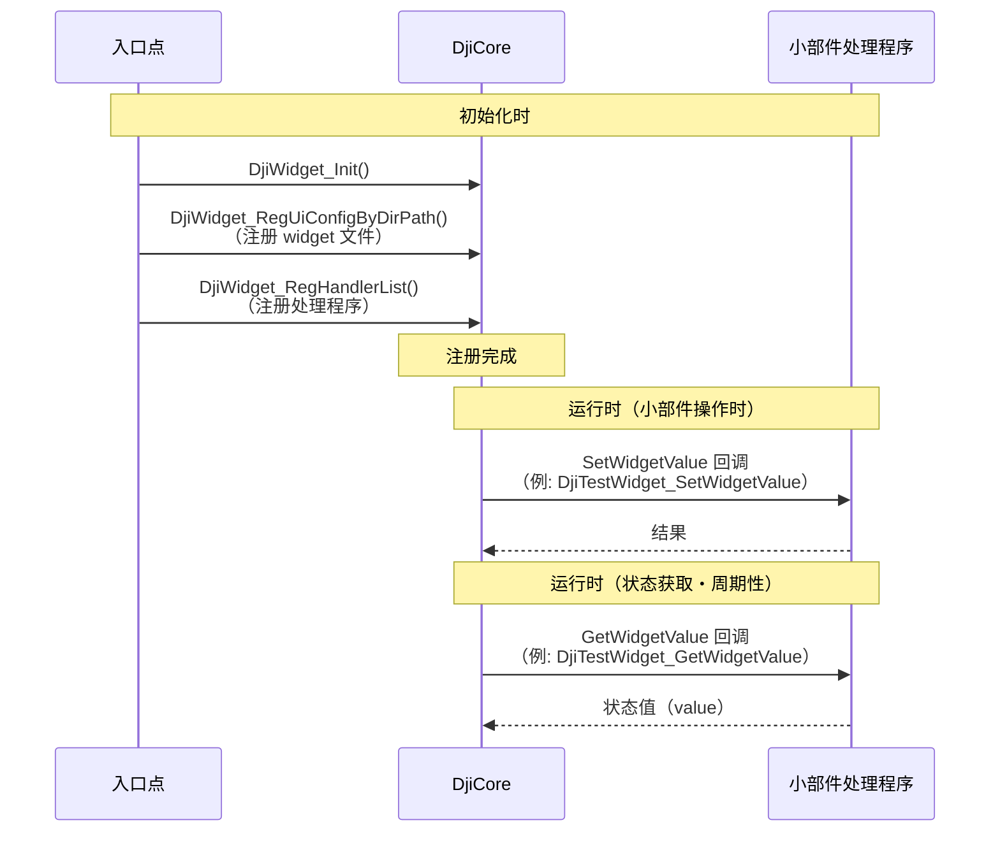

## 引言

is 正在致力于太阳能发电板清洁机器人系统的开发。

该系统由清洁太阳能发电板的机器人和运输该机器人的无人机组成。本文介绍如何使用无人机端开发的 [Payload SDK](https://developer.dji.com/doc/payload-sdk-tutorial/en/tutorial-map.html)，在遥控器上显示自定义小部件。

Payload SDK 的概述也可参考以下文章，请一并参阅。

@[og](https://developer.mamezou-tech.com/robotics/solar-panel-clean-robot/dji-drone-psdk-introduction/)

## 什么是自定义小部件

在将载荷设备安装到机体上使用时，用户往往需要对载荷进行操作指令或查看状态。

在 DJI 无人机系统中，UI 可使用 DJI 生产的遥控器（运行 DJI Pilot 2）或通过 [Mobile SDK](https://developer.dji.com/mobile-sdk/) 开发的应用程序。

自定义小部件是向这些 UI 中集成自定义组件的机制。

使用遥控器时的系统构成示意如下：


第三方制造的载荷设备中的 SBC 应用程序通过 Payload SDK 向机体提供小部件定义。  
在遥控器中运行的 DJI Pilot 2 会自动从机体获取小部件定义，并在 UI 中显示小部件。

本文基于 [DJI 的教程](https://developer.dji.com/doc/payload-sdk-tutorial/en/function-set/basic-function/custom-widget.html)，介绍自定义小部件的功能。

## 自定义小部件示例代码演示

[Payload SDK 的仓库](https://github.com/dji-sdk/Payload-SDK) 中包含了针对各功能的示例代码。

自定义小部件的示例代码位于以下路径：

- [Payload-SDK/samples/sample_c/module_sample/widget/](https://github.com/dji-sdk/Payload-SDK/blob/master/samples/sample_c/module_sample/widget/)

以下为执行示例代码时的演示视频。

在 DJI Pilot 2 的相机视图左侧主菜单中添加了「PSDK」。

<a href="https://youtu.be/uJdoqYUyc-0"></a>

点击右上方的设置按钮，在右侧的设置菜单中也会显示「PSDK」。

<a href="https://youtu.be/P9zsJkX1biQ"></a>

示例中由于小部件操作时的回调为模拟实现，按下按钮时不会有实际动作，但可以直观地了解到 UI 如何扩展。

## 自定义小部件的文件结构

示例目录（[Payload-SDK/samples/sample_c/module_sample/widget/](https://github.com/dji-sdk/Payload-SDK/blob/master/samples/sample_c/module_sample/widget/)）的文件结构如下：

```bash
├── test_widget.c
├── test_widget.h
└── widget_file
    ├── cn_big_screen
    │   ├── icon_button1.png
    │   ├── icon_button2.png
    │   ├── icon_list_item1.png
    │   ├── icon_list_item2.png
    │   ├── icon_scale.png
    │   ├── icon_switch_select.png
    │   ├── icon_switch_unselect.png
    │   └── widget_config.json
    └── en_big_screen
        ├── icon_button1.png
        ├── icon_button2.png
        ├── icon_list_item1.png
        ├── icon_list_item2.png
        ├── icon_scale.png
        ├── icon_switch_select.png
        ├── icon_switch_unselect.png
        └── widget_config.json
```

`widget_config.json` 是自定义小部件的定义文件，PNG 文件用作图标。

根据 UI 语言划分目录，面向中文的为 `cn_big_screen`，面向英语的为 `en_big_screen`。会根据遥控器的语言设置切换引用目录。

无需为所有语言创建定义，可指定默认目录。示例中将 `en_big_screen` 设为默认目录，且在前述演示中由于遥控器为日语设置，所以引用了 `en_big_screen`。

`test_widget.c` 中实现了 SDK 调用的回调处理程序。在处理程序内编写按钮按下时的处理以及返回在 UI 上显示的值的处理。

## 自定义小部件的初始化流程

启动示例应用后，会显示各功能的控制台菜单。自定义小部件会在启动后自动上传到机体，并在 DJI Pilot 2 上显示。

```bash
0.016	            core	[Info]	               dji_core.c:113  Payload SDK Version : V3.15.0-beta.0-build.2318 Dec 10 2025 17:27:05
1.075	         adapter	[Info]	     dji_access_adapter.c:351  Identify mount position type is Extension Port Type
1.075	         adapter	[Info]	     dji_access_adapter.c:371  Identify aircraft series is Matrice 4 Series
1.578	         adapter	[Info]	     dji_access_adapter.c:493  Identity uart0 baudrate is 921600 bps
1.582	            core	[Info]	    dji_identity_verify.c:627  Updating dji sdk policy file...
...(omit)
12.455	            core	[Info]	               dji_core.c:328  Start dji sdk application
12.455	            user	[Info]	          application.cpp:372  Application start.

| Available commands:                                                                              |
| [0] Fc subscribe sample - subscribe quaternion and gps data                                      |
| [1] Flight controller sample - you can control flying by PSDK                                    |
| [2] Hms info manager sample - get health manger system info by language                          |
| [a] Gimbal manager sample - you can control gimbal by PSDK                                       |
| [c] Camera stream view sample - display the camera video stream                                  |
| [d] Stereo vision view sample - display the stereo image                                         |
| [e] Run camera manager sample - you can test camera's functions interactively                    |
| [f] Start rtk positioning sample - you can receive rtk rtcm data when rtk signal is ok           |
| [g] Request Lidar data sample - Request Lidar data and store the point cloud data as pcd files   |
| [h] Request Radar data sample - Request radar data                                               |
| [l] Run widget states manager sample, control widget states on other payload                     |
```

以下为 SDK 初始化流程（摘录）。

[Payload-SDK/samples/sample_c++/platform/linux/raspberry_pi/application/application.cpp](https://github.com/dji-sdk/Payload-SDK/blob/326b8698dd98d5451fc14cfc952976795d37bd66/samples/sample_c%2B%2B/platform/linux/raspberry_pi/application/application.cpp#L330)

```c
void Application::DjiUser_ApplicationStart()
{
    ...(omit)

    returnCode = DjiCore_SetAlias("PSDK_APPALIAS");  // 载荷名称（用于UI显示）
    if (returnCode != DJI_ERROR_SYSTEM_MODULE_CODE_SUCCESS) {
        throw std::runtime_error("Set alias error.");
    }

    ...(omit)

    returnCode = DjiTest_WidgetStartService();  // 启动小部件服务
    if (returnCode != DJI_ERROR_SYSTEM_MODULE_CODE_SUCCESS) {
        USER_LOG_ERROR("widget sample init error");
    }
```

`DjiCore_SetAlias` 指定的 `PSDK_APPALIAS` 将作为载荷设备名称显示在 UI 上。`DjiTest_WidgetStartService` 是在前述的 `test_widget.c` 中定义的函数。

以下为 `DjiTest_WidgetStartService` 的摘录。它将 `widget_file` 目录路径设置到 SDK 中，并注册了每个小部件操作时的回调与返回显示值时的回调处理程序。`s_widgetHandlerList` 的索引 0～8 对应 `widget_config.json` 中定义的各小部件的 `widget_index`。

[Payload-SDK/samples/sample_c/module_sample/widget/test_widget.c](https://github.com/dji-sdk/Payload-SDK/blob/e8041ad6ea468db3346379f771f78c0636994aa8/samples/sample_c/module_sample/widget/test_widget.c#L112)

```c
static const T_DjiWidgetHandlerListItem s_widgetHandlerList[] = {
    {0, DJI_WIDGET_TYPE_BUTTON,        DjiTestWidget_SetWidgetValue, DjiTestWidget_GetWidgetValue, NULL},
    {1, DJI_WIDGET_TYPE_LIST,          DjiTestWidget_SetWidgetValue, DjiTestWidget_GetWidgetValue, NULL},
    {2, DJI_WIDGET_TYPE_SWITCH,        DjiTestWidget_SetWidgetValue, DjiTestWidget_GetWidgetValue, NULL},
    {3, DJI_WIDGET_TYPE_SCALE,         DjiTestWidget_SetWidgetValue, DjiTestWidget_GetWidgetValue, NULL},
    {4, DJI_WIDGET_TYPE_BUTTON,        DjiTestWidget_SetWidgetValue, DjiTestWidget_GetWidgetValue, NULL},
    {5, DJI_WIDGET_TYPE_SCALE,         DjiTestWidget_SetWidgetValue, DjiTestWidget_GetWidgetValue, NULL},
    {6, DJI_WIDGET_TYPE_INT_INPUT_BOX, DjiTestWidget_SetWidgetValue, DjiTestWidget_GetWidgetValue, NULL},
    {7, DJI_WIDGET_TYPE_SWITCH,        DjiTestWidget_SetWidgetValue, DjiTestWidget_GetWidgetValue, NULL},
    {8, DJI_WIDGET_TYPE_LIST,          DjiTestWidget_SetWidgetValue, DjiTestWidget_GetWidgetValue, NULL},
};

...(omit)

T_DjiReturnCode DjiTest_WidgetStartService(void)
{
    T_DjiReturnCode djiStat;
    T_DjiOsalHandler *osalHandler = DjiPlatform_GetOsalHandler();

    // 第1步：初始化 DJI 小部件
    djiStat = DjiWidget_Init();
    if (djiStat != DJI_ERROR_SYSTEM_MODULE_CODE_SUCCESS) {
        USER_LOG_ERROR("Dji test widget init error, stat = 0x%08llX", djiStat);
        return djiStat;
    }

    ...(omit)

    // 设置默认 UI 配置路径
    djiStat = DjiWidget_RegDefaultUiConfigByDirPath(tempPath);
    if (djiStat != DJI_ERROR_SYSTEM_MODULE_CODE_SUCCESS) {
        USER_LOG_ERROR("Add default widget ui config error, stat = 0x%08llX", djiStat);
        return djiStat;
    }

    // 为英语设置 UI 配置
    djiStat = DjiWidget_RegUiConfigByDirPath(DJI_MOBILE_APP_LANGUAGE_ENGLISH,
                                             DJI_MOBILE_APP_SCREEN_TYPE_BIG_SCREEN,
                                             tempPath);
    if (djiStat != DJI_ERROR_SYSTEM_MODULE_CODE_SUCCESS) {
        USER_LOG_ERROR("Add widget ui config error, stat = 0x%08llX", djiStat);
        return djiStat;
    }

    // 为中文设置 UI 配置
    djiStat = DjiWidget_RegUiConfigByDirPath(DJI_MOBILE_APP_LANGUAGE_CHINESE,
                                                DJI_MOBILE_APP_SCREEN_TYPE_BIG_SCREEN,
                                                tempPath);
    if (djiStat != DJI_ERROR_SYSTEM_MODULE_CODE_SUCCESS) {
        USER_LOG_ERROR("Add widget ui config error, stat = 0x%08llX", djiStat);
        return djiStat;
    }

    // 第3步：设置小部件处理程序列表
    djiStat = DjiWidget_RegHandlerList(s_widgetHandlerList, s_widgetHandlerListCount);
    if (djiStat != DJI_ERROR_SYSTEM_MODULE_CODE_SUCCESS) {
        USER_LOG_ERROR("Set widget handler list error, stat = 0x%08llX", djiStat);
        return djiStat;
    }
```

语言设置的标识符（`DJI_MOBILE_APP_LANGUAGE_ENGLISH` 等）定义在 [dji_typedef.h](https://github.com/dji-sdk/Payload-SDK/blob/e8041ad6ea468db3346379f771f78c0636994aa8/psdk_lib/include/dji_typedef.h#L237) 中。

```c
/**
 * @brief Mobile APP system language.
 */
typedef enum {
    DJI_MOBILE_APP_LANGUAGE_UNKNOWN             = 255, /*!< The system language of the mobile app is unknown */
    DJI_MOBILE_APP_LANGUAGE_ENGLISH             = 0, /*!< The system language of the mobile app is English */
    DJI_MOBILE_APP_LANGUAGE_CHINESE             = 1, /*!< The system language of the mobile app is Chinese */
    DJI_MOBILE_APP_LANGUAGE_JAPANESE            = 2, /*!< The system language of the mobile app is Japanese */
    DJI_MOBILE_APP_LANGUAGE_FRENCH              = 3, /*!< The system language of the mobile app is French */
} E_DjiMobileAppLanguage;
```

示例中未注册日语（`DJI_MOBILE_APP_LANGUAGE_JAPANESE`）的 UI 配置。因此，当遥控器为日语时，将引用通过 `DjiWidget_RegDefaultUiConfigByDirPath` 注册的默认目录（`en_big_screen`）。这就是前文所述的“默认目录”的行为。

接下来，我们来看处理程序的实现。

```c
static T_DjiReturnCode DjiTestWidget_SetWidgetValue(E_DjiWidgetType widgetType, uint32_t index, int32_t value,
                                                    void *userData)
{
    s_widgetValueList[index] = value;
    return DJI_ERROR_SYSTEM_MODULE_CODE_SUCCESS;
}

static T_DjiReturnCode DjiTestWidget_GetWidgetValue(E_DjiWidgetType widgetType, uint32_t index, int32_t *value,
                                                    void *userData)
{
    *value = s_widgetValueList[index];
    return DJI_ERROR_SYSTEM_MODULE_CODE_SUCCESS;
}
```

`s_widgetValueList` 是一个以小部件索引为下标的数组。当在 UI 中操作小部件时，会调用 `DjiTestWidget_SetWidgetValue`，并将对应操作的值作为 `value` 传入。`DjiTestWidget_GetWidgetValue` 会被周期性调用，并通过 `value` 返回小部件的状态。

在示例中，仅在 `SetWidgetValue` 中保存接收到的值，并在 `GetWidgetValue` 中原样返回。因此，在切换开关 ON/OFF 时，显示会立即切换。

例如，在通过开关的 ON 操作控制外部设备时，可能希望在设备状态改变之前保持显示为 OFF。这时可在 `GetWidgetValue` 中根据实际设备状态返回相应的值。

向 DjiCore 注册小部件文件和处理程序，以及小部件操作时/状态获取（周期调用）时的回调流程如下。应用程序端的开发目标为入口点和小部件处理程序。



## widget_config.json 解读

本节以示例应用的 `widget_config.json` 为例，说明定义文件的结构。详情请参考 [Payload SDK 教程（Custom Widget）](https://developer.dji.com/doc/payload-sdk-tutorial/en/function-set/basic-function/custom-widget.html)。

**顶层结构**

- **version** … 设置格式的版本（大版本 / 小版本）。  
- **ar_config** … 因教程及 API 规范中无相关说明，本文予以省略。  
- **main_interface** … 在主菜单中显示的小部件定义。  
- **config_interface** … 在设置菜单中显示的小部件定义。  

**main_interface**

用于主菜单的配置。除 `floating_window`（是否显示浮动窗口）和 `speaker`（TTS/语音）外，通过 `widget_list` 排列小部件。示例中定义了 `widget_index` 0〜3 的 4 个（Button、List、Switch、Scale）。

菜单顶部显示的载荷设备名称即为前述通过 `DjiCore_SetAlias` 设置的字符串。


**config_interface**

用于设置菜单的配置。通过 `text_input_box`（是否显示文本输入及占位符）和 `widget_list` 定义小部件。示例中定义了 `widget_index` 4〜8 的 5 个（Button／Scale／Integer Input Box／Switch／List）。


**widget_list 的各元素**

每个小部件至少具有以下属性：

| 属性 | 说明 |
| ---------- | ------ |
| widget_index | 小部件的索引。对应处理程序注册时 `s_widgetHandlerList` 的索引，用于在回调中识别是哪个小部件。 |
| widget_type | 小部件类型。有 `button`、`list`、`switch`、`scale`、`int_input_box` 五种。 |
| widget_name | 在 UI 中显示的名称。 |

此外，还可根据类型指定以下属性：

| 小部件类型 | 额外属性 | 说明 |
| ----------------- | ---------------- | ------ |
| button | `icon_file_set` | 在 `icon_file_name_selected` 和 `icon_file_name_unselected` 中指定 PNG 文件名。当 GetWidgetValue 返回的 value 为 1 时显示选中图标，为 0 时显示未选中图标。引用同一目录。 |
| list | `list_item` | 通过数组指定各项的 `item_name`。可为各项指定 `icon_file_set`。 |
| switch | `icon_file_set` | 同 button。 |
| scale | `icon_file_set`、`customize_rc_buttons_config` | 图标同 button。可通过 `button_value_step_length` 指定遥控器按钮操作时的步长。 |
| int_input_box | `int_input_box_hint` | 指定单位等提示字符串（例如: `"unit:s"`）。 |

## 图标规范

在 DJI Pilot 自定义小部件中，推荐以下图标设计规范：

**尺寸与框架**

| 项目 | 推荐值 |
| ----- | ------ |
| 图标标准尺寸 | 96px |
| 底部框架（尺寸） | 80px |
| 底部框架（背景色） | <span style="display:inline-block;width:1.2em;height:1.2em;background:#000000;vertical-align:middle;border:1px solid #666;"></span> #000000（黑） |
| 底部框架（不透明度） | 0.6（Alpha 值。0＝完全透明，1＝完全不透明。约 60% 的不透明度实现半透明） |
| 底部框架（模糊） | 4（框架的模糊强度，使边缘柔和显示） |
| 圆形元素的描边（线宽） | 约 4px |

底部框架是规范中用于图标显示的框。

**显示状态与颜色**

图标根据显示状态使用以下颜色。对应 `icon_file_name_selected` / `icon_file_name_unselected` 以及 GetWidgetValue 回调返回的 value。

| 状态 | 颜色（HEX） | 说明 |
| ----- | --------- | ------ |
| Normal（未选中） | <span style="display:inline-block;width:1.2em;height:1.2em;background:#4E4E4E;vertical-align:middle;border:1px solid #ccc;"></span> #4E4E4E | 未选中时（value 为 0 时） |
| Active（选中） | <span style="display:inline-block;width:1.2em;height:1.2em;background:#1FA3F6;vertical-align:middle;border:1px solid #ccc;"></span> #1FA3F6 | 选中时（value 为 1 时） |
| Disable | <span style="display:inline-block;width:1.2em;height:1.2em;background:#BCBCBC;vertical-align:middle;border:1px solid #999;"></span> #BCBCBC | 无效时 |

:::info:补充
上表为 UI 图标规范的全面描述。对于自定义小部件，`widget_config.json` 中只能指定两种：`icon_file_name_selected` 与 `icon_file_name_unselected`。SDK 并不支持 Disable 的图标。**遵循 Normal 与 Active，准备两种图标即可。**
:::

**格式与布局**

- 图标格式使用 **PNG**。  
- 显示区域尺寸示例为 48×48、56×56、40×56、56×40 等。建议将实际内容置于中心，并保持适当留白。

DJI 提供了 Sketch 模板（[psdk_widget.sketch](https://terra-1-g.djicdn.com/71a7d383e71a4fb8887a310eb746b47f/psdk/psdk_widget.sketch)）。建议在创建图标时以此为基础。


## 总结

本文介绍了通过自定义小部件扩展遥控器 UI 用于载荷的机制，以及通过定义文件（`widget_config.json`）和注册处理程序的实现流程。

使用 Payload SDK 进行自定义载荷开发的案例还不多，仅靠教程信息有限，难以了解“可以制作怎样的 UI”。希望本文能为正在开发载荷设备的各位提供参考。
