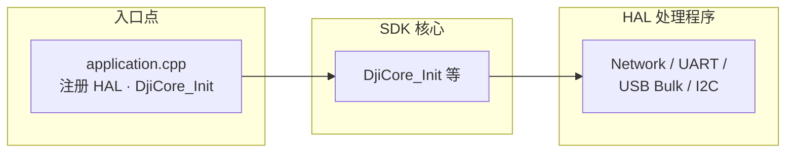
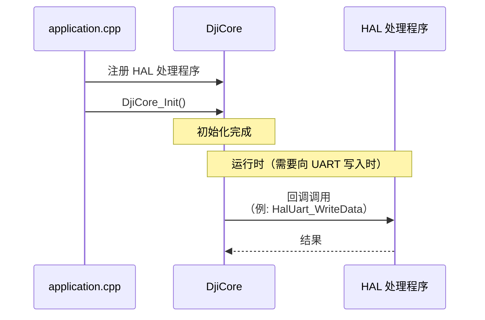

## 前言

is 正在进行光伏发电板清洁机器人系统的开发。

该系统由清洁光伏发电板的机器人和用于运输机器人的无人机构成，本文将介绍无人机端的开发技术 [Payload SDK](https://developer.dji.com/doc/payload-sdk-tutorial/en/tutorial-map.html)。

## 项目概述

为了最大限度地保持光伏发电板的发电效率，必须定期清除表面沉积的灰尘和污垢。对于一般家庭用的小型光伏板，可以手工清洁。但在兆瓦级光伏发电场等大型发电设施中，依靠人力清洁在效率和成本方面都不现实。


我们公司正在开发面向此类发电设施的自主清洁机器人。

## 清洁机器人系统构成

在电站中，连接在一起的光伏发电板被分别安装在不同位置。光伏发电板安装在距离地面 2 米以上的高处，人工在板间搬运机器人非常困难。

因此，本系统采用使用无人机来运输机器人的方法。


主要构成要素如下：

### 清洁机器人

这是我们自主开发的 AMR，可在光伏发电板表面通过刷子清洁的同时自主巡航。它是无人机的运输对象（载荷），并且被设计为总重量在无人机可载范围内。也在 [2025 国际机器人展](https://mamezo.tech/n/10850/) 中进行了展示。


### 无人机

本系统使用 [DJI FlyCart 30](https://www.dji.com/jp/flycart-30)。其可搬重量为双电池模式下 30 kg（最大飞行时间 18 分钟）、单电池模式下 40 kg（最大飞行时间 9 分钟）。

遥控器（操作端）为 DJI RC Plus，其上运行名为 DJI Pilot 2 的应用。


### 载荷设备

由于 FlyCart 30 标配的以下货物箱内部尺寸为 573×416×305 mm，无法容纳机器人。因此，我们开发了用于将机器人固定在无人机上的设备。


## 载荷设备构成

在本系统中，载荷设备的主要作用是将机器人固定在无人机上。

通过遥控器的操作控制锁定机构以固定机器人。锁定机构的控制以及向遥控器提供控件（Widget）由载荷设备内的 SBC（单板计算机）负责。

DJI 为载荷设备的开发提供了名为 Payload SDK 的 SDK，在载荷设备上使用该 SDK 开发的应用将在 SBC 上运行。

在 FlyCart 30 上，以下接口可用于载荷设备：

- [E-Port Lite](https://developer.dji.com/doc/payload-sdk-tutorial/en/quick-start/drone-port.html#e-port-lite)
    - USB Type-C 的维护端口
    - 可直接通过 USB Type-C 数据线与安装了 [DJI Assistant 2](https://www.dji.com/downloads/softwares/dji-assistant-2-for-delivery-series) 的 PC 连接，进行机体固件更新和日志收集
    - 对于如 FlyCart 30 这样未提供 E-Port 的机型，可通过 USB to TTL 串口模块将 E-Port Lite 与 SBC 连接，并作为扩展端口使用
- [Payload Port](https://developer.dji.com/doc/payload-sdk-tutorial/en/quick-start/drone-port.html#flycart-30-payload-port-power-supply-port)
    - 载荷设备专用电源端口
    - 额定电压为 51.2 V

由于本系统的锁定机构仍在开发中，这里略去详细信息。下面是使用支持 CAN 的伺服电机时的构成示意图。在此情况下，伺服电机的供电由 Payload Port 提供，SBC 通过 E-Port Lite 与机体通信以控制伺服电机。


## 机体提供的各种扩展端口

上述构成以 FlyCart 30 为例。不同机体可能提供除 E-Port Lite 之外的其他扩展端口。

### [E-Port](https://developer.dji.com/doc/payload-sdk-tutorial/en/quick-start/drone-port.html#e-port)

这是许多机体支持的扩展端口，提供电源、UART、USB。可通过中继 [E-Port Development Kit](https://store.dji.com/jp/product/dji-e-port-development-kit) 与定制载荷连接，实现 UART 和 USB 通信。

在 E-Port Lite 上获取相机图像等功能受限，而通过 E-Port 中继 Development Kit，可扩展 USB，从而使用更多功能。


### [E-Port V2](https://developer.dji.com/doc/payload-sdk-tutorial/en/quick-start/drone-port.html#e-port-v2-port)

这是在 M400（Matrice 400）上提供的扩展端口（M400 于 2025 年 6 月发布，E-Port V2 为相对较新的端口）。与多数机体仅提供一个 E-Port 不同，E-Port V2 在 M400 机体下方提供 4 个端口，每个端口可供电 120 W。电源输出可在 13.6 V、17 V、24 V 三档间切换。支持 USB 3.0，可同时获取 4K 视频流及雷达点云数据等。可通过中继 [E-Port V2 Development Kit](https://store.dji.com/jp/product/dji-e-port-v2-development-kit) 将其连接到定制载荷。

### [Gimbal Port](https://developer.dji.com/doc/payload-sdk-tutorial/en/quick-start/drone-port.html#gimbal-port)

这是装备在 M300 RTK（2020 年 5 月发布）和 M350 RTK（2023 年 5 月发布）云台部的标准接口，也称为 PSDK Port。用于连接 DJI 自家 Zenmuse 系列云台载荷（相机、传感器等）的接口。


DJI 为第三方提供了 [Payload SDK Development Board Kit 2.0](https://store.dji.com/product/psdk-development-kit-v2)，可通过该开发板中继与定制载荷连接。

### [OSDK Port](https://developer.dji.com/doc/payload-sdk-tutorial/en/quick-start/drone-port.html#osdk-port)

这是现有机体中仅由 M300 RTK 提供的旧接口。它是 E-Port 出现以前的方式，使用 [Onboard SDK (OSDK)](https://developer.dji.com/document/30ac6801-db84-46c2-baf2-8ad8d62bf3ba)，但 OSDK 的最终版本为 `2021-02-02(OSDK 4.1.0)`，不再添加新功能。

OSDK Port 除可与 [OSDK Expansion Module](https://dl.djicdn.com/downloads/matrice-300/20200617/OSDK_Expansion_Module_Product_Information.pdf) 连接外，还支持与 `E-Port Development Kit` 连接，并可使用 Payload SDK（PSDK）。根据 [OSDK Version Support Information](https://developer.dji.com/document/30ac6801-db84-46c2-baf2-8ad8d62bf3ba)（2023 年 5 月 9 日），**OSDK 4.x 的功能均已迁移至 [PSDK V3](https://developer.dji.com/doc/payload-sdk-tutorial/en/)**，新项目开发推荐迁移到 PSDK V3。

## 不同机体的扩展端口

以下列出了现有机体提供的扩展端口一览，摘自 [Standard Hardware Port Introduction](https://developer.dji.com/doc/payload-sdk-tutorial/en/quick-start/drone-port.html#standard-hardware-port-introduction)。

| Aircraft | Port Name | Supports App Binding |
| -------- | ----------- | -------------------- |
| FlyCart 100 | E-Port Lite | – |
| FlyCart 30 | E-Port Lite | – |
| Matrice 4D/4TD | E-Port, E-Port Lite | ✓ |
| Matrice 4E/4T | E-Port, E-Port Lite | ✓ |
| Matrice 3D/3TD | E-Port, E-Port Lite | – |
| Matrice 30/30T | E-Port | – |
| Mavic 3E/3T | E-Port | – |
| M400 | E-Port V2 | ✓ |
| M350 RTK | E-Port | – |
| M350 RTK | Gimbal Port | ✓ |
| M300 RTK | OSDK Port | – |
| M300 RTK | Gimbal Port | ✓ |

在 `Supports App Binding` 列被勾选的机体，需要执行 [Application Binding](https://developer.dji.com/doc/payload-sdk-tutorial/en/quick-start/quick-guide/bind-application.html) 步骤。此步骤将在另一篇文章中介绍。

## 各端口类型的功能对应表

下表从 [Aircraft Type Function Difference](https://developer.dji.com/doc/payload-sdk-tutorial/en/model-instruction/choose-develop-platform.html#aircraft-type-function-difference) 列表中，摘录了部分机体按端口划分的功能支持情况。

即使是相同的端口类型，不同机体支持的功能也可能不同，因此无法仅凭端口类型判断“使用 E-Port 即可实现该功能”之类的结论。例如 Hoisting Control 仅在 FlyCart 100 的 E-Port Lite 上得到支持。

| Function Name | Function Level | FlyCart 30 E-Port Lite | Matrice 4E/4T E-Port | Matrice 400 E-Port V2 | Matrice 350 RTK Gimbal Port |
| :--- | :--- | :---: | :---: | :---: | :---: |
| Log Management | basic | ✓ | ✓ | ✓ | ✓ |
| Data Subscription | basic | ✓ | ✓ | ✓ | ✓ |
| Basic Camera Function | basic | - | ✓ | ✓ | ✓ |
| Basic Camera Management | advanced | - | - | ✓ | - |
| Gimbal Function | basic | - | ✓ | ✓ | ✓ |
| Gimbal Management | advanced | - | - | ✓ | - |
| Power Management | basic | ✓ | - | ✓ | ✓ |
| Flight Control | advanced | ✓ | - | ✓ | ✓ |
| Custom Widget | basic | ✓ | ✓ | ✓ | ✓ |
| Custom HMS | basic | ✓ | ✓ | ✓ | ✓ |
| HMS Manager | advanced | ✓ | - | ✓ | ✓ |
| Time Synchronization | basic | - | ✓ | ✓ | ✓ |
| Low-speed Data Transmission | basic | ✓ | ✓ | ✓ | ✓ |
| Camera Video Stream | basic | - | ✓ | ✓ | ✓ |
| Playback Download | basic | - | - | ✓ | ✓ |
| X-Port Function | basic | - | - | ✓ | ✓ |
| Camera Stream Liveview | advanced | - | - | ✓ | - |
| Local Upgrade | basic | - | ✓ | - | ✓ |
| High-speed Data Transmission | basic | - | - | ✓ | - |
| Positioning | basic | - | - | ✓ | ✓ |
| SDK Interconnection | basic | - | - | ✓ | ✓ |
| Waypoint Mission | advanced | ✓ | - | ✓ | - |
| Speaker | basic | ✓ | ✓ | ✓ | ✓ |
| Hoisting Control | basic | - | - | - | - |
| Access Internet | advanced | - | - | ✓ | - |
| Network RTK | advanced | - | - | ✓ | - |

## 串口通信规范

Payload SDK 使用 UART 和 USB 串行通信。

在 USB 通信中，使用 USB Gadget（使 Linux 设备模拟为 USB 设备端的一种机制），并区分使用以下两种通信方式。

- Bulk（USB Bulk Transfer）
    - 设备与主机之间的双向原始数据通信
- RNDIS（Remote Network Driver Interface Spec）
    - 在 USB 上模拟以太网协议
    - 设备与主机之间的 IP 通信

各端口的支持情况如下表所示。

| Port | Only UART | UART+Bulk | UART+RNDIS | Only Bulk | Only RNDIS |
| ---- | --------- | --------- | ----------- | --------- | ---------- |
| E-Port Lite | ✓ | – | – | – | – |
| E-Port | ✓ | ✓ | ✓ | – | – |
| E-Port V2 | ✓ | – | – | ✓ | ✓ |
| Gimbal Port | ✓ | – | ✓ | – | – |

| 方式 | 说明 |
| ---- | ---- |
| Only UART | 仅通过 UART 与无人机通信 |
| UART+Bulk | 同时使用 UART 和 Bulk 与无人机通信 |
| UART+RNDIS | 同时使用 UART 和 RNDIS 与无人机通信 |
| Only Bulk | 仅通过 Bulk 与无人机通信 |
| Only RNDIS | 仅通过 RNDIS 与无人机通信 |

仅 E-Port V2 支持仅通过 Bulk 或仅通过 RNDIS 通信，其余端口均需要 UART。

详细信息请参阅以下 DJI Developer Support 页面（中文）。访问均需在 DJI Developer Center 注册账户。

- [PSDK 各机型硬件连接介绍](https://sdk-forum.dji.net/hc/zh-cn/articles/50341690206105-PSDK-%E5%90%84%E6%9C%BA%E5%9E%8B%E7%A1%AC%E4%BB%B6%E8%BF%9E%E6%8E%A5%E4%BB%8B%E7%BB%8D)
- [树莓派4B配置USB device RNDIS 和 BULK](https://sdk-forum.dji.net/hc/zh-cn/articles/10232604141465-%E6%A0%91%E8%8E%93%E6%B4%BE4B%E9%85%8D%E7%BD%AEUSB-device-RNDIS-%E5%92%8C-BULK)

由于任何端口都可仅通过 UART 进行通信，建议在开发初期仅连接 UART，以验证使用 Payload SDK 开发的应用运行情况。

## Payload SDK 的 API 规范

[Payload SDK 的 API 参考](https://developer.dji.com/doc/payload-sdk-api-reference/en/) 中，列出了从 SDK 源代码头文件自动生成的 API 规范。然而说明文很少，以函数和类型列表为主。因此，要理解 API 规范，需要参考示例代码并在实机上验证其运行。

## Payload SDK 示例应用

在 DJI 的 [Payload-SDK](https://github.com/dji-sdk/Payload-SDK) 仓库中，公开了 Payload SDK 的库及基于其的示例应用。

### 目录结构

仓库的目录结构如下。

```plaintext
├── psdk_lib
│   ├── include
│   └── lib
│       ├── aarch64-linux-gnu-gcc
│       ├── arm-linux-gnueabi-gcc
│       ├── arm-linux-gnueabihf-gcc
│       ├── armcc_cortex-m4
│       └── x86_64-linux-gnu-gcc
├── samples
│   ├── sample_c
│   │   ├── module_sample
│   │   │   ├── camera_emu
│   │   │   ├── camera_manager
│   │   │   ├── cloud_api
│   │   │   ├── data_transmission
│   │   │   ├── fc_subscription
│   │   │   ├── flight_control
│   │   │   ├── gimbal_emu
│   │   │   ├── gimbal_manager
│   │   │   ├── hms
│   │   │   ├── interest_point
│   │   │   ├── liveview
│   │   │   ├── mop_channel
│   │   │   ├── payload_collaboration
│   │   │   ├── perception
│   │   │   ├── positioning
│   │   │   ├── power_management
│   │   │   ├── tethered_battery
│   │   │   ├── time_sync
│   │   │   ├── upgrade
│   │   │   ├── utils
│   │   │   ├── waypoint_v2
│   │   │   ├── waypoint_v3
│   │   │   ├── widget
│   │   │   ├── widget_interaction_test
│   │   │   └── xport
│   │   └── platform
│   │       ├── linux
│   │       │   ├── common
│   │       │   │   ├── 3rdparty
│   │       │   │   ├── monitor
│   │       │   │   ├── osal
│   │       │   │   └── upgrade_platform_opt
│   │       │   ├── manifold2
│   │       │   │   ├── application
│   │       │   │   └── hal
│   │       │   ├── manifold3
│   │       │   │   ├── app_json
│   │       │   │   ├── application
│   │       │   │   └── hal
│   │       │   ├── nvidia_jetson
│   │       │   │   ├── application
│   │       │   │   └── hal
│   │       │   └── raspberry_pi
│   │       │       ├── application
│   │       │       └── hal
│   │       └── rtos_freertos
│   │           ├── common
│   │           │   └── osal
│   │           ├── gd32f527_development_board
│   │           │   ├── application
│   │           │   ├── bootloader
│   │           │   ├── drivers
│   │           │   ├── hal
│   │           │   ├── middlewares
│   │           │   └── project
│   │           └── stm32f4_discovery
│   │               ├── application
│   │               ├── bootloader
│   │               ├── drivers
│   │               ├── hal
│   │               ├── middlewares
│   │               └── project
│   └── sample_c++
│       ├── module_sample
│       │   ├── camera_manager
│       │   ├── flight_controller
│       │   ├── gimbal
│       │   ├── hms_manager
│       │   ├── liveview
│       │   ├── perception
│       │   ├── positioning
│       │   └── widget_manager
│       └── platform
│           └── linux
│               ├── common
│               │   ├── 3rdparty
│               │   └── osal
│               ├── manifold2
│               │   ├── application
│               │   └── hal
│               ├── manifold3
│               │   ├── application
│               │   └── hal
│               ├── nvidia_jetson
│               │   ├── application
│               │   └── hal
│               └── raspberry_pi
│                   ├── application
│                   └── hal
```

### psdk_lib

各平台对应的静态库位于此处。有关各工具链，请参阅 [Using third-party development platforms](https://developer.dji.com/doc/payload-sdk-tutorial/en/model-instruction/choose-develop-platform.html#using-third-party-development-platforms)。对于 Raspberry Pi 和 Jetson，请使用此目录下的 `aarch64-linux-gnu-gcc/libpayloadsdk.a`。如需使用此处未提供的工具链，可联系 SDK 技术支持（dev@dji.com），他们似乎会提供相应工具链的静态库。还可参阅 [PSDK platform static library link](https://sdk-forum.dji.net/hc/en-us/community/posts/35228015714073-PSDK-platform-static-library-link-problem-feedback-application)。

### samples

#### module_sample

该目录包含 SDK 提供的各功能示例代码。按功能提供了相机管理、飞行控制、云台、实时取景、HMS、定位、控件等示例。

#### platform

该目录汇总了平台相关的代码。放置在 `hal/` 下的源代码实现了硬件抽象层（HAL）（网络、UART、USB Bulk、I2C 等）。

示例应用的入口点为 `application/main.cpp`。它会调用 `application/application.cpp`，在此注册 HAL 处理程序并通过 `DjiCore_Init` 完成 SDK 的初始化。使用 UART、Bulk 还是 RNDIS，由注册的 HAL 处理程序组合决定。

下面是上述 HAL 处理程序注册部分（基于 `CONFIG_HARDWARE_CONNECTION` 的分支）的摘录。

[Payload-SDK/samples/sample_c++/platform/linux/raspberry_pi/application/application.cpp](https://github.com/dji-sdk/Payload-SDK/blob/326b8698dd98d5451fc14cfc952976795d37bd66/samples/sample_c%2B%2B/platform/linux/raspberry_pi/application/application.cpp#L179)

```cpp
    returnCode = DjiPlatform_RegHalI2cHandler(&i2CHandler);
    if (returnCode != DJI_ERROR_SYSTEM_MODULE_CODE_SUCCESS) {
        throw std::runtime_error("register hal i2c handler error");
    }

#if (CONFIG_HARDWARE_CONNECTION == DJI_USE_UART_AND_USB_BULK_DEVICE)
    returnCode = DjiPlatform_RegHalUartHandler(&uartHandler);
    if (returnCode != DJI_ERROR_SYSTEM_MODULE_CODE_SUCCESS) {
        throw std::runtime_error("Register hal uart handler error.");
    }

    returnCode = DjiPlatform_RegHalUsbBulkHandler(&usbBulkHandler);
    if (returnCode != DJI_ERROR_SYSTEM_MODULE_CODE_SUCCESS) {
        throw std::runtime_error("Register hal usb bulk handler error.");
    }
#elif (CONFIG_HARDWARE_CONNECTION == DJI_USE_UART_AND_NETWORK_DEVICE)
    returnCode = DjiPlatform_RegHalUartHandler(&uartHandler);
    if (returnCode != DJI_ERROR_SYSTEM_MODULE_CODE_SUCCESS) {
        throw std::runtime_error("Register hal uart handler error.");
    }

    returnCode = DjiPlatform_RegHalNetworkHandler(&networkHandler);
    if (returnCode != DJI_ERROR_SYSTEM_MODULE_CODE_SUCCESS) {
        throw std::runtime_error("Register hal network handler error");
    }
#elif (CONFIG_HARDWARE_CONNECTION == DJI_USE_ONLY_USB_BULK_DEVICE)
    returnCode = DjiPlatform_RegHalUsbBulkHandler(&usbBulkHandler);
    if (returnCode != DJI_ERROR_SYSTEM_MODULE_CODE_SUCCESS) {
        throw std::runtime_error("Register hal usb bulk handler error.");
    }

#elif (CONFIG_HARDWARE_CONNECTION == DJI_USE_ONLY_NETWORK_DEVICE)
    returnCode = DjiPlatform_RegHalNetworkHandler(&networkHandler);
    if (returnCode != DJI_ERROR_SYSTEM_MODULE_CODE_SUCCESS) {
        throw std::runtime_error("Register hal network handler error");
    }

    //Attention: if you want to use camera stream view function, please uncomment it.
    returnCode = DjiPlatform_RegSocketHandler(&socketHandler);
    if (returnCode != DJI_ERROR_SYSTEM_MODULE_CODE_SUCCESS) {
        throw std::runtime_error("register osal socket handler error");
    }
#elif (CONFIG_HARDWARE_CONNECTION == DJI_USE_ONLY_UART)
    /*!< Attention: Only use uart hardware connection.
     */
    returnCode = DjiPlatform_RegHalUartHandler(&uartHandler);
    if (returnCode != DJI_ERROR_SYSTEM_MODULE_CODE_SUCCESS) {
        throw std::runtime_error("Register hal uart handler error.");
    }
#endif
```

以下是应用层次结构的示意图。



在运行时，当 DjiCore 需要向 UART 写入数据等操作时，会回调事先注册的 HAL 处理程序。流程如下：



图中所示的 application.cpp 和 HAL 处理程序包含在示例代码中，DjiCore 以 psdk_lib 中的静态库形式提供。

初次查看可能会觉得示例代码量较大，但平台相关的代码基本可直接使用。不过，同一平台在最新操作系统或相关库环境下可能无法运行，因此需要开发者维护。

## Payload SDK 的验证环境

遗憾的是，要验证 Payload SDK 应用的运行，需要实际的机体。

DJI Assistant 2 虽具有飞行模拟功能，但只能在与遥控器配对的机体连接状态下使用。此外，Payload SDK 的通信目标也需要实机。

需要采购或租赁与正式运行时使用机体相同端口（E-Port Lite 或 E-Port）的机型。

本公司在正式运行中使用 FlyCart 30，但由于成本较高，开发和调试时使用配备 E-Port Lite 的其他机型（如 Matrice 4E）进行应用开发。

## 总结

本文介绍了在光伏发电板清洁机器人通过无人机运输系统中，使用于无人机端开发的 Payload SDK。

在互联网上搜索，针对 Payload SDK 的资料主要限于 DJI 官方提供，实际操作步骤也以 DJI Developer Support 的中文页面为主。我们公司将应用运行起来也花费了不少功夫。希望对同样致力于定制载荷开发的同行，本文能成为起点的帮助。

有关飞行状态获取、控件集成、Application Binding 步骤等 Payload SDK 的实用主题，计划在后续文章中详细介绍。敬请继续关注。
