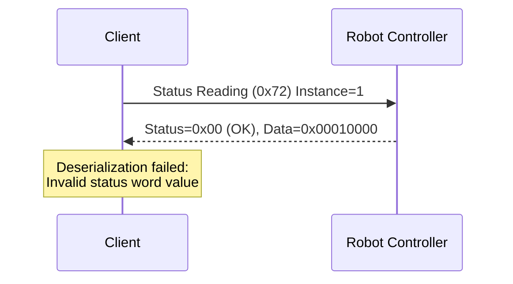

## 引言

我们公司使用来自多家厂商的机器人构建系统。与机器人控制器的通信部分是“理所当然”应当具备的功能。我们面临的挑战是降低这部分的集成成本，以便专注于视觉和手爪等系统特有功能的开发。

另一方面，工业用机器人控制器的协议规范通常以PDF形式分发，输入到LLM中需要将其转为Markdown格式。即使转为Markdown，也需要领域知识才能理解，且网页上几乎没有实际应用案例，LLM的训练数据也不足，因此在很多情况下还需要额外输入上下文信息。

因此本次我们将控制器通信协议和客户端的使用方法整理为Agent Skills，并尝试让LLM编写控制器通信代码。

本次针对安川机器人的HSES（High-Speed Ethernet Server）协议创建了技能，并与Rust编写的客户端 [moto-hses](https://github.com/masayuki-kono/moto-hses) 结合进行验证。

通过以Agent Skills的形式提供通信规范和客户端的使用方法，即使网络上没有实践案例，LLM也能生成合适的代码。虽然内容尚不成熟，但通过利用和完善这些技能，与控制器的通信代码已经开始由LLM自动实现。此外，在通信发生故障时，也可通过比对数据包和通信协议进行调试，从代码生成到后续维护已逐渐可以交由LLM完成。

## 安川电机提供的标准SDK

安川电机的机器人控制器通信手段由厂家提供以下三种SDK。

| 项目           | **MotoCom32 / MotoComES**                             | **MotoPlus**                       | **YMConnect**                                                                    |
| :----------- | :---------------------------------------------------- | :------------------------------------- | :------------------------------------------------------------------------------- |
| **概述**       | 用于从PC通过以太网访问机器人控制器的传统通信SDK，在外部PC上运行。 | 用于在控制器内部开发以C语言实现的用户应用的嵌入式SDK。 | MotoCom的继任者。面向跨平台的新一代通信SDK，在外部PC上运行。                                      |
| **支持的OS**     | Windows（32bit/64bit）                                  | 专用RTOS（在机器人控制器内部运行）                 | **Windows 10+ / Ubuntu 22.04+**                                                  |
| **支持的语言**     | C / C++ / VB6 / .NET                                  | C                                      | **C++17 / C# (.NET 10)**                                                         |
| **运行地点**     | 外部PC（主机端）                                            | 在控制器内部（嵌入式端）                          | 外部PC（主机端）                                                                       |
| **通信方式**     | Ethernet（TCP/IP）                                      | 内部API（与控制器OS直接交互）                   | Ethernet（TCP/IP）                                                                 |
| **主要用途**     | 监控・I/O控制・作业启动等外部控制                                  | 高速控制・定制动作・外部通信任务                    | 监控・I/O控制・作业启动等外部控制                                                             |
| **付费 / 免费**  | **付费（通过USB加密狗的硬件许可。每个运行环境都需要）**                                       | **付费（仅限开发许可。运行环境无需许可）**                   | **免费（Apache License 2.0）**                                                       |
| **特点**       | 仅限Windows、历史悠久且稳定，但新功能更新倾向于停止。                        | 自由度最高，可进行实时处理及外部通信。             | 跨平台支持、现代API设计。                                                            |
| **分发方**      | Yaskawa Electric（需要销售合同）                               | Yaskawa Electric（仅限签约开发者）              | [GitHub](https://github.com/Yaskawa-Global/YMConnect) |

在MotoPlus的场景中，需要自行开发在控制器内部运行的应用和PC端的通信客户端。因此，可选择的通信客户端仅有MotoCom和YMConnect两种。

YMConnect是相对近期（2024年）发布的SDK。对于能够使用C++17及以上或.NET 10及以上的现代项目，YMConnect似乎是不错的选择，但在现有的遗留系统中仍然有很多继续使用MotoCom的案例。到目前为止，几乎还看不到YMConnect的使用案例。不过，从[YMConnect的Discussions](https://github.com/Yaskawa-Global/YMConnect/discussions)可以看到也逐渐有一些缺陷报告出现，我认为其采用实例也会逐渐增多。

另一方面，安川机器人的控制器提供了名为 `High-Speed Ethernet Server (HSES)` 的服务器功能，通信协议也已公开（[FS100 HSES Manual (PDF)](https://www.motoman.com/getmedia/16B5CD92-BD0B-4DE0-9DC9-B71D0B6FE264/160766-1CD.pdf.aspx?ext=.pdf)）。

MotoCom（估计YMConnect也一样）是安川提供的作为HSES通信客户端的SDK，同等的客户端可以自行实现。由于上层应用采用Rust，且希望在遗留系统中也能使用，并且需要LLM驱动开发所需的模拟服务器功能，因此本次使用了自制的Rust客户端。

## moto-hses：Rust编写的HSES客户端

[moto-hses](https://github.com/masayuki-kono/moto-hses) 是一款支持安川机器人控制器HSES (High-Speed Ethernet Server) 协议的Rust异步通信客户端库。

:::info: moto-hses 本身也是使用LLM开发
实际上，这个客户端本身也是使用LLM开发的。我们将协议规范PDF转为Markdown格式的文档，以及作为参考的其他语言客户端代码，作为上下文输入。开发过程中，我们一边建立对LLM的护栏和自动反馈机制一边推进开发。采用同样的方式似乎也可以创建面向C#的客户端。关于这个开发流程，如果有机会，将在另一篇文章中介绍。
:::

### 特点

- **类型安全**：利用Rust的类型系统进行安全的API设计
- **异步处理**：使用Tokio运行时进行异步UDP通信
- **线程安全**：通过`SharedHsesClient`支持多个任务并发访问
- **易于测试**：可通过模拟服务器 (`moto-hses-mock`) 进行集成测试

:::info: 模拟服务器的重要性
安川提供的机器人仿真器（MotoSim EG-VRC）不具有HSES服务器功能。因此，过去需要使用实际的机器人控制器来进行通信验证。使用moto-hses的模拟服务器，可以在本地环境或CI中测试通信代码。在本地即可完成通信验证，这对于构建向LLM自动反馈的机制也是一个非常重要的因素。
:::

### Crate 结构

| Crate | 说明 |
|---------|------|
| `moto-hses-proto` | 协议定义和序列化 |
| `moto-hses-client` | 基于Tokio的异步UDP客户端 |
| `moto-hses-mock` | 用于测试的本地模拟HSES服务器 |

### 支持的命令

| 命令编号 | 命令名称 |
|------------|------------|
| 0x70 | 读取报警数据 |
| 0x71 | 读取报警历史 |
| 0x72 | 读取状态信息 |
| 0x73 | 读取正在执行的作业信息 |
| 0x75 | 读取机器人位置数据 |
| 0x78 | I/O数据读写 |
| 0x79 | 寄存器数据读写 |
| 0x7A〜0x7E | 各种变量（B/I/D/R/S型）读写 |
| 0x82 | 报警复位 / 错误取消 |
| 0x83 | 保持 / 伺服ON/OFF |
| 0x84 | 步进 / 循环 / 连续切换 |
| 0x86 | 启动（作业启动） |
| 0x87 | 选择作业 |

此外，还支持文件操作命令（删除、保存、获取列表）以及多数据的批量读写命令。

### 基本用法

```rust
use moto_hses_client::HsesClient;
use moto_hses_proto::AlarmAttribute;

#[tokio::main]
async fn main() -> Result<(), Box<dyn std::error::Error>> {
    // 创建客户端
    let client = HsesClient::new("192.168.0.3:10040").await?;

    // 读取报警数据
    let alarm = client.read_alarm_data(1, AlarmAttribute::All).await?;
    println!("Alarm Code: {}", alarm.code);
    println!("Alarm Name: {}", alarm.name);

    // 复位报警
    client.reset_alarm().await?;
    println!("Alarm reset completed");

    Ok(())
}
```

## 使用 Agent Skills 进行 LLM 支持

[Agent Skills](https://agentskills.io/) 是一种用于向 AI 编码代理传授特定领域知识和使用方法的格式。技能由 SKILL.md（对代理的指令）、references/（参考文档）、scripts/（自动化脚本）组成。

本次为了发挥 moto-hses 的作用，创建了以下三种技能。

| 技能 | 说明 |
|--------|------|
| **hses-protocol** | HSES协议规范。消息结构、命令格式、错误代码等 |
| **moto-hses-usage** | moto-hses crate 的使用指南。客户端操作、命令参考等 |
| **hses-packet-analysis** | HSES数据包解析指南。用于通信故障调试 |

### 安装技能

已创建的技能在[GitHub仓库](https://github.com/masayuki-kono/agent-skills)公开。可以使用 Vercel 提供的技能安装器 [add-skill](https://github.com/vercel-labs/add-skill) 将技能导入项目。

```bash
# 对于 Cursor
npx add-skill masayuki-kono/agent-skills -s hses-protocol moto-hses-usage hses-packet-analysis -a cursor -y

# 对于 Claude Code
npx add-skill masayuki-kono/agent-skills -s hses-protocol moto-hses-usage hses-packet-analysis -a claude-code -y
```

安装后，项目中将以如下目录结构排列技能：

```
.agents/
└── skills
    ├── hses-packet-analysis
    │   └── SKILL.md
    ├── hses-protocol
    │   ├── references
    │   │   ├── data-types.md
    │   │   ├── error-codes.md
    │   │   ├── protocol-overview.md
    │   │   └── ...
    │   └── SKILL.md
    └── moto-hses-usage
        ├── references
        │   ├── examples
        │   │   ├── alarm_operations.rs
        │   │   ├── job_start.rs
        │   │   ├── read_status.rs
        │   │   └── ...
        │   └── protocol-commands.md
        └── SKILL.md
```

对于Cursor，`.cursor/skills/`下将创建符号链接，以便AI代理能够引用技能。有关add-skill的详细用法，请参阅[官方仓库](https://github.com/vercel-labs/add-skill)。

安装技能后，AI代理将能够理解HSES协议，并生成使用moto-hses的合适代码。

## 使用 Agent Skills 进行代码生成演示

为了验证技能效果，让Cursor Agent生成了代码。生成的代码已在 [moto-hses-examples](https://github.com/masayuki-kono/moto-hses-examples) 仓库公开。

### 生成提示

输入了以下简单的提示：

> 请开发一个使用 moto-hses 的 Rust 示例应用。在应用启动时打开伺服电机，并启动指定的作业。请让机器人控制器的IP地址可通过命令行参数指定。

### 生成的应用程序

根据上述提示，Cursor Agent自动生成了具有以下功能的应用程序：

1. 通过命令行参数指定机器人控制器的IP地址和作业名称  
2. 连接到机器人控制器  
3. 将伺服电机设置为 ON  
4. 选择并启动指定的作业  
5. 检查启动状态并显示结果  

### 运行示例

```bash
# 连接到机器人控制器（192.168.0.18）并启动作业 "TEST"
cargo run -- 192.168.0.18 TEST
```

```
[2026-01-26T21:50:24Z INFO  moto_hses_examples] Connecting to robot controller: 192.168.0.18:10040
[2026-01-26T21:50:24Z INFO  moto_hses_examples] ✓ Successfully connected to controller
[2026-01-26T21:50:24Z INFO  moto_hses_examples] Reading initial status...
[2026-01-26T21:50:24Z INFO  moto_hses_examples] ✓ Status read successfully
[2026-01-26T21:50:24Z INFO  moto_hses_examples]   - Running: false
[2026-01-26T21:50:24Z INFO  moto_hses_examples]   - Servo ON: true
[2026-01-26T21:50:24Z INFO  moto_hses_examples]   - Alarm: false
[2026-01-26T21:50:24Z INFO  moto_hses_examples]   - Error: false
[2026-01-26T21:50:24Z INFO  moto_hses_examples] Turning servo ON...
[2026-01-26T21:50:24Z INFO  moto_hses_examples] ✓ Servo ON command sent successfully
[2026-01-26T21:50:25Z INFO  moto_hses_examples] ✓ Servo is now ON
[2026-01-26T21:50:25Z INFO  moto_hses_examples] Selecting job 'TEST'...
[2026-01-26T21:50:25Z INFO  moto_hses_examples] ✓ Job 'TEST' selected successfully
[2026-01-26T21:50:25Z INFO  moto_hses_examples] Starting job 'TEST'...
[2026-01-26T21:50:25Z INFO  moto_hses_examples] ✓ Job start command sent successfully
[2026-01-26T21:50:25Z INFO  moto_hses_examples] ✓ Job 'TEST' started successfully
```

这是一个自主开发的客户端库，即使在网络上几乎没有实践案例的情况下，通过Agent Skills补充领域知识，也能够确认LLM能够生成合适的代码。

## 使用 Agent Skills 的数据包解析演示

接下来介绍在通信故障时利用技能进行调试的示例。hses-packet-analysis 技能使用 tshark 捕获数据包，并与 hses-protocol 技能的协议规范进行比对后输出报告。通过这种技能间的协同，也可以应对复杂的解析任务。

### 故障场景创建

为了验证，尝试在模拟服务器端将 Status Reading（0x72）命令的响应数据包故意改写为不正确的数据后回复。

Status Reading 的 Data 1 字段为4字节（32位），但有效的状态位仅使用低8位。

| 位 | 含义 |
|--------|------|
| Bit 0 | 步进模式 |
| Bit 1 | 单循环模式 |
| Bit 2 | 连续模式 |
| Bit 3 | 运行（动作中） |
| Bit 4 | 限速 |
| Bit 5 | 示教模式 |
| Bit 6 | 播放模式 |
| Bit 7 | 远程模式 |
| Bit 8-31 | 未使用（应始终为0） |

#### 规范违规内容

在 Data 1 的高位字节（Bit 16-23）设置值 `0x01`，使其超出定义的取值范围。

```text
期望值: [0x00][0x00][0x00][0x00]  （高位3字节应始终为0）
实际  : [0x00][0x00][0x01][0x00]  （第3字节为0x01）
         ↓    ↓    ↓    ↓
        位    位    位    位
        0-7  8-15 16-23 24-31
                   ↑
              不合法的值
```

在此状态下执行前面生成的应用程序，将输出以下错误日志。

```
[2026-01-27T21:18:54Z INFO  moto_hses_examples] Connecting to robot controller: 192.168.0.18:10040
[2026-01-27T21:18:54Z INFO  moto_hses_examples] ✓ Successfully connected to controller
[2026-01-27T21:18:54Z INFO  moto_hses_examples] Reading initial status...
[2026-01-27T21:18:54Z ERROR moto_hses_examples] ✗ Failed to read status: Protocol error: deserialization error: Invalid status word value
Error: ProtocolError(Deserialization("Invalid status word value"))
```

出现了 `Invalid status word value` 错误。在这里，使用 hses-packet-analysis 技能让LLM进行数据包解析吧。

### 解析提示

输入了以下提示：

> cargo run -- 192.168.0.18 TEST 运行失败。请进行数据包解析并以 Markdown 输出结果。

### 解析结果

输出了以下解析报告。该技能执行数据包抓取，并与协议规范进行比对以定位问题位置。

:::info: 报告结构
输出的报告包含协议验证结果、时序图、数据包详情（二进制解析）以及建议的应对措施。本次定位到的原因是 Status Data 1 的 bit 16 设置了不合法的值，违反了规范。
:::

---
# HSES Protocol Analysis Report

**Generated:** 2026-01-28 06:19:36  
**Capture File:** hses_capture_20260128_061936.pcap  
**Export File:** hses_export_20260128_061936.txt

## 1. Summary

| Metric | Value |
|--------|-------|
| Total Packets | 2 |
| Requests | 1 |
| Responses | 1 |
| Errors | 0 (protocol level) |
| Duration | 0.000136 sec |

**Issue Detected:** Application error "Invalid status word value" - the robot controller returned a status value with an unexpected bit set (bit 16) that is not defined in the protocol specification.

## 2. Protocol Validation

| Check | Result | Details |
|-------|--------|---------|
| Magic bytes | ✅ Pass | Both packets start with "YERC" (0x59455243) |
| Header size | ✅ Pass | All headers are 32 bytes (0x0020) |
| Reserved (byte 8) | ✅ Pass | Value is 0x03 |
| Reserved (bytes 16-23) | ✅ Pass | Value is "99999999" |
| Division | ✅ Pass | 0x01 (Robot) |
| ACK field | ✅ Pass | Request=0x00, Response=0x01 |
| Block number | ✅ Pass | Request=0, Response=0x80000000 (single) |
| Request/Response pairs | ✅ Pass | 1 request matched with 1 response |
| Service code match | ✅ Pass | Response service (0x81) = Request service (0x01) + 0x80 |
| Command ID | ✅ Pass | 0x72 (Status reading) is valid |
| Response status | ✅ Pass | 0x00 (Normal reply) |
| **Payload validity** | ⚠️ Warning | Status word contains undefined bit 16 |

### Payload Analysis Issue

The response payload contains status data with an unexpected value:

- **Expected:** Status Data 1 should only use bits 0-7 (bits 8-15 are reserved)
- **Received:** `0x00010000` (bit 16 is set)
- **Consequence:** `moto-hses` library rejects this value as "Invalid status word value"

## 3. Sequence Diagram



## 4. Communication Sequence

| # | Time (sec) | Direction | Command | Instance | Status | Description |
|---|------------|-----------|---------|----------|--------|-------------|
| 1 | 0.000000 | Request | Status Reading (0x72) | 1 | - | Read Status Data 1 |
| 2 | 0.000136 | Response | Status Reading | - | 0x00 (OK) | Returned status=0x00010000 |

## 5. Protocol Errors

No protocol-level errors detected. However, an application-level deserialization error occurred.

| # | Time | Command | Issue | Meaning |
|---|------|---------|-------|---------|
| 2 | 0.000136 | Status Reading | Status word bit 16 set | Robot returned status data with undefined bit, causing deserialization failure |

### Root Cause Analysis

The robot controller returned Status Data 1 with value `0x00010000`, which has bit 16 set. According to the HSES protocol specification:

**Status Data 1 (Command 0x72, Instance 1) bit definitions:**

| Bit | Meaning |
|-----|---------|
| 0 | Step mode |
| 1 | One-cycle mode |
| 2 | Continuous mode |
| 3 | Running |
| 4 | Speed limited |
| 5 | Teach mode |
| 6 | Play mode |
| 7 | Remote mode |
| 8-15 | Reserved |

Bit 16 is not defined in the specification. The `moto-hses` library strictly validates status values and rejects undefined bits.

**Possible causes:**
1. Newer firmware version with extended status bits not yet documented
2. Controller-specific extension to the protocol
3. Memory/data corruption on the controller

## 6. Packet Details

### Packet 1 - Request

| Field | Value | Description |
|-------|-------|-------------|
| Time | 0.000000 | Start of capture |
| Type | Request | ACK=0x00 |
| Magic | YERC | 0x59455243 |
| Header Size | 32 | 0x0020 |
| Payload Size | 0 | No payload |
| Division | Robot | 0x01 |
| Request ID | 1 | Session ID |
| Block Number | 0 | Request block |
| Command ID | 0x0072 | Status reading |
| Instance | 1 | Status Data 1 |
| Attribute | 0 | Default |
| Service | 0x01 | Get_Attribute_All |

**Raw Hex:**
```
59455243 2000 0000 03 01 00 01 00000000 3939393939393939 7200 0100 00 01 0000
│        │    │    │  │  │  │  │        │                │    │    │  │  │
│        │    │    │  │  │  │  │        │                │    │    │  │  └─ Padding
│        │    │    │  │  │  │  │        │                │    │    │  └─ Service (Get_Attribute_All)
│        │    │    │  │  │  │  │        │                │    │    └─ Attribute
│        │    │    │  │  │  │  │        │                └─ Instance (1)
│        │    │    │  │  │  │  │        └─ Command ID (Status reading)
│        │    │    │  │  │  │  └─ Reserved "99999999"
│        │    │    │  │  │  └─ Block Number (0)
│        │    │    │  │  └─ Request ID (1)
│        │    │    │  └─ ACK (Request)
│        │    │    └─ Division (Robot)
│        │    └─ Reserved (0x03)
│        └─ Payload Size (0)
└─ Magic "YERC"
```

### Packet 2 - Response

| Field | Value | Description |
|-------|-------|-------------|
| Time | 0.000136 | 136μs after request |
| Type | Response | ACK=0x01 |
| Magic | YERC | 0x59455243 |
| Header Size | 32 | 0x0020 |
| Payload Size | 8 | Status data |
| Division | Robot | 0x01 |
| Request ID | 1 | Matches request |
| Block Number | 0x80000000 | Single response |
| Service | 0x81 | Get_Attribute_All + 0x80 |
| Status | 0x00 | Normal reply |
| Added Status Size | 2 | |
| Added Status | 0x0000 | No error |

**Payload Data:**
```
00000100 00000000
│        └─ Status Data 1 part 2: 0x00000000
└─ Status Data 1 part 1: 0x00010000 (bit 16 set - UNEXPECTED)
```

**Raw Hex:**
```
59455243 2000 0800 03 01 01 01 00000080 3939393939393939 81 00 02 00 0000 0000 | 00000100 00000000
│        │    │    │  │  │  │  │        │                │  │  │  │  │    │      │
│        │    │    │  │  │  │  │        │                │  │  │  │  │    │      └─ Payload (8 bytes)
│        │    │    │  │  │  │  │        │                │  │  │  │  │    └─ Padding
│        │    │    │  │  │  │  │        │                │  │  │  │  └─ Added Status (0x0000)
│        │    │    │  │  │  │  │        │                │  │  │  └─ Padding
│        │    │    │  │  │  │  │        │                │  │  └─ Added Status Size (2)
│        │    │    │  │  │  │  │        │                │  └─ Status (0x00 = OK)
│        │    │    │  │  │  │  │        │                └─ Service (0x81 = 0x01 + 0x80)
│        │    │    │  │  │  │  │        └─ Reserved "99999999"
│        │    │    │  │  │  │  └─ Block Number (0x80000000 = single)
│        │    │    │  │  │  └─ Request ID (1)
│        │    │    │  │  └─ ACK (Response)
│        │    │    │  └─ Division (Robot)
│        │    │    └─ Reserved (0x03)
│        │    └─ Payload Size (8)
│        └─ Header Size (32)
└─ Magic "YERC"
```

## 总结

本文介绍了将安川机器人控制器的HSES通信客户端（moto-hses）与Agent Skills结合的做法。

- **代码生成**：通过 moto-hses-usage 技能，LLM能够自动生成使用 moto-hses 的合适通信代码
- **数据包解析**：通过 hses-packet-analysis 技能，将通信故障时的调试委托给LLM

工业用机器人的协议规范通常以PDF分发，且需要领域知识，LLM难以直接处理这些信息，但如果整理成Agent Skills的形式，就可以解决这一难题。从代码生成到维护和调试，一直都有可以交给LLM的环境正在逐步完善。

## 未来展望

也可以设想未来各厂商的机器人控制器都会支持类似ROS2的框架，并通过通用I/F进行利用，但这需要控制器厂商做出让步，在现实中很难实现。此外，各厂商的机器人还存在各种独特的规格（如焊接等特定用途的功能），单一的通用I/F很难涵盖所有部分。

即使控制器的I/F不同，只要提供了对应的技能，LLM也可以开发所需的应用程序。我们计划针对各厂商的机器人控制器创建各种技能，逐步增加LLM在机器人系统开发中能够承担的部分。
